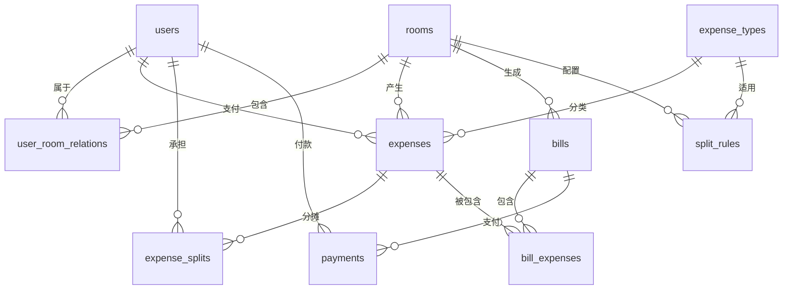
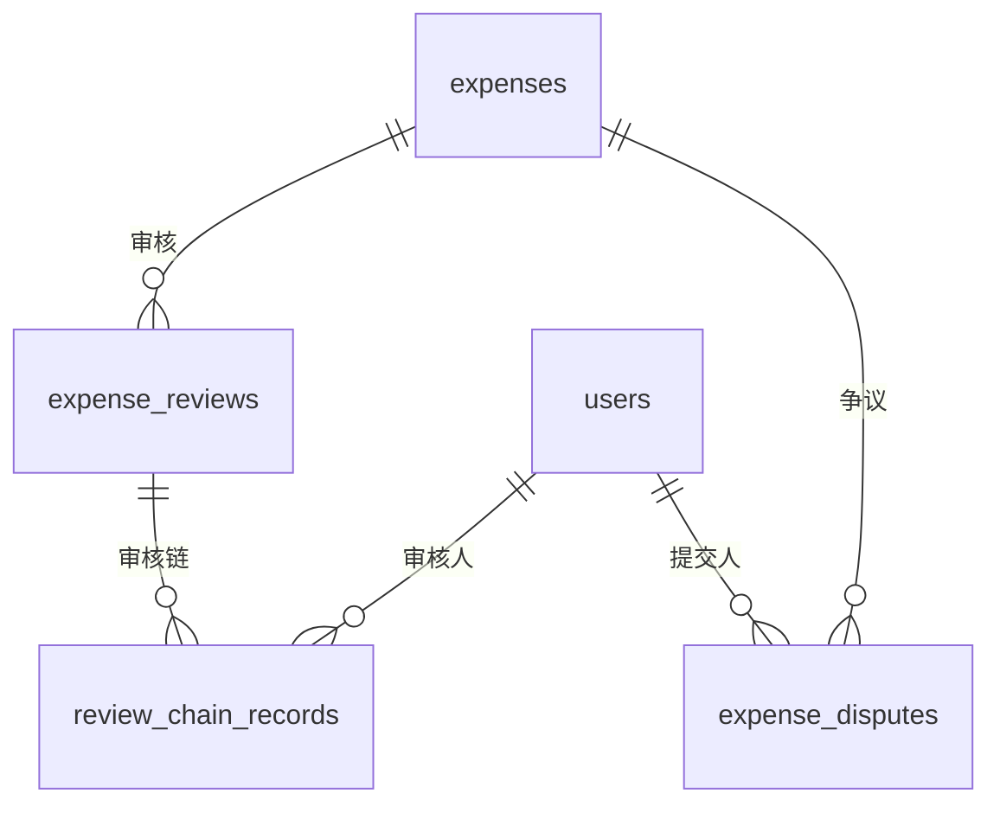

# 记账系统数据库设计文档

## 1. 数据库架构概述

### 1.1 设计原则
- **数据隔离**：基于寝室ID实现数据隔离，确保用户只能访问其所属寝室的数据
- **权限控制**：通过角色权限矩阵实现细粒度的数据访问控制
- **扩展性**：支持分表分库和读写分离，满足系统扩展需求
- **安全性**：实施企业级安全标准，防止数据泄露和未授权访问

### 1.2 数据库架构
```
生产数据库 (Production DB) - PostgreSQL 13+
├── 核心业务表 (Core Tables)
├── 审计日志表 (Audit Tables)
├── 系统配置表 (System Tables)
└── 统计报表表 (Report Tables)

缓存数据库 (Redis) - Redis 6.0+
├── 会话存储
├── 热点数据缓存
└── 分布式锁

测试数据库 (Test DB) - 结构与生产数据库一致，仅用于测试
```

## 2. 核心业务表设计

### 2.1 用户表 (users)
```sql
CREATE TABLE users (
    id UUID PRIMARY KEY DEFAULT gen_random_uuid(),
    username VARCHAR(50) UNIQUE NOT NULL,
    email VARCHAR(100) UNIQUE NOT NULL,
    phone VARCHAR(20),
    password_hash VARCHAR(255) NOT NULL,
    name VARCHAR(100) NOT NULL,
    avatar_url VARCHAR(500),
    role VARCHAR(20) DEFAULT '普通用户' CHECK (role IN ('系统管理员', '管理员', '寝室长', '缴费人', '普通用户')),
    status VARCHAR(20) DEFAULT 'active' CHECK (status IN ('active', 'inactive', 'suspended')),
    last_login_at TIMESTAMP,
    created_at TIMESTAMP DEFAULT NOW(),
    updated_at TIMESTAMP DEFAULT NOW(),
    
    -- 索引
    INDEX idx_users_username (username),
    INDEX idx_users_email (email),
    INDEX idx_users_role (role),
    INDEX idx_users_status (status)
);
```

### 2.2 寝室表 (rooms)
```sql
CREATE TABLE rooms (
    id UUID PRIMARY KEY DEFAULT gen_random_uuid(),
    name VARCHAR(100) NOT NULL,
    description TEXT,
    code VARCHAR(20) UNIQUE NOT NULL, -- 寝室邀请码
    max_members INTEGER DEFAULT 6,
    creator_id UUID NOT NULL REFERENCES users(id) ON DELETE RESTRICT,
    status VARCHAR(20) DEFAULT 'active' CHECK (status IN ('active', 'inactive', 'archived')),
    created_at TIMESTAMP DEFAULT NOW(),
    updated_at TIMESTAMP DEFAULT NOW(),
    
    -- 索引
    INDEX idx_rooms_creator_id (creator_id),
    INDEX idx_rooms_code (code),
    INDEX idx_rooms_status (status)
);
```

### 2.3 用户寝室关联表 (user_room_relations)
```sql
CREATE TABLE user_room_relations (
    id UUID PRIMARY KEY DEFAULT gen_random_uuid(),
    user_id UUID NOT NULL REFERENCES users(id) ON DELETE CASCADE,
    room_id UUID NOT NULL REFERENCES rooms(id) ON DELETE CASCADE,
    relation_type VARCHAR(20) NOT NULL CHECK (relation_type IN ('owner', 'member', 'payer')),
    join_date DATE NOT NULL,
    leave_date DATE,
    is_active BOOLEAN DEFAULT TRUE,
    created_at TIMESTAMP DEFAULT NOW(),
    updated_at TIMESTAMP DEFAULT NOW(),
    
    -- 唯一约束：用户在同一寝室只能有一条活跃记录
    UNIQUE(user_id, room_id),
    
    -- 索引
    INDEX idx_user_room_relations_user_id (user_id),
    INDEX idx_user_room_relations_room_id (room_id),
    INDEX idx_user_room_relations_is_active (is_active),
    INDEX idx_user_room_relations_relation_type (relation_type)
);
```

### 2.4 费用类型表 (expense_types)
```sql
CREATE TABLE expense_types (
    id UUID PRIMARY KEY DEFAULT gen_random_uuid(),
    name VARCHAR(50) NOT NULL,
    description TEXT,
    calculation_method VARCHAR(20) NOT NULL CHECK (calculation_method IN ('amount', 'reading', 'custom')),
    unit VARCHAR(20), -- 单位：元、度、吨等
    is_system_default BOOLEAN DEFAULT FALSE,
    sort_order INTEGER DEFAULT 0,
    created_at TIMESTAMP DEFAULT NOW(),
    updated_at TIMESTAMP DEFAULT NOW(),
    
    -- 索引
    INDEX idx_expense_types_name (name),
    INDEX idx_expense_types_calculation_method (calculation_method),
    INDEX idx_expense_types_is_system_default (is_system_default)
);
```

### 2.5 费用表 (expenses)
```sql
CREATE TABLE expenses (
    id UUID PRIMARY KEY DEFAULT gen_random_uuid(),
    room_id UUID NOT NULL REFERENCES rooms(id) ON DELETE CASCADE,
    expense_type_id UUID NOT NULL REFERENCES expense_types(id) ON DELETE RESTRICT,
    title VARCHAR(200) NOT NULL,
    description TEXT,
    amount DECIMAL(10,2) NOT NULL CHECK (amount > 0),
    previous_reading DECIMAL(10,2), -- 上次读数（仅适用于读数计算方式）
    current_reading DECIMAL(10,2), -- 本次读数（仅适用于读数计算方式）
    unit_price DECIMAL(8,4), -- 单价（仅适用于读数计算方式）
    payer_id UUID NOT NULL REFERENCES users(id) ON DELETE RESTRICT,
    expense_date DATE NOT NULL,
    split_algorithm VARCHAR(20) DEFAULT 'equal' CHECK (split_algorithm IN ('equal', 'by_days', 'custom', 'by_area')),
    split_parameters JSONB, -- 分摊算法参数
    status VARCHAR(20) DEFAULT 'pending' CHECK (status IN ('pending', 'approved', 'rejected', 'disputed')),
    created_by UUID NOT NULL REFERENCES users(id) ON DELETE RESTRICT,
    created_at TIMESTAMP DEFAULT NOW(),
    updated_at TIMESTAMP DEFAULT NOW(),
    
    -- 数据隔离约束：确保费用记录只能属于用户所在寝室
    CONSTRAINT check_expense_creator_in_room CHECK (
        EXISTS (
            SELECT 1 FROM user_room_relations urr 
            WHERE urr.room_id = room_id AND urr.user_id = created_by AND urr.is_active = TRUE
        )
    ),
    
    -- 索引
    INDEX idx_expenses_room_id (room_id),
    INDEX idx_expenses_expense_type_id (expense_type_id),
    INDEX idx_expenses_payer_id (payer_id),
    INDEX idx_expenses_expense_date (expense_date),
    INDEX idx_expenses_status (status),
    INDEX idx_expenses_created_by (created_by)
);
```

### 2.6 费用分摊明细表 (expense_splits)
```sql
CREATE TABLE expense_splits (
    id UUID PRIMARY KEY DEFAULT gen_random_uuid(),
    expense_id UUID NOT NULL REFERENCES expenses(id) ON DELETE CASCADE,
    user_id UUID NOT NULL REFERENCES users(id) ON DELETE CASCADE,
    amount DECIMAL(10,2) NOT NULL CHECK (amount >= 0),
    split_type VARCHAR(20) NOT NULL CHECK (split_type IN ('equal', 'by_days', 'custom', 'by_area')),
    split_ratio DECIMAL(5,4) NOT NULL CHECK (split_ratio >= 0 AND split_ratio <= 1), -- 分摊比例
    days_in_room INTEGER, -- 在寝天数（仅适用于按天数分摊）
    custom_amount DECIMAL(10,2), -- 自定义金额（仅适用于自定义分摊）
    created_at TIMESTAMP DEFAULT NOW(),
    
    -- 数据隔离约束：确保分摊记录只能属于费用所在寝室的成员
    CONSTRAINT check_split_user_in_room CHECK (
        EXISTS (
            SELECT 1 FROM expenses e 
            JOIN user_room_relations urr ON e.room_id = urr.room_id 
            WHERE e.id = expense_id AND urr.user_id = user_id AND urr.is_active = TRUE
        )
    ),
    
    -- 唯一约束：一个费用对同一个用户只能有一条分摊记录
    UNIQUE(expense_id, user_id),
    
    -- 索引
    INDEX idx_expense_splits_expense_id (expense_id),
    INDEX idx_expense_splits_user_id (user_id),
    INDEX idx_expense_splits_split_type (split_type)
);
```

### 2.7 账单表 (bills)
```sql
CREATE TABLE bills (
    id UUID PRIMARY KEY DEFAULT gen_random_uuid(),
    room_id UUID NOT NULL REFERENCES rooms(id) ON DELETE CASCADE,
    title VARCHAR(200) NOT NULL,
    description TEXT,
    total_amount DECIMAL(10,2) NOT NULL CHECK (total_amount > 0),
    due_date DATE NOT NULL,
    status VARCHAR(20) DEFAULT 'pending' CHECK (status IN ('pending', 'paid', 'overdue', 'cancelled')),
    period_start DATE, -- 账单周期开始日期
    period_end DATE, -- 账单周期结束日期
    created_by UUID NOT NULL REFERENCES users(id) ON DELETE RESTRICT,
    created_at TIMESTAMP DEFAULT NOW(),
    updated_at TIMESTAMP DEFAULT NOW(),
    
    -- 数据隔离约束：确保账单只能由本寝室用户创建
    CONSTRAINT check_bill_creator_in_room CHECK (
        EXISTS (
            SELECT 1 FROM user_room_relations urr 
            WHERE urr.room_id = room_id AND urr.user_id = created_by AND urr.is_active = TRUE
        )
    ),
    
    -- 索引
    INDEX idx_bills_room_id (room_id),
    INDEX idx_bills_due_date (due_date),
    INDEX idx_bills_status (status),
    INDEX idx_bills_created_by (created_by)
);
```

### 2.8 账单费用关联表 (bill_expenses)
```sql
CREATE TABLE bill_expenses (
    id UUID PRIMARY KEY DEFAULT gen_random_uuid(),
    bill_id UUID NOT NULL REFERENCES bills(id) ON DELETE CASCADE,
    expense_id UUID NOT NULL REFERENCES expenses(id) ON DELETE CASCADE,
    created_at TIMESTAMP DEFAULT NOW(),
    
    -- 唯一约束：一个费用只能关联到一个账单
    UNIQUE(expense_id),
    
    -- 索引
    INDEX idx_bill_expenses_bill_id (bill_id),
    INDEX idx_bill_expenses_expense_id (expense_id)
);
```

### 2.9 用户收款码表 (user_qr_codes)
```sql
CREATE TABLE user_qr_codes (
    id UUID PRIMARY KEY DEFAULT gen_random_uuid(),
    user_id UUID NOT NULL REFERENCES users(id) ON DELETE CASCADE,
    qr_type VARCHAR(20) NOT NULL CHECK (qr_type IN ('wechat', 'alipay')),
    qr_image_url VARCHAR(500) NOT NULL, -- 收款码图片URL
    is_active BOOLEAN DEFAULT TRUE,
    created_at TIMESTAMP DEFAULT NOW(),
    updated_at TIMESTAMP DEFAULT NOW(),
    
    -- 唯一约束：每个用户每种类型只能有一个活跃的收款码
    UNIQUE(user_id, qr_type),
    
    -- 索引
    INDEX idx_user_qr_codes_user_id (user_id),
    INDEX idx_user_qr_codes_qr_type (qr_type),
    INDEX idx_user_qr_codes_is_active (is_active)
);
```

### 2.10 支付记录表 (payments)
```sql
CREATE TABLE payments (
    id UUID PRIMARY KEY DEFAULT gen_random_uuid(),
    bill_id UUID NOT NULL REFERENCES bills(id) ON DELETE CASCADE,
    user_id UUID NOT NULL REFERENCES users(id) ON DELETE CASCADE,
    payer_id UUID NOT NULL REFERENCES users(id) ON DELETE CASCADE, -- 付款人ID
    amount DECIMAL(10,2) NOT NULL CHECK (amount > 0),
    payment_method VARCHAR(20) DEFAULT 'qr_code' CHECK (payment_method IN ('qr_code')),
    qr_code_type VARCHAR(20) CHECK (qr_code_type IN ('wechat', 'alipay')), -- 扫码支付类型
    payment_time TIMESTAMP,
    status VARCHAR(20) DEFAULT 'pending' CHECK (status IN ('pending', 'confirmed', 'completed', 'cancelled')),
    confirmed_by UUID REFERENCES users(id) ON DELETE SET NULL, -- 收款人确认
    confirmed_at TIMESTAMP,
    created_at TIMESTAMP DEFAULT NOW(),
    updated_at TIMESTAMP DEFAULT NOW(),
    
    -- 数据隔离约束：确保支付记录只能属于账单所在寝室的成员
    CONSTRAINT check_payment_user_in_room CHECK (
        EXISTS (
            SELECT 1 FROM bills b 
            JOIN user_room_relations urr ON b.room_id = urr.room_id 
            WHERE b.id = bill_id AND urr.user_id = user_id AND urr.is_active = TRUE
        )
    ),
    
    -- 约束：付款人和收款人不能是同一人
    CONSTRAINT check_payer_not_payee CHECK (user_id != payer_id),
    
    -- 索引
    INDEX idx_payments_bill_id (bill_id),
    INDEX idx_payments_user_id (user_id),
    INDEX idx_payments_payer_id (payer_id),
    INDEX idx_payments_status (status),
    INDEX idx_payments_payment_time (payment_time)
);
```

## 3. 邀请码管理系统表设计

### 3.1 邀请码表 (invitation_codes)
```sql
CREATE TABLE invitation_codes (
    id UUID PRIMARY KEY DEFAULT gen_random_uuid(),
    code VARCHAR(4) UNIQUE NOT NULL, -- 4位数字邀请码
    room_id UUID NOT NULL REFERENCES rooms(id) ON DELETE CASCADE,
    created_by UUID NOT NULL REFERENCES users(id) ON DELETE CASCADE,
    max_uses INTEGER DEFAULT 1, -- 最大使用次数
    used_count INTEGER DEFAULT 0, -- 已使用次数
    is_active BOOLEAN DEFAULT TRUE,
    expires_at TIMESTAMP, -- 过期时间
    created_at TIMESTAMP DEFAULT NOW(),
    updated_at TIMESTAMP DEFAULT NOW(),
    
    -- 索引
    INDEX idx_invitation_codes_code (code),
    INDEX idx_invitation_codes_room_id (room_id),
    INDEX idx_invitation_codes_is_active (is_active),
    INDEX idx_invitation_codes_expires_at (expires_at)
);
```

### 3.2 邀请码使用记录表 (invitation_usage)
```sql
CREATE TABLE invitation_usage (
    id UUID PRIMARY KEY DEFAULT gen_random_uuid(),
    invitation_code_id UUID NOT NULL REFERENCES invitation_codes(id) ON DELETE CASCADE,
    used_by UUID NOT NULL REFERENCES users(id) ON DELETE CASCADE,
    used_at TIMESTAMP DEFAULT NOW(),
    
    -- 索引
    INDEX idx_invitation_usage_invitation_code_id (invitation_code_id),
    INDEX idx_invitation_usage_used_by (used_by)
);
```

## 4. 智能分摊系统表设计

### 4.1 分摊规则表 (split_rules)
```sql
CREATE TABLE split_rules (
    id UUID PRIMARY KEY DEFAULT gen_random_uuid(),
    room_id UUID NOT NULL REFERENCES rooms(id) ON DELETE CASCADE,
    expense_type_id UUID REFERENCES expense_types(id) ON DELETE CASCADE,
    name VARCHAR(100) NOT NULL,
    algorithm VARCHAR(20) NOT NULL CHECK (algorithm IN ('equal', 'by_days', 'custom', 'by_area')),
    parameters JSONB NOT NULL, -- 分摊算法参数
    is_active BOOLEAN DEFAULT TRUE,
    priority INTEGER DEFAULT 0, -- 规则优先级
    created_by UUID NOT NULL REFERENCES users(id) ON DELETE RESTRICT,
    created_at TIMESTAMP DEFAULT NOW(),
    updated_at TIMESTAMP DEFAULT NOW(),
    
    -- 数据隔离约束：确保分摊规则只能由本寝室用户创建
    CONSTRAINT check_split_rule_creator_in_room CHECK (
        EXISTS (
            SELECT 1 FROM user_room_relations urr 
            WHERE urr.room_id = room_id AND urr.user_id = created_by AND urr.is_active = TRUE
        )
    ),
    
    -- 索引
    INDEX idx_split_rules_room_id (room_id),
    INDEX idx_split_rules_expense_type_id (expense_type_id),
    INDEX idx_split_rules_is_active (is_active),
    INDEX idx_split_rules_algorithm (algorithm)
);
```

### 3.2 智能推荐配置表 (recommendation_configs)
```sql
CREATE TABLE recommendation_configs (
    id UUID PRIMARY KEY DEFAULT gen_random_uuid(),
    room_id UUID NOT NULL REFERENCES rooms(id) ON DELETE CASCADE,
    config_type VARCHAR(50) NOT NULL CHECK (config_type IN ('expense_type', 'split_algorithm', 'amount_range')),
    config_key VARCHAR(100) NOT NULL,
    config_value JSONB NOT NULL,
    weight DECIMAL(3,2) DEFAULT 1.0 CHECK (weight >= 0 AND weight <= 1),
    is_active BOOLEAN DEFAULT TRUE,
    created_at TIMESTAMP DEFAULT NOW(),
    updated_at TIMESTAMP DEFAULT NOW(),
    
    -- 唯一约束
    UNIQUE(room_id, config_type, config_key),
    
    -- 索引
    INDEX idx_recommendation_configs_room_id (room_id),
    INDEX idx_recommendation_configs_config_type (config_type),
    INDEX idx_recommendation_configs_is_active (is_active)
);
```

## 4. 审核与争议处理表设计

### 4.1 费用审核表 (expense_reviews)
```sql
CREATE TABLE expense_reviews (
    id UUID PRIMARY KEY DEFAULT gen_random_uuid(),
    expense_id UUID NOT NULL REFERENCES expenses(id) ON DELETE CASCADE,
    submitted_by UUID NOT NULL REFERENCES users(id) ON DELETE RESTRICT,
    reason TEXT,
    current_level VARCHAR(20) NOT NULL CHECK (current_level IN ('寝室长', '缴费人', '系统自动审核')),
    status VARCHAR(20) NOT NULL DEFAULT 'pending' CHECK (status IN ('pending', 'approved', 'rejected', 'escalated')),
    created_at TIMESTAMP DEFAULT NOW(),
    updated_at TIMESTAMP DEFAULT NOW(),
    
    -- 索引
    INDEX idx_expense_reviews_expense_id (expense_id),
    INDEX idx_expense_reviews_submitted_by (submitted_by),
    INDEX idx_expense_reviews_status (status)
);
```

### 4.2 审核链记录表 (review_chain_records)
```sql
CREATE TABLE review_chain_records (
    id UUID PRIMARY KEY DEFAULT gen_random_uuid(),
    review_id UUID NOT NULL REFERENCES expense_reviews(id) ON DELETE CASCADE,
    level VARCHAR(20) NOT NULL CHECK (level IN ('寝室长', '缴费人', '系统自动审核')),
    reviewer_id UUID REFERENCES users(id) ON DELETE RESTRICT,
    reviewer_name VARCHAR(100) NOT NULL,
    decision VARCHAR(20) NOT NULL CHECK (decision IN ('approved', 'rejected', 'escalated')),
    comments TEXT,
    reviewed_at TIMESTAMP DEFAULT NOW(),
    
    -- 数据隔离约束：确保审核人只能审核其权限范围内的费用
    CONSTRAINT check_reviewer_permission CHECK (
        -- 寝室长只能审核本寝室的费用
        (level = '寝室长' AND EXISTS (
            SELECT 1 FROM expense_reviews er
            JOIN expenses e ON er.expense_id = e.id
            JOIN user_room_relations urr ON e.room_id = urr.room_id 
            WHERE er.id = review_id AND urr.user_id = reviewer_id AND urr.relation_type = 'owner'
        )) OR
        -- 缴费人可以审核费用
        (level = '缴费人' AND EXISTS (
            SELECT 1 FROM users u WHERE u.id = reviewer_id AND u.role = '缴费人'
        )) OR
        -- 系统自动审核
        (level = '系统自动审核')
    ),
    
    -- 索引
    INDEX idx_review_chain_records_review_id (review_id),
    INDEX idx_review_chain_records_reviewer_id (reviewer_id),
    INDEX idx_review_chain_records_level (level)
);
```

### 4.3 费用争议表 (expense_disputes)
```sql
CREATE TABLE expense_disputes (
    id UUID PRIMARY KEY DEFAULT gen_random_uuid(),
    expense_id UUID NOT NULL REFERENCES expenses(id) ON DELETE CASCADE,
    submitter_id UUID NOT NULL REFERENCES users(id) ON DELETE CASCADE,
    dispute_type VARCHAR(20) NOT NULL CHECK (dispute_type IN ('amount', 'split', 'attribution', 'period')),
    description TEXT NOT NULL,
    status VARCHAR(20) DEFAULT 'pending' CHECK (status IN ('pending', 'processing', 'resolved', 'escalated')),
    level VARCHAR(20) DEFAULT 'room' CHECK (level IN ('room', 'system')),
    escalation_reason TEXT,
    created_at TIMESTAMP DEFAULT NOW(),
    resolved_at TIMESTAMP,
    
    -- 数据隔离约束：确保只有费用所在寝室的成员可以提交争议
    CONSTRAINT check_dispute_submitter_in_room CHECK (
        EXISTS (
            SELECT 1 FROM expenses e 
            JOIN user_room_relations urr ON e.room_id = urr.room_id 
            WHERE e.id = expense_id AND urr.user_id = submitter_id AND urr.is_active = TRUE
        )
    ),
    
    -- 索引
    INDEX idx_expense_disputes_expense_id (expense_id),
    INDEX idx_expense_disputes_submitter_id (submitter_id),
    INDEX idx_expense_disputes_status (status)
);
```

## 5. 审计与日志表设计

### 5.1 审计日志表 (audit_logs)
```sql
CREATE TABLE audit_logs (
    id UUID PRIMARY KEY DEFAULT gen_random_uuid(),
    user_id UUID REFERENCES users(id) ON DELETE SET NULL,
    operation_type VARCHAR(50) NOT NULL CHECK (operation_type IN ('create', 'update', 'delete', 'login', 'logout', 'payment')),
    resource_type VARCHAR(50) NOT NULL CHECK (resource_type IN ('user', 'room', 'expense', 'bill', 'payment', 'system_config')),
    resource_id UUID,
    operation_details JSONB,
    ip_address INET,
    user_agent TEXT,
    operation_time TIMESTAMP DEFAULT NOW(),
    created_at TIMESTAMP DEFAULT NOW(),
    
    -- 索引
    INDEX idx_audit_logs_user_id (user_id),
    INDEX idx_audit_logs_operation_type (operation_type),
    INDEX idx_audit_logs_resource_type (resource_type),
    INDEX idx_audit_logs_operation_time (operation_time)
);
```

### 5.2 系统操作日志表 (system_operation_logs)
```sql
CREATE TABLE system_operation_logs (
    id UUID PRIMARY KEY DEFAULT gen_random_uuid(),
    operator_id UUID NOT NULL REFERENCES users(id) ON DELETE RESTRICT,
    operation_type VARCHAR(50) NOT NULL CHECK (operation_type IN ('config_update', 'user_management', 'system_maintenance', 'data_export')),
    target_resource VARCHAR(100),
    operation_details JSONB,
    result VARCHAR(20) CHECK (result IN ('success', 'failure')),
    error_message TEXT,
    ip_address INET,
    operation_time TIMESTAMP DEFAULT NOW(),
    
    -- 索引
    INDEX idx_system_operation_logs_operator_id (operator_id),
    INDEX idx_system_operation_logs_operation_type (operation_type),
    INDEX idx_system_operation_logs_operation_time (operation_time)
);
```

## 6. 系统配置表设计

### 6.1 系统配置表 (system_configs)
```sql
CREATE TABLE system_configs (
    id UUID PRIMARY KEY DEFAULT gen_random_uuid(),
    config_key VARCHAR(100) UNIQUE NOT NULL,
    config_value JSONB NOT NULL,
    config_type VARCHAR(50) NOT NULL CHECK (config_type IN ('string', 'number', 'boolean', 'array', 'object')),
    description TEXT,
    is_public BOOLEAN DEFAULT FALSE,
    created_by UUID NOT NULL REFERENCES users(id) ON DELETE RESTRICT,
    created_at TIMESTAMP DEFAULT NOW(),
    updated_at TIMESTAMP DEFAULT NOW(),
    
    -- 索引
    INDEX idx_system_configs_config_key (config_key),
    INDEX idx_system_configs_config_type (config_type),
    INDEX idx_system_configs_is_public (is_public)
);
```

### 6.2 通知配置表 (notification_configs)
```sql
CREATE TABLE notification_configs (
    id UUID PRIMARY KEY DEFAULT gen_random_uuid(),
    user_id UUID NOT NULL REFERENCES users(id) ON DELETE CASCADE,
    notification_type VARCHAR(50) NOT NULL CHECK (notification_type IN ('email', 'sms', 'push', 'in_app')),
    event_type VARCHAR(100) NOT NULL CHECK (event_type IN ('expense_created', 'bill_due', 'payment_received', 'dispute_submitted')),
    is_enabled BOOLEAN DEFAULT TRUE,
    created_at TIMESTAMP DEFAULT NOW(),
    updated_at TIMESTAMP DEFAULT NOW(),
    
    -- 唯一约束
    UNIQUE(user_id, notification_type, event_type),
    
    -- 索引
    INDEX idx_notification_configs_user_id (user_id),
    INDEX idx_notification_configs_event_type (event_type),
    INDEX idx_notification_configs_is_enabled (is_enabled)
);
```

## 7. 表关系图与数据流

### 7.1 核心业务表关系图


### 7.2 审核与争议表关系图


## 8. 数据访问权限控制设计

### 8.1 角色权限矩阵

| 角色 | 数据访问范围 | 操作权限 | 特殊限制 |
|------|-------------|----------|----------|
| 系统管理员 | 仅系统配置和脱敏统计数据 | 系统维护、配置管理 | 严格禁止接触真实业务数据 |
| 管理员 | 所有用户数据、统计报表 | 用户管理、权限分配 | 不能查看用户敏感信息 |
| 寝室长 | 本寝室所有数据 | 费用管理、成员管理、审核 | 仅限于本寝室范围 |
| 缴费人 | 本寝室费用相关数据 | 费用添加、账单支付、审核 | 费用相关操作权限 |
| 普通用户 | 个人数据、本寝室公开数据 | 个人信息管理、账单查看 | 仅限于个人数据操作 |

### 8.2 数据隔离实现

1. **寝室级数据隔离**：所有业务表通过`room_id`字段实现数据隔离
2. **用户级权限控制**：通过`user_room_relations`表验证用户与寝室的关联关系
3. **角色权限验证**：在数据库层面通过CHECK约束实现权限验证

## 9. 性能优化策略

### 9.1 索引策略
- 所有外键字段建立索引
- 高频查询字段建立复合索引
- 时间范围查询字段建立索引

### 9.2 分表分库策略
- **垂直分表**：将审计日志、系统配置等低频访问数据分离
- **水平分表**：按寝室ID进行数据分片，支持分布式部署
- **读写分离**：主库处理写操作，从库处理读操作

### 9.3 数据归档策略
- 超过1年的历史数据自动归档到历史表
- 归档数据支持按需查询
- 定期清理过期数据

## 10. 数据库安全设计

### 10.1 数据加密
- 用户密码使用bcrypt加密存储
- 敏感数据字段加密存储
- 数据库连接使用SSL加密

### 10.2 访问控制
- 基于角色的数据库用户权限管理
- 应用程序层权限验证
- 数据库操作审计日志

### 10.3 备份恢复
- 每日自动备份
- 异地灾备方案
- 数据恢复演练机制

## 11. 数据库初始化脚本

### 11.1 系统默认数据
```sql
-- 插入系统默认费用类型
INSERT INTO expense_types (id, name, description, calculation_method, unit, is_system_default, sort_order) VALUES
('11111111-1111-1111-1111-111111111111', '水费', '生活用水费用', 'reading', '吨', TRUE, 1),
('22222222-2222-2222-2222-222222222222', '电费', '生活用电费用', 'reading', '度', TRUE, 2),
('33333333-3333-3333-3333-333333333333', '房租', '住房租金', 'amount', '元', TRUE, 3),
('44444444-4444-4444-4444-444444444444', '网络费', '宽带网络费用', 'amount', '元', TRUE, 4),
('55555555-5555-5555-5555-555555555555', '燃气费', '厨房燃气费用', 'reading', '立方米', TRUE, 5);

-- 插入系统默认配置
INSERT INTO system_configs (id, config_key, config_value, config_type, description, is_public, created_by) VALUES
('11111111-1111-1111-1111-111111111111', 'system.name', '"记账系统"', 'string', '系统名称', TRUE, '11111111-1111-1111-1111-111111111111'),
('22222222-2222-2222-2222-222222222222', 'system.version', '"1.0.0"', 'string', '系统版本', TRUE, '11111111-1111-1111-1111-111111111111'),
('33333333-3333-3333-3333-333333333333', 'payment.timeout', '1800', 'number', '支付超时时间(秒)', FALSE, '11111111-1111-1111-1111-111111111111');
```

### 11.2 数据库函数
```sql
-- 计算费用分摊的函数
CREATE OR REPLACE FUNCTION calculate_expense_split(
    p_expense_id UUID,
    p_algorithm VARCHAR(20),
    p_parameters JSONB
) RETURNS TABLE(user_id UUID, amount DECIMAL(10,2)) AS $$
BEGIN
    -- 实现智能分摊计算逻辑
    -- 根据算法类型和参数计算每个用户的分摊金额
    RETURN QUERY ...;
END;
$$ LANGUAGE plpgsql;

-- 生成账单的函数
CREATE OR REPLACE FUNCTION generate_bill(
    p_room_id UUID,
    p_period_start DATE,
    p_period_end DATE
) RETURNS UUID AS $$
DECLARE
    v_bill_id UUID;
BEGIN
    -- 生成指定周期的账单
    INSERT INTO bills (...) VALUES (...)
    RETURNING id INTO v_bill_id;
    
    -- 关联相关费用
    INSERT INTO bill_expenses (bill_id, expense_id)
    SELECT v_bill_id, id FROM expenses 
    WHERE room_id = p_room_id 
    AND expense_date BETWEEN p_period_start AND p_period_end
    AND status = 'approved';
    
    RETURN v_bill_id;
END;
$$ LANGUAGE plpgsql;
```

## 12. 邀请码生成规则

### 12.1 邀请码生成算法
```sql
-- 生成4位数字邀请码的函数
CREATE OR REPLACE FUNCTION generate_invitation_code() 
RETURNS VARCHAR(4) AS $$
DECLARE
    code VARCHAR(4);
    attempts INTEGER := 0;
    max_attempts INTEGER := 100;
BEGIN
    WHILE attempts < max_attempts LOOP
        -- 生成4位随机数字
        code := LPAD(FLOOR(RANDOM() * 10000)::TEXT, 4, '0');
        
        -- 检查是否满足规则：不允许同个数字重复3次
        IF NOT (
            code ~ '(.)\1{2}' OR  -- 检查是否有连续3个相同数字
            code ~ '(.)\1.*\1'    -- 检查是否有3个相同数字（不连续）
        ) THEN
            -- 检查是否已存在
            IF NOT EXISTS (SELECT 1 FROM invitation_codes WHERE code = code) THEN
                RETURN code;
            END IF;
        END IF;
        
        attempts := attempts + 1;
    END LOOP;
    
    -- 如果无法生成符合条件的邀请码，抛出异常
    RAISE EXCEPTION '无法生成符合条件的邀请码，请稍后重试';
END;
$$ LANGUAGE plpgsql;
```

### 12.2 邀请码验证规则
```sql
-- 验证邀请码是否有效的函数
CREATE OR REPLACE FUNCTION validate_invitation_code(
    p_code VARCHAR(4),
    p_room_id UUID
) RETURNS BOOLEAN AS $$
DECLARE
    invitation_record RECORD;
BEGIN
    -- 检查邀请码是否存在且有效
    SELECT * INTO invitation_record 
    FROM invitation_codes 
    WHERE code = p_code 
      AND room_id = p_room_id
      AND is_active = TRUE
      AND (expires_at IS NULL OR expires_at > NOW())
      AND (max_uses = 0 OR used_count < max_uses);
    
    RETURN FOUND;
END;
$$ LANGUAGE plpgsql;
```

## 13. 支付流程设计

### 13.1 扫码支付流程
1. **账单生成**：系统根据费用分摊生成账单
2. **用户确认**：用户确认自己的应转账金额及应转给的缴费人
3. **收款码展示**：系统弹出收款人的相应收款码照片
4. **扫码支付**：用户通过扫描收款码进行支付
5. **状态更新**：支付状态变为待审核
6. **收款人确认**：收款人本人确认收到款项
7. **状态完成**：支付状态更新为已完成

### 13.2 支付状态流转
- **pending**：待支付（用户确认后）
- **confirmed**：待审核（用户扫码支付后）
- **completed**：已完成（收款人确认后）
- **cancelled**：已取消

### 13.3 特殊支付规则
1. **缴费人本人**：不需要向自己缴费，支付状态直接显示为已支付
2. **多名缴费人**：需要计算每个人的分摊金额，明确转给谁多少金额
3. **缴费人之间**：除了缴费人自己不欠其他缴费人的金额，则显示支付状态直接为已支付

## 14. 数据库函数和存储过程

### 14.1 计算分摊金额函数
```sql
CREATE OR REPLACE FUNCTION calculate_payment_amounts(
    p_bill_id UUID
) RETURNS TABLE (
    user_id UUID,
    payer_id UUID,
    amount DECIMAL(10,2),
    status VARCHAR(20)
) AS $$
BEGIN
    RETURN QUERY
    SELECT 
        es.user_id,
        e.payer_id,
        es.amount,
        CASE 
            WHEN es.user_id = e.payer_id THEN 'completed'  -- 缴费人本人
            WHEN EXISTS (
                SELECT 1 FROM payments p 
                WHERE p.bill_id = p_bill_id 
                  AND p.user_id = es.user_id 
                  AND p.payer_id = e.payer_id
                  AND p.status = 'completed'
            ) THEN 'completed'  -- 已支付
            ELSE 'pending'  -- 待支付
        END as status
    FROM expense_splits es
    JOIN expenses e ON es.expense_id = e.id
    JOIN bill_expenses be ON e.id = be.expense_id
    WHERE be.bill_id = p_bill_id;
END;
$$ LANGUAGE plpgsql;
```

### 14.2 更新支付状态存储过程
```sql
CREATE OR REPLACE PROCEDURE update_payment_status(
    p_payment_id UUID,
    p_confirmed_by UUID
) AS $$
BEGIN
    UPDATE payments 
    SET status = 'completed',
        confirmed_by = p_confirmed_by,
        confirmed_at = NOW(),
        updated_at = NOW()
    WHERE id = p_payment_id
      AND status = 'confirmed'
      AND user_id = p_confirmed_by;  -- 只有收款人本人可以确认
END;
$$ LANGUAGE plpgsql;
```

这个数据库设计文档完整地覆盖了记账系统的所有业务需求，包括新增的收款码管理和邀请码功能，确保了数据一致性、安全性和可扩展性。