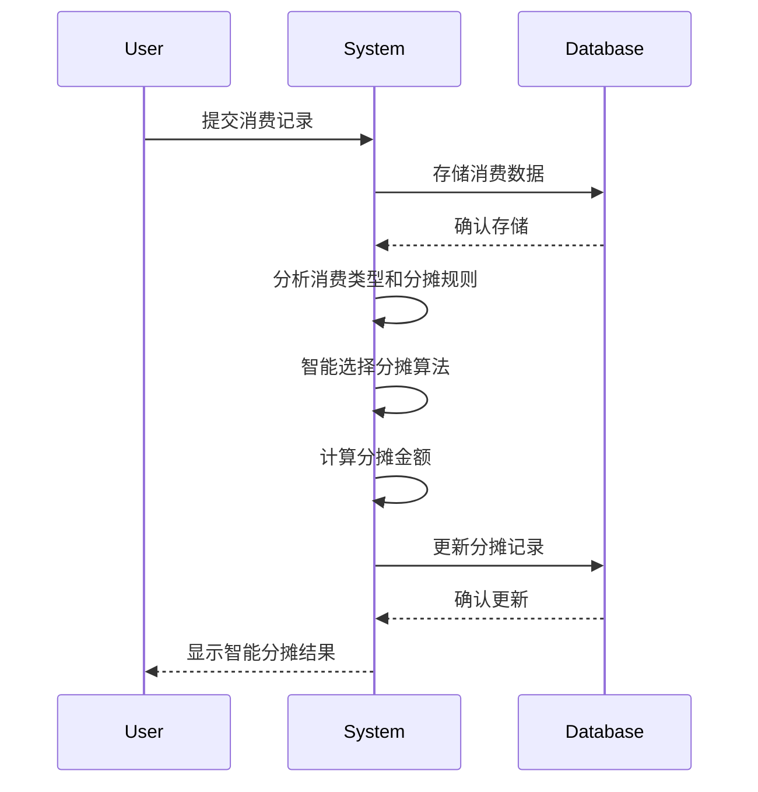

# 记账系统需求文档

## 目录

### 1. 项目概述
1.1 系统简介
1.2 项目目标
1.3 核心价值

### 2. 用户角色
2.1 系统初始化与首次使用角色定位
2.2 角色定义
2.3 角色关系
2.4 角色页面访问权限
2.5 权限控制规则

### 3. 功能模块详细需求
3.1 首页
3.2 寝室管理
3.3 寝室详情
3.4 费用管理
3.5 账单管理
3.6 统计分析
3.7 个人信息
3.8 系统管理面板
3.9 用户管理
3.10 费用类型管理
3.11 系统设置
3.12 缴费人角色管理
3.13 寝室成员管理
3.14 寝室长管理
3.15 系统管理员管理

### 4. 功能需求
4.1 用户角色与权限管理
4.1.1 角色定义
4.1.2 角色权限矩阵
4.1.3 页面访问权限矩阵
4.1.4 操作权限矩阵
4.1.5 特殊权限说明
4.1.6 缴费人权限机制

4.2 核心功能模块
4.2.1 用户注册与登录
4.2.2 寝室管理
4.2.3 成员管理
4.2.4 费用记录管理
4.2.5 智能分摊功能
4.2.5.1 费用添加流程优化
4.2.5.2 智能推荐系统
4.2.5.3 快捷操作
4.2.5.4 输入优化
4.2.5.5 流程简化
4.2.5.6 移动端优化
4.2.6 账单管理
4.2.7 数据持久化与导出
4.2.8 通知提醒系统
4.2.9 多媒体功能
4.2.10 数据可视化

4.3 新增功能模块

#### 4.3.1 收款码管理功能
**4.3.1.1 收款码上传与维护**
- 支持微信、支付宝收款码上传
- 图片格式验证（支持JPG、PNG格式）
- 图片大小限制（最大5MB）
- 收款码有效性验证
- 支持多收款码管理（每个用户每种类型一个活跃收款码）

**4.3.1.2 收款码激活/停用**
- 支持收款码的激活和停用状态管理
- 停用后不可用于收款
- 激活状态实时同步

**4.3.1.3 收款码安全验证**
- 上传前客户端验证图片格式和大小
- 服务端验证图片内容是否为有效收款码
- 防止恶意文件上传

#### 4.3.2 扫码支付功能
**4.3.2.1 账单确认流程**
1. 系统生成账单后，用户查看自己的应转账金额
2. 明确显示应转给哪位缴费人
3. 用户确认金额和收款人信息
4. 系统记录确认状态

**4.3.2.2 收款码展示机制**
- 用户确认支付后，系统弹出收款人的收款码照片
- 清晰显示收款人姓名和应转账金额
- 支持微信和支付宝收款码切换
- 收款码图片支持放大查看

**4.3.2.3 支付状态流转**
- **pending**：待支付（用户确认后）
- **confirmed**：待审核（用户扫码支付后）
- **completed**：已完成（收款人确认后）
- **cancelled**：已取消

**4.3.2.4 收款人确认机制**
- 用户扫码支付后，支付状态变为待审核
- 收款人本人登录系统确认收到款项
- 只有收款人本人可以确认支付
- 确认后支付状态更新为已完成

#### 4.3.3 邀请码管理功能
**4.3.3.1 邀请码生成规则**
- 随机生成4位数字邀请码
- 不允许同个数字重复3次（包括连续和不连续）
- 生成算法确保邀请码的唯一性
- 支持最大100次尝试生成有效邀请码

**4.3.3.2 邀请码验证机制**
- 验证邀请码是否存在且有效
- 检查邀请码是否过期
- 验证使用次数是否超过限制
- 验证邀请码与寝室的匹配关系

**4.3.3.3 邀请码使用限制**
- 支持设置最大使用次数（默认1次）
- 支持设置过期时间
- 支持停用邀请码
- 记录邀请码使用历史

#### 4.3.4 特殊支付规则
**4.3.4.1 缴费人本人支付规则**
- 缴费人本人不需要向自己缴费
- 系统自动将缴费人本人的支付状态标记为已支付
- 在账单详情中明确显示缴费人本人的支付状态

**4.3.4.2 多名缴费人支付规则**
- 系统计算每个用户的分摊金额
- 明确显示每个用户应转给哪位缴费人
- 支持多名缴费人之间的金额结算
- 提供清晰的支付指引

**4.3.4.3 缴费人之间支付规则**
- 除了缴费人自己不欠其他缴费人的金额，显示支付状态为已支付
- 缴费人之间的欠款需要正常支付
- 系统自动识别缴费人之间的支付关系
- 提供详细的支付明细说明

#### 4.3.5 支付流程优化
**4.3.5.1 离线支付支持**
- 支持用户离线查看账单和收款码
- 支付确认信息本地缓存
- 网络恢复后自动同步支付状态

**4.3.5.2 支付提醒功能**
- 账单到期前自动提醒
- 支付确认后通知收款人
- 支持多种通知方式（站内信、邮件、短信）

**4.3.5.3 支付记录查询**
- 完整的支付历史记录
- 支持按时间、状态、金额筛选
- 支付记录导出功能

4.3 费用分摊计算规则
4.3.1 基础原则
4.3.2 核心计算因子
4.3.3 详细计算流程
4.3.4 离寝天数计算规则
4.3.5 费用计算方式
4.3.6 分摊计算精度与四舍五入处理
4.3.7 费用金额和读数验证
4.3.8 成员退宿处理规则
4.3.9 费用审核和争议处理流程
4.3.10 配置版本管理和监控
4.3.11 性能优化：索引策略和归档策略
4.3.12 性能优化：分表分库与读写分离

4.4 核心业务流程
4.4.1 智能分摊算法
4.4.2 智能分摊流程

4.5 统计与分析功能
4.5.1 支出统计
4.5.2 预算管理

### 5. 非功能性需求
5.1 性能需求
5.2 安全需求
5.3 可用性需求
5.4 兼容性需求
5.5 可靠性需求
5.6 可维护性需求

### 6. 技术约束
6.1 开发技术
- **前端技术栈**：Vue.js 3.3.4 + Composition API + Element Plus 2.3.8 + Vite
- **后端技术栈**：Node.js + Express + PostgreSQL + Redis
- **实时通信**：WebSocket实现实时通知功能
- **构建工具**：Vite + ESLint + Prettier

6.2 数据存储
- **主数据库**：PostgreSQL（已从MySQL迁移）
- **缓存数据库**：Redis
- **本地存储**：浏览器本地存储API（IndexedDB/localStorage）
- **文件存储**：本地文件系统（支付码图片存储）

6.3 技术栈要求
- Node.js >= 16.0.0
- PostgreSQL >= 13.0
- Redis >= 6.0
- 现代浏览器支持（Chrome 90+, Firefox 88+, Safari 14+）

6.4 数据存储要求
- 支持UTF-8字符集
- 支持JSON数据类型
- 支持事务处理
- 支持数据备份和恢复

### 7. 项目里程碑

### 8. 附录
8.1 术语表
8.2 假设和依赖

### 9. 验收标准
9.1 功能验收标准
9.2 性能验收标准
9.3 安全验收标准

### 10. 项目约束
10.1 技术约束
10.2 时间约束
10.3 资源约束

### 11. 系统开发需求说明
11.1 前端开发需求 (Client application)
11.2 后端开发需求 (Server-side)
11.3 管理端需求 (Admin panel)
11.4 API接口设计 (详细API规范见API接口设计文档.md)
11.5 数据库设计 (详细数据库设计见数据库设计文档.md)

#### 4.3.11 性能优化：分表分库与读写分离

**功能概述：**
随着系统数据量和用户量的增长，单一数据库可能成为性能瓶颈。分表分库和读写分离是解决大规模数据处理和高并发访问的有效手段。本节将详细介绍系统的分表分库策略和读写分离方案。

**分表策略：**

**1. 水平分表（按时间）：**
- **费用表分表：**
  ```sql
  -- 按月分表，每月一个表
  CREATE TABLE expenses_202401 LIKE expenses;
  CREATE TABLE expenses_202402 LIKE expenses;
  -- ... 其他月份表
  
  -- 创建分表视图，提供统一查询接口
  CREATE VIEW expenses_all AS
  SELECT * FROM expenses_202401
  UNION ALL
  SELECT * FROM expenses_202402
  UNION ALL
  -- ... 其他月份表
  SELECT * FROM expenses_current;
  ```

- **审核记录表分表：**
  ```sql
  -- 按季度分表，每季度一个表
  CREATE TABLE review_records_2024q1 LIKE review_records;
  CREATE TABLE review_records_2024q2 LIKE review_records;
  -- ... 其他季度表
  
  -- 创建分表视图
  CREATE VIEW review_records_all AS
  SELECT * FROM review_records_2024q1
  UNION ALL
  SELECT * FROM review_records_2024q2
  UNION ALL
  -- ... 其他季度表
  SELECT * FROM review_records_current;
  ```

**2. 水平分表（按业务维度）：**
- **费用分摊表分表：**
  ```sql
  -- 按寝室ID范围分表
  CREATE TABLE expense_splits_1_100 LIKE expense_splits;
  CREATE TABLE expense_splits_101_200 LIKE expense_splits;
  -- ... 其他范围表
  
  -- 创建分表视图
  CREATE VIEW expense_splits_all AS
  SELECT * FROM expense_splits_1_100
  UNION ALL
  SELECT * FROM expense_splits_101_200
  UNION ALL
  -- ... 其他范围表
  SELECT * FROM expense_splits_current;
  ```

**3. 分表路由策略：**
```javascript
// 分表路由器
class TableRouter {
  constructor() {
    this.tableConfigs = {
      expenses: {
        type: 'time',
        format: 'YYYYMM',
        currentTable: 'expenses_current'
      },
      review_records: {
        type: 'time',
        format: 'YYYY[q]Q',
        currentTable: 'review_records_current'
      },
      expense_splits: {
        type: 'hash',
        field: 'dorm_id',
        ranges: [
          { min: 1, max: 100, table: 'expense_splits_1_100' },
          { min: 101, max: 200, table: 'expense_splits_101_200' }
        ],
        currentTable: 'expense_splits_current'
      }
    };
  }
  
  // 根据条件路由到正确的表
  routeTable(baseTable, conditions = {}) {
    const config = this.tableConfigs[baseTable];
    if (!config) {
      return baseTable; // 未配置分表的表
    }
    
    if (config.type === 'time') {
      // 时间分表路由
      if (conditions.created_at) {
        const date = new Date(conditions.created_at);
        const tableSuffix = this.formatDate(date, config.format);
        return `${baseTable}_${tableSuffix}`;
      }
    } else if (config.type === 'hash') {
      // 哈希分表路由
      if (conditions[config.field]) {
        const value = conditions[config.field];
        const range = config.ranges.find(r => value >= r.min && value <= r.max);
        return range ? range.table : config.currentTable;
      }
    }
    
    // 默认返回当前表
    return config.currentTable;
  }
  
  // 格式化日期
  formatDate(date, format) {
    const year = date.getFullYear();
    const month = String(date.getMonth() + 1).padStart(2, '0');
    const quarter = Math.floor(date.getMonth() / 3) + 1;
    
    return format
      .replace('YYYY', year)
      .replace('MM', month)
      .replace('[q]Q', quarter);
  }
  
  // 获取所有分表
  getAllTables(baseTable) {
    const config = this.tableConfigs[baseTable];
    if (!config) {
      return [baseTable];
    }
    
    // 这里应该从数据库元数据获取所有分表
    // 简化处理，返回一些示例表
    if (config.type === 'time') {
      return [
        `${baseTable}_202401`, `${baseTable}_202402`, `${baseTable}_202403`,
        `${baseTable}_202404`, `${baseTable}_202405`, `${baseTable}_202406`,
        config.currentTable
      ];
    } else if (config.type === 'hash') {
      return config.ranges.map(r => r.table).concat([config.currentTable]);
    }
    
    return [baseTable];
  }
}
```

**分库策略：**

**1. 垂直分库：**
- **核心业务库：** 存储用户、房间、费用等核心业务数据
- **审核流程库：** 存储审核记录、审核配置等审核相关数据
- **争议处理库：** 存储争议记录、争议处理等争议相关数据
- **日志审计库：** 存储各类日志和审计记录

**2. 水平分库：**
- **按区域分库：** 根据学校或地区划分不同的数据库实例
- **按业务量分库：** 根据数据量和访问压力动态分配数据库实例

**3. 分库路由策略：**
```javascript
// 分库路由器
class DatabaseRouter {
  constructor() {
    this.dbConfigs = {
      core: {
        host: 'db-core.example.com',
        database: 'dorm_expense_core',
        tables: ['users', 'rooms', 'expenses', 'expense_splits', 'bills', 'payments']
      },
      review: {
        host: 'db-review.example.com',
        database: 'dorm_expense_review',
        tables: ['expense_reviews', 'review_chain_records', 'review_configurations', 'review_notifications']
      },
      dispute: {
        host: 'db-dispute.example.com',
        database: 'dorm_expense_dispute',
        tables: ['expense_disputes', 'dispute_negotiations', 'dispute_resolutions', 'dispute_notifications', 'dispute_evidence']
      },
      audit: {
        host: 'db-audit.example.com',
        database: 'dorm_expense_audit',
        tables: ['audit_logs', 'expense_audit_logs', 'login_audit_logs']
      }
    };
    
    this.connections = {};
  }
  
  // 根据表名获取数据库连接
  getConnection(table) {
    for (const [dbName, config] of Object.entries(this.dbConfigs)) {
      if (config.tables.includes(table)) {
        if (!this.connections[dbName]) {
          // 创建数据库连接
          this.connections[dbName] = this.createConnection(config);
        }
        return this.connections[dbName];
      }
    }
    
    // 默认返回核心库连接
    if (!this.connections.core) {
      this.connections.core = this.createConnection(this.dbConfigs.core);
    }
    return this.connections.core;
  }
  
  // 创建数据库连接
  createConnection(config) {
    // 实际应该使用数据库连接池
    return {
      host: config.host,
      database: config.database,
      query: (sql, params) => {
        // 实际查询逻辑
        console.log(`执行查询: ${sql} 在 ${config.host}/${config.database}`);
        return [];
      },
      execute: (sql, params) => {
        // 实际执行逻辑
        console.log(`执行SQL: ${sql} 在 ${config.host}/${config.database}`);
        return { affectedRows: 0 };
      },
      beginTransaction: () => {
        console.log(`开始事务在 ${config.host}/${config.database}`);
      },
      commit: () => {
        console.log(`提交事务在 ${config.host}/${config.database}`);
      },
      rollback: () => {
        console.log(`回滚事务在 ${config.host}/${config.database}`);
      }
    };
  }
  
  // 跨库查询
  queryAcrossDatabases(queries) {
    const results = {};
    
    // 按数据库分组查询
    const queriesByDb = {};
    queries.forEach(query => {
      const dbName = this.getDatabaseByTable(query.table);
      if (!queriesByDb[dbName]) {
        queriesByDb[dbName] = [];
      }
      queriesByDb[dbName].push(query);
    });
    
    // 并行执行各数据库的查询
    const promises = Object.entries(queriesByDb).map(([dbName, dbQueries]) => {
      return new Promise((resolve) => {
        const connection = this.getConnectionByDbName(dbName);
        const dbResults = {};
        
        dbQueries.forEach(query => {
          dbResults[query.id] = connection.query(query.sql, query.params);
        });
        
        resolve({ dbName, results: dbResults });
      });
    });
    
    // 等待所有查询完成
    Promise.all(promises).then(dbResults => {
      dbResults.forEach(({ dbName, results: dbResult }) => {
        Object.assign(results, dbResult);
      });
    });
    
    return results;
  }
  
  // 根据表名获取数据库名
  getDatabaseByTable(table) {
    for (const [dbName, config] of Object.entries(this.dbConfigs)) {
      if (config.tables.includes(table)) {
        return dbName;
      }
    }
    return 'core';
  }
  
  // 根据数据库名获取连接
  getConnectionByDbName(dbName) {
    const config = this.dbConfigs[dbName];
    if (!config) {
      return this.getConnection('users'); // 默认返回核心库连接
    }
    
    if (!this.connections[dbName]) {
      this.connections[dbName] = this.createConnection(config);
    }
    return this.connections[dbName];
  }
}
```

**读写分离策略：**

**1. 主从复制架构：**
- **主库（Master）：** 处理所有写操作和实时性要求高的读操作
- **从库（Slave）：** 处理大部分读操作，减轻主库压力
- **多级从库：** 可以配置多级从库，进一步分散读压力

**2. 读写分离路由：**
```javascript
// 读写分离路由器
class ReadWriteSplitter {
  constructor(masterConfig, slaveConfigs) {
    this.master = this.createConnection(masterConfig);
    this.slaves = slaveConfigs.map(config => this.createConnection(config));
    this.currentSlaveIndex = 0;
    
    // 负载均衡策略
    this.loadBalanceStrategy = 'round_robin'; // round_robin, least_connections, weighted
  }
  
  // 获取读连接
  getReadConnection() {
    if (this.slaves.length === 0) {
      return this.master; // 没有从库，使用主库
    }
    
    switch (this.loadBalanceStrategy) {
      case 'round_robin':
        return this.getRoundRobinSlave();
      case 'least_connections':
        return this.getLeastConnectionsSlave();
      case 'weighted':
        return this.getWeightedSlave();
      default:
        return this.slaves[0];
    }
  }
  
  // 获取写连接
  getWriteConnection() {
    return this.master;
  }
  
  // 轮询选择从库
  getRoundRobinSlave() {
    const slave = this.slaves[this.currentSlaveIndex];
    this.currentSlaveIndex = (this.currentSlaveIndex + 1) % this.slaves.length;
    return slave;
  }
  
  // 选择连接数最少的从库
  getLeastConnectionsSlave() {
    // 简化处理，实际应该跟踪每个从库的连接数
    return this.slaves.reduce((min, current) => {
      return current.activeConnections < min.activeConnections ? current : min;
    });
  }
  
  // 根据权重选择从库
  getWeightedSlave() {
    // 简化处理，实际应该根据权重选择
    const totalWeight = this.slaves.reduce((sum, slave) => sum + (slave.weight || 1), 0);
    let random = Math.random() * totalWeight;
    
    for (const slave of this.slaves) {
      random -= (slave.weight || 1);
      if (random <= 0) {
        return slave;
      }
    }
    
    return this.slaves[0];
  }
  
  // 执行查询
  query(sql, params = []) {
    // 判断是否为写操作
    if (this.isWriteOperation(sql)) {
      return this.master.query(sql, params);
    } else {
      const slave = this.getReadConnection();
      return slave.query(sql, params);
    }
  }
  
  // 执行写操作
  execute(sql, params = []) {
    return this.master.execute(sql, params);
  }
  
  // 判断是否为写操作
  isWriteOperation(sql) {
    const writeKeywords = ['INSERT', 'UPDATE', 'DELETE', 'CREATE', 'ALTER', 'DROP'];
    const upperSql = sql.trim().toUpperCase();
    
    return writeKeywords.some(keyword => upperSql.startsWith(keyword));
  }
  
  // 创建数据库连接
  createConnection(config) {
    // 实际应该使用数据库连接池
    return {
      host: config.host,
      database: config.database,
      weight: config.weight || 1,
      activeConnections: 0,
      query: (sql, params) => {
        this.activeConnections++;
        console.log(`执行查询: ${sql} 在 ${config.host}/${config.database}`);
        // 模拟查询延迟
        setTimeout(() => {
          this.activeConnections--;
        }, 100);
        return [];
      },
      execute: (sql, params) => {
        this.activeConnections++;
        console.log(`执行SQL: ${sql} 在 ${config.host}/${config.database}`);
        // 模拟执行延迟
        setTimeout(() => {
          this.activeConnections--;
        }, 100);
        return { affectedRows: 0 };
      }
    };
  }
}
```

**3. 数据一致性保障：**
- **强一致性场景：** 关键业务操作使用主库读取
- **最终一致性场景：** 非关键业务操作使用从库读取
- **延迟容忍：** 设置合理的从库延迟阈值，超过阈值时切换到主库读取

**性能优化实现示例：**

```javascript
// 综合性能优化管理器
class AdvancedPerformanceManager {
  constructor() {
    this.tableRouter = new TableRouter();
    this.dbRouter = new DatabaseRouter();
    this.readWriteSplitter = new ReadWriteSplitter(
      { host: 'master.example.com', database: 'dorm_expense' },
      [
        { host: 'slave1.example.com', database: 'dorm_expense', weight: 1 },
        { host: 'slave2.example.com', database: 'dorm_expense', weight: 2 }
      ]
    );
  }
  
  // 查询方法
  query(table, sql, params = [], options = {}) {
    // 1. 路由到正确的数据库
    const dbConnection = this.dbRouter.getConnection(table);
    
    // 2. 路由到正确的表（如果需要分表）
    const routedTable = this.tableRouter.routeTable(table, options.conditions || {});
    const routedSql = sql.replace(new RegExp(`\\b${table}\\b`, 'g'), routedTable);
    
    // 3. 读写分离
    if (options.useMaster || this.readWriteSplitter.isWriteOperation(routedSql)) {
      return dbConnection.execute(routedSql, params);
    } else {
      const readConnection = this.readWriteSplitter.getReadConnection();
      return readConnection.query(routedSql, params);
    }
  }
  
  // 跨库查询
  queryMultiple(queries) {
    // 1. 按数据库分组
    const queriesByDb = {};
    queries.forEach(query => {
      const dbName = this.dbRouter.getDatabaseByTable(query.table);
      if (!queriesByDb[dbName]) {
        queriesByDb[dbName] = [];
      }
      
      // 路由到正确的表
      const routedTable = this.tableRouter.routeTable(query.table, query.conditions || {});
      const routedSql = query.sql.replace(new RegExp(`\\b${query.table}\\b`, 'g'), routedTable);
      
      queriesByDb[dbName].push({
        ...query,
        routedTable,
        routedSql
      });
    });
    
    // 2. 并行执行各数据库的查询
    const results = {};
    const promises = Object.entries(queriesByDb).map(([dbName, dbQueries]) => {
      return new Promise((resolve) => {
        const connection = this.dbRouter.getConnectionByDbName(dbName);
        const dbResults = {};
        
        dbQueries.forEach(query => {
          // 读写分离
          if (query.useMaster || this.readWriteSplitter.isWriteOperation(query.routedSql)) {
            dbResults[query.id] = connection.execute(query.routedSql, query.params);
          } else {
            const readConnection = this.readWriteSplitter.getReadConnection();
            dbResults[query.id] = readConnection.query(query.routedSql, query.params);
          }
        });
        
        resolve({ dbName, results: dbResults });
      });
    });
    
    // 3. 等待所有查询完成并合并结果
    return Promise.all(promises).then(dbResults => {
      const mergedResults = {};
      dbResults.forEach(({ results: dbResult }) => {
        Object.assign(mergedResults, dbResult);
      });
      return mergedResults;
    });
  }
  
  // 事务方法（跨库事务）
  async transaction(operations) {
    // 按数据库分组操作
    const operationsByDb = {};
    operations.forEach(op => {
      const dbName = this.dbRouter.getDatabaseByTable(op.table);
      if (!operationsByDb[dbName]) {
        operationsByDb[dbName] = [];
      }
      
      // 路由到正确的表
      const routedTable = this.tableRouter.routeTable(op.table, op.conditions || {});
      const routedSql = op.sql.replace(new RegExp(`\\b${op.table}\\b`, 'g'), routedTable);
      
      operationsByDb[dbName].push({
        ...op,
        routedTable,
        routedSql
      });
    });
    
    // 开始所有数据库的事务
    const connections = [];
    try {
      for (const dbName of Object.keys(operationsByDb)) {
        const connection = this.dbRouter.getConnectionByDbName(dbName);
        connection.beginTransaction();
        connections.push(connection);
      }
      
      // 执行所有操作
      for (const [dbName, dbOperations] of Object.entries(operationsByDb)) {
        const connection = this.dbRouter.getConnectionByDbName(dbName);
        
        for (const op of dbOperations) {
          connection.execute(op.routedSql, op.params);
        }
      }
      
      // 提交所有事务
      connections.forEach(connection => connection.commit());
      
      return { success: true };
    } catch (error) {
      // 回滚所有事务
      connections.forEach(connection => connection.rollback());
      throw error;
    }
  }
}
```

**监控与维护：**

**1. 分表分库监控：**
- **表数据量监控：** 监控各分表的数据量，及时调整分表策略
- **查询性能监控：** 监控跨表、跨库查询的性能，优化查询路由
- **数据分布监控：** 监控数据在各个分表、分库中的分布情况

**2. 读写分离监控：**
- **主从延迟监控：** 监控主从同步延迟，超过阈值时告警
- **从库负载监控：** 监控各从库的负载情况，调整负载均衡策略
- **读写比例监控：** 监控读写操作比例，优化读写分离策略

**3. 自动化维护：**
- **分表自动创建：** 根据时间自动创建新的分表
- **数据自动迁移：** 根据数据分布自动调整数据存储位置
- **从库自动切换：** 从库故障时自动切换到其他从库或主库

---
#### 4.3.13 系统监控与告警

#### 4.3.14 并发处理机制：乐观锁与悲观锁

**功能概述：**
在多用户同时访问和修改数据的场景下，需要有效的并发控制机制来保证数据的一致性和完整性。本节将详细介绍系统中的并发处理机制，包括乐观锁和悲观锁的应用场景、实现方式和最佳实践。

**并发控制策略选择：**

**1. 乐观锁（Optimistic Locking）：**
- **适用场景：**
  - 读多写少的场景
  - 冲突概率较低的业务
  - 对响应时间要求较高的场景
- **优点：**
  - 无需长时间锁定资源
  - 系统吞吐量高
  - 实现相对简单
- **缺点：**
  - 冲突时需要重试
  - 不适合写冲突频繁的场景

**2. 悲观锁（Pessimistic Locking）：**
- **适用场景：**
  - 写多读少的场景
  - 冲突概率较高的业务
  - 对数据一致性要求极高的场景
- **优点：**
  - 避免冲突
  - 数据一致性保障强
- **缺点：**
  - 资源锁定时间长
  - 系统吞吐量低
  - 可能导致死锁

**乐观锁实现：**

**1. 版本号机制：**
```sql
-- 在表中添加版本号字段
ALTER TABLE expenses ADD COLUMN version INT DEFAULT 0;
ALTER TABLE expense_splits ADD COLUMN version INT DEFAULT 0;
ALTER TABLE bills ADD COLUMN version INT DEFAULT 0;
```

**2. 乐观锁更新操作：**
```javascript
// 乐观锁更新服务
class OptimisticLockService {
  constructor(db) {
    this.db = db;
  }
  
  /**
   * 使用乐观锁更新费用记录
   * @param {number} expenseId - 费用ID
   * @param {Object} updateData - 更新数据
   * @param {number} currentVersion - 当前版本号
   * @returns {Promise} 更新结果
   */
  async updateExpenseWithOptimisticLock(expenseId, updateData, currentVersion) {
    // 添加版本号递增
    updateData.version = currentVersion + 1;
    
    // 执行更新，同时检查版本号
    const result = await this.db.execute(`
      UPDATE expenses 
      SET ${Object.keys(updateData).map(key => `${key} = ?`).join(', ')}, 
          updated_at = NOW()
      WHERE id = ? AND version = ?
    `, [...Object.values(updateData), expenseId, currentVersion]);
    
    // 检查是否更新成功
    if (result.affectedRows === 0) {
      // 查询当前记录信息
      const currentRecord = await this.db.query(`
        SELECT id, version FROM expenses WHERE id = ?
      `, [expenseId]);
      
      if (currentRecord.length === 0) {
        throw new Error('费用记录不存在');
      } else {
        throw new Error(`数据已被其他用户修改，当前版本号: ${currentRecord[0].version}，请求版本号: ${currentVersion}`);
      }
    }
    
    return { success: true, newVersion: currentVersion + 1 };
  }
  
  /**
   * 使用乐观锁更新费用分摊记录
   * @param {number} splitId - 分摊ID
   * @param {Object} updateData - 更新数据
   * @param {number} currentVersion - 当前版本号
   * @returns {Promise} 更新结果
   */
  async updateExpenseSplitWithOptimisticLock(splitId, updateData, currentVersion) {
    // 添加版本号递增
    updateData.version = currentVersion + 1;
    
    // 执行更新，同时检查版本号
    const result = await this.db.execute(`
      UPDATE expense_splits 
      SET ${Object.keys(updateData).map(key => `${key} = ?`).join(', ')}, 
          updated_at = NOW()
      WHERE id = ? AND version = ?
    `, [...Object.values(updateData), splitId, currentVersion]);
    
    // 检查是否更新成功
    if (result.affectedRows === 0) {
      // 查询当前记录信息
      const currentRecord = await this.db.query(`
        SELECT id, version FROM expense_splits WHERE id = ?
      `, [splitId]);
      
      if (currentRecord.length === 0) {
        throw new Error('费用分摊记录不存在');
      } else {
        throw new Error(`数据已被其他用户修改，当前版本号: ${currentRecord[0].version}，请求版本号: ${currentVersion}`);
      }
    }
    
    return { success: true, newVersion: currentVersion + 1 };
  }
  
  /**
   * 使用乐观锁更新账单记录
   * @param {number} billId - 账单ID
   * @param {Object} updateData - 更新数据
   * @param {number} currentVersion - 当前版本号
   * @returns {Promise} 更新结果
   */
  async updateBillWithOptimisticLock(billId, updateData, currentVersion) {
    // 添加版本号递增
    updateData.version = currentVersion + 1;
    
    // 执行更新，同时检查版本号
    const result = await this.db.execute(`
      UPDATE bills 
      SET ${Object.keys(updateData).map(key => `${key} = ?`).join(', ')}, 
          updated_at = NOW()
      WHERE id = ? AND version = ?
    `, [...Object.values(updateData), billId, currentVersion]);
    
    // 检查是否更新成功
    if (result.affectedRows === 0) {
      // 查询当前记录信息
      const currentRecord = await this.db.query(`
        SELECT id, version FROM bills WHERE id = ?
      `, [billId]);
      
      if (currentRecord.length === 0) {
        throw new Error('账单记录不存在');
      } else {
        throw new Error(`数据已被其他用户修改，当前版本号: ${currentRecord[0].version}，请求版本号: ${currentVersion}`);
      }
    }
    
    return { success: true, newVersion: currentVersion + 1 };
  }
}
```

**3. 乐观锁重试机制：**
```javascript
// 乐观锁重试工具
class OptimisticLockRetry {
  /**
   * 带重试的乐观锁操作
   * @param {Function} operation - 需要重试的操作
   * @param {number} maxRetries - 最大重试次数
   * @param {number} retryDelay - 重试延迟(毫秒)
   * @returns {Promise} 操作结果
   */
  static async executeWithRetry(operation, maxRetries = 3, retryDelay = 100) {
    let lastError;
    
    for (let attempt = 1; attempt <= maxRetries; attempt++) {
      try {
        return await operation();
      } catch (error) {
        lastError = error;
        
        // 如果不是乐观锁冲突错误，直接抛出
        if (!error.message.includes('数据已被其他用户修改')) {
          throw error;
        }
        
        // 如果是最后一次尝试，抛出错误
        if (attempt === maxRetries) {
          throw new Error(`操作失败，已重试${maxRetries}次。最后错误: ${error.message}`);
        }
        
        // 等待一段时间后重试
        console.warn(`乐观锁冲突，第${attempt}次重试...`);
        await new Promise(resolve => setTimeout(resolve, retryDelay * attempt));
      }
    }
    
    throw lastError;
  }
}
```

**悲观锁实现：**

**1. SELECT FOR UPDATE 锁定：**
```javascript
// 悲观锁服务
class PessimisticLockService {
  constructor(db) {
    this.db = db;
  }
  
  /**
   * 使用悲观锁获取并更新费用记录
   * @param {number} expenseId - 费用ID
   * @param {Object} updateData - 更新数据
   * @param {Function} updateOperation - 更新操作函数
   * @returns {Promise} 更新结果
   */
  async updateExpenseWithPessimisticLock(expenseId, updateData, updateOperation) {
    // 开始事务
    await this.db.beginTransaction();
    
    try {
      // 使用SELECT FOR UPDATE锁定记录
      const lockedRecord = await this.db.query(`
        SELECT * FROM expenses WHERE id = ? FOR UPDATE
      `, [expenseId]);
      
      if (lockedRecord.length === 0) {
        throw new Error('费用记录不存在');
      }
      
      // 执行更新操作
      await updateOperation(lockedRecord[0]);
      
      // 更新记录
      const result = await this.db.execute(`
        UPDATE expenses 
        SET ${Object.keys(updateData).map(key => `${key} = ?`).join(', ')}, 
            updated_at = NOW()
        WHERE id = ?
      `, [...Object.values(updateData), expenseId]);
      
      // 提交事务
      await this.db.commit();
      
      return { success: true, record: lockedRecord[0] };
    } catch (error) {
      // 回滚事务
      await this.db.rollback();
      throw error;
    }
  }
  
  /**
   * 使用悲观锁获取并更新费用分摊记录
   * @param {number} splitId - 分摊ID
   * @param {Object} updateData - 更新数据
   * @param {Function} updateOperation - 更新操作函数
   * @returns {Promise} 更新结果
   */
  async updateExpenseSplitWithPessimisticLock(splitId, updateData, updateOperation) {
    // 开始事务
    await this.db.beginTransaction();
    
    try {
      // 使用SELECT FOR UPDATE锁定记录
      const lockedRecord = await this.db.query(`
        SELECT * FROM expense_splits WHERE id = ? FOR UPDATE
      `, [splitId]);
      
      if (lockedRecord.length === 0) {
        throw new Error('费用分摊记录不存在');
      }
      
      // 执行更新操作
      await updateOperation(lockedRecord[0]);
      
      // 更新记录
      const result = await this.db.execute(`
        UPDATE expense_splits 
        SET ${Object.keys(updateData).map(key => `${key} = ?`).join(', ')}, 
            updated_at = NOW()
        WHERE id = ?
      `, [...Object.values(updateData), splitId]);
      
      // 提交事务
      await this.db.commit();
      
      return { success: true, record: lockedRecord[0] };
    } catch (error) {
      // 回滚事务
      await this.db.rollback();
      throw error;
    }
  }
  
  /**
   * 使用悲观锁获取并更新账单记录
   * @param {number} billId - 账单ID
   * @param {Object} updateData - 更新数据
   * @param {Function} updateOperation - 更新操作函数
   * @returns {Promise} 更新结果
   */
  async updateBillWithPessimisticLock(billId, updateData, updateOperation) {
    // 开始事务
    await this.db.beginTransaction();
    
    try {
      // 使用SELECT FOR UPDATE锁定记录
      const lockedRecord = await this.db.query(`
        SELECT * FROM bills WHERE id = ? FOR UPDATE
      `, [billId]);
      
      if (lockedRecord.length === 0) {
        throw new Error('账单记录不存在');
      }
      
      // 执行更新操作
      await updateOperation(lockedRecord[0]);
      
      // 更新记录
      const result = await this.db.execute(`
        UPDATE bills 
        SET ${Object.keys(updateData).map(key => `${key} = ?`).join(', ')}, 
            updated_at = NOW()
        WHERE id = ?
      `, [...Object.values(updateData), billId]);
      
      // 提交事务
      await this.db.commit();
      
      return { success: true, record: lockedRecord[0] };
    } catch (error) {
      // 回滚事务
      await this.db.rollback();
      throw error;
    }
  }
}
```

**2. 锁超时处理：**
```javascript
// 带超时的悲观锁服务
class PessimisticLockWithTimeoutService {
  constructor(db) {
    this.db = db;
  }
  
  /**
   * 使用带超时的悲观锁获取并更新记录
   * @param {string} table - 表名
   * @param {number} recordId - 记录ID
   * @param {Object} updateData - 更新数据
   * @param {Function} updateOperation - 更新操作函数
   * @param {number} lockTimeout - 锁超时时间(秒)
   * @returns {Promise} 更新结果
   */
  async updateWithPessimisticLockAndTimeout(table, recordId, updateData, updateOperation, lockTimeout = 10) {
    // 开始事务
    await this.db.beginTransaction();
    
    try {
      // 设置锁超时
      await this.db.execute(`SET innodb_lock_wait_timeout = ?`, [lockTimeout]);
      
      // 使用SELECT FOR UPDATE锁定记录
      const lockedRecord = await this.db.query(`
        SELECT * FROM ${table} WHERE id = ? FOR UPDATE
      `, [recordId]);
      
      if (lockedRecord.length === 0) {
        throw new Error(`${table}记录不存在`);
      }
      
      // 执行更新操作
      await updateOperation(lockedRecord[0]);
      
      // 更新记录
      const result = await this.db.execute(`
        UPDATE ${table} 
        SET ${Object.keys(updateData).map(key => `${key} = ?`).join(', ')}, 
            updated_at = NOW()
        WHERE id = ?
      `, [...Object.values(updateData), recordId]);
      
      // 提交事务
      await this.db.commit();
      
      return { success: true, record: lockedRecord[0] };
    } catch (error) {
      // 回滚事务
      await this.db.rollback();
      
      // 检查是否是锁等待超时错误
      if (error.message.includes('Lock wait timeout exceeded')) {
        throw new Error(`获取锁超时(${lockTimeout}秒)，请稍后重试`);
      }
      
      throw error;
    }
  }
}
```

**并发控制策略应用场景：**

**1. 乐观锁应用场景：**
- **费用记录更新：** 用户编辑已提交的费用记录，适用于读多写少的场景，多个用户可能同时查看同一费用记录，但实际修改操作较少且冲突概率低
- **账单状态更新：** 账单支付状态变更，用户支付账单时更新状态，通常不会出现多个用户同时支付同一账单的情况
- **用户信息更新：** 用户个人资料修改，用户更新个人信息如联系方式、头像等，属于低冲突场景
- **分摊比例调整：** 费用分摊比例修改，寝室成员调整费用分摊比例，冲突概率较低
- **费用审核状态变更：** 审核人员对费用记录进行审核操作，不同级别的审核员处理不同阶段的审核
- **争议处理状态更新：** 争议处理人员更新争议处理状态，通常一次只由一个处理人操作
- **通知状态更新：** 用户标记通知为已读状态，属于轻量级操作

**2. 悲观锁应用场景：**
- **账单结算：** 月度账单结算过程，生成月度账单时需要锁定相关费用记录，确保在结算过程中数据不被修改
- **费用审核：** 多级审核流程中的状态变更，审核人员处理费用审核时需要锁定记录，防止其他审核员同时操作
- **争议处理：** 争议解决过程中的状态变更，争议处理人员处理争议时需要独占访问相关记录
- **批量操作：** 批量处理费用分摊，批量更新多个费用分摊记录时需要确保数据一致性
- **费用分摊计算：** 复杂费用分摊算法执行过程中，需要锁定相关费用和分摊记录以确保计算准确性
- **数据导入导出：** 大量数据导入或导出操作时，需要锁定相关表以防止数据不一致
- **系统维护操作：** 系统自动执行的数据清理、归档等维护任务
- **多步骤业务流程：** 涉及多个步骤的复杂业务流程，需要在整个流程期间保持数据一致性

**综合并发控制管理器：**

```javascript
// 综合并发控制管理器
class ConcurrencyControlManager {
  constructor(db) {
    this.db = db;
    this.optimisticLockService = new OptimisticLockService(db);
    this.pessimisticLockService = new PessimisticLockService(db);
    this.pessimisticLockWithTimeoutService = new PessimisticLockWithTimeoutService(db);
  }
  
  /**
   * 更新费用记录（根据场景自动选择锁策略）
   * @param {number} expenseId - 费用ID
   * @param {Object} updateData - 更新数据
   * @param {string} lockType - 锁类型：'optimistic'或'pessimistic'
   * @param {Object} options - 额外选项
   * @returns {Promise} 更新结果
   */
  async updateExpense(expenseId, updateData, lockType = 'optimistic', options = {}) {
    // 获取当前记录信息
    const currentRecord = await this.db.query(`
      SELECT id, version FROM expenses WHERE id = ?
    `, [expenseId]);
    
    if (currentRecord.length === 0) {
      throw new Error('费用记录不存在');
    }
    
    if (lockType === 'optimistic') {
      // 使用乐观锁
      return await OptimisticLockRetry.executeWithRetry(async () => {
        return await this.optimisticLockService.updateExpenseWithOptimisticLock(
          expenseId, 
          updateData, 
          currentRecord[0].version
        );
      }, options.maxRetries || 3, options.retryDelay || 100);
    } else if (lockType === 'pessimistic') {
      // 使用悲观锁
      const updateOperation = async (record) => {
        // 可以在这里添加额外的业务逻辑
        if (options.beforeUpdate) {
          await options.beforeUpdate(record);
        }
      };
      
      if (options.lockTimeout) {
        return await this.pessimisticLockWithTimeoutService.updateWithPessimisticLockAndTimeout(
          'expenses',
          expenseId,
          updateData,
          updateOperation,
          options.lockTimeout
        );
      } else {
        return await this.pessimisticLockService.updateExpenseWithPessimisticLock(
          expenseId,
          updateData,
          updateOperation
        );
      }
    } else {
      throw new Error(`不支持的锁类型: ${lockType}`);
    }
  }
  
  /**
   * 更新费用分摊记录（根据场景自动选择锁策略）
   * @param {number} splitId - 分摊ID
   * @param {Object} updateData - 更新数据
   * @param {string} lockType - 锁类型：'optimistic'或'pessimistic'
   * @param {Object} options - 额外选项
   * @returns {Promise} 更新结果
   */
  async updateExpenseSplit(splitId, updateData, lockType = 'optimistic', options = {}) {
    // 获取当前记录信息
    const currentRecord = await this.db.query(`
      SELECT id, version FROM expense_splits WHERE id = ?
    `, [splitId]);
    
    if (currentRecord.length === 0) {
      throw new Error('费用分摊记录不存在');
    }
    
    if (lockType === 'optimistic') {
      // 使用乐观锁
      return await OptimisticLockRetry.executeWithRetry(async () => {
        return await this.optimisticLockService.updateExpenseSplitWithOptimisticLock(
          splitId, 
          updateData, 
          currentRecord[0].version
        );
      }, options.maxRetries || 3, options.retryDelay || 100);
    } else if (lockType === 'pessimistic') {
      // 使用悲观锁
      const updateOperation = async (record) => {
        // 可以在这里添加额外的业务逻辑
        if (options.beforeUpdate) {
          await options.beforeUpdate(record);
        }
      };
      
      if (options.lockTimeout) {
        return await this.pessimisticLockWithTimeoutService.updateWithPessimisticLockAndTimeout(
          'expense_splits',
          splitId,
          updateData,
          updateOperation,
          options.lockTimeout
        );
      } else {
        return await this.pessimisticLockService.updateExpenseSplitWithPessimisticLock(
          splitId,
          updateData,
          updateOperation
        );
      }
    } else {
      throw new Error(`不支持的锁类型: ${lockType}`);
    }
  }
  
  /**
   * 更新账单记录（根据场景自动选择锁策略）
   * @param {number} billId - 账单ID
   * @param {Object} updateData - 更新数据
   * @param {string} lockType - 锁类型：'optimistic'或'pessimistic'
   * @param {Object} options - 额外选项
   * @returns {Promise} 更新结果
   */
  async updateBill(billId, updateData, lockType = 'optimistic', options = {}) {
    // 获取当前记录信息
    const currentRecord = await this.db.query(`
      SELECT id, version FROM bills WHERE id = ?
    `, [billId]);
    
    if (currentRecord.length === 0) {
      throw new Error('账单记录不存在');
    }
    
    if (lockType === 'optimistic') {
      // 使用乐观锁
      return await OptimisticLockRetry.executeWithRetry(async () => {
        return await this.optimisticLockService.updateBillWithOptimisticLock(
          billId, 
          updateData, 
          currentRecord[0].version
        );
      }, options.maxRetries || 3, options.retryDelay || 100);
    } else if (lockType === 'pessimistic') {
      // 使用悲观锁
      const updateOperation = async (record) => {
        // 可以在这里添加额外的业务逻辑
        if (options.beforeUpdate) {
          await options.beforeUpdate(record);
        }
      };
      
      if (options.lockTimeout) {
        return await this.pessimisticLockWithTimeoutService.updateWithPessimisticLockAndTimeout(
          'bills',
          billId,
          updateData,
          updateOperation,
          options.lockTimeout
        );
      } else {
        return await this.pessimisticLockService.updateBillWithPessimisticLock(
          billId,
          updateData,
          updateOperation
        );
      }
    } else {
      throw new Error(`不支持的锁类型: ${lockType}`);
    }
  }
  
  /**
   * 批量更新费用分摊（使用悲观锁）
   * @param {Array} updates - 更新数组，每个元素包含{splitId, updateData}
   * @param {Object} options - 额外选项
   * @returns {Promise} 更新结果
   */
  async batchUpdateExpenseSplits(updates, options = {}) {
    // 开始事务
    await this.db.beginTransaction();
    
    try {
      const results = [];
      
      // 按顺序处理每个更新
      for (const { splitId, updateData } of updates) {
        // 使用SELECT FOR UPDATE锁定记录
        const lockedRecord = await this.db.query(`
          SELECT * FROM expense_splits WHERE id = ? FOR UPDATE
        `, [splitId]);
        
        if (lockedRecord.length === 0) {
          throw new Error(`费用分摊记录不存在: ${splitId}`);
        }
        
        // 执行更新操作
        if (options.beforeUpdate) {
          await options.beforeUpdate(lockedRecord[0]);
        }
        
        // 更新记录
        const result = await this.db.execute(`
          UPDATE expense_splits 
          SET ${Object.keys(updateData).map(key => `${key} = ?`).join(', ')}, 
              updated_at = NOW()
          WHERE id = ?
        `, [...Object.values(updateData), splitId]);
        
        results.push({
          splitId,
          success: result.affectedRows > 0,
          record: lockedRecord[0]
        });
      }
      
      // 提交事务
      await this.db.commit();
      
      return { success: true, results };
    } catch (error) {
      // 回滚事务
      await this.db.rollback();
      throw error;
    }
  }
}
```

**并发监控与优化：**

**1. 并发冲突监控：**
- **乐观锁冲突率：** 监控乐观锁更新失败的比例
- **锁等待时间：** 监控悲观锁等待时间
- **死锁检测：** 监控数据库死锁发生频率

**2. 性能优化建议：**
- **合理选择锁策略：** 根据业务场景选择合适的锁策略
- **控制事务粒度：** 尽量缩短事务持有锁的时间
- **避免长事务：** 长事务会增加锁冲突的概率
- **批量操作优化：** 批量操作时考虑使用悲观锁

**3. 并发测试：**
- **压力测试：** 模拟高并发场景测试系统稳定性
- **冲突测试：** 测试乐观锁和悲观锁在冲突场景下的表现
- **死锁测试：** 测试系统对死锁的处理能力

#### 4.3.15 加强数据验证：业务规则校验

**功能概述：**
在费用录入、分摊计算和账单生成等关键业务流程中，需要建立全面的数据验证和业务规则校验机制，确保数据的准确性、一致性和完整性。本节将详细介绍系统中的数据验证策略、业务规则校验实现和异常处理机制。

**数据验证架构：**

**1. 多层验证架构：**
- **前端验证：** 用户输入时的实时格式验证和基础业务规则验证
- **后端验证：** 服务端接收数据时的全面验证和业务规则校验
- **数据库验证：** 数据库层面的约束和触发器验证
- **业务逻辑验证：** 业务流程中的复杂规则验证和一致性检查

**2. 验证分类：**
- **格式验证：** 数据类型、长度、格式等基础验证
- **业务规则验证：** 业务逻辑相关的规则验证
- **一致性验证：** 数据间关系和一致性的验证
- **完整性验证：** 数据完整性和必要性的验证

**业务规则校验实现：**

**1. 费用录入业务规则校验：**
```javascript
// 费用录入业务规则校验服务
class ExpenseValidationService {
  constructor(db, userService, roomService) {
    this.db = db;
    this.userService = userService;
    this.roomService = roomService;
  }
  
  /**
   * 全面验证费用录入数据
   * @param {Object} expenseData - 费用数据
   * @param {string} userId - 用户ID
   * @returns {Object} 验证结果
   */
  async validateExpenseData(expenseData, userId) {
    const validationResults = {
      isValid: true,
      errors: [],
      warnings: [],
      suggestions: []
    };
    
    // 1. 基础格式验证
    const formatValidation = this.validateExpenseFormat(expenseData);
    this.mergeValidationResults(validationResults, formatValidation);
    
    // 2. 业务规则验证
    const businessValidation = await this.validateBusinessRules(expenseData, userId);
    this.mergeValidationResults(validationResults, businessValidation);
    
    // 3. 一致性验证
    const consistencyValidation = await this.validateConsistency(expenseData);
    this.mergeValidationResults(validationResults, consistencyValidation);
    
    // 4. 完整性验证
    const completenessValidation = await this.validateCompleteness(expenseData);
    this.mergeValidationResults(validationResults, completenessValidation);
    
    // 5. 历史数据对比验证
    const historicalValidation = await this.validateWithHistoricalData(expenseData);
    this.mergeValidationResults(validationResults, historicalValidation);
    
    // 6. 智能建议生成
    this.generateSuggestions(expenseData, validationResults);
    
    // 设置整体验证结果
    validationResults.isValid = validationResults.errors.length === 0;
    
    return validationResults;
  }
  
  /**
   * 验证费用数据格式
   * @param {Object} expenseData - 费用数据
   * @returns {Object} 验证结果
   */
  validateExpenseFormat(expenseData) {
    const result = { isValid: true, errors: [], warnings: [], suggestions: [] };
    
    // 验证必填字段
    const requiredFields = ['category', 'amount', 'payment_date', 'paid_by'];
    for (const field of requiredFields) {
      if (!expenseData[field]) {
        result.errors.push(`缺少必填字段: ${field}`);
        result.isValid = false;
      }
    }
    
    // 验证金额格式
    if (expenseData.amount) {
      if (isNaN(expenseData.amount) || parseFloat(expenseData.amount) <= 0) {
        result.errors.push('金额必须是大于0的数字');
        result.isValid = false;
      }
      
      // 检查小数位数
      const decimalPlaces = (expenseData.amount.toString().split('.')[1] || '').length;
      if (decimalPlaces > 2) {
        result.errors.push('金额最多保留两位小数');
        result.isValid = false;
      }
    }
    
    // 验证日期格式
    if (expenseData.payment_date) {
      const paymentDate = new Date(expenseData.payment_date);
      const today = new Date();
      
      if (isNaN(paymentDate.getTime())) {
        result.errors.push('付款日期格式无效');
        result.isValid = false;
      } else if (paymentDate > today) {
        result.errors.push('付款日期不能是未来日期');
        result.isValid = false;
      }
    }
    
    // 验证读数相关字段（如果有）
    if (expenseData.calculation_method === 'reading') {
      const readingFields = ['meter_type', 'current_reading', 'previous_reading', 'unit_price'];
      for (const field of readingFields) {
        if (!expenseData[field]) {
          result.errors.push(`读数计算方式缺少必填字段: ${field}`);
          result.isValid = false;
        }
      }
      
      // 验证读数逻辑
      if (expenseData.current_reading && expenseData.previous_reading) {
        if (parseFloat(expenseData.current_reading) < parseFloat(expenseData.previous_reading)) {
          result.errors.push('本次读数不能小于上次读数');
          result.isValid = false;
        }
      }
    }
    
    return result;
  }
  
  /**
   * 验证业务规则
   * @param {Object} expenseData - 费用数据
   * @param {string} userId - 用户ID
   * @returns {Object} 验证结果
   */
  async validateBusinessRules(expenseData, userId) {
    const result = { isValid: true, errors: [], warnings: [], suggestions: [] };
    
    // 验证用户权限
    const user = await this.userService.getUserById(userId);
    if (!user) {
      result.errors.push('用户不存在');
      result.isValid = false;
      return result;
    }
    
    // 验证用户是否属于指定房间
    if (expenseData.room_id && user.room_id !== expenseData.room_id) {
      const isRoomManager = await this.userService.isRoomManager(userId, expenseData.room_id);
      const isSystemAdmin = await this.userService.isSystemAdmin(userId);
      
      if (!isRoomManager && !isSystemAdmin) {
        result.errors.push('您只能为自己所在的房间添加费用');
        result.isValid = false;
      }
    }
    
    // 验证费用类型是否允许
    const allowedCategories = await this.getAllowedCategoriesForRoom(expenseData.room_id);
    if (!allowedCategories.includes(expenseData.category)) {
      result.errors.push(`该房间不允许添加${expenseData.category}类型的费用`);
      result.isValid = false;
    }
    
    // 验证金额是否在合理范围内
    const amountValidation = await this.validateAmountRange(expenseData);
    if (!amountValidation.isValid) {
      result.errors.push(...amountValidation.errors);
      result.isValid = false;
    }
    result.warnings.push(...amountValidation.warnings);
    
    // 验证付款人是否有效
    if (expenseData.paid_by) {
      const payer = await this.userService.getUserById(expenseData.paid_by);
      if (!payer) {
        result.errors.push('指定的付款人不存在');
        result.isValid = false;
      } else if (payer.room_id !== expenseData.room_id) {
        result.errors.push('付款人必须属于该房间');
        result.isValid = false;
      }
    }
    
    // 验证分摊成员是否有效
    if (expenseData.split_members && expenseData.split_members.length > 0) {
      for (const memberId of expenseData.split_members) {
        const member = await this.userService.getUserById(memberId);
        if (!member) {
          result.errors.push(`分摊成员不存在: ${memberId}`);
          result.isValid = false;
        } else if (member.room_id !== expenseData.room_id) {
          result.errors.push(`分摊成员必须属于该房间: ${member.name}`);
          result.isValid = false;
        }
      }
    }
    
    // 验证读数计算的业务规则
    if (expenseData.calculation_method === 'reading') {
      const readingValidation = await this.validateReadingCalculation(expenseData);
      if (!readingValidation.isValid) {
        result.errors.push(...readingValidation.errors);
        result.isValid = false;
      }
      result.warnings.push(...readingValidation.warnings);
    }
    
    return result;
  }
  
  /**
   * 验证数据一致性
   * @param {Object} expenseData - 费用数据
   * @returns {Object} 验证结果
   */
  async validateConsistency(expenseData) {
    const result = { isValid: true, errors: [], warnings: [], suggestions: [] };
    
    // 验证计算方式与提供数据的一致性
    if (expenseData.calculation_method === 'amount' && 
        (expenseData.current_reading || expenseData.previous_reading)) {
      result.warnings.push('选择了金额计算方式，但提供了读数数据，请确认是否需要切换到读数计算方式');
    }
    
    if (expenseData.calculation_method === 'reading' && 
        (!expenseData.current_reading || !expenseData.previous_reading || !expenseData.unit_price)) {
      result.errors.push('选择了读数计算方式，但缺少必要的读数数据');
      result.isValid = false;
    }
    
    // 验证金额与读数计算的一致性
    if (expenseData.calculation_method === 'reading' && 
        expenseData.amount && 
        expenseData.current_reading && 
        expenseData.previous_reading && 
        expenseData.unit_price) {
      
      const calculatedAmount = (parseFloat(expenseData.current_reading) - parseFloat(expenseData.previous_reading)) * parseFloat(expenseData.unit_price);
      const providedAmount = parseFloat(expenseData.amount);
      
      // 允许小数点后两位的误差
      if (Math.abs(calculatedAmount - providedAmount) > 0.01) {
        result.errors.push(`提供的金额(${providedAmount})与读数计算结果(${calculatedAmount.toFixed(2)})不一致`);
        result.isValid = false;
      }
    }
    
    // 验证分摊方式与分摊成员的一致性
    if (expenseData.split_method === 'custom' && 
        (!expenseData.split_members || expenseData.split_members.length === 0)) {
      result.errors.push('选择了自定义分摊方式，但未指定分摊成员');
      result.isValid = false;
    }
    
    if (expenseData.split_method === 'equal' && expenseData.split_members && 
        expenseData.split_members.length > 0) {
      result.warnings.push('选择了平均分摊方式，但指定了分摊成员，将忽略指定的分摊成员');
    }
    
    // 验证分摊比例总和是否为100%
    if (expenseData.split_method === 'custom' && 
        expenseData.split_ratios && 
        Object.keys(expenseData.split_ratios).length > 0) {
      
      const totalRatio = Object.values(expenseData.split_ratios).reduce((sum, ratio) => sum + parseFloat(ratio), 0);
      
      if (Math.abs(totalRatio - 100) > 0.01) {
        result.errors.push(`分摊比例总和必须为100%，当前为${totalRatio}%`);
        result.isValid = false;
      }
    }
    
    return result;
  }
  
  /**
   * 验证数据完整性
   * @param {Object} expenseData - 费用数据
   * @returns {Object} 验证结果
   */
  async validateCompleteness(expenseData) {
    const result = { isValid: true, errors: [], warnings: [], suggestions: [] };
    
    // 验证费用描述是否完整
    if (!expenseData.description || expenseData.description.trim().length === 0) {
      result.warnings.push('建议添加费用描述，以便其他成员了解费用详情');
    }
    
    // 验证是否上传了凭证
    if (!expenseData.receipt_url) {
      result.warnings.push('建议上传费用凭证，以便审核和争议处理');
    }
    
    // 验证多线路计算的完整性
    if (expenseData.calculation_method === 'multi_line' && 
        (!expenseData.lines || expenseData.lines.length === 0)) {
      result.errors.push('选择了多线路计算方式，但未提供线路数据');
      result.isValid = false;
    }
    
    // 验证每条线路数据的完整性
    if (expenseData.lines && expenseData.lines.length > 0) {
      for (let i = 0; i < expenseData.lines.length; i++) {
        const line = expenseData.lines[i];
        
        if (!line.name || line.name.trim().length === 0) {
          result.errors.push(`线路${i+1}缺少名称`);
          result.isValid = false;
        }
        
        if (!line.calculation_method) {
          result.errors.push(`线路${i+1}缺少计算方式`);
          result.isValid = false;
        }
        
        if (line.calculation_method === 'amount' && !line.amount) {
          result.errors.push(`线路${i+1}选择了金额计算方式，但未提供金额`);
          result.isValid = false;
        }
        
        if (line.calculation_method === 'reading' && 
            (!line.current_reading || !line.previous_reading || !line.unit_price)) {
          result.errors.push(`线路${i+1}选择了读数计算方式，但缺少必要的读数数据`);
          result.isValid = false;
        }
      }
    }
    
    return result;
  }
  
  /**
   * 与历史数据对比验证
   * @param {Object} expenseData - 费用数据
   * @returns {Object} 验证结果
   */
  async validateWithHistoricalData(expenseData) {
    const result = { isValid: true, errors: [], warnings: [], suggestions: [] };
    
    // 获取同类型费用的历史数据
    const historicalData = await this.getHistoricalExpenses(
      expenseData.room_id, 
      expenseData.category, 
      6 // 最近6个月
    );
    
    if (historicalData.length === 0) {
      return result; // 没有历史数据，无法对比
    }
    
    // 计算历史平均值和范围
    const amounts = historicalData.map(expense => parseFloat(expense.amount));
    const avgAmount = amounts.reduce((sum, amount) => sum + amount, 0) / amounts.length;
    const maxAmount = Math.max(...amounts);
    const minAmount = Math.min(...amounts);
    
    const currentAmount = parseFloat(expenseData.amount);
    
    // 检测异常波动
    if (currentAmount > avgAmount * 3) {
      result.warnings.push(`当前金额(${currentAmount})超过历史平均值(${avgAmount.toFixed(2)})的3倍，请确认输入是否正确`);
    } else if (currentAmount < avgAmount / 3) {
      result.warnings.push(`当前金额(${currentAmount})低于历史平均值(${avgAmount.toFixed(2)})的1/3，请确认输入是否正确`);
    }
    
    // 检测超出历史范围
    if (currentAmount > maxAmount * 1.5) {
      result.warnings.push(`当前金额(${currentAmount})超过历史最高金额(${maxAmount})的50%，请确认输入是否正确`);
    }
    
    // 读数数据对比验证
    if (expenseData.calculation_method === 'reading') {
      const readingHistoricalData = await this.getHistoricalReadingData(
        expenseData.room_id, 
        expenseData.meter_type, 
        6 // 最近6个月
      );
      
      if (readingHistoricalData.length > 0) {
        const usages = readingHistoricalData.map(data => parseFloat(data.usage));
        const avgUsage = usages.reduce((sum, usage) => sum + usage, 0) / usages.length;
        
        const currentUsage = parseFloat(expenseData.current_reading) - parseFloat(expenseData.previous_reading);
        
        if (currentUsage > avgUsage * 3) {
          result.warnings.push(`当前用量(${currentUsage})超过历史平均值(${avgUsage.toFixed(2)})的3倍，请确认输入是否正确`);
        }
        
        // 单价对比验证
        const unitPrices = readingHistoricalData.map(data => parseFloat(data.unit_price));
        const avgUnitPrice = unitPrices.reduce((sum, price) => sum + price, 0) / unitPrices.length;
        
        const currentUnitPrice = parseFloat(expenseData.unit_price);
        
        if (currentUnitPrice > avgUnitPrice * 2) {
          result.warnings.push(`当前单价(${currentUnitPrice})超过历史平均值(${avgUnitPrice.toFixed(2)})的2倍，请确认输入是否正确`);
        }
      }
    }
    
    return result;
  }
  
  /**
   * 生成智能建议
   * @param {Object} expenseData - 费用数据
   * @param {Object} validationResults - 验证结果
   */
  generateSuggestions(expenseData, validationResults) {
    // 基于历史数据建议合理的金额范围
    if (expenseData.category && expenseData.room_id) {
      // 这里可以添加基于历史数据的智能建议逻辑
      validationResults.suggestions.push('建议参考历史同类型费用数据，确保金额在合理范围内');
    }
    
    // 建议添加描述和凭证
    if (!expenseData.description || expenseData.description.trim().length === 0) {
      validationResults.suggestions.push('建议添加详细的费用描述，提高透明度');
    }
    
    if (!expenseData.receipt_url) {
      validationResults.suggestions.push('建议上传费用凭证，便于后续审核和争议处理');
    }
    
    // 建议合理的分摊方式
    if (expenseData.category === '房租' && expenseData.split_method !== 'equal') {
      validationResults.suggestions.push('房租通常采用平均分摊方式，请确认当前分摊方式是否合适');
    }
    
    if (expenseData.category === '空调超额费' && expenseData.split_method === 'equal') {
      validationResults.suggestions.push('空调超额费可能需要根据实际使用情况分摊，考虑使用自定义分摊方式');
    }
  }
  
  /**
   * 验证金额范围
   * @param {Object} expenseData - 费用数据
   * @returns {Object} 验证结果
   */
  async validateAmountRange(expenseData) {
    const result = { isValid: true, errors: [], warnings: [], suggestions: [] };
    
    // 获取费用类型的金额限制
    const categoryLimits = await this.getCategoryLimits(expenseData.room_id);
    const limit = categoryLimits[expenseData.category];
    
    if (limit) {
      const amount = parseFloat(expenseData.amount);
      
      // 检查是否超过单次费用上限
      if (limit.maxAmount && amount > limit.maxAmount) {
        result.errors.push(`${expenseData.category}单次费用不能超过${limit.maxAmount}元`);
        result.isValid = false;
      }
      
      // 检查是否低于单次费用下限
      if (limit.minAmount && amount < limit.minAmount) {
        result.errors.push(`${expenseData.category}单次费用不能低于${limit.minAmount}元`);
        result.isValid = false;
      }
      
      // 警告金额偏高
      if (limit.warningAmount && amount > limit.warningAmount) {
        result.warnings.push(`${expenseData.category}金额偏高，超过${limit.warningAmount}元`);
      }
    }
    
    return result;
  }
  
  /**
   * 验证读数计算
   * @param {Object} expenseData - 费用数据
   * @returns {Object} 验证结果
   */
  async validateReadingCalculation(expenseData) {
    const result = { isValid: true, errors: [], warnings: [], suggestions: [] };
    
    // 获取表具类型的限制
    const meterLimits = await this.getMeterLimits(expenseData.meter_type);
    
    if (meterLimits) {
      const currentReading = parseFloat(expenseData.current_reading);
      const previousReading = parseFloat(expenseData.previous_reading);
      const unitPrice = parseFloat(expenseData.unit_price);
      const usage = currentReading - previousReading;
      
      // 检查用量是否超过限制
      if (meterLimits.maxUsage && usage > meterLimits.maxUsage) {
        result.errors.push(`${expenseData.meter_type}单次用量不能超过${meterLimits.maxUsage}单位`);
        result.isValid = false;
      }
      
      // 警告用量偏高
      if (meterLimits.warningUsage && usage > meterLimits.warningUsage) {
        result.warnings.push(`${expenseData.meter_type}单次用量偏高，超过${meterLimits.warningUsage}单位`);
      }
      
      // 检查单价是否在合理范围内
      if (meterLimits.priceRange) {
        const [minPrice, maxPrice] = meterLimits.priceRange;
        
        if (unitPrice < minPrice || unitPrice > maxPrice) {
          result.warnings.push(`${expenseData.meter_type}单价(${unitPrice}元/单位)超出常规范围(${minPrice}-${maxPrice}元/单位)`);
        }
      }
    }
    
    return result;
  }
  
  /**
   * 合并验证结果
   * @param {Object} target - 目标结果
   * @param {Object} source - 源结果
   */
  mergeValidationResults(target, source) {
    target.errors.push(...source.errors);
    target.warnings.push(...source.warnings);
    target.suggestions.push(...source.suggestions);
    
    if (!source.isValid) {
      target.isValid = false;
    }
  }
  
  // 以下是辅助方法，用于获取验证所需的数据
  
  async getAllowedCategoriesForRoom(roomId) {
    // 从数据库获取房间允许的费用类型
    const room = await this.roomService.getRoomById(roomId);
    return room.allowed_categories || ['水费', '电费', '网费', '房租'];
  }
  
  async getCategoryLimits(roomId) {
    // 从数据库获取费用类型的金额限制
    return {
      '水费': { maxAmount: 500, warningAmount: 300 },
      '电费': { maxAmount: 1000, warningAmount: 600 },
      '网费': { maxAmount: 300, warningAmount: 200 },
      '房租': { maxAmount: 5000, warningAmount: 4000 },
      '照明费用': { maxAmount: 200, warningAmount: 150 },
      '空调基础费': { maxAmount: 300, warningAmount: 200 },
      '空调超额费': { maxAmount: 800, warningAmount: 500 },
      '主机费用': { maxAmount: 1000, warningAmount: 700 },
      '物业费': { maxAmount: 1000, warningAmount: 700 },
      '购物': { maxAmount: 2000, warningAmount: 1500 }
    };
  }
  
  async getMeterLimits(meterType) {
    // 从数据库获取表具类型的限制
    return {
      '水表': { maxUsage: 50, warningUsage: 30, priceRange: [0.5, 10] },
      '电表': { maxUsage: 1000, warningUsage: 600, priceRange: [0.3, 2] },
      '燃气表': { maxUsage: 100, warningUsage: 60, priceRange: [2, 8] }
    }[meterType];
  }
  
  async getHistoricalExpenses(roomId, category, months) {
    // 从数据库获取历史费用数据
    const startDate = new Date();
    startDate.setMonth(startDate.getMonth() - months);
    
    return this.db.query(`
      SELECT * FROM expenses 
      WHERE room_id = ? AND category = ? AND payment_date >= ?
      ORDER BY payment_date DESC
    `, [roomId, category, startDate.toISOString()]);
  }
  
  async getHistoricalReadingData(roomId, meterType, months) {
    // 从数据库获取历史读数数据
    const startDate = new Date();
    startDate.setMonth(startDate.getMonth() - months);
    
    return this.db.query(`
      SELECT 
        current_reading - previous_reading as usage,
        unit_price
      FROM expenses 
      WHERE room_id = ? AND meter_type = ? AND calculation_method = 'reading' AND payment_date >= ?
      ORDER BY payment_date DESC
    `, [roomId, meterType, startDate.toISOString()]);
  }
}
```

**2. 分摊计算业务规则校验：**
```javascript
// 分摊计算业务规则校验服务
class SplitCalculationValidationService {
  constructor(db, userService) {
    this.db = db;
    this.userService = userService;
  }
  
  /**
   * 验证分摊计算数据
   * @param {Object} splitData - 分摊数据
   * @returns {Object} 验证结果
   */
  async validateSplitCalculation(splitData) {
    const validationResults = {
      isValid: true,
      errors: [],
      warnings: [],
      suggestions: []
    };
    
    // 1. 基础格式验证
    const formatValidation = this.validateSplitFormat(splitData);
    this.mergeValidationResults(validationResults, formatValidation);
    
    // 2. 业务规则验证
    const businessValidation = await this.validateSplitBusinessRules(splitData);
    this.mergeValidationResults(validationResults, businessValidation);
    
    // 3. 计算结果验证
    const calculationValidation = this.validateCalculationResults(splitData);
    this.mergeValidationResults(validationResults, calculationValidation);
    
    // 4. 公平性验证
    const fairnessValidation = await this.validateFairness(splitData);
    this.mergeValidationResults(validationResults, fairnessValidation);
    
    // 设置整体验证结果
    validationResults.isValid = validationResults.errors.length === 0;
    
    return validationResults;
  }
  
  /**
   * 验证分摊数据格式
   * @param {Object} splitData - 分摊数据
   * @returns {Object} 验证结果
   */
  validateSplitFormat(splitData) {
    const result = { isValid: true, errors: [], warnings: [], suggestions: [] };
    
    // 验证必填字段
    const requiredFields = ['expense_id', 'split_method', 'total_amount'];
    for (const field of requiredFields) {
      if (splitData[field] === undefined || splitData[field] === null) {
        result.errors.push(`缺少必填字段: ${field}`);
        result.isValid = false;
      }
    }
    
    // 验证分摊方式
    const validSplitMethods = ['equal', 'by_days', 'custom', 'by_usage'];
    if (splitData.split_method && !validSplitMethods.includes(splitData.split_method)) {
      result.errors.push(`无效的分摊方式: ${splitData.split_method}`);
      result.isValid = false;
    }
    
    // 验证总金额
    if (splitData.total_amount) {
      if (isNaN(splitData.total_amount) || parseFloat(splitData.total_amount) <= 0) {
        result.errors.push('总金额必须是大于0的数字');
        result.isValid = false;
      }
    }
    
    // 验证分摊成员数据
    if (splitData.split_details && Array.isArray(splitData.split_details)) {
      for (let i = 0; i < splitData.split_details.length; i++) {
        const detail = splitData.split_details[i];
        
        if (!detail.user_id) {
          result.errors.push(`分摊详情${i+1}缺少用户ID`);
          result.isValid = false;
        }
        
        if (detail.amount === undefined || detail.amount === null) {
          result.errors.push(`分摊详情${i+1}缺少分摊金额`);
          result.isValid = false;
        }
        
        if (detail.amount && (isNaN(detail.amount) || parseFloat(detail.amount) < 0)) {
          result.errors.push(`分摊详情${i+1}的分摊金额必须是非负数`);
          result.isValid = false;
        }
      }
    }
    
    return result;
  }
  
  /**
   * 验证分摊业务规则
   * @param {Object} splitData - 分摊数据
   * @returns {Object} 验证结果
   */
  async validateSplitBusinessRules(splitData) {
    const result = { isValid: true, errors: [], warnings: [], suggestions: [] };
    
    // 获取费用信息
    const expense = await this.db.query('SELECT * FROM expenses WHERE id = ?', [splitData.expense_id]);
    if (expense.length === 0) {
      result.errors.push('费用记录不存在');
      result.isValid = false;
      return result;
    }
    
    const expenseData = expense[0];
    
    // 验证分摊成员是否属于该房间
    if (splitData.split_details && Array.isArray(splitData.split_details)) {
      for (const detail of splitData.split_details) {
        const user = await this.userService.getUserById(detail.user_id);
        if (!user) {
          result.errors.push(`分摊成员不存在: ${detail.user_id}`);
          result.isValid = false;
        } else if (user.room_id !== expenseData.room_id) {
          result.errors.push(`分摊成员必须属于该房间: ${user.name}`);
          result.isValid = false;
        }
      }
    }
    
    // 验证分摊方式与费用类型的一致性
    const categorySplitRules = await this.getCategorySplitRules(expenseData.category);
    if (categorySplitRules) {
      if (categorySplitRules.allowedMethods && 
          !categorySplitRules.allowedMethods.includes(splitData.split_method)) {
        result.errors.push(`${expenseData.category}不支持${splitData.split_method}分摊方式`);
        result.isValid = false;
      }
      
      if (categorySplitRules.recommendedMethods && 
          !categorySplitRules.recommendedMethods.includes(splitData.split_method)) {
        result.warnings.push(`${expenseData.category}建议使用${categorySplitRules.recommendedMethods.join('或')}分摊方式`);
      }
    }
    
    // 验证按天分摊的天数数据
    if (splitData.split_method === 'by_days') {
      if (!splitData.stay_days || typeof splitData.stay_days !== 'object') {
        result.errors.push('按天分摊方式需要提供住宿天数数据');
        result.isValid = false;
      } else {
        // 验证每个成员的住宿天数
        for (const [userId, days] of Object.entries(splitData.stay_days)) {
          if (isNaN(days) || parseInt(days) < 0) {
            result.errors.push(`用户${userId}的住宿天数必须是非负整数`);
            result.isValid = false;
          }
        }
      }
    }
    
    // 验证按使用量分摊的使用量数据
    if (splitData.split_method === 'by_usage') {
      if (!splitData.usage_data || typeof splitData.usage_data !== 'object') {
        result.errors.push('按使用量分摊方式需要提供使用量数据');
        result.isValid = false;
      } else {
        // 验证每个成员的使用量
        for (const [userId, usage] of Object.entries(splitData.usage_data)) {
          if (isNaN(usage) || parseFloat(usage) < 0) {
            result.errors.push(`用户${userId}的使用量必须是非负数`);
            result.isValid = false;
          }
        }
      }
    }
    
    return result;
  }
  
  /**
   * 验证计算结果
   * @param {Object} splitData - 分摊数据
   * @returns {Object} 验证结果
   */
  validateCalculationResults(splitData) {
    const result = { isValid: true, errors: [], warnings: [], suggestions: [] };
    
    // 验证分摊金额总和是否等于总金额
    if (splitData.split_details && Array.isArray(splitData.split_details)) {
      const totalSplitAmount = splitData.split_details.reduce(
        (sum, detail) => sum + parseFloat(detail.amount), 
        0
      );
      
      const totalAmount = parseFloat(splitData.total_amount);
      
      // 允许小数点后两位的误差
      if (Math.abs(totalSplitAmount - totalAmount) > 0.01) {
        result.errors.push(`分摊金额总和(${totalSplitAmount.toFixed(2)})与总金额(${totalAmount.toFixed(2)})不一致`);
        result.isValid = false;
      }
    }
    
    // 验证自定义分摊的比例总和
    if (splitData.split_method === 'custom' && splitData.split_ratios) {
      const totalRatio = Object.values(splitData.split_ratios).reduce(
        (sum, ratio) => sum + parseFloat(ratio), 
        0
      );
      
      // 允许小数点后两位的误差
      if (Math.abs(totalRatio - 100) > 0.01) {
        result.errors.push(`分摊比例总和(${totalRatio.toFixed(2)}%)必须为100%`);
        result.isValid = false;
      }
    }
    
    // 验证按天分摊的计算结果
    if (splitData.split_method === 'by_days' && splitData.stay_days && splitData.split_details) {
      const totalDays = Object.values(splitData.stay_days).reduce(
        (sum, days) => sum + parseInt(days), 
        0
      );
      
      if (totalDays === 0) {
        result.errors.push('按天分摊的总天数不能为0');
        result.isValid = false;
      } else {
        // 验证每个成员的分摊金额是否正确
        const totalAmount = parseFloat(splitData.total_amount);
        const dailyAmount = totalAmount / totalDays;
        
        for (const detail of splitData.split_details) {
          const userId = detail.user_id;
          const days = splitData.stay_days[userId];
          const expectedAmount = days * dailyAmount;
          const actualAmount = parseFloat(detail.amount);
          
          // 允许小数点后两位的误差
          if (Math.abs(expectedAmount - actualAmount) > 0.01) {
            result.errors.push(`用户${userId}的分摊金额计算错误，期望${expectedAmount.toFixed(2)}，实际${actualAmount.toFixed(2)}`);
            result.isValid = false;
          }
        }
      }
    }
    
    // 验证按使用量分摊的计算结果
    if (splitData.split_method === 'by_usage' && splitData.usage_data && splitData.split_details) {
      const totalUsage = Object.values(splitData.usage_data).reduce(
        (sum, usage) => sum + parseFloat(usage), 
        0
      );
      
      if (totalUsage === 0) {
        result.errors.push('按使用量分摊的总使用量不能为0');
        result.isValid = false;
      } else {
        // 验证每个成员的分摊金额是否正确
        const totalAmount = parseFloat(splitData.total_amount);
        const unitPrice = totalAmount / totalUsage;
        
        for (const detail of splitData.split_details) {
          const userId = detail.user_id;
          const usage = splitData.usage_data[userId];
          const expectedAmount = usage * unitPrice;
          const actualAmount = parseFloat(detail.amount);
          
          // 允许小数点后两位的误差
          if (Math.abs(expectedAmount - actualAmount) > 0.01) {
            result.errors.push(`用户${userId}的分摊金额计算错误，期望${expectedAmount.toFixed(2)}，实际${actualAmount.toFixed(2)}`);
            result.isValid = false;
          }
        }
      }
    }
    
    return result;
  }
  
  /**
   * 验证分摊公平性
   * @param {Object} splitData - 分摊数据
   * @returns {Object} 验证结果
   */
  async validateFairness(splitData) {
    const result = { isValid: true, errors: [], warnings: [], suggestions: [] };
    
    // 获取费用信息
    const expense = await this.db.query('SELECT * FROM expenses WHERE id = ?', [splitData.expense_id]);
    if (expense.length === 0) {
      return result;
    }
    
    const expenseData = expense[0];
    
    // 获取房间成员信息
    const roomMembers = await this.userService.getRoomMembers(expenseData.room_id);
    
    // 检查是否有房间成员未被包含在分摊中
    if (splitData.split_details && Array.isArray(splitData.split_details)) {
      const splitUserIds = splitData.split_details.map(detail => detail.user_id);
      const excludedMembers = roomMembers.filter(member => !splitUserIds.includes(member.id));
      
      if (excludedMembers.length > 0) {
        const excludedNames = excludedMembers.map(member => member.name).join('、');
        result.warnings.push(`以下房间成员未被包含在分摊中: ${excludedNames}`);
      }
    }
    
    // 检查分摊金额的公平性
    if (splitData.split_details && Array.isArray(splitData.split_details)) {
      const amounts = splitData.split_details.map(detail => parseFloat(detail.amount));
      const maxAmount = Math.max(...amounts);
      const minAmount = Math.min(...amounts);
      
      // 如果最高分摊金额是最低分摊金额的5倍以上，发出警告
      if (minAmount > 0 && maxAmount / minAmount > 5) {
        result.warnings.push(`分摊金额差异较大，最高分摊金额是最低分摊金额的${(maxAmount/minAmount).toFixed(1)}倍`);
      }
      
      // 对于某些费用类型，检查分摊是否合理
      if (expenseData.category === '房租' && splitData.split_method !== 'equal') {
        result.suggestions.push('房租通常采用平均分摊方式，当前分摊方式可能导致不公平');
      }
    }
    
    return result;
  }
  
  /**
   * 合并验证结果
   * @param {Object} target - 目标结果
   * @param {Object} source - 源结果
   */
  mergeValidationResults(target, source) {
    target.errors.push(...source.errors);
    target.warnings.push(...source.warnings);
    target.suggestions.push(...source.suggestions);
    
    if (!source.isValid) {
      target.isValid = false;
    }
  }
  
  // 以下是辅助方法，用于获取验证所需的数据
  
  async getCategorySplitRules(category) {
    // 从数据库获取费用类型的分摊规则
    return {
      '水费': { allowedMethods: ['equal', 'by_days', 'by_usage'], recommendedMethods: ['by_usage'] },
      '电费': { allowedMethods: ['equal', 'by_days', 'by_usage'], recommendedMethods: ['by_usage'] },
      '网费': { allowedMethods: ['equal', 'by_days'], recommendedMethods: ['equal'] },
      '房租': { allowedMethods: ['equal', 'by_days'], recommendedMethods: ['equal'] },
      '照明费用': { allowedMethods: ['equal', 'by_days'], 'by_usage'], recommendedMethods: ['equal'] },
      '空调基础费': { allowedMethods: ['equal', 'by_days'], recommendedMethods: ['equal'] },
      '空调超额费': { allowedMethods: ['equal', 'by_days', 'by_usage'], recommendedMethods: ['by_usage'] },
      '主机费用': { allowedMethods: ['equal', 'by_days', 'custom'], recommendedMethods: ['custom'] },
      '物业费': { allowedMethods: ['equal', 'by_days'], recommendedMethods: ['equal'] },
      '购物': { allowedMethods: ['equal', 'custom'], recommendedMethods: ['custom'] }
    }[category];
  }
}
```

**3. 账单生成业务规则校验：**
```javascript
// 账单生成业务规则校验服务
class BillGenerationValidationService {
  constructor(db, userService) {
    this.db = db;
    this.userService = userService;
  }
  
  /**
   * 验证账单生成数据
   * @param {Object} billData - 账单数据
   * @returns {Object} 验证结果
   */
  async validateBillGeneration(billData) {
    const validationResults = {
      isValid: true,
      errors: [],
      warnings: [],
      suggestions: []
    };
    
    // 1. 基础格式验证
    const formatValidation = this.validateBillFormat(billData);
    this.mergeValidationResults(validationResults, formatValidation);
    
    // 2. 业务规则验证
    const businessValidation = await this.validateBillBusinessRules(billData);
    this.mergeValidationResults(validationResults, businessValidation);
    
    // 3. 计算结果验证
    const calculationValidation = await this.validateBillCalculation(billData);
    this.mergeValidationResults(validationResults, calculationValidation);
    
    // 4. 一致性验证
    const consistencyValidation = await this.validateBillConsistency(billData);
    this.mergeValidationResults(validationResults, consistencyValidation);
    
    // 设置整体验证结果
    validationResults.isValid = validationResults.errors.length === 0;
    
    return validationResults;
  }
  
  /**
   * 验证账单数据格式
   * @param {Object} billData - 账单数据
   * @returns {Object} 验证结果
   */
  validateBillFormat(billData) {
    const result = { isValid: true, errors: [], warnings: [], suggestions: [] };
    
    // 验证必填字段
    const requiredFields = ['room_id', 'bill_period', 'status'];
    for (const field of requiredFields) {
      if (billData[field] === undefined || billData[field] === null) {
        result.errors.push(`缺少必填字段: ${field}`);
        result.isValid = false;
      }
    }
    
    // 验证账单期间格式
    if (billData.bill_period) {
      const periodRegex = /^\d{4}-\d{2}$/; // YYYY-MM格式
      if (!periodRegex.test(billData.bill_period)) {
        result.errors.push('账单期间格式无效，应为YYYY-MM格式');
        result.isValid = false;
      }
    }
    
    // 验证账单状态
    const validStatuses = ['draft', 'pending', 'approved', 'paid', 'cancelled'];
    if (billData.status && !validStatuses.includes(billData.status)) {
      result.errors.push(`无效的账单状态: ${billData.status}`);
      result.isValid = false;
    }
    
    // 验证账单明细
    if (billData.bill_items && Array.isArray(billData.bill_items)) {
      for (let i = 0; i < billData.bill_items.length; i++) {
        const item = billData.bill_items[i];
        
        if (!item.expense_id) {
          result.errors.push(`账单明细${i+1}缺少费用ID`);
          result.isValid = false;
        }
        
        if (item.amount === undefined || item.amount === null) {
          result.errors.push(`账单明细${i+1}缺少金额`);
          result.isValid = false;
        }
        
        if (item.amount && (isNaN(item.amount) || parseFloat(item.amount) < 0)) {
          result.errors.push(`账单明细${i+1}的金额必须是非负数`);
          result.isValid = false;
        }
      }
    }
    
    // 验证分摊明细
    if (billData.split_details && Array.isArray(billData.split_details)) {
      for (let i = 0; i < billData.split_details.length; i++) {
        const detail = billData.split_details[i];
        
        if (!detail.user_id) {
          result.errors.push(`分摊明细${i+1}缺少用户ID`);
          result.isValid = false;
        }
        
        if (detail.amount === undefined || detail.amount === null) {
          result.errors.push(`分摊明细${i+1}缺少金额`);
          result.isValid = false;
        }
        
        if (detail.amount && (isNaN(detail.amount) || parseFloat(detail.amount) < 0)) {
          result.errors.push(`分摊明细${i+1}的金额必须是非负数`);
          result.isValid = false;
        }
      }
    }
    
    return result;
  }
  
  /**
   * 验证账单业务规则
   * @param {Object} billData - 账单数据
   * @returns {Object} 验证结果
   */
  async validateBillBusinessRules(billData) {
    const result = { isValid: true, errors: [], warnings: [], suggestions: [] };
    
    // 验证房间是否存在
    const room = await this.db.query('SELECT * FROM rooms WHERE id = ?', [billData.room_id]);
    if (room.length === 0) {
      result.errors.push('房间不存在');
      result.isValid = false;
      return result;
    }
    
    // 验证账单期间是否重复
    const existingBill = await this.db.query(
      'SELECT * FROM bills WHERE room_id = ? AND bill_period = ? AND status != "cancelled"',
      [billData.room_id, billData.bill_period]
    );
    
    if (existingBill.length > 0 && (!billData.id || billData.id !== existingBill[0].id)) {
      result.errors.push(`该房间在${billData.bill_period}期间已存在账单`);
      result.isValid = false;
    }
    
    // 验证账单明细中的费用是否属于该房间和期间
    if (billData.bill_items && Array.isArray(billData.bill_items)) {
      for (const item of billData.bill_items) {
        const expense = await this.db.query('SELECT * FROM expenses WHERE id = ?', [item.expense_id]);
        
        if (expense.length === 0) {
          result.errors.push(`费用记录不存在: ${item.expense_id}`);
          result.isValid = false;
        } else {
          const expenseData = expense[0];
          
          if (expenseData.room_id !== billData.room_id) {
            result.errors.push(`费用${item.expense_id}不属于该房间`);
            result.isValid = false;
          }
          
          // 检查费用是否在账单期间内
          const expenseDate = new Date(expenseData.payment_date);
          const [year, month] = billData.bill_period.split('-').map(Number);
          const periodStart = new Date(year, month - 1, 1);
          const periodEnd = new Date(year, month, 0); // 月末
          
          if (expenseDate < periodStart || expenseDate > periodEnd) {
            result.errors.push(`费用${item.expense_id}不在账单期间内`);
            result.isValid = false;
          }
          
          // 检查费用是否已被其他账单使用
          const usedExpense = await this.db.query(
            'SELECT * FROM bill_items WHERE expense_id = ? AND bill_id != ?',
            [item.expense_id, billData.id || '']
          );
          
          if (usedExpense.length > 0) {
            result.errors.push(`费用${item.expense_id}已被其他账单使用`);
            result.isValid = false;
          }
        }
      }
    }
    
    // 验证分摊明细中的用户是否属于该房间
    if (billData.split_details && Array.isArray(billData.split_details)) {
      for (const detail of billData.split_details) {
        const user = await this.userService.getUserById(detail.user_id);
        
        if (!user) {
          result.errors.push(`用户不存在: ${detail.user_id}`);
          result.isValid = false;
        } else if (user.room_id !== billData.room_id) {
          result.errors.push(`用户${user.name}不属于该房间`);
          result.isValid = false;
        }
      }
    }
    
    return result;
  }
  
  /**
   * 验证账单计算结果
   * @param {Object} billData - 账单数据
   * @returns {Object} 验证结果
   */
  async validateBillCalculation(billData) {
    const result = { isValid: true, errors: [], warnings: [], suggestions: [] };
    
    // 验证账单总金额
    if (billData.bill_items && Array.isArray(billData.bill_items)) {
      const totalAmount = billData.bill_items.reduce(
        (sum, item) => sum + parseFloat(item.amount), 
        0
      );
      
      if (billData.total_amount) {
        const providedTotalAmount = parseFloat(billData.total_amount);
        
        // 允许小数点后两位的误差
        if (Math.abs(totalAmount - providedTotalAmount) > 0.01) {
          result.errors.push(`账单总金额计算错误，明细总和为${totalAmount.toFixed(2)}，提供的总金额为${providedTotalAmount.toFixed(2)}`);
          result.isValid = false;
        }
      } else {
        result.warnings.push('未提供账单总金额，将使用明细总和作为总金额');
        billData.total_amount = totalAmount.toFixed(2);
      }
    }
    
    // 验证分摊金额总和
    if (billData.split_details && Array.isArray(billData.split_details)) {
      const totalSplitAmount = billData.split_details.reduce(
        (sum, detail) => sum + parseFloat(detail.amount), 
        0
      );
      
      const totalAmount = parseFloat(billData.total_amount || 0);
      
      // 允许小数点后两位的误差
      if (Math.abs(totalSplitAmount - totalAmount) > 0.01) {
        result.errors.push(`分摊金额总和(${totalSplitAmount.toFixed(2)})与账单总金额(${totalAmount.toFixed(2)})不一致`);
        result.isValid = false;
      }
    }
    
    // 验证每个用户的分摊金额计算
    if (billData.bill_items && billData.split_details) {
      // 获取每个用户的分摊明细
      const userSplits = {};
      
      for (const detail of billData.split_details) {
        if (!userSplits[detail.user_id]) {
          userSplits[detail.user_id] = [];
        }
        userSplits[detail.user_id].push(detail);
      }
      
      // 验证每个用户的分摊金额总和
      for (const [userId, splits] of Object.entries(userSplits)) {
        const userTotalAmount = splits.reduce(
          (sum, split) => sum + parseFloat(split.amount), 
          0
        );
        
        // 从费用分摊表中获取该用户在相关费用中的分摊金额
        let expectedUserAmount = 0;
        
        for (const item of billData.bill_items) {
          const expenseSplits = await this.db.query(
            'SELECT amount FROM expense_splits WHERE expense_id = ? AND user_id = ?',
            [item.expense_id, userId]
          );
          
          for (const split of expenseSplits) {
            expectedUserAmount += parseFloat(split.amount);
          }
        }
        
        // 允许小数点后两位的误差
        if (Math.abs(userTotalAmount - expectedUserAmount) > 0.01) {
          result.errors.push(`用户${userId}的分摊金额计算错误，账单中为${userTotalAmount.toFixed(2)}，费用分摊中为${expectedUserAmount.toFixed(2)}`);
          result.isValid = false;
        }
      }
    }
    
    return result;
  }
  
  /**
   * 验证账单一致性
   * @param {Object} billData - 账单数据
   * @returns {Object} 验证结果
   */
  async validateBillConsistency(billData) {
    const result = { isValid: true, errors: [], warnings: [], suggestions: [] };
    
    // 检查账单状态与操作的一致性
    if (billData.status === 'paid' && !billData.paid_date) {
      result.warnings.push('账单状态为已支付，但未提供支付日期');
    }
    
    if (billData.status === 'paid' && !billData.payment_method) {
      result.warnings.push('账单状态为已支付，但未提供支付方式');
    }
    
    // 检查账单期间与费用日期的一致性
    if (billData.bill_items && Array.isArray(billData.bill_items)) {
      const [year, month] = billData.bill_period.split('-').map(Number);
      const periodStart = new Date(year, month - 1, 1);
      const periodEnd = new Date(year, month, 0); // 月末
      
      for (const item of billData.bill_items) {
        const expense = await this.db.query('SELECT payment_date FROM expenses WHERE id = ?', [item.expense_id]);
        
        if (expense.length > 0) {
          const expenseDate = new Date(expense[0].payment_date);
          
          if (expenseDate < periodStart || expenseDate > periodEnd) {
            result.warnings.push(`费用${item.expense_id}的日期(${expense[0].payment_date})不在账单期间(${billData.bill_period})内`);
          }
        }
      }
    }
    
    // 检查账单成员与房间成员的一致性
    const roomMembers = await this.userService.getRoomMembers(billData.room_id);
    
    if (billData.split_details && Array.isArray(billData.split_details)) {
      const billUserIds = billData.split_details.map(detail => detail.user_id);
      const roomUserIds = roomMembers.map(member => member.id);
      
      // 检查账单中是否有非房间成员
      for (const userId of billUserIds) {
        if (!roomUserIds.includes(userId)) {
          const user = await this.userService.getUserById(userId);
          result.warnings.push(`账单中包含非房间成员: ${user ? user.name : userId}`);
        }
      }
      
      // 检查是否有房间成员未包含在账单中
      for (const member of roomMembers) {
        if (!billUserIds.includes(member.id)) {
          result.warnings.push(`房间成员${member.name}未包含在账单中`);
        }
      }
    }
    
    return result;
  }
  
  /**
   * 合并验证结果
   * @param {Object} target - 目标结果
   * @param {Object} source - 源结果
   */
  mergeValidationResults(target, source) {
    target.errors.push(...source.errors);
    target.warnings.push(...source.warnings);
    target.suggestions.push(...source.suggestions);
    
    if (!source.isValid) {
      target.isValid = false;
    }
  }
}
```

**4. 综合业务规则校验管理器：**
```javascript
// 综合业务规则校验管理器
class BusinessRuleValidationManager {
  constructor(db, userService, roomService) {
    this.db = db;
    this.userService = userService;
    this.roomService = roomService;
    
    // 初始化各种验证服务
    this.expenseValidationService = new ExpenseValidationService(db, userService, roomService);
    this.splitCalculationValidationService = new SplitCalculationValidationService(db, userService);
    this.billGenerationValidationService = new BillGenerationValidationService(db, userService);
  }
  
  /**
   * 验证费用录入
   * @param {Object} expenseData - 费用数据
   * @param {string} userId - 用户ID
   * @returns {Object} 验证结果
   */
  async validateExpenseEntry(expenseData, userId) {
    console.log(`开始验证费用录入，用户ID: ${userId}`);
    
    const validationResult = await this.expenseValidationService.validateExpenseData(expenseData, userId);
    
    // 记录验证日志
    await this.logValidationResult('expense_entry', expenseData, userId, validationResult);
    
    // 如果有错误，发送通知
    if (validationResult.errors.length > 0) {
      await this.sendValidationNotification('expense_entry_error', userId, validationResult);
    }
    
    return validationResult;
  }
  
  /**
   * 验证分摊计算
   * @param {Object} splitData - 分摊数据
   * @param {string} userId - 用户ID
   * @returns {Object} 验证结果
   */
  async validateSplitCalculation(splitData, userId) {
    console.log(`开始验证分摊计算，用户ID: ${userId}`);
    
    const validationResult = await this.splitCalculationValidationService.validateSplitCalculation(splitData);
    
    // 记录验证日志
    await this.logValidationResult('split_calculation', splitData, userId, validationResult);
    
    // 如果有错误，发送通知
    if (validationResult.errors.length > 0) {
      await this.sendValidationNotification('split_calculation_error', userId, validationResult);
    }
    
    return validationResult;
  }
  
  /**
   * 验证账单生成
   * @param {Object} billData - 账单数据
   * @param {string} userId - 用户ID
   * @returns {Object} 验证结果
   */
  async validateBillGeneration(billData, userId) {
    console.log(`开始验证账单生成，用户ID: ${userId}`);
    
    const validationResult = await this.billGenerationValidationService.validateBillGeneration(billData);
    
    // 记录验证日志
    await this.logValidationResult('bill_generation', billData, userId, validationResult);
    
    // 如果有错误，发送通知
    if (validationResult.errors.length > 0) {
      await this.sendValidationNotification('bill_generation_error', userId, validationResult);
    }
    
    return validationResult;
  }
  
  /**
   * 记录验证日志
   * @param {string} validationType - 验证类型
   * @param {Object} data - 验证数据
   * @param {string} userId - 用户ID
   * @param {Object} validationResult - 验证结果
   */
  async logValidationResult(validationType, data, userId, validationResult) {
    const logEntry = {
      id: this.generateId(),
      validation_type: validationType,
      data_id: data.id || 'unknown',
      user_id: userId,
      is_valid: validationResult.isValid,
      errors: validationResult.errors,
      warnings: validationResult.warnings,
      suggestions: validationResult.suggestions,
      created_at: new Date()
    };
    
    await this.db.save('validation_logs', logEntry);
    
    console.log(`验证日志已记录，类型: ${validationType}, 结果: ${validationResult.isValid ? '通过' : '失败'}`);
  }
  
  /**
   * 发送验证通知
   * @param {string} notificationType - 通知类型
   * @param {string} userId - 用户ID
   * @param {Object} validationResult - 验证结果
   */
  async sendValidationNotification(notificationType, userId, validationResult) {
    const user = await this.userService.getUserById(userId);
    
    if (!user) {
      return;
    }
    
    let title = '';
    let message = '';
    
    switch (notificationType) {
      case 'expense_entry_error':
        title = '费用录入验证失败';
        message = `您提交的费用数据有${validationResult.errors.length}个错误，请修正后重新提交。`;
        break;
      case 'split_calculation_error':
        title = '分摊计算验证失败';
        message = `分摊计算有${validationResult.errors.length}个错误，请检查分摊规则。`;
        break;
      case 'bill_generation_error':
        title = '账单生成验证失败';
        message = `账单生成有${validationResult.errors.length}个错误，请检查账单数据。`;
        break;
    }
    
    // 这里可以调用通知服务发送通知
    console.log(`通知用户${user.name}: ${title} - ${message}`);
  }
  
  /**
   * 生成唯一ID
   * @returns {string} 唯一ID
   */
  generateId() {
    return Date.now().toString(36) + Math.random().toString(36).substr(2);
  }
}
```

**5. 数据验证中间件：**
```javascript
// Express中间件示例：费用录入验证
const validateExpenseEntry = async (req, res, next) => {
  try {
    const { userId } = req.user;
    const expenseData = req.body;
    
    // 使用业务规则校验管理器验证
    const validationResult = await businessRuleValidationManager.validateExpenseEntry(expenseData, userId);
    
    // 如果验证失败，返回错误信息
    if (!validationResult.isValid) {
      return res.status(400).json({
        success: false,
        message: '数据验证失败',
        errors: validationResult.errors,
        warnings: validationResult.warnings,
        suggestions: validationResult.suggestions
      });
    }
    
    // 验证通过，继续处理
    req.validationResult = validationResult;
    next();
  } catch (error) {
    console.error('费用录入验证中间件错误:', error);
    res.status(500).json({
      success: false,
      message: '服务器内部错误'
    });
  }
};

// Express中间件示例：分摊计算验证
const validateSplitCalculation = async (req, res, next) => {
  try {
    const { userId } = req.user;
    const splitData = req.body;
    
    // 使用业务规则校验管理器验证
    const validationResult = await businessRuleValidationManager.validateSplitCalculation(splitData, userId);
    
    // 如果验证失败，返回错误信息
    if (!validationResult.isValid) {
      return res.status(400).json({
        success: false,
        message: '分摊计算验证失败',
        errors: validationResult.errors,
        warnings: validationResult.warnings,
        suggestions: validationResult.suggestions
      });
    }
    
    // 验证通过，继续处理
    req.validationResult = validationResult;
    next();
  } catch (error) {
    console.error('分摊计算验证中间件错误:', error);
    res.status(500).json({
      success: false,
      message: '服务器内部错误'
    });
  }
};

// Express中间件示例：账单生成验证
const validateBillGeneration = async (req, res, next) => {
  try {
    const { userId } = req.user;
    const billData = req.body;
    
    // 使用业务规则校验管理器验证
    const validationResult = await businessRuleValidationManager.validateBillGeneration(billData, userId);
    
    // 如果验证失败，返回错误信息
    if (!validationResult.isValid) {
      return res.status(400).json({
        success: false,
        message: '账单生成验证失败',
        errors: validationResult.errors,
        warnings: validationResult.warnings,
        suggestions: validationResult.suggestions
      });
    }
    
    // 验证通过，继续处理
    req.validationResult = validationResult;
    next();
  } catch (error) {
    console.error('账单生成验证中间件错误:', error);
    res.status(500).json({
      success: false,
      message: '服务器内部错误'
    });
  }
};
```

**数据验证最佳实践：**

**1. 验证策略：**
- **多层验证：** 前端、后端、数据库多层验证，确保数据质量
- **分级处理：** 区分错误、警告和建议，提供不同级别的反馈
- **实时验证：** 用户输入时提供即时反馈，提高用户体验
- **全面验证：** 覆盖格式、业务规则、一致性和完整性等多个方面

**2. 错误处理：**
- **友好提示：** 提供清晰、具体的错误信息，指导用户修正
- **错误恢复：** 提供错误恢复建议和自动修正选项
- **错误记录：** 记录验证错误，用于分析和优化验证规则
- **错误通知：** 及时通知相关人员处理验证错误

**3. 性能优化：**
- **缓存验证规则：** 缓存常用的验证规则，减少数据库查询
- **异步验证：** 对于复杂的验证逻辑，采用异步处理
- **批量验证：** 对于批量操作，采用批量验证提高效率
- **智能验证：** 根据数据特征选择合适的验证策略

**4. 持续改进：**
- **规则优化：** 基于验证结果持续优化验证规则
- **用户反馈：** 收集用户反馈，改进验证体验
- **数据分析：** 分析验证数据，发现潜在问题
- **规则更新：** 根据业务变化及时更新验证规则

---
*文档版本：v1.0*  
*最后更新：2025-10-30*

### 4.3.17 系统监控与告警机制

系统监控与告警机制是确保系统稳定运行的关键组成部分，通过全面监控系统状态、性能指标和业务指标，及时发现和解决潜在问题，保障系统的高可用性和可靠性。

#### 1. 监控体系架构

**1.1 监控层次结构：**
- **基础设施监控：**
  - 服务器资源监控（CPU、内存、磁盘、网络）
  - 虚拟化平台监控（VM、容器）
  - 存储系统监控（主数据库、归档数据库）
  - 网络设备监控（交换机、路由器、防火墙）

- **应用服务监控：**
  - 应用实例状态监控
  - API接口性能监控
  - 数据库连接池监控
  - 缓存服务监控
  - 消息队列监控

- **业务功能监控：**
  - 用户活动监控
  - 费用处理流程监控
  - 审核流程监控
  - 争议处理监控
  - 系统关键业务指标监控

**1.2 监控数据流：**
```
数据采集 → 数据处理 → 数据存储 → 数据分析 → 告警触发 → 通知发送 → 问题处理 → 反馈优化
```

#### 2. 监控指标体系

**2.1 系统资源指标：**
- **CPU指标：**
  - CPU使用率（总体、各核心）
  - CPU负载（1分钟、5分钟、15分钟）
  - CPU上下文切换次数
  - CPU中断次数

- **内存指标：**
  - 内存使用率（总体、各进程）
  - 可用内存量
  - 内存交换活动
  - 内存页面错误

- **磁盘指标：**
  - 磁盘使用率（各分区）
  - 磁盘I/O（读写速率、IOPS）
  - 磁盘队列深度
  - 磁盘响应时间

- **网络指标：**
  - 网络带宽使用率
  - 网络吞吐量（入站、出站）
  - 网络连接数
  - 网络延迟和丢包率

**2.2 应用性能指标：**
- **API性能指标：**
  - 请求响应时间（平均、P95、P99）
  - 请求成功率
  - 请求速率（RPS）
  - 并发连接数

- **数据库性能指标：**
  - 查询响应时间（平均、P95、P99）
  - 数据库连接数
  - 查询执行计划
  - 慢查询统计
  - 数据库锁等待

- **缓存性能指标：**
  - 缓存命中率
  - 缓存内存使用率
  - 缓存操作延迟
  - 缓存键分布

**2.3 业务指标：**
- **用户活动指标：**
  - 活跃用户数（DAU、MAU）
  - 用户会话时长
  - 用户操作频率
  - 用户留存率

- **费用处理指标：**
  - 费用提交速率
  - 费用处理延迟
  - 费用分摊准确率
  - 账单生成成功率

- **审核流程指标：**
  - 审核处理时间
  - 审核通过率
  - 审核积压量
  - 审核员工作效率

- **争议处理指标：**
  - 争议发生率
  - 争议解决时间
  - 争议解决满意度
  - 争议升级率

#### 3. 告警规则引擎

**3.1 告警级别定义：**
- **紧急（Critical）：**
  - 系统不可用或核心功能异常
  - 数据丢失或损坏风险
  - 安全漏洞或攻击
  - 需要立即处理的问题

- **警告（Warning）：**
  - 性能下降或资源紧张
  - 非核心功能异常
  - 潜在问题风险
  - 需要关注的问题

- **信息（Info）：**
  - 系统状态变化
  - 性能波动
  - 配置变更
  - 需要了解的情况

**3.2 告警规则配置：**
```javascript
// 告警规则配置示例
const alertRules = [
  // 系统资源告警规则
  {
    name: 'high_cpu_usage',
    description: 'CPU使用率过高',
    metric: 'system.cpu.usage',
    condition: '>',
    threshold: 90,
    duration: '5m',
    level: 'critical',
    enabled: true
  },
  {
    name: 'high_memory_usage',
    description: '内存使用率过高',
    metric: 'system.memory.usage',
    condition: '>',
    threshold: 85,
    duration: '5m',
    level: 'warning',
    enabled: true
  },
  {
    name: 'low_disk_space',
    description: '磁盘空间不足',
    metric: 'system.disk.usage',
    condition: '>',
    threshold: 90,
    duration: '2m',
    level: 'critical',
    enabled: true
  },
  
  // 应用性能告警规则
  {
    name: 'slow_api_response',
    description: 'API响应时间过长',
    metric: 'application.api.response_time',
    condition: '>',
    threshold: 2000,
    duration: '3m',
    level: 'warning',
    enabled: true
  },
  {
    name: 'high_api_error_rate',
    description: 'API错误率过高',
    metric: 'application.api.error_rate',
    condition: '>',
    threshold: 5,
    duration: '2m',
    level: 'critical',
    enabled: true
  },
  {
    name: 'slow_database_query',
    description: '数据库查询响应时间过长',
    metric: 'application.database.response_time',
    condition: '>',
    threshold: 1000,
    duration: '3m',
    level: 'warning',
    enabled: true
  },
  
  // 业务指标告警规则
  {
    name: 'high_dispute_rate',
    description: '争议发生率过高',
    metric: 'business.dispute.rate',
    condition: '>',
    threshold: 10,
    duration: '1h',
    level: 'warning',
    enabled: true
  },
  {
    name: 'expense_processing_delay',
    description: '费用处理延迟',
    metric: 'business.expense.processing_delay',
    condition: '>',
    threshold: 3600,
    duration: '30m',
    level: 'warning',
    enabled: true
  }
];
```

**3.3 告警抑制与升级：**
- **告警抑制：**
  - 同类型告警在指定时间窗口内只触发一次
  - 低级别告警被高级别告警抑制
  - 维护期间抑制非关键告警
  - 基于依赖关系的告警抑制

- **告警升级：**
  - 告警未及时处理时自动升级
  - 告警重复触发时自动升级
  - 基于业务影响程度的告警升级
  - 多级通知渠道的告警升级

#### 4. 通知渠道管理

**4.1 通知渠道类型：**
- **即时通知：**
  - 短信通知（SMS）
  - 电话通知
  - 即时消息（微信、钉钉、Slack）
  - 移动推送通知

- **邮件通知：**
  - 普通邮件通知
  - HTML格式邮件
  - 邮件组通知
  - 邮件模板定制

- **可视化通知：**
  - 监控大屏显示
  - 仪表盘高亮
  - 状态指示灯
  - 声光报警

**4.2 通知渠道配置：**
```javascript
// 通知渠道配置示例
const notificationChannels = [
  // 短信通知渠道
  {
    name: 'sms_notification',
    type: 'sms',
    description: '短信通知渠道',
    config: {
      provider: 'aliyun',
      accessKey: 'your_access_key',
      secretKey: 'your_secret_key',
      signName: '记账系统',
      templateCode: 'SMS_123456789'
    },
    supportsCritical: true,
    supportsWarning: true,
    supportsInfo: false,
    enabled: true
  },
  
  // 邮件通知渠道
  {
    name: 'email_notification',
    type: 'email',
    description: '邮件通知渠道',
    config: {
      smtp: {
        host: 'smtp.example.com',
        port: 587,
        secure: false,
        auth: {
          user: 'noreply@example.com',
          pass: 'your_password'
        }
      },
      from: 'noreply@example.com',
      templates: {
        critical: 'critical_alert_template.html',
        warning: 'warning_alert_template.html',
        info: 'info_alert_template.html'
      }
    },
    supportsCritical: true,
    supportsWarning: true,
    supportsInfo: true,
    enabled: true
  },
  
  // 钉钉通知渠道
  {
    name: 'dingtalk_notification',
    type: 'webhook',
    description: '钉钉机器人通知',
    config: {
      webhook: 'https://oapi.dingtalk.com/robot/send?access_token=your_token',
      secret: 'your_secret'
    },
    supportsCritical: true,
    supportsWarning: true,
    supportsInfo: true,
    enabled: true
  }
];
```

#### 5. 监控仪表盘设计

**5.1 系统概览仪表盘：**
- **系统健康状态：**
  - 整体系统健康评分
  - 各子系统状态指示
  - 关键服务状态
  - 活跃告警数量

- **资源使用情况：**
  - CPU、内存、磁盘、网络使用率图表
  - 资源使用趋势图
  - 资源使用预测
  - 资源瓶颈识别

- **应用性能概览：**
  - API响应时间趋势
  - 请求成功率
  - 错误率变化
  - 并发用户数

**5.2 业务监控仪表盘：**
- **用户活动监控：**
  - 实时在线用户数
  - 用户活动热力图
  - 用户行为分析
  - 用户留存情况

- **费用处理监控：**
  - 费用提交趋势
  - 费用处理延迟分布
  - 各类型费用统计
  - 异常费用检测

- **审核流程监控：**
  - 审核积压情况
  - 审核员工作效率
  - 审核通过率趋势
  - 审核质量评估

**5.3 告警管理仪表盘：**
- **告警统计：**
  - 告警数量趋势
  - 告警级别分布
  - 告警类型分布
  - 告警解决时间分析

- **告警处理：**
  - 活跃告警列表
  - 告警处理状态
  - 告警处理历史
  - 告警处理效率

#### 6. 系统监控实现

**6.1 监控系统架构：**
```javascript
// 监控系统核心类
class SystemMonitoringSystem {
  constructor(config) {
    this.config = config;
    this.metricsCollector = new MetricsCollector(config.metrics);
    this.alertManager = new AlertManager(config.alerts);
    this.notificationManager = new NotificationManager(config.notifications);
    this.dashboardManager = new DashboardManager(config.dashboard);
    this.reportManager = new ReportManager(config.reports);
  }
  
  // 初始化监控系统
  async initialize() {
    // 初始化指标收集器
    await this.metricsCollector.initialize();
    
    // 初始化告警管理器
    await this.alertManager.initialize();
    
    // 初始化通知管理器
    await this.notificationManager.initialize();
    
    // 初始化仪表盘管理器
    await this.dashboardManager.initialize();
    
    // 初始化报告管理器
    await this.reportManager.initialize();
    
    // 启动监控任务
    this.startMonitoringTasks();
    
    console.log('系统监控已初始化');
  }
  
  // 启动监控任务
  startMonitoringTasks() {
    // 启动系统资源监控
    this.startSystemResourceMonitoring();
    
    // 启动应用性能监控
    this.startApplicationPerformanceMonitoring();
    
    // 启动业务指标监控
    this.startBusinessMetricsMonitoring();
    
    // 启动健康检查
    this.startHealthChecks();
    
    // 启动告警检查
    this.startAlertChecking();
    
    // 启动报告生成
    this.startReportGeneration();
  }
  
  // 启动系统资源监控
  startSystemResourceMonitoring() {
    setInterval(async () => {
      try {
        const systemMetrics = await this.collectSystemMetrics();
        await this.metricsCollector.storeMetrics('system', systemMetrics);
        await this.alertManager.checkAlerts('system', systemMetrics);
      } catch (error) {
        console.error('系统资源监控失败:', error);
      }
    }, this.config.monitoring.system.interval);
  }
  
  // 启动应用性能监控
  startApplicationPerformanceMonitoring() {
    setInterval(async () => {
      try {
        const appMetrics = await this.collectApplicationMetrics();
        await this.metricsCollector.storeMetrics('application', appMetrics);
        await this.alertManager.checkAlerts('application', appMetrics);
      } catch (error) {
        console.error('应用性能监控失败:', error);
      }
    }, this.config.monitoring.application.interval);
  }
  
  // 启动业务指标监控
  startBusinessMetricsMonitoring() {
    setInterval(async () => {
      try {
        const businessMetrics = await this.collectBusinessMetrics();
        await this.metricsCollector.storeMetrics('business', businessMetrics);
        await this.alertManager.checkAlerts('business', businessMetrics);
      } catch (error) {
        console.error('业务指标监控失败:', error);
      }
    }, this.config.monitoring.business.interval);
  }
  
  // 启动健康检查
  startHealthChecks() {
    setInterval(async () => {
      try {
        const healthStatus = await this.performHealthChecks();
        await this.metricsCollector.storeMetrics('health', healthStatus);
        await this.alertManager.checkAlerts('health', healthStatus);
      } catch (error) {
        console.error('健康检查失败:', error);
      }
    }, this.config.monitoring.health.interval);
  }
  
  // 启动告警检查
  startAlertChecking() {
    setInterval(async () => {
      try {
        await this.alertManager.processAlerts();
      } catch (error) {
        console.error('告警检查失败:', error);
      }
    }, this.config.monitoring.alerts.interval);
  }
  
  // 启动报告生成
  startReportGeneration() {
    // 每日报告
    cron.schedule('0 8 * * *', async () => {
      try {
        await this.reportManager.generateDailyReport();
      } catch (error) {
        console.error('生成日报失败:', error);
      }
    });
    
    // 每周报告
    cron.schedule('0 8 * * 1', async () => {
      try {
        await this.reportManager.generateWeeklyReport();
      } catch (error) {
        console.error('生成周报失败:', error);
      }
    });
    
    // 每月报告
    cron.schedule('0 8 1 * *', async () => {
      try {
        await this.reportManager.generateMonthlyReport();
      } catch (error) {
        console.error('生成月报失败:', error);
      }
    });
  }
  
  // 收集系统指标
  async collectSystemMetrics() {
    return {
      timestamp: new Date(),
      cpu: {
        usage: await this.getCpuUsage(),
        load: await this.getCpuLoad(),
        cores: await this.getCpuCores()
      },
      memory: {
        total: await this.getTotalMemory(),
        used: await this.getUsedMemory(),
        free: await this.getFreeMemory(),
        usage: await this.getMemoryUsage()
      },
      disk: {
        total: await this.getTotalDiskSpace(),
        used: await this.getUsedDiskSpace(),
        free: await this.getFreeDiskSpace(),
        usage: await this.getDiskUsage(),
        io: await this.getDiskIO()
      },
      network: {
        inbound: await this.getNetworkInbound(),
        outbound: await this.getNetworkOutbound(),
        connections: await this.getNetworkConnections()
      }
    };
  }
  
  // 收集应用指标
  async collectApplicationMetrics() {
    return {
      timestamp: new Date(),
      api: {
        responseTime: await this.getAverageApiResponseTime(),
        requestRate: await this.getApiRequestRate(),
        errorRate: await this.getApiErrorRate(),
        activeConnections: await this.getActiveApiConnections()
      },
      database: {
        responseTime: await this.getAverageDbResponseTime(),
        connectionPool: await this.getDbConnectionPoolStatus(),
        activeConnections: await this.getActiveDbConnections(),
        slowQueries: await this.getSlowQueriesCount()
      },
      cache: {
        hitRate: await this.getCacheHitRate(),
        memoryUsage: await this.getCacheMemoryUsage(),
        evictionRate: await this.getCacheEvictionRate()
      },
      queue: {
        size: await this.getQueueSize(),
        processingRate: await this.getQueueProcessingRate(),
        errorRate: await this.getQueueErrorRate()
      }
    };
  }
  
  // 收集业务指标
  async collectBusinessMetrics() {
    return {
      timestamp: new Date(),
      users: {
        active: await this.getActiveUserCount(),
        new: await this.getNewUserCount(),
        sessions: await this.getSessionCount(),
        retention: await this.getUserRetentionRate()
      },
      expenses: {
        submitted: await this.getSubmittedExpenseCount(),
        processing: await this.getProcessingExpenseCount(),
        processed: await this.getProcessedExpenseCount(),
        processingDelay: await this.getExpenseProcessingDelay()
      },
      reviews: {
        pending: await this.getPendingReviewCount(),
        completed: await this.getCompletedReviewCount(),
        averageTime: await this.getAverageReviewTime(),
        approvalRate: await this.getReviewApprovalRate()
      },
      disputes: {
        initiated: await this.getDisputeInitiatedCount(),
        resolved: await this.getDisputeResolvedCount(),
        resolutionTime: await this.getAverageDisputeResolutionTime(),
        escalationRate: await this.getDisputeEscalationRate()
      }
    };
  }
  
  // 执行健康检查
  async performHealthChecks() {
    return {
      timestamp: new Date(),
      services: {
        api: await this.checkApiServiceHealth(),
        database: await this.checkDatabaseHealth(),
        cache: await this.checkCacheHealth(),
        queue: await this.checkQueueHealth(),
        notification: await this.checkNotificationServiceHealth()
      },
      dependencies: {
        externalApis: await this.checkExternalApiHealth(),
        fileStorage: await this.checkFileStorageHealth(),
        backup: await this.checkBackupHealth()
      },
      security: {
        authSystem: await this.checkAuthSystemHealth(),
        permissionSystem: await this.checkPermissionSystemHealth(),
        certificate: await this.checkCertificateHealth()
      }
    };
  }
}
```

**6.2 高级告警管理器：**
```javascript
// 高级告警管理器
class AdvancedAlertManager {
  constructor(config) {
    this.config = config;
    this.alertRules = new Map();
    this.activeAlerts = new Map();
    this.alertHistory = [];
    this.alertSuppression = new Map();
    this.alertEscalation = new Map();
    this.notificationChannels = [];
    this.alertCorrelation = new AlertCorrelationEngine();
  }
  
  // 初始化告警管理器
  async initialize() {
    // 加载告警规则
    await this.loadAlertRules();
    
    // 初始化通知渠道
    await this.initializeNotificationChannels();
    
    // 初始化告警关联引擎
    await this.alertCorrelation.initialize();
    
    // 启动告警处理任务
    this.startAlertProcessing();
    
    console.log('高级告警管理器已初始化');
  }
  
  // 加载告警规则
  async loadAlertRules() {
    try {
      const rules = await this.getAlertRulesFromDatabase();
      
      rules.forEach(rule => {
        this.alertRules.set(rule.name, rule);
      });
      
      console.log(`已加载 ${rules.length} 条告警规则`);
    } catch (error) {
      console.error('加载告警规则失败:', error);
    }
  }
  
  // 初始化通知渠道
  async initializeNotificationChannels() {
    try {
      const channels = await this.getNotificationChannelsFromDatabase();
      
      channels.forEach(channel => {
        this.notificationChannels.push(new NotificationChannel(channel));
      });
      
      console.log(`已初始化 ${channels.length} 个通知渠道`);
    } catch (error) {
      console.error('初始化通知渠道失败:', error);
    }
  }
  
  // 检查告警
  async checkAlerts(category, metrics) {
    // 获取该类别的告警规则
    const rules = Array.from(this.alertRules.values()).filter(rule => 
      rule.category === category && rule.enabled
    );
    
    // 检查每条规则
    for (const rule of rules) {
      try {
        const alertResult = await this.evaluateRule(rule, metrics);
        
        if (alertResult.triggered) {
          await this.triggerAlert(rule, alertResult);
        } else {
          await this.checkAlertResolution(rule, metrics);
        }
      } catch (error) {
        console.error(`检查告警规则失败: ${rule.name}`, error);
      }
    }
  }
  
  // 评估告警规则
  async evaluateRule(rule, metrics) {
    // 获取规则对应的指标值
    const metricValue = this.getMetricValue(metrics, rule.metric);
    
    // 检查条件是否满足
    let conditionMet = false;
    
    switch (rule.condition) {
      case '>':
        conditionMet = metricValue > rule.threshold;
        break;
      case '>=':
        conditionMet = metricValue >= rule.threshold;
        break;
      case '<':
        conditionMet = metricValue < rule.threshold;
        break;
      case '<=':
        conditionMet = metricValue <= rule.threshold;
        break;
      case '==':
        conditionMet = metricValue == rule.threshold;
        break;
      case '!=':
        conditionMet = metricValue != rule.threshold;
        break;
      default:
        console.error(`未知的告警条件: ${rule.condition}`);
        return { triggered: false };
    }
    
    // 如果条件满足，检查持续时间
    if (conditionMet) {
      const now = new Date();
      const alertKey = `${rule.name}_${rule.metric}`;
      
      // 检查是否已有活跃的条件满足记录
      if (this.alertSuppression.has(alertKey)) {
        const suppression = this.alertSuppression.get(alertKey);
        const duration = now - suppression.startTime;
        
        // 如果持续时间超过规则要求，触发告警
        if (duration >= this.parseDuration(rule.duration)) {
          return {
            triggered: true,
            metricValue: metricValue,
            threshold: rule.threshold,
            duration: duration,
            startTime: suppression.startTime
          };
        }
      } else {
        // 记录条件满足的开始时间
        this.alertSuppression.set(alertKey, {
          startTime: now,
          metricValue: metricValue
        });
      }
    } else {
      // 条件不满足，清除抑制记录
      const alertKey = `${rule.name}_${rule.metric}`;
      this.alertSuppression.delete(alertKey);
    }
    
    return { triggered: false };
  }
  
  // 触发告警
  async triggerAlert(rule, alertResult) {
    const alertId = `${rule.name}_${Date.now()}`;
    const alertType = rule.name;
    
    // 检查是否已存在相同类型的活跃告警
    if (this.activeAlerts.has(alertType)) {
      // 更新现有告警
      const existingAlert = this.activeAlerts.get(alertType);
      existingAlert.count += 1;
      existingAlert.lastTriggered = new Date();
      existingAlert.latestData = alertResult;
      
      // 检查是否需要升级告警
      await this.checkAlertEscalation(existingAlert);
      
      console.log(`告警更新: ${alertType}, 触发次数: ${existingAlert.count}`);
    } else {
      // 创建新告警
      const alert = {
        id: alertId,
        type: alertType,
        ruleId: rule.id,
        level: rule.level,
        title: rule.title || rule.name,
        message: rule.description || `${rule.name}: ${alertResult.metricValue} ${rule.condition} ${alertResult.threshold}`,
        data: alertResult,
        triggeredAt: new Date(),
        lastTriggered: new Date(),
        count: 1,
        status: 'active',
        acknowledged: false,
        resolved: false
      };
      
      this.activeAlerts.set(alertType, alert);
      
      // 检查告警关联
      await this.alertCorrelation.correlateAlert(alert);
      
      // 发送告警通知
      await this.sendAlertNotification(alert);
      
      // 记录告警历史
      this.recordAlertHistory(alert);
      
      console.log(`新告警触发: ${alertType}, 级别: ${rule.level}`);
    }
  }
  
  // 检查告警解决
  async checkAlertResolution(rule, metrics) {
    const alertType = rule.name;
    
    if (this.activeAlerts.has(alertType)) {
      const alert = this.activeAlerts.get(alertType);
      
      // 检查是否满足自动解决条件
      if (this.shouldAutoResolve(alert, rule)) {
        await this.resolveAlert(alertType, 'system', '条件恢复正常');
      }
    }
  }
  
  // 解决告警
  async resolveAlert(alertType, resolvedBy, resolution) {
    if (this.activeAlerts.has(alertType)) {
      const alert = this.activeAlerts.get(alertType);
      alert.status = 'resolved';
      alert.resolvedAt = new Date();
      alert.resolvedBy = resolvedBy;
      alert.resolution = resolution;
      
      // 发送告警解决通知
      await this.sendAlertResolutionNotification(alert);
      
      // 从活跃告警中移除
      this.activeAlerts.delete(alertType);
      
      // 清除抑制记录
      const alertKey = `${alertType}_${alert.ruleId}`;
      this.alertSuppression.delete(alertKey);
      
      console.log(`告警已解决: ${alertType}`);
    }
  }
  
  // 确认告警
  async acknowledgeAlert(alertType, acknowledgedBy) {
    if (this.activeAlerts.has(alertType)) {
      const alert = this.activeAlerts.get(alertType);
      alert.acknowledged = true;
      alert.acknowledgedAt = new Date();
      alert.acknowledgedBy = acknowledgedBy;
      
      // 发送确认通知
      await this.sendAlertAcknowledgementNotification(alert);
      
      console.log(`告警已确认: ${alertType}`);
    }
  }
  
  // 检查告警升级
  async checkAlertEscalation(alert) {
    // 检查是否需要升级告警
    const escalationRules = this.config.escalationRules;
    
    for (const rule of escalationRules) {
      if (this.matchesEscalationRule(alert, rule)) {
        await this.escalateAlert(alert, rule);
        break;
      }
    }
  }
  
  // 升级告警
  async escalateAlert(alert, escalationRule) {
    const oldLevel = alert.level;
    alert.level = escalationRule.newLevel;
    alert.escalatedAt = new Date();
    alert.escalationRule = escalationRule.id;
    
    // 发送升级通知
    await this.sendAlertEscalationNotification(alert, oldLevel);
    
    console.log(`告警已升级: ${alert.type}, 从 ${oldLevel} 升级到 ${escalationRule.newLevel}`);
  }
  
  // 发送告警通知
  async sendAlertNotification(alert) {
    const notification = {
      type: 'alert',
      title: alert.title,
      content: alert.message,
      level: alert.level,
      timestamp: alert.triggeredAt,
      data: alert
    };
    
    // 根据告警级别选择通知渠道
    const channels = this.getChannelsForLevel(alert.level);
    
    // 发送通知
    for (const channel of channels) {
      try {
        await channel.send(notification);
      } catch (error) {
        console.error(`发送告警通知失败: ${channel.name}`, error);
      }
    }
  }
  
  // 发送告警解决通知
  async sendAlertResolutionNotification(alert) {
    const notification = {
      type: 'alert_resolution',
      title: `告警已解决: ${alert.type}`,
      content: `告警"${alert.message}"已解决，解决方案: ${alert.resolution}`,
      level: 'info',
      timestamp: alert.resolvedAt,
      data: alert
    };
    
    // 发送给所有渠道
    for (const channel of this.notificationChannels) {
      try {
        await channel.send(notification);
      } catch (error) {
        console.error(`发送告警解决通知失败: ${channel.name}`, error);
      }
    }
  }
  
  // 发送告警升级通知
  async sendAlertEscalationNotification(alert, oldLevel) {
    const notification = {
      type: 'alert_escalation',
      title: `告警升级: ${alert.type}`,
      content: `告警"${alert.message}"已从 ${oldLevel} 升级到 ${alert.level}`,
      level: alert.level,
      timestamp: alert.escalatedAt,
      data: alert
    };
    
    // 只发送给高级别通知渠道
    const channels = this.getChannelsForLevel(alert.level);
    
    for (const channel of channels) {
      try {
        await channel.send(notification);
      } catch (error) {
        console.error(`发送告警升级通知失败: ${channel.name}`, error);
      }
    }
  }
  
  // 根据级别获取通知渠道
  getChannelsForLevel(level) {
    return this.notificationChannels.filter(channel => {
      if (level === 'critical') {
        return channel.supportsCritical;
      } else if (level === 'warning') {
        return channel.supportsWarning;
      } else {
        return channel.supportsInfo;
      }
    });
  }
  
  // 判断是否应该自动解决告警
  shouldAutoResolve(alert, rule) {
    // 如果告警触发超过配置时间且未升级，则自动解决
    const autoResolveTime = this.parseDuration(rule.autoResolveAfter || '1h');
    const triggerTime = alert.lastTriggered.getTime();
    const now = new Date().getTime();
    
    return (now - triggerTime) >= autoResolveTime && alert.level !== 'critical';
  }
  
  // 判断是否匹配升级规则
  matchesEscalationRule(alert, rule) {
    // 检查告警级别
    if (rule.currentLevel && alert.level !== rule.currentLevel) {
      return false;
    }
    
    // 检查触发次数
    if (rule.triggerCount && alert.count < rule.triggerCount) {
      return false;
    }
    
    // 检查持续时间
    if (rule.duration) {
      const durationMs = this.parseDuration(rule.duration);
      const alertDuration = new Date().getTime() - alert.triggeredAt.getTime();
      
      if (alertDuration < durationMs) {
        return false;
      }
    }
    
    // 检查是否已确认
    if (rule.requireUnacknowledged && alert.acknowledged) {
      return false;
    }
    
    return true;
  }
  
  // 记录告警历史
  recordAlertHistory(alert) {
    this.alertHistory.push({
      id: alert.id,
      type: alert.type,
      level: alert.level,
      title: alert.title,
      message: alert.message,
      triggeredAt: alert.triggeredAt,
      resolvedAt: alert.resolvedAt,
      resolvedBy: alert.resolvedBy,
      resolution: alert.resolution,
      count: alert.count
    });
    
    // 限制历史记录数量
    if (this.alertHistory.length > 10000) {
      this.alertHistory = this.alertHistory.slice(-5000);
    }
  }
  
  // 解析持续时间字符串
  parseDuration(durationStr) {
    const match = durationStr.match(/^(\d+)([smhd])$/);
    
    if (!match) {
      return 0;
    }
    
    const value = parseInt(match[1]);
    const unit = match[2];
    
    switch (unit) {
      case 's': return value * 1000;
      case 'm': return value * 60 * 1000;
      case 'h': return value * 60 * 60 * 1000;
      case 'd': return value * 24 * 60 * 60 * 1000;
      default: return 0;
    }
  }
  
  // 获取指标值
  getMetricValue(metrics, metricPath) {
    const parts = metricPath.split('.');
    let value = metrics;
    
    for (const part of parts) {
      if (value && typeof value === 'object' && part in value) {
        value = value[part];
      } else {
        return null;
      }
    }
    
    return typeof value === 'number' ? value : null;
  }
  
  // 启动告警处理任务
  startAlertProcessing() {
    // 定期检查告警升级和自动解决
    setInterval(async () => {
      try {
        await this.processActiveAlerts();
      } catch (error) {
        console.error('处理活跃告警失败:', error);
      }
    }, this.config.alertProcessingInterval || 60000);
  }
  
  // 处理活跃告警
  async processActiveAlerts() {
    for (const [alertType, alert] of this.activeAlerts) {
      try {
        // 检查告警升级
        await this.checkAlertEscalation(alert);
        
        // 检查自动解决
        const rule = this.alertRules.get(alertType);
        if (rule) {
          await this.checkAlertResolution(rule, await this.getLatestMetrics(rule.category));
        }
      } catch (error) {
        console.error(`处理告警失败: ${alertType}`, error);
      }
    }
  }
  
  // 获取最新指标
  async getLatestMetrics(category) {
    // 这里应该从指标存储中获取最新指标
    // 简化实现，返回空对象
    return {};
  }
}

// 告警关联引擎
class AlertCorrelationEngine {
  constructor() {
    this.correlationRules = [];
  }
  
  // 初始化关联引擎
  async initialize() {
    // 加载关联规则
    this.correlationRules = await this.loadCorrelationRules();
    
    console.log(`已加载 ${this.correlationRules.length} 条告警关联规则`);
  }
  
  // 关联告警
  async correlateAlert(alert) {
    for (const rule of this.correlationRules) {
      if (this.matchesCorrelationRule(alert, rule)) {
        await this.applyCorrelationRule(alert, rule);
      }
    }
  }
  
  // 判断是否匹配关联规则
  matchesCorrelationRule(alert, rule) {
    // 检查告警类型
    if (rule.alertTypes && !rule.alertTypes.includes(alert.type)) {
      return false;
    }
    
    // 检查告警级别
    if (rule.alertLevels && !rule.alertLevels.includes(alert.level)) {
      return false;
    }
    
    // 检查时间窗口
    if (rule.timeWindow) {
      const now = new Date();
      const alertTime = alert.triggeredAt;
      const timeDiff = now - alertTime;
      
      if (timeDiff > this.parseDuration(rule.timeWindow)) {
        return false;
      }
    }
    
    return true;
  }
  
  // 应用关联规则
  async applyCorrelationRule(alert, rule) {
    switch (rule.action) {
      case 'suppress':
        // 抑制告警
        alert.suppressed = true;
        alert.suppressionReason = rule.reason;
        break;
        
      case 'group':
        // 分组告警
        alert.groupId = rule.groupId;
        break;
        
      case 'transform':
        // 转换告警
        alert.level = rule.newLevel || alert.level;
        alert.message = rule.newMessage || alert.message;
        break;
        
      case 'correlate':
        // 关联告警
        alert.correlatedAlerts = await this.findCorrelatedAlerts(alert, rule);
        break;
    }
  }
  
  // 查找关联告警
  async findCorrelatedAlerts(alert, rule) {
    // 这里应该从活跃告警中查找关联告警
    // 简化实现，返回空数组
    return [];
  }
  
  // 加载关联规则
  async loadCorrelationRules() {
    // 这里应该从数据库加载关联规则
    // 简化实现，返回空数组
    return [];
  }
  
  // 解析持续时间字符串
  parseDuration(durationStr) {
    const match = durationStr.match(/^(\d+)([smhd])$/);
    
    if (!match) {
      return 0;
    }
    
    const value = parseInt(match[1]);
    const unit = match[2];
    
    switch (unit) {
      case 's': return value * 1000;
      case 'm': return value * 60 * 1000;
      case 'h': return value * 60 * 60 * 1000;
      case 'd': return value * 24 * 60 * 60 * 1000;
      default: return 0;
    }
  }
}
```

#### 7. 监控最佳实践

**7.1 监控策略：**
- **分层监控：** 从基础设施到业务逻辑的全方位监控
- **关键指标优先：** 优先监控对业务影响最大的指标
- **合理阈值设置：** 基于历史数据和业务需求设置合理的告警阈值
- **告警降噪：** 避免告警风暴，确保告警的有效性

**7.2 告警管理：**
- **告警分级：** 根据影响程度对告警进行分级
- **告警抑制：** 避免重复告警和告警风暴
- **告警升级：** 确保重要告警得到及时处理
- **告警闭环：** 建立告警处理流程，确保告警得到解决

**7.3 监控数据管理：**
- **数据保留策略：** 根据监控数据的重要性和存储成本制定保留策略
- **数据压缩存储：** 对历史监控数据进行压缩存储
- **数据归档：** 将长期不用的监控数据归档到低成本存储
- **数据分析：** 利用监控数据进行趋势分析和容量规划

**7.4 持续优化：**
- **监控效果评估：** 定期评估监控系统的有效性
- **告警规则优化：** 根据告警处理情况优化告警规则
- **监控指标调整：** 根据业务变化调整监控指标
- **技术升级：** 跟进监控技术发展，适时升级监控系统

通过实施全面的系统监控与告警机制，可以及时发现系统问题，提高系统可靠性和用户体验，确保记账系统的稳定运行。

---
*文档版本：v1.0*  
*最后更新：2025-10-30*

## 1. 项目概述

### 1.1 系统简介
本系统是一个基于PostgreSQL为数据库的房间费用分摊记账系统，旨在帮助有效管理寝室公共费用，实现公平分摊和透明记账。

### 1.2 项目目标
- 实现房间费用的自动化分摊计算
- 提供完整的费用管理和账单跟踪功能
- 支持多用户协作和权限管理
- 提供数据分析和统计功能

### 1.3 核心价值
- **公平分摊**：基于实际消费情况自动计算分摊金额
- **透明管理**：所有消费记录和分摊结果对所有寝室成员可见
- **预算控制**：设置预算预警，避免超支
- **数据安全**：采用JWT认证和数据加密存储

## 2. 用户角色

### 2.1 系统初始化与首次使用角色定位

#### 2.1.1 系统初始角色设置
系统首次部署时，将自动创建以下初始角色：

1. **系统管理员账号**：
   - 默认用户名：`sysadmin`
   - 默认密码：首次登录时系统生成的随机密码（8位，包含大小写字母、数字和特殊字符）
   - 此账号为系统内置账号，不可删除
   - 首次登录后，系统管理员应立即修改默认密码（12345678）
   - 密码复杂度要求：至少8位，包含大小写字母、数字和特殊字符（系统管理员除外）
   - 密码有效期：永久，针对于系统管理员账号不限制
   - 密码历史记录：不记录系统管理员密码历史
   - 生成默认密码需要告知用户，用户首次登录后必须修改默认密码

2. **初始管理员账号**：
   - 系统管理员首次登录后，需要创建至少一个管理员账号（系统初始化配置）
   - 管理员账号负责日常的用户角色分配和权限管理
   - 管理员不能修改系统管理员的权限和角色

3. **初始用户角色**：
   - 新用户注册时，默认角色为"普通用户"
   - 普通用户可以通过角色分配获得其他角色（寝室长、缴费人）
   - 角色申请需要管理员审批

#### 2.1.2 角色等级与权限层级
系统角色按照权限等级从高到低排列如下：

1. **系统管理员（等级1）**：
   - 系统内置角色用户，信息不可修改
   - 仅具备系统维护相关权限：
     - 系统配置管理
     - 系统运行状态监控
     - 系统更新与升级
     - 系统日志查看与管理
     - 系统性能监控
   - 严格禁止接触任何真实业务数据和用户个人信息：
     - 不得查看、编辑、删除任何用户的个人敏感信息（如姓名、联系方式、身份证号等）
     - 不得访问具体的费用记录、账单详情、支付记录等业务数据
     - 不得参与任何与用户数据直接相关的业务操作
   - 只能访问经过脱敏处理的统计数据和系统管理信息
   - 不可被其他角色修改权限或删除

2. **管理员（等级2）**：
   - 负责日常用户角色分配和权限管理
   - 可分配角色，分配寝室长和缴费人角色
   - 可查看所有用户数据，但仅限于权限管理目的
   - 不能修改系统管理员的权限和角色

3. **寝室长（等级3）**：
   - 负责本寝室的管理和协调
   - 可管理本寝室成员和费用分摊规则
   - 仅能访问和管理自己寝室的数据
   - 由系统管理员或管理员指定

4. **缴费人（等级4）**：
   - 负责实际支付费用和记录费用信息
   - 可添加、编辑、删除本寝室的费用记录（缴费人拥有此权限，寝室长只能添加费用记录但不能编辑或删除已存在的费用记录）
   - 仅能访问和管理自己寝室的费用数据
   - 由系统管理员、管理员或寝室长指定

5. **普通用户（等级5）**：
   - 基础角色，权限最低
   - 可查看个人相关费用和账单信息
   - 可被分配为寝室长或缴费人
   - 所有用户注册时的默认角色

**权限层级原则**：
- 高等级角色可以管理低等级角色的相关权限
- 高等级角色可以查看低等级角色的数据（在职责范围内）
- 低等级角色不能查看或管理高等级角色的数据
- 同等级角色之间数据隔离（除系统管理员外）

#### 2.1.3 首次使用流程
1. **系统管理员首次登录**：
   - 使用默认账号`sysadmin`登录系统
   - 修改默认密码
   - 创建至少一个管理员账号
   - 配置系统基本参数

2. **管理员首次登录**：
   - 使用系统管理员创建的账号登录
   - 设置权限管理规则
   - 准备审批用户角色申请

3. **普通用户首次使用**：
   - 通过注册页面创建账号
   - 默认获得"普通用户"角色
   - 可以被分配为寝室长或缴费人
   - 等待管理员审批

4. **寝室创建流程**：
   - 系统管理员可进行系统级别的寝室管理配置；寝室长可以创建寝室
   - 创建者自动成为该寝室的寝室长
   - 寝室长可以邀请其他用户加入
   - 寝室长可以指定缴费人

#### 2.1.4 角色分配流程
1. **角色分配**：
    - 管理员或寝室长可以在系统内为普通用户分配寝室长或缴费人角色
    - 分配需要说明分配理由和预期职责
    - 分配记录将被记录在系统日志中

2. **角色确认**：
   - 系统自动确认角色分配
   - 分配成功后，用户将收到通知
   - 角色变更记录将被保存到系统日志

3. **权限变更**：
   - 角色分配后，系统自动更新用户权限
   - 新权限在下次登录时生效
   - 权限变更记录将被保存在系统日志中

### 2.2 角色定义

系统包含五种用户角色，按照权限等级从高到低排列，每种角色具有不同的权限和功能：

#### 2.2.1 系统管理员（等级1）
- **职责**：负责整个系统的维护和管理
- **权限**：
  - 系统配置管理
  - 系统运行状态监控
  - 系统更新与升级
  - 系统日志查看与管理
  - 系统性能监控
  - 用户账户管理（创建、删除、修改用户信息）
  - 数据备份和恢复
  - 查看系统日志和统计信息

#### 2.2.2 管理员（等级2）
- **职责**：负责权限分配和角色分配
- **权限**：
  - 分配用户角色
  - 管理用户权限
  - 审批角色申请
  - 查看用户权限状态

#### 2.2.3 寝室长（等级3）
- **职责**：负责本寝室的管理和协调
- **权限**：
  - 创建和管理本寝室
  - 邀请和批准寝室成员
  - 设置寝室费用分摊规则
  - 管理寝室账单和统计

#### 2.2.4 缴费人（等级4）
- **职责**：负责实际支付费用
- **权限**：
  - 记录支付信息
  - 查看支付记录
  - 确认费用支付状态
  - 管理个人支付方式

#### 2.2.5 普通用户（等级5）
- **职责**：参与寝室费用记录和分摊
- **权限**：
  - 记录个人消费
  - 查看本人费用分摊情况
  - 管理个人信息
  - 查看寝室统计信息

**角色关系**：
- 每个寝室可以拥有一名寝室长和多名缴费人
- 系统管理员作为系统内置角色用户，信息不可修改，仅具备系统维护相关权限：
  - 系统配置管理
  - 系统运行状态监控
  - 系统更新与升级
  - 系统日志查看与管理
  - 系统性能监控
- 系统管理员严格禁止接触任何真实业务数据和用户个人信息
- 管理员可以分配用户角色和权限
- 寝室长和缴费人只能管理自己寝室的业务

### 2.3 角色关系
- 系统管理员作为系统内置角色用户，信息不可修改，仅具备系统维护相关权限：
  - 系统配置管理
  - 系统运行状态监控
  - 系统更新与升级
  - 系统日志查看与管理
  - 系统性能监控
- 系统管理员严格禁止接触任何真实业务数据和用户个人信息：
  - 不得查看、编辑、删除任何用户的个人敏感信息（如姓名、联系方式、身份证号等）
  - 不得访问具体的费用记录、账单详情、支付记录等业务数据
  - 不得参与任何与用户数据直接相关的业务操作
- 系统管理员只能访问经过脱敏处理的统计数据和系统管理信息
- 寝室长是普通用户的特殊角色，拥有额外的寝室管理权限
- 缴费人是普通用户的特殊角色，负责实际支付操作
- 一个用户可以同时拥有普通用户和缴费人角色
- 一个用户可以同时拥有普通用户和寝室长角色

### 2.4 角色页面访问权限

#### 2.4.1 系统管理员可访问页面及权限
- **登录页面**：登录系统
- **系统仪表盘**：查看系统运行状态、性能指标、资源使用情况
- **系统配置管理**：配置系统参数；设置系统公告；管理数据备份
- **系统日志查看**：查看系统操作日志；查看异常日志；监控系统安全事件
- **用户账户管理**：查看用户账户信息（脱敏处理）；创建、编辑、删除用户账户；重置用户密码
- **寝室状态监控**：查看所有寝室列表（脱敏处理）；监控寝室状态
- **数据统计导出**：导出系统统计数据（脱敏处理）；生成系统运行报表
- **系统维护**：系统更新与升级；性能优化；安全防护配置

#### 2.4.2 管理员可访问页面及权限
- **登录页面**：登录系统
- **仪表盘**：查看系统整体数据统计、用户角色分布、权限使用情况
- **用户管理**：查看用户账户信息；分配用户角色；管理用户权限
- **权限管理**：配置系统权限；设置角色权限；管理权限模板
- **角色申请审批**：审批用户角色申请；查看申请历史
- **统计分析**：查看用户权限统计；分析角色使用情况
- **通知中心**：查看系统通知；发送权限相关通知
- **个人信息**：查看和编辑个人信息；修改密码

#### 2.4.3 寝室长可访问页面及权限
- **登录页面**：登录系统
- **仪表盘**：查看本寝室数据统计、费用趋势、成员活跃度
- **寝室管理**：创建寝室；邀请成员；批准加入申请；设置寝室信息
- **成员管理**：管理本寝室成员；设置成员权限；移除成员
- **费用记录**：查看本寝室费用记录（仅查看，不可编辑或删除）；上传费用凭证；可添加费用记录（限定本寝室）
- **账单管理**：生成本寝室账单；查看历史账单；确认账单状态
- **分摊规则设置**：设置费用分摊规则；配置智能分摊算法
- **统计分析**：查看本寝室费用统计；分析消费趋势；查看个人消费占比
- **通知管理**：发送寝室通知；设置费用提醒
- **个人信息**：查看和编辑个人信息；修改密码

#### 2.4.4 普通用户可访问页面及权限
- **登录页面**：登录系统
- **仪表盘**：查看个人费用统计；查看待支付金额；查看最近消费记录
- **费用记录**：查看本人相关费用记录（仅查看，不可添加、编辑或删除）
- **账单管理**：查看本人参与的账单；查看个人应付金额；确认支付状态
- **统计分析**：查看个人消费统计；查看消费趋势；查看各类别消费占比
- **通知中心**：查看寝室通知；查看费用提醒
- **个人信息**：查看和编辑个人信息；修改密码；绑定支付方式

#### 2.4.5 缴费人可访问页面及权限
- **登录页面**：登录系统
- **仪表盘**：查看个人费用统计；查看待支付金额；查看最近支付记录
- **费用记录**：完整权限：添加、编辑、删除本寝室费用记录；上传费用凭证；查看本人相关费用
- **账单管理**：创建、编辑、删除本寝室账单；查看本人参与的账单；确认支付操作；上传支付凭证
- **支付管理**：管理支付方式；查看支付历史；设置自动支付
- **统计分析**：查看个人支付统计；查看支付趋势；查看各类别支付占比
- **通知中心**：查看寝室通知；查看支付提醒
- **个人信息**：查看和编辑个人信息；修改密码；管理支付账户

### 2.5 页面权限控制规则
- **登录控制**：所有用户必须登录后才能访问系统功能
- **角色验证**：系统根据用户角色控制可访问的页面和功能
- **数据隔离**：系统管理员作为系统内置角色用户，信息不可修改，仅具备系统维护相关权限：
  - 系统配置管理
  - 系统运行状态监控
  - 系统更新与升级
  - 系统日志查看与管理
  - 系统性能监控
系统管理员严格禁止接触任何真实业务数据和用户个人信息：
  - 不得查看、编辑、删除任何用户的个人敏感信息（如姓名、联系方式、身份证号等）
  - 不得访问具体的费用记录、账单详情、支付记录等业务数据
  - 不得参与任何与用户数据直接相关的业务操作
系统管理员只能访问经过脱敏处理的统计数据和系统管理信息；管理员可以查看和管理所有用户权限相关数据，其他角色只能访问和管理自己寝室的数据
- **费用记录权限**：系统管理员严格禁止接触任何真实业务数据，包括费用记录；缴费人拥有本寝室费用记录的完整权限（添加、编辑、删除）；寝室长拥有本寝室费用记录的查看和添加权限，但不能编辑或删除已存在的费用记录；管理员和普通用户只能查看费用记录，不能进行任何修改操作
- **角色和权限管理**：系统管理员可以创建、删除、停用用户角色，但不可以分配所有角色给具体的真实用户；管理员可以分配用户角色和管理用户权限，管理员不能修改系统管理员的权限
- **操作限制**：寝室长只能管理本寝室的成员和设置，缴费人只能管理本寝室的费用记录，普通用户只能查看个人相关数据
- **跨寝室访问**：任何操作都应验证用户与目标寝室的关联关系，跨寝室数据访问必须被系统拦截
- **权限验证**：所有API请求必须验证用户权限，敏感操作需要二次身份验证
- **权限继承**：寝室长拥有普通用户的所有权限；缴费人拥有普通用户的所有支付相关权限
- **权限层级规则**：
  - 系统管理员 > 管理员 > 寝室长/缴费人 > 普通用户
  - 高级角色自动继承低级角色的所有权限
  - 同级角色（寝室长和缴费人）权限不重叠，各自拥有特定领域的管理权限
  - 系统管理员作为系统内置角色用户，信息不可修改，仅具备系统维护相关权限：
    - 系统配置管理
    - 系统运行状态监控
    - 系统更新与升级
    - 系统日志查看与管理
    - 系统性能监控
  - 系统管理员严格禁止接触任何真实业务数据和用户个人信息：
    - 不得查看、编辑、删除任何用户的个人敏感信息（如姓名、联系方式、身份证号等）
    - 不得访问具体的费用记录、账单详情、支付记录等业务数据
    - 不得参与任何与用户数据直接相关的业务操作
  - 系统管理员只能访问经过脱敏处理的统计数据和系统管理信息
  - 管理员权限覆盖寝室长、缴费人和普通用户，但不能覆盖系统管理员
- **权限覆盖规则**：
  - 当用户同时拥有多个角色时，以最高权限角色为准
  - 权限冲突时，以更高级别的权限为准
  - 数据访问范围以最高权限角色允许的范围为准
  - 特殊权限（如系统设置、数据备份）仅限特定角色，不可被覆盖

## 3. 功能模块详细需求

### 3.1 首页
**功能描述：** 系统入口和概览页面
**功能需求：**
- 显示用户待缴费用总额
- 展示最近费用记录
- 快速入口到各主要功能模块
- 费用分摊进度可视化展示
- 系统公告和通知显示

### 3.2 寝室管理
**功能描述：** 管理用户创建或加入的寝室
**功能需求：**
- 寝室列表展示
- 创建新寝室功能（系统管理员可进行系统级别的寝室管理配置；寝室长可创建）
- 编辑寝室基本信息（系统管理员可进行系统级别的寝室管理配置；寝室长可编辑）
- 删除寝室（需权限验证，系统管理员可删除所有寝室，寝室长只能删除本寝室）
- 寝室成员管理（寝室长可管理本寝室成员）
- 寝室邀请码生成和分享
- 权限控制：寝室长只能管理本寝室，管理员可查看所有寝室信息但无修改权限，系统管理员仅具备系统维护相关权限，严格禁止接触任何真实业务数据

### 3.3 寝室详情
**功能描述：** 查看特定寝室的详细信息
**功能需求：**
- 寝室基本信息展示
- 成员列表和分摊比例设置
- 费用分类设置
- 历史费用统计
- 成员缴费状态跟踪

### 3.4 费用管理
**功能描述：** 记录和管理各类费用
**功能需求：**
- 添加新费用记录（缴费人和寝室长可添加，限定本寝室）
- 费用类型选择（水电、房租、网络等）
- 金额输入
- 缴费人选择
- 分摊方式设置
- 费用记录列表（所有角色可查看，权限范围不同）
  - 系统管理员：严格禁止接触任何真实业务数据，包括费用记录
  - 管理员：可查看所有费用记录（仅查看，无修改权限）
  - 寝室长：可查看本寝室费用记录
  - 普通用户：可查看个人相关费用记录
  - 缴费人：可查看本寝室费用记录
- 费用编辑和删除（缴费人可编辑删除本寝室费用记录，寝室长只能添加费用记录但不能编辑或删除已存在的费用记录，系统管理员严格禁止接触任何真实业务数据，包括费用记录）
- 费用分类管理
- 批量导入费用数据（缴费人和寝室长可导入本寝室费用数据，系统管理员严格禁止接触任何真实业务数据，包括费用数据）
- 费用导出：系统管理员严格禁止接触任何真实业务数据，包括费用数据；管理员可导出费用数据
- 权限控制：
  - 添加、编辑、删除费用：系统管理员和缴费人拥有（系统管理员不限寝室，缴费人限定本寝室）；添加费用：寝室长拥有（限定本寝室）
  - 查看费用：所有角色拥有（权限范围不同）
  - 管理员可查看所有费用记录但无修改权限
  - 系统管理员严格禁止接触任何真实业务数据，包括费用记录

### 3.5 账单管理
**功能描述：** 生成和管理个人账单
**功能需求：**
- **账单创建**：缴费人可创建新账单
- **账单编辑**：缴费人可编辑已有账单
- **账单删除**：缴费人可删除账单
- **账单查看**：所有角色可查看账单（权限范围不同）
  - 系统管理员：严格禁止接触任何真实业务数据，包括账单信息
  - 管理员：可查看所有账单（仅查看，无修改权限）
  - 寝室长：可查看本寝室账单
  - 普通用户：可查看个人相关账单
  - 缴费人：可查看本寝室账单
- **账单状态跟踪**：待缴、已缴、逾期状态管理
- **账单支付记录**：记录支付信息和凭证
- **账单导出功能**：系统管理员严格禁止接触任何真实业务数据，包括账单数据；管理员可导出账单数据
- **账单提醒设置**：设置支付提醒和通知

#### 3.5.1 支付管理功能
- **支付确认**：普通用户和缴费人可确认个人支付
- **支付记录查看**：所有角色可查看支付记录（权限范围不同）
  - 系统管理员：严格禁止接触任何真实业务数据，包括支付记录
  - 管理员：可查看所有支付记录（仅查看，无修改权限）
  - 寝室长：可查看本寝室支付记录
  - 普通用户：可查看个人支付记录
  - 缴费人：可查看本寝室支付记录
- **支付统计**：系统自动统计支付数据
- **支付导出**：系统管理员严格禁止接触任何真实业务数据，包括支付数据；管理员可导出支付数据

#### 3.5.2 权限控制
- **账单操作权限**：
  - 创建、编辑、删除账单：系统管理员和缴费人拥有（系统管理员不限寝室，缴费人限定本寝室）
  - 查看账单：所有角色拥有（权限范围不同）
- **账单数据隔离**：
  - 缴费人只能管理本寝室的账单
  - 寝室长只能查看本寝室的账单
  - 普通用户只能查看个人相关的账单
  - 管理员可查看所有账单但无修改权限
  - 系统管理员严格禁止接触任何真实业务数据，包括账单信息
- **支付操作权限**：
  - 确认支付：普通用户和缴费人（仅个人支付）
  - 查看支付记录：所有角色拥有（权限范围不同）
- **支付数据隔离**：
  - 普通用户和缴费人只能操作个人支付
  - 寝室长只能查看本寝室的支付记录
  - 管理员可查看所有支付记录但无修改权限
  - 系统管理员严格禁止接触任何真实业务数据，包括支付记录

### 3.6 统计分析
**功能描述：** 数据分析和可视化
**功能需求：**
- 费用趋势分析
- 个人消费统计
- 寝室总费用分析
- 费用分类占比
- 导出分析报告

#### 3.6.1 功能需求
- **费用统计**：系统自动统计各类费用数据
- **账单统计**：系统自动统计账单数据
- **支付统计**：系统自动统计支付数据
- **统计报表查看**：所有角色可查看统计报表（权限范围不同）
  - 系统管理员：仅能查看经过脱敏处理的统计数据
  - 管理员：可查看所有统计报表
  - 寝室长：可查看本寝室统计报表
  - 普通用户：可查看个人统计报表
  - 缴费人：可查看本寝室统计报表
- **数据导出**：系统管理员仅能导出经过脱敏处理的统计数据；管理员可导出统计数据

#### 3.6.2 权限控制
- **统计查看权限**：
  - 查看统计报表：所有角色拥有（权限范围不同）
- **统计数据隔离**：
  - 寝室长只能查看本寝室的统计数据
  - 普通用户只能查看个人统计数据
  - 缴费人只能查看本寝室统计数据
  - 管理员可查看所有统计数据
  - 系统管理员仅能查看经过脱敏处理的统计数据

### 3.7 个人信息
**功能描述：** 用户个人资料管理
**功能需求：**
- 基本信息修改
- 头像设置
- 密码修改
- 通知偏好设置
- 账户注销
- **个人资料查看**：所有角色可查看个人资料
- **个人资料编辑**：所有角色可编辑个人资料
- **角色分配**：普通用户可被分配为缴费人或寝室长
- **角色状态查看**：所有角色可查看自己的角色状态

**权限控制：**
- **个人信息操作权限**：
  - 查看、编辑个人资料：所有角色拥有（仅限本人）
  - 修改密码：所有角色拥有（仅限本人）
  - 上传头像：所有角色拥有（仅限本人）
  - 角色申请：仅普通用户拥有
- **个人信息隔离**：
  - 所有角色只能管理自己的个人信息
  - 系统管理员仅能访问经过脱敏处理的统计数据和系统管理信息，不得查看用户个人敏感信息；管理员可查看所有用户信息（用于角色分配和权限管理）

### 3.8 系统管理面板
**功能描述：** 系统整体管理界面
**功能需求：**
- 系统运行状态监控
- 数据统计概览
- 快速管理入口
- 系统日志概览
- **系统概览**：系统管理员和管理员可查看系统概览信息
- **用户管理**：系统管理员仅具备系统维护相关权限，严格禁止接触任何真实业务数据和用户个人信息；管理员可查看所有用户信息
- **角色管理**：系统管理员可以创建、删除、停用用户角色；管理员可分配部分角色
- **权限管理**：系统管理员和管理员可管理用户权限
- **系统设置**：系统管理员可修改系统设置
- **日志查看**：系统管理员可查看系统日志
- **数据备份**：系统管理员可执行系统级别的数据备份和恢复

**权限控制：**
- **系统管理权限**：
  - 系统概览：系统管理员和管理员拥有
  - 用户管理：系统管理员仅具备系统维护相关权限：
    - 系统配置管理
    - 系统运行状态监控
    - 系统更新与升级
    - 系统日志查看与管理
    - 系统性能监控
  系统管理员严格禁止接触任何真实业务数据和用户个人信息：
    - 不得查看、编辑、删除任何用户的个人敏感信息（如姓名、联系方式、身份证号等）
    - 不得访问具体的费用记录、账单详情、支付记录等业务数据
    - 不得参与任何与用户数据直接相关的业务操作
  系统管理员只能访问经过脱敏处理的统计数据和系统管理信息；管理员拥有查看权限
  - 角色管理：系统管理员仅具备系统维护相关权限：
    - 系统配置管理
    - 系统运行状态监控
    - 系统更新与升级
    - 系统日志查看与管理
    - 系统性能监控
  系统管理员严格禁止接触任何真实业务数据和用户个人信息；管理员拥有部分角色分配权限
  - 权限管理：系统管理员仅具备系统维护相关权限：
    - 系统配置管理
    - 系统运行状态监控
    - 系统更新与升级
    - 系统日志查看与管理
    - 系统性能监控
  系统管理员严格禁止接触任何真实业务数据和用户个人信息；管理员拥有非系统管理员用户权限管理
  - 系统设置：仅系统管理员拥有
  - 日志查看：仅系统管理员拥有
  - 数据备份：仅系统管理员拥有

### 3.9 用户管理
**功能描述：** 系统用户管理
**功能需求：**
- 用户列表查看
- 用户信息编辑
- 用户权限管理
- 用户状态控制
- 批量用户操作
- **用户注册**：新用户可注册账户
- **用户登录**：用户登录验证
- **角色分配**：管理员可为用户分配角色；系统管理员可以创建、删除、停用用户角色，但不可以分配所有角色给具体的真实用户
  - 系统管理员：可以创建、删除、停用用户角色，但不可以分配所有角色给具体的真实用户
    - 系统配置管理
    - 系统运行状态监控
    - 系统更新与升级
    - 系统日志查看与管理
    - 系统性能监控
  系统管理员严格禁止接触任何真实业务数据和用户个人信息：
    - 不得查看、编辑、删除任何用户的个人敏感信息（如姓名、联系方式、身份证号等）
    - 不得访问具体的费用记录、账单详情、支付记录等业务数据
    - 不得参与任何与用户数据直接相关的业务操作
  系统管理员只能访问经过脱敏处理的统计数据和系统管理信息
  - 管理员：可分配寝室长、普通用户、缴费人角色
  - 角色分配限制：每个寝室可有一名寝室长和多名缴费人
- **权限管理**：系统管理员和管理员可管理用户权限
- **寝室关联**：用户与寝室的关联关系管理
- **个人信息管理**：用户可管理个人信息

### 3.10 费用类型管理
**功能描述：** 系统费用类型的定义和管理
**功能需求：**

**预定义费用类型：**
- 系统内置以下预定义费用类型，不可删除：
  - 水费：按用水量计费，支持读数计算方式
  - 电费：按用电量计费，支持读数计算方式
  - 网费：固定周期费用，支持金额计算方式
  - 房租：固定周期费用，支持金额计算方式
  - 照明费用：公共区域照明费用，支持金额计算方式
  - 空调基础费：空调基础使用费用，支持金额计算方式
  - 空调超额费：超额使用空调费用，支持读数计算方式
  - 主机费用：电脑等设备使用费用，支持自定义比例分摊
  - 物业费：固定周期费用，支持金额计算方式
  - 购物：公共购物费用，支持金额计算方式

**自定义费用类型：**
- 寝室长和缴费人可创建自定义费用类型
- 自定义费用类型属性：
  - 类型名称：唯一标识，不可与已有类型重复
  - 类型描述：详细说明该费用类型的用途
  - 默认计算方式：金额计算、读数计算或多线路计算
  - 默认分摊方式：等额分摊、按天数分摊或自定义比例
  - 适用范围：本寝室或全系统（仅系统管理员可设置全系统范围）
  - 是否启用：控制该类型是否可用
- 自定义费用类型权限：
  - 创建：寝室长和缴费人（仅限本寝室）、系统管理员（全系统）
  - 编辑：创建者和系统管理员
  - 删除：创建者和系统管理员（已使用的类型不可删除，只能禁用）
  - 查看：所有用户（仅查看自己寝室创建的类型）

**费用类型与计算方式关联：**
- 每种费用类型可关联一种或多种计算方式
- 系统根据费用类型自动推荐最适合的计算方式
- 用户可在创建费用记录时临时更改计算方式
- 系统记录用户的选择习惯，优化后续推荐

**费用类型使用统计：**
- 系统自动统计各费用类型的使用频率
- 显示每种费用类型的最近使用时间
- 提供费用类型使用趋势分析
- 基于使用情况智能排序费用类型选择列表

**费用类型导入导出：**
- 支持费用类型的批量导入（仅系统管理员）
- 支持费用类型的导出为Excel格式（系统管理员和管理员）
- 导入导出包含费用类型的所有属性和配置

### 3.11 系统设置
**功能描述：** 系统参数配置
**功能需求：**
- 费用类型配置
- 分摊规则设置
- 系统参数调整
- 邮件通知配置
- 界面主题设置

### 3.12 缴费人角色管理
**功能描述：** 管理用户成为缴费人的角色分配
**功能需求：**
- 角色分配列表查看
- 角色分配流程
- 角色状态跟踪
- 角色变更历史记录

### 3.13 系统日志查看
**功能描述：** 查看系统操作日志
**功能需求：**
- 日志列表展示
- 日志筛选和搜索
- 日志详情查看
- 日志导出功能

### 3.14 数据导出
**功能描述：** 数据导出功能
**功能需求：**
- 导出格式选择（Excel、PDF、CSV）
- 导出范围选择
- 导出任务管理
- 导出历史记录

### 3.15 系统备份与恢复
**功能描述：** 系统数据备份和恢复
**功能需求：**
- 手动备份功能
- 自动备份设置
- 备份文件管理
- 数据恢复操作
- 备份策略配置

## 4. 功能需求

### 4.1 用户角色与权限管理

#### 4.1.1 角色定义
```javascriptmermaid
graph TB
    A[系统管理员] --> B[内置账号 sysadmin]
    C[寝室长] --> D[寝室管理权限]
    E[缴费人] --> F[费用创建权限]
    G[普通用户] --> H[基础查看权限]
    
    A --> C
    C --> E
    C --> G
```

**角色权限矩阵：**
| 功能模块 | 系统管理员 | 管理员 | 寝室长 | 普通用户 | 缴费人 |
|----------|-----------|--------|---------|--------|--------|
| 用户注册与登录 | ✓ | ✓ | ✓ | ✓ | ✓ |
| 寝室创建与加入 | ✓ | ✗ | ✓ | ✓ | ✓ |
| 成员管理 | ✓ | ✗ | ✓ | ✗ | ✗ |
| 费用记录管理 | 查看 | 查看 | ✓ | 添加 | 添加 |
| 费用分类管理 | ✓ | ✗ | ✓ | ✗ | ✗ |
| 分摊规则设置 | ✓ | ✗ | ✓ | ✗ | ✗ |
| 账单总览查看 | ✓ | ✓ | ✓ | ✓ | ✓ |
| 历史账单查询 | ✓ | ✓ | ✓ | ✓ | ✓ |
| 费用结算操作 | ✓ | ✗ | ✓ | ✗ | ✓ |
| 数据导出功能 | ✓ | ✓ | ✓ | ✗ | ✗ |
| 通知提醒管理 | ✓ | ✓ | ✓ | ✗ | ✗ |
| 费用图片上传 | ✓ | ✗ | ✓ | ✗ | ✓ |
| 费用评论功能 | ✓ | ✓ | ✓ | ✓ | ✓ |
| 角色分配 | ✓ | ✓ | ✗ | ✗ | ✗ |
| 权限管理 | ✓ | ✓ | ✗ | ✗ | ✗ |
| 角色申请审批 | ✓ | ✓ | ✗ | ✗ | ✗ |

#### 4.1.2 权限矩阵

**页面访问权限矩阵：**

| 页面/功能 | 系统管理员 | 管理员 | 寝室长 | 普通用户 | 缴费人 |
|---------|---------|--------|---------|---------|--------|
| 登录页面 | ✓ | ✓ | ✓ | ✓ | ✓ |
| 仪表盘 | ✓（系统级） | ✓（系统级） | ✓（寝室级） | ✓（个人级） | ✓（个人级） |
| 用户管理 | 系统维护权限 | 查看（角色分配） | 无 | 无 | 无 |
| 权限管理 | 系统维护权限 | 完全控制 | 无 | 无 | 无 |
| 寝室管理 | 完全控制 | 无 | 完全控制（本寝室） | 查看（本寝室） | 查看（本寝室） |
| 成员管理 | 完全控制 | 无 | 完全控制（本寝室） | 无 | 无 |
| 费用记录 | 查看（所有） | 查看（所有） | 查看（本寝室） | 查看（个人） | 完全控制（本寝室） |
| 账单管理 | 查看（所有） | 查看（所有） | 完全控制（本寝室） | 查看（个人） | 确认支付（个人） |
| 分摊规则设置 | 完全控制 | 无 | 完全控制（本寝室） | 无 | 无 |
| 统计分析 | 完全控制 | ✓（系统级） | 查看（本寝室） | 查看（个人） | 查看（个人） |
| 通知管理 | 完全控制 | ✓ | 完全控制（本寝室） | 查看 | 查看 |
| 支付管理 | 查看 | 查看 | 无 | 无 | 完全控制（个人） |
| 系统设置 | 系统维护权限 | 无 | 无 | 无 | 无 |
| 日志查看 | 系统维护权限 | 无 | 无 | 无 | 无 |
| 数据导出 | 系统维护权限 | 查看 | 查看（本寝室） | 查看（个人） | 查看（个人） |
| 个人信息 | 系统维护权限 | 完全控制（个人） | 完全控制（个人） | 完全控制（个人） | 完全控制（个人） |
| 缴费人角色管理 | 系统维护权限 | 无 | 完全控制（本寝室） | 无 | 无 |
| 角色申请审批 | 系统维护权限 | ✓ | 无 | 无 | 无 |

**操作权限矩阵：**

| 操作类型 | 系统管理员 | 管理员 | 寝室长 | 普通用户 | 缴费人 |
|---------|---------|--------|---------|---------|--------|
| 创建用户 | 系统维护权限 | ✗ | ✗ | ✗ | ✗ |
| 删除用户 | 系统维护权限 | ✗ | ✗ | ✗ | ✗ |
| 重置密码 | 系统维护权限 | ✗ | ✗ | ✗ | ✗ |
| 分配角色 | 系统维护权限 | ✓ | ✗ | ✗ | ✗ |
| 创建寝室 | 系统维护权限 | ✗ | ✓ | ✗ | ✗ |
| 解散寝室 | 系统维护权限 | ✗ | ✓（本寝室） | ✗ | ✗ |
| 邀请成员 | 系统维护权限 | ✗ | ✓（本寝室） | ✗ | ✗ |
| 移除成员 | 系统维护权限 | ✗ | ✓（本寝室） | ✗ | ✗ |
| 添加费用 | 无 | ✗ | ✓（本寝室） | ✗ | ✓（本寝室） |
| 编辑费用 | 无 | ✗ | ✓（本寝室） | ✗ | ✓（本寝室） |
| 删除费用 | 无 | ✗ | ✓（本寝室） | ✗ | ✓（本寝室） |
| 确认支付 | 无 | ✗ | ✗ | ✓（个人） | ✓（个人） |
| 设置分摊规则 | 系统维护权限 | ✗ | ✓（本寝室） | ✗ | ✗ |
| 发送通知 | 系统维护权限 | ✗ | ✓（本寝室） | ✗ | ✗ |
| 导出数据 | 系统维护权限 | 查看 | 查看（本寝室） | ✓（个人） | ✓（个人） |
| 申请缴费人权限 | 无 | ✗ | ✗ | ✗ | ✗ |
| 分配缴费人角色 | 系统维护权限 | ✗ | ✓（本寝室） | ✗ | ✗ |
| 分配权限 | 系统维护权限 | ✓ | ✗ | ✗ | ✗ |
| 角色申请审批 | 系统维护权限 | ✓ | ✗ | ✗ | ✗ |

#### 4.1.3 特殊权限说明

##### 4.1.3.1 系统管理员特殊权限
- **系统管理员**：账号 `sysadmin`，首次登录必须修改默认密码
- **初始密码策略**：系统初始化时生成临时密码，首次登录后必须修改为符合安全策略的复杂密码
- **不可删除和修改**：系统内置账号，用于系统维护和全局管理
- **系统管理员**：账号 `sysadmin`，首次登录必须修改默认密码
- **初始密码策略**：系统初始化时生成临时密码，首次登录后必须修改为符合安全策略的复杂密码
- **不可删除和修改**：系统内置账号，用于系统维护和全局管理
- **权限范围**：系统管理员作为系统内置角色用户，其信息不可修改

系统管理员仅具备系统维护相关权限：
  - 系统配置管理
  - 系统运行状态监控
  - 系统更新与升级
  - 系统日志查看与管理
  - 系统性能监控

系统管理员严格禁止接触任何真实业务数据和用户个人信息：
  - 不得查看、编辑、删除任何用户的个人敏感信息（如姓名、联系方式、身份证号等）
  - 不得访问具体的费用记录、账单详情、支付记录等业务数据
  - 不得参与任何与用户数据直接相关的业务操作

系统管理员只能访问经过脱敏处理的统计数据和系统管理信息

- **用户角色管理**：可以创建、删除、停用用户角色，但不可以分配所有角色给具体的真实用户
- **全局权限控制**：可以管理所有用户的角色状态
- **系统维护**：可以执行系统备份、数据恢复等操作
- **日志审计**：可以查看所有用户的操作日志
- **隐私保护限制**：系统管理员不接触真实用户数据，仅能查看脱敏后的统计数据
- **管理信息访问**：仅能访问系统运行状态、日志、配置等管理信息


##### 4.1.3.2 管理员特殊权限
- **角色分配权限**：可为普通用户分配寝室长、缴费人等角色
- **权限管理权限**：可管理非系统管理员用户的权限配置
- **角色申请审批权限**：可审批用户提交的角色申请
- **数据查看权限**：可查看所有用户权限相关数据，但无修改权限
- **限制说明**：管理员不能修改系统管理员的权限和角色

##### 4.1.3.3 寝室长特殊权限
- **寝室级操作权限**：寝室长拥有本寝室相关功能的完全控制权限
- **成员管理权限**：可添加、移除本寝室成员
- **费用管理权限**：寝室长拥有本寝室费用记录的查看和添加权限，但不能编辑或删除已存在的费用记录；缴费人拥有本寝室费用记录的完全控制权限（添加、编辑、删除）
- **角色分配权限**：可分配本寝室成员的缴费人角色

##### 4.1.3.4 缴费人特殊权限
- **费用管理权限**：缴费人拥有本寝室费用记录的完全控制权限（添加、编辑、删除），但只能管理本寝室的费用记录
- **账单管理权限**：可查看本寝室的账单，确认个人支付操作
- **费用记录权限**：可添加、编辑、删除本寝室的费用记录（缴费人专属权限，寝室长只能添加费用记录但不能编辑或删除已存在的费用记录）
- **费用凭证上传**：可上传费用支付凭证
- **支付确认权限**：可确认个人支付操作
- **支付记录查看**：可查看个人支付记录和本寝室支付记录

#### 4.1.4 缴费人权限机制
- **角色分配**：缴费人角色由系统管理员、管理员或寝室长指定
- **权限范围**：缴费人只能管理本寝室的费用记录
- **权限持续性**：缴费人权限持续有效，直到被管理员或寝室长取消
- **权限隔离**：缴费人只能访问和管理自己寝室的费用数据，不能访问其他寝室的数据

### 4.2 核心功能模块

#### 4.2.1 用户注册与登录
- **系统内账号注册**：用户名+密码方式注册
- **登录验证**：JWT Token认证机制，Access Token有效期为30分钟，Refresh Token有效期为7天
- **会话管理**：自动登录和会话保持，支持基于Refresh Token的Token刷新机制，在Access Token过期前5分钟自动刷新
- **安全增强**：
  - 敏感操作（如修改密码、删除数据、修改权限）需要二次身份验证
  - 登录失败5次后账户锁定5分钟
  - 支持双因素认证（可选）
  - 登录成功后发送邮件通知（可选）

#### 4.2.2 寝室管理功能
- **寝室创建**：管理员创建寝室并设置基本信息
- **寝室加入**：通过邀请链接或寝室码加入
- **寝室信息管理**：寝室名称、描述、成员管理等

#### 4.2.3 成员管理功能
- **成员添加**：管理员可以添加寝室成员
- **成员删除**：管理员可以移除寝室成员
- **角色分配**：管理员可以设置缴费人角色

#### 4.2.4 费用记录管理
- **费用添加**：支持多种费用类型录入
- **费用编辑**：修改费用信息和分摊方式
- **费用删除**：权限控制（仅创建者和管理员）
- **费用分类**：水费、电费、网费、购物等分类

#### 4.2.5 智能分摊功能

**缴费人添加缴费记录逻辑及步骤：**

**第一步：选择费用类型**
- 缴费人从系统内置的费用类型中选择（如：照明费用、主机费用、空调基础费、自定义费用等）
- 费用类型与分摊方式不强制绑定，支持灵活选择和记忆推荐
- **优化体验**：提供费用类型搜索功能和常用类型快捷选择，支持最近使用类型优先显示

**第二步：确定计费周期**
- 缴费人自行设定计费周期（如：2025-08-06——2025-09-15）
- 系统自动计算该周期的总天数
- 计费周期作为费用分摊的时间基准
- **优化体验**：提供"本月"、"上月"、"本学期"等快捷周期选择，自动填充常用周期

**第三步：选择费用计算方式**
根据选择的费用类型，缴费人选择相应的计算方式：

**1. 金额计算方式：**
- 直接输入总金额
- 系统验证金额有效性后进入分摊逻辑
- **优化体验**：支持语音输入金额，自动识别并转换为数字格式

**2. 读数计算方式：**
- 输入上次读数、本次读数、单价
- 系统自动计算：总费用 = (本次读数 - 上次读数) × 单价
- 验证读数数据的有效性
- 保存本次读数作为下次计算的上次读数
- **优化体验**：支持拍照识别读数，自动填充表单；上次读数自动填充，减少输入

**3. 多线路计算方式：**
- 可添加多条线路，每条线路包含：
  - 线路名称
  - 计算方式（金额或读数）
  - 分摊规则（"global"全局分摊或"assign"指定成员分摊）
  - 指定成员ID数组（当分摊规则为"assign"时）
- 系统分别计算每条线路费用，按规则汇总
- **优化体验**：提供常用线路模板，一键添加预设线路组合

**第四步：选择是否包含其他费用类型**
- **单一费用类型**：只记录当前选择的费用类型
- **包含其他费用类型**：当前费用类型可以包含其他费用类型，每个包含的费用类型可以单独设置分摊方式

**包含其他费用类型功能：**
- **费用类型选择**：从系统已有的费用类型中选择要包含的其他费用类型（没有的可以新增）
- **分摊方式独立设置**：每个包含的费用类型可以独立选择分摊方式（与主费用类型相同或不同）
- **分摊方式记忆**：系统会记录用户的使用习惯，下次创建相同费用类型时推荐上次使用的分摊方式
- **分摊方式推荐**：基于使用频率和最近使用时间智能推荐分摊方式
- **优化体验**：提供"常用组合"功能，保存常用费用类型组合，一键添加

**第五步：选择分摊人员**
- **默认选择**：默认为同一寝室的所有人员
- **人员选择**：缴费人可以从寝室成员中选择需要分摊本次费用的人员
- **选择方式**：支持全选、反选、单个选择等多种选择方式
- **选择限制**：至少需要选择一名成员进行分摊
- **优化体验**：提供"最近使用"人员组合，快速选择常用分摊人员

**第六步：选择分摊算法**
- **等额分摊**：总金额平均分配给所有被选中的寝室成员
- **按在寝室天数分**：根据被选中成员在寝室的居住天数比例分摊
- **自定义比例**：缴费人自定义每个被选中成员的分摊比例
- **优化体验**：根据费用类型和历史数据智能推荐最适合的分摊算法

**第七步：提交确认**
- **费用信息预览**：在提交前显示本次录入的费用详细信息
- **分摊结果预览**：显示每个被选中成员的分摊金额
- **确认提示**：弹出确认对话框，显示"本次录入的费用信息如下："
- **确认选项**：提供"确认提交"和"返回修改"两个选项
- **修改功能**：如果选择返回修改，可以重新调整费用信息、分摊人员或分摊算法
- **优化体验**：提供"保存草稿"功能，允许用户保存未完成的费用记录，稍后继续编辑

#### 4.2.5.1 费用添加流程优化

**设计原则：**
- 减少用户操作步骤，提高录入效率
- 智能推荐和自动填充，减少重复输入
- 提供多种录入方式，适应不同用户习惯
- 实时验证和反馈，减少错误率

**具体优化措施：**

**1. 智能推荐系统：**
- **费用类型推荐**：基于历史记录和当前时间智能推荐最可能的费用类型
- **周期推荐**：根据费用类型自动推荐合理的计费周期
- **分摊方式推荐**：根据费用类型和历史使用习惯推荐最适合的分摊算法
- **人员推荐**：基于历史记录推荐最可能的分摊人员组合

**2. 快捷操作：**
- **快捷按钮**：为常用费用类型提供快捷添加按钮
- **模板功能**：支持保存常用费用记录为模板，一键创建相似记录
- **批量操作**：支持批量添加相似费用，减少重复操作
- **复制功能**：支持复制历史费用记录，快速创建新记录

**3. 输入优化：**
- **智能输入框**：支持自动完成、格式化输入和实时验证
- **语音输入**：支持语音输入金额和描述，自动转换为文本
- **图片识别**：支持拍照识别票据信息，自动填充表单
- **扫码识别**：支持扫描二维码获取费用信息

**4. 流程简化：**
- **分步引导**：提供新手引导，帮助用户快速掌握操作流程
- **高级模式**：为熟练用户提供高级模式，跳过部分步骤
- **批量添加**：支持一次性添加多个相关费用，如水电费同时录入
- **快速预览**：在输入过程中实时显示分摊结果预览

**5. 移动端优化：**
- **响应式设计**：确保在移动设备上有良好的使用体验
- **手势操作**：支持滑动、长按等手势操作，提高操作效率
- **离线功能**：支持离线录入费用，联网后自动同步
- **推送提醒**：基于用户习惯，在合适时间推送费用录入提醒

**实现示例：**
```javascript
// 优化后的费用添加服务
class OptimizedExpenseService {
  constructor() {
    this.userPreferences = {};
    this.templates = [];
    this.recentExpenses = [];
  }
  
  // 智能推荐费用类型
  recommendExpenseType(userId) {
    // 基于历史记录和当前时间推荐
    const userHistory = this.getUserExpenseHistory(userId);
    const currentTime = new Date();
    const currentMonth = currentTime.getMonth();
    const currentDay = currentTime.getDate();
    
    // 月初推荐房租、物业费等固定费用
    if (currentDay <= 5) {
      const fixedExpenses = ['房租', '物业费', '网费'];
      const usedFixedExpenses = fixedExpenses.filter(type => 
        !userHistory.some(expense => 
          expense.type === type && 
          this.isSameMonth(expense.date, currentTime)
        )
      );
      if (usedFixedExpenses.length > 0) {
        return usedFixedExpenses[0];
      }
    }
    
    // 基于历史频率推荐
    const typeFrequency = {};
    userHistory.forEach(expense => {
      typeFrequency[expense.type] = (typeFrequency[expense.type] || 0) + 1;
    });
    
    return Object.keys(typeFrequency).reduce((a, b) => 
      typeFrequency[a] > typeFrequency[b] ? a : b
    );
  }
  
  // 智能推荐计费周期
  recommendBillingPeriod(expenseType, lastExpense) {
    if (!lastExpense) {
      // 默认推荐本月
      const now = new Date();
      return {
        startDate: new Date(now.getFullYear(), now.getMonth(), 1),
        endDate: new Date(now.getFullYear(), now.getMonth() + 1, 0)
      };
    }
    
    // 根据费用类型推荐周期
    const fixedPeriodTypes = ['房租', '物业费', '网费'];
    if (fixedPeriodTypes.includes(expenseType)) {
      // 固定费用推荐上月周期
      const lastDate = new Date(lastExpense.endDate);
      return {
        startDate: new Date(lastDate.getFullYear(), lastDate.getMonth() + 1, 1),
        endDate: new Date(lastDate.getFullYear(), lastDate.getMonth() + 2, 0)
      };
    }
    
    // 其他费用推荐最近周期
    const lastStartDate = new Date(lastExpense.startDate);
    const lastEndDate = new Date(lastExpense.endDate);
    const daysDiff = Math.round((lastEndDate - lastStartDate) / (1000 * 60 * 60 * 24));
    
    return {
      startDate: new Date(lastEndDate.getTime() + 24 * 60 * 60 * 1000),
      endDate: new Date(lastEndDate.getTime() + (daysDiff + 1) * 24 * 60 * 60 * 1000)
    };
  }
  
  // 智能推荐分摊算法
  recommendSplitAlgorithm(expenseType, selectedMembers, userHistory) {
    // 根据费用类型推荐
    if (['水费', '电费', '网费', '照明费用'].includes(expenseType)) {
      return '按在寝室天数分';
    }
    
    if (['购物', '聚餐'].includes(expenseType)) {
      return '等额分摊';
    }
    
    // 根据历史使用习惯推荐
    const algorithmFrequency = {};
    userHistory.forEach(expense => {
      if (expense.type === expenseType) {
        algorithmFrequency[expense.algorithm] = (algorithmFrequency[expense.algorithm] || 0) + 1;
      }
    });
    
    if (Object.keys(algorithmFrequency).length > 0) {
      return Object.keys(algorithmFrequency).reduce((a, b) => 
        algorithmFrequency[a] > algorithmFrequency[b] ? a : b
      );
    }
    
    // 默认推荐等额分摊
    return '等额分摊';
  }
  
  // 创建费用模板
  createTemplate(expenseData, templateName) {
    const template = {
      id: this.generateId(),
      name: templateName,
      type: expenseData.type,
      calculationMethod: expenseData.calculationMethod,
      splitAlgorithm: expenseData.splitAlgorithm,
      selectedMembers: expenseData.selectedMembers,
      createdAt: new Date()
    };
    
    this.templates.push(template);
    return template;
  }
  
  // 从模板创建费用
  createFromTemplate(templateId, customData = {}) {
    const template = this.templates.find(t => t.id === templateId);
    if (!template) {
      throw new Error('模板不存在');
    }
    
    return {
      type: template.type,
      calculationMethod: template.calculationMethod,
      splitAlgorithm: template.splitAlgorithm,
      selectedMembers: template.selectedMembers,
      ...customData
    };
  }
  
  // 语音输入处理
  processVoiceInput(audioBlob) {
    // 调用语音识别API
    return this.speechToText(audioBlob)
      .then(text => {
        // 解析语音文本，提取费用信息
        return this.parseExpenseText(text);
      });
  }
  
  // 图片识别处理
  processImageInput(imageFile) {
    // 调用OCR识别API
    return this.ocrRecognition(imageFile)
      .then(text => {
        // 解析图片文本，提取费用信息
        return this.parseExpenseText(text);
      });
  }
  
  // 解析费用文本
  parseExpenseText(text) {
    const result = {
      type: null,
      amount: null,
      date: null,
      description: null
    };
    
    // 提取费用类型
    const typePatterns = {
      '水费': /水费|水费单|水费账单/gi,
      '电费': /电费|电费单|电费账单|电费/gi,
      '网费': /网费|网络费|宽带费/gi,
      '房租': /房租|租金|租房/gi,
      '购物': /购物|买|购买/gi
    };
    
    for (const [type, pattern] of Object.entries(typePatterns)) {
      if (pattern.test(text)) {
        result.type = type;
        break;
      }
    }
    
    // 提取金额
    const amountPattern = /(\d+\.?\d*)\s*元/gi;
    const amountMatch = text.match(amountPattern);
    if (amountMatch) {
      result.amount = parseFloat(amountMatch[0].replace(/[^\d.]/g, ''));
    }
    
    // 提取日期
    const datePattern = /(\d{4}[-/]\d{1,2}[-/]\d{1,2})/g;
    const dateMatch = text.match(datePattern);
    if (dateMatch) {
      result.date = new Date(dateMatch[0]);
    }
    
    // 提取描述
    result.description = text;
    
    return result;
  }
  
  // 保存草稿
  saveDraft(expenseData, userId) {
    const draft = {
      id: this.generateId(),
      userId: userId,
      data: expenseData,
      createdAt: new Date()
    };
    
    // 保存到本地存储或数据库
    this.saveToStorage('drafts', draft);
    return draft;
  }
  
  // 加载草稿
  loadDrafts(userId) {
    return this.loadFromStorage('drafts')
      .filter(draft => draft.userId === userId)
      .sort((a, b) => b.createdAt - a.createdAt);
  }
  
  // 辅助方法
  generateId() {
    return Date.now().toString(36) + Math.random().toString(36).substr(2);
  }
  
  isSameMonth(date1, date2) {
    return date1.getFullYear() === date2.getFullYear() && 
           date1.getMonth() === date2.getMonth();
  }
  
  getUserExpenseHistory(userId) {
    // 从数据库获取用户历史费用记录
    return this.userHistory || [];
  }
  
  speechToText(audioBlob) {
    // 调用语音识别API
    return Promise.resolve('语音识别结果');
  }
  
  ocrRecognition(imageFile) {
    // 调用OCR识别API
    return Promise.resolve('图片识别结果');
  }
  
  saveToStorage(key, data) {
    // 保存到本地存储
    localStorage.setItem(key, JSON.stringify(data));
  }
  
  loadFromStorage(key) {
    // 从本地存储加载
    const data = localStorage.getItem(key);
    return data ? JSON.parse(data) : [];
  }
}
```javascript
// 智能分摊算法体系
class SmartSplitSystem {
  // 等额分摊算法（支持选择分摊人员）
  calculateEqualSplit(expense, selectedMembers) {
    return selectedMembers.map(member => ({
      user_id: member.id,
      amount: expense.amount / selectedMembers.length,
      paid: member.id === expense.payer_id
    }));
  }
  
  // 按在寝室天数分摊算法（支持选择分摊人员）
  calculateDaysSplit(expense, selectedMemberDays) {
    const totalDays = selectedMemberDays.reduce((sum, item) => sum + item.days, 0);
    return selectedMemberDays.map(item => ({
      user_id: item.user_id,
      amount: (expense.amount * item.days) / totalDays,
      paid: item.user_id === expense.payer_id
    }));
  }
  
  // 自定义比例分摊算法（支持选择分摊人员）
  calculateCustomSplit(expense, selectedCustomRatios) {
    const totalRatio = selectedCustomRatios.reduce((sum, item) => sum + item.ratio, 0);
    return selectedCustomRatios.map(item => ({
      user_id: item.user_id,
      amount: (expense.amount * item.ratio) / totalRatio,
      paid: item.user_id === expense.payer_id
    }));
  }
  
  // 提交确认功能
  submitConfirmation(expenseData) {
    const confirmationMessage = `
本次录入的费用信息如下：

费用类型：${expenseData.category}
计费周期：${expenseData.startDate} 至 ${expenseData.endDate}
总金额：¥${expenseData.amount}
分摊人员：${expenseData.selectedMembers.map(m => m.name).join(', ')}
分摊算法：${expenseData.splitAlgorithm}

分摊结果：
${expenseData.splits.map(split => `  ${split.user_name}：¥${split.amount}`).join('
')}

请确认是否提交？
    `;
    
    return {
      message: confirmationMessage,
      options: ['确认提交', '返回修改']
    };
  }
  
  // 自动计算每个成员应支付金额
  autoCalculateBalances(expenses, members) {
    return members.map(member => {
      const paidAmount = expenses
        .filter(e => e.payer_id === member.id)
        .reduce((sum, e) => sum + e.amount, 0);
      
      const owedAmount = expenses
        .flatMap(e => e.splits)
        .filter(s => s.user_id === member.id)
        .reduce((sum, s) => sum + s.amount, 0);
      
      return {
        user_id: member.id,
        balance: paidAmount - owedAmount
      };
    });
  }
}
```

#### 4.2.6 账单管理功能
- **账单总览**：显示当前寝室的总支出、各成员余额
- **历史账单查询**：按时间范围查询历史账单
- **费用结算**：标记某笔费用已结算
- **结算状态跟踪**：实时更新结算状态

#### 4.2.7 数据持久化与导出
- **数据持久化**：PostgreSQL数据库存储所有数据
- **数据导出**：支持导出为Excel格式
- **数据备份**：定期数据备份机制

#### 4.2.8 通知提醒系统

**功能概述：**
通知提醒系统通过WebSocket技术实现实时通知功能，确保用户能够及时获得系统重要事件和业务状态变更的通知。

**通知类型：**
- **费用相关通知**：
  - 费用记录创建/更新通知
  - 费用审核状态变更通知
  - 费用争议处理通知
- **账单相关通知**：
  - 账单创建通知
  - 账单状态变更通知
- **支付相关通知**：
  - 支付记录创建通知
  - 支付状态变更通知
- **系统通知**：
  - 系统维护通知
  - 重要公告通知
  - 安全事件通知

**通知方式：**
- **实时WebSocket推送**：通过WebSocket连接实时推送通知到客户端
- **费用到期提醒**：设置费用到期提醒
- **结算提醒**：未结算费用提醒
- **系统通知**：重要操作通知

**技术实现：**
- 使用WebSocket协议实现实时双向通信
- 支持事件订阅机制，客户端可选择性接收感兴趣的通知
- 提供自动重连机制，确保连接稳定性
- 支持多设备同时在线接收通知

#### 4.2.9 多媒体功能
- **费用图片上传**：上传缴费截图等图片
- **图片管理**：图片存储和显示
- **费用评论**：成员可以对费用进行评论

#### 4.2.10 数据可视化
- **统计图表**：饼图显示费用分类占比
- **趋势分析**：折线图显示费用趋势
- **成员对比**：柱状图显示成员消费对比

### 4.3 费用分摊计算规则

#### 4.3.1 基础原则
费用分摊需严格遵循"谁使用，谁付费"和"按实际使用情况量化"的公平原则。

#### 4.3.2 核心计算因子

**在寝天数：**
- 成员实际在寝室居住的天数比例是分摊大部分费用的基础
- 最小计量单位为1天
- 计算规则详见4.3.4节

**主机使用比例：**
- 对于主机（空调/电脑等）费用，严格按照成员手动设置或系统计算的使用比例进行分摊
- 支持自定义比例设置

**自定义比例：**
- 为特定费用类型（如多线路计算）提供手动覆盖默认计算方式的能力
- 允许缴费人根据实际情况调整分摊比例

#### 4.3.3 计算流程

**1. 确定计费周期与总天数：**
- 明确费用所属的时间段（如2024-05-23——2024-06-02）
- 计算该时间段的总天数：总天数 = (周期结束日期 - 周期开始日期) + 1

**2. 计算成员有效在寝天数：**
- 成员有效在寝天数 = 计费周期总天数 - 该成员所有经核实的离寝天数
- 详见4.3.4节离寝天数计算规则

**3. 计算成员基础分摊比率：**
- 成员基础分摊比率 = 成员有效在寝天数 / 计费周期总天数
- 此比率用于照明、空调基础费等按天数平均分摊的费用

**4. 分项计算：**

**照明费用：**
- 照明费用 = 总照明费用 × 成员基础分摊比率

**主机费用：**
- 主机费用 = 总主机费用 × 该成员的主机使用比例

**空调基础费：**
- 空调基础费 = 空调基础费 × 成员基础分摊比率

**空调超额费：**
- 空调超额费 = (空调总费用 - 空调基础费) × 成员基础分摊比率

**自定义费用：**
- 根据为该费用选择的计算方式（金额/读数/多线路）进行独立计算

**5. 汇总成员应缴总额：**
- 将上述所有分项费用相加，得到该成员最终应缴金额

**6. 累加逻辑：**
- 成员当前周期的最终应缴金额若未完全支付，其欠款将自动累加到下一个计费周期的应缴总额中

#### 4.3.4 离寝天数计算规则

**核心规则：**
- 成员在寝天数以"天"为单位进行量化计算
- 最小计量单位为1天
- 具体规则如下：

**单次离寝时长 <= 12小时：**
- 不计为离寝，不扣除在寝天数

**单次离寝时长 > 12小时：**
- 计为1个离寝日（即扣除1个在寝天数）
- 此后每超过24小时额外增加1个离寝日

**简化计算逻辑：**
- 离寝天数 = Math.ceil((离寝结束时间戳 - 离寝开始时间戳) / 24小时)
- 使用向上取整，简化计算过程，减少小数运算

**数据来源：**

**请假记录：**
- 成员自主申报或管理员添加的离寝时间段（开始日期、结束日期）
- 需要状态为"已核实"或"已结算"的记录才纳入计算

**退宿记录：**
- 成员申请退宿并获得批准的日期
- 自退宿日期起，该成员不再参与任何费用分摊

**计算流程：**

**1. 确定计费周期：**
- 明确要计算的时间段（如2024-05-01至2024-05-31）

**2. 获取有效离寝记录：**
- 从数据库查询该成员在此计费周期内所有状态为"已核实"或"已结算"的请假记录
- 查询已批准的退宿记录

**3. 计算周期内总离寝天数：**
- 遍历每一条有效的离寝记录
- 计算该次离寝与计费周期的实际交集天数
- 根据上述核心规则，使用向上取整计算离寝天数
- 将所有离寝记录的离寝天数累加，得到该成员在本次计费周期内的总离寝天数

**4. 计算有效在寝天数：**
- 计费周期总天数 = (周期结束日期 - 周期开始日期) + 1
- 成员有效在寝天数 = 计费周期总天数 - 总离寝天数
- 结果为整数（例如：28天）

**功能要求：**

**请假结束时间支持后期补填：**
- 在相关表中，end字段应允许为NULL
- 系统界面需提供"结束请假"或"补填结束时间"的功能
- 在计算未结束的请假记录时，可提供一个选项："计算至今"或"按计划结束日期计算"
- 若选择"计算至今"，则结束时间默认为当前系统时间
- 若请假仍未结束且无计划日期，则此次请假暂不纳入计算

**请假记录状态管理：**
- 请假记录包含以下状态：待审核、已批准、已核实、已结算、已取消
- 只有"已核实"或"已结算"状态的请假记录才纳入费用分摊计算
- 请假记录创建时默认为"待审核"状态
- 寝室长或管理员可审核并批准请假申请
- 请假结束后，系统自动将状态更新为"已核实"
- 费用结算完成后，状态更新为"已结算"

**请假结束时间补填机制优化：**
- 对于未结束的请假记录（end字段为NULL），系统提供以下处理方式：
  1. 自动补填：系统定期检查未结束的请假记录，若超过计划结束时间，自动标记为"已核实"并使用当前时间作为结束时间
  2. 手动补填：用户可在请假记录列表中找到未结束的记录，点击"结束请假"按钮补填结束时间
  3. 批量补填：管理员可批量选择多个未结束的请假记录，统一设置结束时间
- 补填结束时间时，系统验证：
  - 结束时间不能早于开始时间
  - 结束时间不能超过当前时间超过7天（防止长时间未更新）
  - 若请假记录已关联费用计算，需提示用户可能影响历史费用分摊
- 补填完成后，系统自动重新计算相关费用分摊，并记录操作日志

**请假记录与费用计算的联动：**
- 当请假记录状态变更为"已核实"或"已结算"时，系统自动触发相关费用分摊的重新计算
- 系统提供"重新计算历史费用"功能，允许用户手动触发基于最新请假记录的费用分摊计算
- 费用计算完成后，系统记录计算版本号，确保费用分摊的可追溯性

**退宿处理：**
- 一旦退宿申请被批准，系统应自动生成一条开始于move_out_date，结束于9999-12-31（或类似表示"永久"的日期）的特殊离寝记录
- 确保该成员之后不再产生任何分摊费用

#### 4.3.8 成员退宿处理规则

**退宿申请流程：**

**1. 退宿申请提交：**
- 成员可通过系统提交退宿申请，包含退宿日期、退宿原因和联系方式
- 退宿申请需包含以下信息：
  - 预计退宿日期（不能早于申请日期）
  - 退宿原因（选填，如毕业、搬家、个人原因等）
  - 费用结算方式（在线支付、现金或其他）
  - 特殊说明（选填）
  - 确认退宿后不再参与费用分摊的声明

**2. 退宿申请审核：**
- 寝室长或管理员负责审核退宿申请
- 审核内容包括：
  - 退宿日期是否合理
  - 费用是否已结清
  - 是否有未归还的公共物品
  - 是否有未处理的争议
- 审核结果：批准、驳回或要求补充材料
- 审核时限：提交后3个工作日内完成审核

**3. 退宿确认：**
- 退宿申请批准后，系统发送确认通知给申请人
- 申请人需在退宿日期前确认最终退宿安排
- 系统记录退宿确认时间和操作人员

**费用结算处理：**

**1. 费用结算计算：**
- 退宿成员需结清截至退宿日期的所有费用
- 系统自动计算退宿成员的应缴费用：
  - 计算退宿日期前一个完整计费周期的费用
  - 计算当前周期内从周期开始到退宿日期的费用
  - 汇总所有未结算的费用
- 费用计算考虑以下因素：
  - 在寝天数（按实际天数计算）
  - 已支付的费用
  - 已分摊但未支付的费用
  - 预付费用（如有）

**2. 费用结算方式：**
- 支持多种结算方式：
  - 在线支付（微信、支付宝等）
  - 现金支付（需管理员确认）
  - 抵消其他成员欠款（需双方确认）
- 结算完成后，系统生成结算凭证
- 结算凭证包含：
  - 结算金额明细
  - 结算时间
  - 结算方式
  - 操作人员

**3. 费用分摊调整：**
- 退宿成员结算完成后，系统自动调整相关费用分摊
- 对于已分摊但未结算的费用：
  - 重新计算剩余成员的分摊比例
  - 生成调整记录，确保费用总额不变
- 对于未分摊的费用：
  - 从退宿日期起，不再将退宿成员纳入分摊范围
  - 按剩余成员重新计算分摊比例

**数据完整性保障：**

**1. 退宿记录管理：**
- 退宿记录包含以下信息：
  - 成员基本信息
  - 退宿申请信息
  - 审核记录
  - 费用结算记录
  - 状态变更历史
- 退宿记录状态：
  - 待审核
  - 已批准
  - 已确认
  - 已完成
  - 已取消

**2. 数据关联处理：**
- 退宿成员的数据处理：
  - 保留历史费用记录和分摊记录
  - 保留个人信息和登录凭证（可查看历史数据）
  - 停用新费用分摊权限
  - 限制寝室管理功能
- 数据访问权限：
  - 退宿成员可查看历史费用记录
  - 退宿成员不可查看退宿后的寝室数据
  - 寝室成员可查看退宿成员的历史记录

**3. 系统集成处理：**
- 退宿成员在系统中的状态变更：
  - 用户状态从"正常"变更为"已退宿"
  - 自动移除所有当前费用分摊关系
  - 保留历史数据访问权限
  - 停止接收费用通知
- 自动化处理：
  - 定期检查即将退宿的成员，提前7天发送提醒
  - 退宿完成后，自动更新寝室成员列表
  - 自动生成退宿报告，包含费用结算明细

**异常情况处理：**

**1. 退宿日期变更：**
- 退宿申请批准后，如需变更退宿日期：
  - 退宿成员提交变更申请
  - 寝室长或管理员审核
  - 系统重新计算费用分摊
  - 生成变更记录和费用调整

**2. 退宿后费用争议：**
- 退宿完成后，如发现费用计算错误：
  - 任何相关成员可提交争议申请
  - 管理员审核并处理争议
  - 系统根据处理结果调整费用记录
  - 生成争议处理记录和通知

**3. 退宿后数据恢复：**
- 特殊情况下（如退宿被取消）：
  - 管理员可恢复成员状态
  - 系统重新计算相关费用分摊
  - 生成恢复记录和通知

**JavaScript实现示例：**

```javascript
// 成员退宿处理系统
class MemberCheckoutSystem {
  // 提交退宿申请
  submitCheckoutApplication(userId, checkoutData) {
    const application = {
      id: this.generateId(),
      userId: userId,
      checkoutDate: checkoutData.checkoutDate,
      reason: checkoutData.reason,
      settlementMethod: checkoutData.settlementMethod,
      specialNotes: checkoutData.specialNotes,
      status: 'pending',
      createdAt: new Date(),
      updatedAt: new Date()
    };
    
    // 验证退宿日期
    if (new Date(checkoutData.checkoutDate) < new Date()) {
      throw new Error('退宿日期不能早于今天');
    }
    
    // 保存申请
    this.saveCheckoutApplication(application);
    
    // 通知寝室长和管理员
    this.notifyAdministrators(application);
    
    return application;
  }
  
  // 审核退宿申请
  reviewCheckoutApplication(applicationId, reviewerId, decision, comments) {
    const application = this.getCheckoutApplication(applicationId);
    
    if (!application) {
      throw new Error('退宿申请不存在');
    }
    
    application.status = decision === 'approved' ? 'approved' : 'rejected';
    application.reviewedBy = reviewerId;
    application.reviewedAt = new Date();
    application.reviewComments = comments;
    
    this.updateCheckoutApplication(application);
    
    if (decision === 'approved') {
      // 生成特殊离寝记录
      this.createPermanentLeaveRecord(application.userId, application.checkoutDate);
      
      // 通知申请人
      this.notifyApplicant(application, 'approved');
    } else {
      // 通知申请人
      this.notifyApplicant(application, 'rejected');
    }
    
    return application;
  }
  
  // 确认退宿
  confirmCheckout(applicationId) {
    const application = this.getCheckoutApplication(applicationId);
    
    if (!application || application.status !== 'approved') {
      throw new Error('退宿申请未批准或不存在');
    }
    
    // 计算费用结算
    const settlement = this.calculateCheckoutSettlement(application.userId, application.checkoutDate);
    
    // 更新申请状态
    application.status = 'confirmed';
    application.confirmedAt = new Date();
    this.updateCheckoutApplication(application);
    
    return {
      application: application,
      settlement: settlement
    };
  }
  
  // 完成退宿
  completeCheckout(applicationId, paymentData) {
    const application = this.getCheckoutApplication(applicationId);
    
    if (!application || application.status !== 'confirmed') {
      throw new Error('退宿申请未确认或不存在');
    }
    
    // 处理支付
    const payment = this.processPayment(application.userId, paymentData);
    
    // 更新用户状态
    this.updateUserStatus(application.userId, 'checked_out');
    
    // 调整费用分摊
    this.adjustExpenseSplits(application.userId, application.checkoutDate);
    
    // 更新申请状态
    application.status = 'completed';
    application.completedAt = new Date();
    application.paymentId = payment.id;
    this.updateCheckoutApplication(application);
    
    // 生成退宿报告
    const report = this.generateCheckoutReport(application);
    
    return {
      application: application,
      payment: payment,
      report: report
    };
  }
  
  // 计算退宿费用结算
  calculateCheckoutSettlement(userId, checkoutDate) {
    // 获取用户所有未结算费用
    const unsettledExpenses = this.getUnsettledExpenses(userId, checkoutDate);
    
    // 计算总应缴金额
    const totalAmount = unsettledExpenses.reduce((sum, expense) => {
      return sum + this.calculateUserShare(userId, expense);
    }, 0);
    
    // 获取用户已支付金额
    const paidAmount = this.getPaidAmount(userId, checkoutDate);
    
    // 计算最终结算金额
    const settlementAmount = totalAmount - paidAmount;
    
    return {
      userId: userId,
      checkoutDate: checkoutDate,
      unsettledExpenses: unsettledExpenses,
      totalAmount: totalAmount,
      paidAmount: paidAmount,
      settlementAmount: settlementAmount,
      calculatedAt: new Date()
    };
  }
  
  // 调整费用分摊
  adjustExpenseSplits(userId, checkoutDate) {
    // 获取用户参与的所有未结算费用
    const unsettledExpenses = this.getUnsettledExpenses(userId, checkoutDate);
    
    unsettledExpenses.forEach(expense => {
      // 移除用户的分摊记录
      this.removeUserFromExpenseSplit(userId, expense.id);
      
      // 重新计算剩余成员的分摊比例
      this.recalculateExpenseSplits(expense.id);
      
      // 记录调整日志
      this.logSplitAdjustment(userId, expense.id, 'checkout');
    });
  }
  
  // 创建永久离寝记录
  createPermanentLeaveRecord(userId, checkoutDate) {
    const leaveRecord = {
      id: this.generateId(),
      userId: userId,
      type: 'checkout',
      startDate: checkoutDate,
      endDate: '9999-12-31', // 表示永久
      status: 'approved',
      createdAt: new Date()
    };
    
    this.saveLeaveRecord(leaveRecord);
    return leaveRecord;
  }
  
  // 生成退宿报告
  generateCheckoutReport(application) {
    const user = this.getUser(application.userId);
    const settlement = this.calculateCheckoutSettlement(application.userId, application.checkoutDate);
    
    return {
      id: this.generateId(),
      applicationId: application.id,
      userId: application.userId,
      userName: user.name,
      checkoutDate: application.checkoutDate,
      reason: application.reason,
      settlement: settlement,
      generatedAt: new Date()
    };
  }
  
  // 辅助方法
  generateId() {
    return Date.now().toString(36) + Math.random().toString(36).substr(2);
  }
  
  saveCheckoutApplication(application) {
    // 保存到数据库
    this.db.save('checkout_applications', application);
  }
  
  getCheckoutApplication(applicationId) {
    // 从数据库获取
    return this.db.findOne('checkout_applications', { id: applicationId });
  }
  
  updateCheckoutApplication(application) {
    // 更新数据库
    this.db.update('checkout_applications', { id: application.id }, application);
  }
  
  getUnsettledExpenses(userId, checkoutDate) {
    // 获取用户在退宿日期前的所有未结算费用
    return this.db.find('expenses', {
      'splits.user_id': userId,
      'splits.paid': false,
      endDate: { $lte: checkoutDate }
    });
  }
  
  calculateUserShare(userId, expense) {
    // 计算用户在某笔费用中的分摊金额
    const split = expense.splits.find(s => s.user_id === userId);
    return split ? split.amount : 0;
  }
  
  getPaidAmount(userId, checkoutDate) {
    // 获取用户在退宿日期前的已支付金额
    const payments = this.db.find('payments', {
      userId: userId,
      date: { $lte: checkoutDate }
    });
    
    return payments.reduce((sum, payment) => sum + payment.amount, 0);
  }
  
  processPayment(userId, paymentData) {
    // 处理支付逻辑
    const payment = {
      id: this.generateId(),
      userId: userId,
      amount: paymentData.amount,
      method: paymentData.method,
      date: new Date(),
      status: 'completed'
    };
    
    this.db.save('payments', payment);
    return payment;
  }
  
  updateUserStatus(userId, status) {
    // 更新用户状态
    this.db.update('users', { id: userId }, { status: status });
  }
  
  removeUserFromExpenseSplit(userId, expenseId) {
    // 从费用分摊中移除用户
    const expense = this.db.findOne('expenses', { id: expenseId });
    expense.splits = expense.splits.filter(s => s.user_id !== userId);
    this.db.update('expenses', { id: expenseId }, expense);
  }
  
  recalculateExpenseSplits(expenseId) {
    // 重新计算费用分摊
    const expense = this.db.findOne('expenses', { id: expenseId });
    const remainingMembers = expense.splits.map(s => s.user_id);
    
    // 根据选择的分摊算法重新计算
    if (expense.splitAlgorithm === 'equal') {
      this.recalculateEqualSplit(expenseId, remainingMembers);
    } else if (expense.splitAlgorithm === 'days') {
      this.recalculateDaysSplit(expenseId, remainingMembers);
    } else if (expense.splitAlgorithm === 'custom') {
      this.recalculateCustomSplit(expenseId, remainingMembers);
    }
  }
  
  logSplitAdjustment(userId, expenseId, reason) {
    // 记录分摊调整日志
    const log = {
      id: this.generateId(),
      userId: userId,
      expenseId: expenseId,
      reason: reason,
      timestamp: new Date()
    };
    
    this.db.save('split_adjustment_logs', log);
  }
  
  saveLeaveRecord(leaveRecord) {
    // 保存离寝记录
    this.db.save('leave_records', leaveRecord);
  }
  
  getUser(userId) {
    // 获取用户信息
    return this.db.findOne('users', { id: userId });
  }
  
  notifyAdministrators(application) {
    // 通知管理员
    // 实现通知逻辑
  }
  
  notifyApplicant(application, decision) {
    // 通知申请人
    // 实现通知逻辑
  }
}
```

**集成至分摊公式：**
- 上述计算出的成员有效在寝天数应作为关键参数，替换原有公式中的present_days
- 传入"照明费用分摊公式"、"空调基础费用分摊公式"等进行最终计算

**界面与提示：**
- 在成员管理或费用计算界面，应展示每个成员在选定周期内的"计费总天数"、"离寝天数"和"有效在寝天数"的明细，确保计算过程完全透明
- 若成员的请假记录未结束，系统应给出明确提示："此成员有未结束的请假记录，当前计算可能不准确"

#### 4.3.5 费用计算方式

**1. 金额计算 (固定金额分摊)**

**描述：**
- 缴费人直接录入一个总金额，系统根据既定规则（在寝天数、主机比例等）将此总金额在所有成员间进行分摊

**适用场景：**
- 电费（供电局直接给出一个账单总额）
- 水费
- 物业费
- 购买公共用品等已知总价的费用

**实现要求：**
- 实现一个费用类型选项，允许缴费人直接输入总金额
- 系统后端自动调用核心分摊逻辑算法，将该金额按比例计算并分解到每个成员

#### 4.3.6 分摊计算精度与四舍五入处理

**浮点数精度问题：**
- 费用分摊计算中涉及大量浮点数运算，存在精度丢失风险
- JavaScript浮点数运算可能导致精度误差（如：0.1 + 0.2 ≠ 0.3）
- 多次分摊计算累积误差可能导致分摊总额与原始金额不一致
- 分摊比例计算可能产生无限小数（如：1/3 ≈ 0.333...）

**精度处理策略：**

**1. 高精度计算库：**
- 使用Decimal.js或big.js等高精度计算库替代原生JavaScript浮点数运算
- 所有费用计算应基于高精度数值进行，避免中间计算精度丢失
- 数据库存储金额字段使用DECIMAL类型，而非FLOAT类型

**2. 四舍五入规则：**
- 分摊金额计算结果保留两位小数（精确到分）
- 采用标准的"四舍六入五成双"银行家舍入法，而非简单的四舍五入
- 分摊金额显示保留两位小数，内部计算保留更高精度

**3. 分摊总额校验：**
- 每次分摊计算完成后，必须验证所有成员分摊金额之和是否等于原始金额
- 若存在差异（如：由于四舍五入导致的尾差），系统应自动调整：
  - 优先调整分摊金额最大的成员的金额
  - 或创建一个"尾差调整"记录，确保总额精确匹配

**4. 分摊算法优化：**
```javascript
// 高精度分摊计算示例
class PrecisionSplitCalculator {
  // 使用高精度计算库进行等额分摊
  calculateEqualSplit(expense, selectedMembers) {
    // 使用Decimal.js进行高精度计算
    const totalAmount = new Decimal(expense.amount);
    const memberCount = new Decimal(selectedMembers.length);
    const splitAmount = totalAmount.div(memberCount).toDecimalPlaces(2); // 保留两位小数
    
    // 计算所有成员分摊金额总和
    const totalSplit = splitAmount.times(memberCount);
    
    // 处理可能的尾差
    const difference = totalAmount.minus(totalSplit);
    
    let results = selectedMembers.map((member, index) => ({
      user_id: member.id,
      amount: splitAmount.toNumber(),
      paid: member.id === expense.payer_id
    }));
    
    // 将尾差分配给第一个成员
    if (difference.abs().greaterThan(0)) {
      results[0].amount = results[0].amount + difference.toNumber();
    }
    
    return results;
  }
  
  // 使用高精度计算进行按天数分摊
  calculateDaysSplit(expense, selectedMemberDays) {
    const totalAmount = new Decimal(expense.amount);
    
    // 计算总天数
    const totalDays = selectedMemberDays.reduce((sum, item) => 
      sum.plus(new Decimal(item.days)), new Decimal(0));
    
    // 计算每个成员的分摊金额
    let results = selectedMemberDays.map(item => {
      const days = new Decimal(item.days);
      const amount = totalAmount.times(days).div(totalDays).toDecimalPlaces(2);
      return {
        user_id: item.user_id,
        amount: amount.toNumber(),
        paid: item.user_id === expense.payer_id
      };
    });
    
    // 计算所有成员分摊金额总和
    const totalSplit = results.reduce((sum, item) => 
      sum.plus(new Decimal(item.amount)), new Decimal(0));
    
    // 处理可能的尾差
    const difference = totalAmount.minus(totalSplit);
    
    // 将尾差分配给分摊金额最大的成员
    if (difference.abs().greaterThan(0)) {
      const maxAmountIndex = results.reduce((maxIndex, item, index, array) => 
        item.amount > array[maxIndex].amount ? index : maxIndex, 0);
      results[maxAmountIndex].amount = results[maxAmountIndex].amount + difference.toNumber();
    }
    
    return results;
  }
  
  // 使用高精度计算进行自定义比例分摊
  calculateCustomSplit(expense, selectedCustomRatios) {
    const totalAmount = new Decimal(expense.amount);
    
    // 计算总比例
    const totalRatio = selectedCustomRatios.reduce((sum, item) => 
      sum.plus(new Decimal(item.ratio)), new Decimal(0));
    
    // 计算每个成员的分摊金额
    let results = selectedCustomRatios.map(item => {
      const ratio = new Decimal(item.ratio);
      const amount = totalAmount.times(ratio).div(totalRatio).toDecimalPlaces(2);
      return {
        user_id: item.user_id,
        amount: amount.toNumber(),
        paid: item.user_id === expense.payer_id
      };
    });
    
    // 计算所有成员分摊金额总和
    const totalSplit = results.reduce((sum, item) => 
      sum.plus(new Decimal(item.amount)), new Decimal(0));
    
    // 处理可能的尾差
    const difference = totalAmount.minus(totalSplit);
    
    // 将尾差分配给分摊金额最大的成员
    if (difference.abs().greaterThan(0)) {
      const maxAmountIndex = results.reduce((maxIndex, item, index, array) => 
        item.amount > array[maxIndex].amount ? index : maxIndex, 0);
      results[maxAmountIndex].amount = results[maxAmountIndex].amount + difference.toNumber();
    }
    
    return results;
  }
}
```

**5. 数据库设计考虑：**
- 金额字段使用DECIMAL(10,2)类型，确保精确到分
- 分摊记录表增加precision_version字段，记录计算时使用的精度处理版本
- 增加rounding_method字段，记录使用的四舍五入方法

**6. 前端显示处理：**
- 所有金额显示统一格式化为两位小数
- 在分摊结果页面显示"已自动调整尾差"提示（当发生尾差调整时）
- 提供查看详细计算过程的功能，展示精度处理步骤

**7. 审计与日志：**
- 记录每次分摊计算的原始输入、计算过程和最终结果
- 当发生尾差调整时，详细记录调整原因和调整对象
- 提供分摊计算历史查询功能，便于问题排查和数据审计

**2. 读数计算 (用量 * 单价)**

**描述：**
- 系统根据本次抄表读数与上次抄表读数的差值（即实际用量），乘以一个预设的单价，自动计算出总费用，再进行分摊

**适用场景：**
- 水电煤等需要抄表、按用量计费的项目

**实现要求：**
- 在创建费用记录时，提供"读数计算"选项
- 需提供数据录入字段：上次读数、本次读数、单价（元/度 或 元/吨）
- 系统自动计算：总费用 = (本次读数 - 上次读数) * 单价
- 计算出的总费用再进入核心分摊逻辑，按比例计算各成员应缴额
- 应保存本次读数，作为下一次计算的上次读数

#### 4.3.7 费用金额和读数验证

**数据验证重要性：**
- 确保录入的费用数据准确性和合理性
- 防止异常数据导致的计算错误和分摊不公
- 提高系统数据质量和用户体验
- 减少人为错误和恶意数据输入

**金额验证规则：**

**1. 基础验证：**
- 金额必须为正数，不允许负数或零
- 金额小数位最多保留两位（精确到分）
- 单次费用金额上限设置为10,000元（可配置）
- 月度累计费用上限设置为50,000元（可配置）

**2. 合理性验证：**
- 根据费用类型设置合理的金额范围
  - 水费：单次上限500元
  - 电费：单次上限1,000元
  - 网费：单次上限300元
  - 房租：单次上限5,000元
  - 照明费用：单次上限200元
  - 空调基础费：单次上限300元
  - 空调超额费：单次上限800元
  - 主机费用：单次上限1,000元
  - 物业费：单次上限1,000元
  - 购物：单次上限2,000元
- 自定义费用类型可设置合理的金额范围

**3. 历史数据对比验证：**
- 与同类型费用的历史记录对比，检测异常波动
- 若当前金额超过历史平均值的3倍，系统应发出警告
- 若当前金额低于历史平均值的1/3，系统应发出提醒

**4. 金额输入格式验证：**
- 前端输入框限制只能输入数字和小数点
- 小数点后最多两位，自动截断多余位数
- 支持千分位分隔符显示，但提交时自动去除

**读数验证规则：**

**1. 基础验证：**
- 读数必须为非负数，不允许负数
- 本次读数必须大于或等于上次读数
- 读数小数位最多保留两位（根据表具类型可配置）
- 单次用量上限设置为10,000单位（可配置）

**2. 合理性验证：**
- 根据费用类型和表具类型设置合理的读数范围
  - 水表：单次用量上限50吨
  - 电表：单次用量上限1,000度
  - 燃气表：单次用量上限100立方米
- 单价范围验证：
  - 水费：单价范围0.5-10元/吨
  - 电费：单价范围0.3-2元/度
  - 燃气费：单价范围2-8元/立方米

**3. 历史数据对比验证：**
- 与历史用量数据对比，检测异常波动
- 若当前用量超过历史平均值的3倍，系统应发出警告
- 若当前用量低于历史平均值的1/3，系统应发出提醒
- 与历史单价数据对比，检测价格异常变化

**4. 读数输入格式验证：**
- 前端输入框限制只能输入数字和小数点
- 小数点后最多两位，自动截断多余位数
- 支持大数字显示，但提交时自动去除格式化字符

**验证实现示例：**
```javascript
// 数据验证服务
class DataValidationService {
  // 验证金额
  validateAmount(amount, expenseType, historicalData = null) {
    const errors = [];
    const warnings = [];
    
    // 基础验证
    if (amount <= 0) {
      errors.push("金额必须为正数");
    }
    
    if (amount > 10000) {
      errors.push("单次费用金额不能超过10,000元");
    }
    
    // 小数位验证
    const decimalPlaces = (amount.toString().split('.')[1] || '').length;
    if (decimalPlaces > 2) {
      errors.push("金额最多保留两位小数");
    }
    
    // 费用类型合理性验证
    const typeLimits = {
      '水费': 500,
      '电费': 1000,
      '网费': 300,
      '房租': 5000,
      '照明费用': 200,
      '空调基础费': 300,
      '空调超额费': 800,
      '主机费用': 1000,
      '物业费': 1000,
      '购物': 2000
    };
    
    if (typeLimits[expenseType] && amount > typeLimits[expenseType]) {
      warnings.push(`${expenseType}金额超过常规范围(${typeLimits[expenseType]}元)`);
    }
    
    // 历史数据对比验证
    if (historicalData && historicalData.length > 0) {
      const avgAmount = historicalData.reduce((sum, item) => sum + item.amount, 0) / historicalData.length;
      
      if (amount > avgAmount * 3) {
        warnings.push("当前金额超过历史平均值的3倍，请确认输入是否正确");
      } else if (amount < avgAmount / 3) {
        warnings.push("当前金额低于历史平均值的1/3，请确认输入是否正确");
      }
    }
    
    return { errors, warnings };
  }
  
  // 验证读数
  validateReading(currentReading, previousReading, unitPrice, meterType, historicalData = null) {
    const errors = [];
    const warnings = [];
    
    // 基础验证
    if (currentReading < 0 || previousReading < 0) {
      errors.push("读数不能为负数");
    }
    
    if (currentReading < previousReading) {
      errors.push("本次读数必须大于或等于上次读数");
    }
    
    // 用量验证
    const usage = currentReading - previousReading;
    if (usage > 10000) {
      errors.push("单次用量不能超过10,000单位");
    }
    
    // 小数位验证
    const currentDecimalPlaces = (currentReading.toString().split('.')[1] || '').length;
    const previousDecimalPlaces = (previousReading.toString().split('.')[1] || '').length;
    
    if (currentDecimalPlaces > 2 || previousDecimalPlaces > 2) {
      errors.push("读数最多保留两位小数");
    }
    
    // 表具类型合理性验证
    const typeLimits = {
      '水表': { usage: 50, price: [0.5, 10] },
      '电表': { usage: 1000, price: [0.3, 2] },
      '燃气表': { usage: 100, price: [2, 8] }
    };
    
    if (typeLimits[meterType]) {
      const limit = typeLimits[meterType];
      
      if (usage > limit.usage) {
        warnings.push(`${meterType}单次用量超过常规范围(${limit.usage}单位)`);
      }
      
      if (unitPrice < limit.price[0] || unitPrice > limit.price[1]) {
        warnings.push(`${meterType}单价超出常规范围(${limit.price[0]}-${limit.price[1]}元/单位)`);
      }
    }
    
    // 历史数据对比验证
    if (historicalData && historicalData.length > 0) {
      const avgUsage = historicalData.reduce((sum, item) => sum + item.usage, 0) / historicalData.length;
      const avgPrice = historicalData.reduce((sum, item) => sum + item.unitPrice, 0) / historicalData.length;
      
      if (usage > avgUsage * 3) {
        warnings.push("当前用量超过历史平均值的3倍，请确认输入是否正确");
      } else if (usage < avgUsage / 3) {
        warnings.push("当前用量低于历史平均值的1/3，请确认输入是否正确");
      }
      
      if (unitPrice > avgPrice * 2) {
        warnings.push("当前单价超过历史平均值的2倍，请确认输入是否正确");
      }
    }
    
    return { errors, warnings };
  }
}
```

**验证提示与处理：**

**1. 错误处理：**
- 严重错误（如负数金额、本次读数小于上次读数）阻止提交
- 在相应输入框下方显示错误信息
- 错误输入框高亮显示，引导用户修正

**2. 警告处理：**
- 警告信息不阻止提交，但需用户确认
- 显示警告对话框，用户可选择"继续提交"或"修改数据"
- 记录用户选择，用于后续智能推荐

**3. 验证反馈：**
- 实时验证：用户输入时即时反馈基础格式错误
- 提交验证：用户提交时进行全面验证
- 智能提示：基于历史数据提供输入建议

**4. 验证日志：**
- 记录所有验证错误和警告
- 记录用户对警告的处理方式
- 定期分析验证数据，优化验证规则

**3. 多线路计算 (分表合计)**

**描述：**
- 适用于寝室内有多个独立电表/水表（如空调专线、照明专线）的情况
- 系统分别计算每条线路的费用，再合并为总费用，或甚至指定某条线路的费用由特定成员分摊

**适用场景：**
- 寝室进行了电路改造，空调、照明、插座为独立线路并装有分表

**实现要求：**
- 在创建费用记录时，提供"多线路计算"选项
- 允许缴费人添加多条线路（例如：线路1-空调，线路2-照明，线路3-插座）
- 每条线路可独立选择计算方式（金额或读数）
- 为每条线路指定分摊规则：
  - 按全局规则分摊：该线路计算出的费用并入总费用，参与统一的按天、按比例分摊
  - 指定成员分摊：该线路计算出的费用完全由指定的一个或多个成员（如使用该空调的成员）按特定比例分摊，不参与全局计算
- 系统最终将各线路指定成员的应缴额汇总，生成每个成员的最终账单

#### 4.3.9 费用审核和争议处理流程

**功能概述：**
费用审核和争议处理是确保系统公平性和数据准确性的重要机制，通过多级审核和争议解决流程，保障费用分摊的合理性和透明度。

**费用审核流程：**

**1. 多级审核机制设计：**
- **审核级别定义：**
  - 一级审核（寝室长审核）：常规费用审核，由寝室长负责
  - 二级审核（缴费人审核）：高额费用或争议费用审核，缴费人具有最高的审核权限，可以直接进行审核
  - 三级审核（系统自动审核）：系统级重大费用或复杂争议审核，由系统自动审核
- **审核级别触发条件：**
  - 一级审核触发：常规费用提交、成员提出一般异议
  - 二级审核触发：金额超过预设阈值（如单笔费用超过1000元）、读数异常波动、一级审核未通过
  - 三级审核触发：金额超过高阈值（如单笔费用超过5000元）、跨寝室费用争议、二级审核未通过

**2. 费用提交审核流程：**
- **自动审核触发条件：**
  - 金额超过预设阈值（如单笔费用超过1000元触发二级审核）
  - 读数异常波动（如用电量超过历史平均值3倍）
  - 新用户首次提交费用记录
  - 系统检测到数据异常或潜在错误
- **人工审核触发条件：**
  - 成员对费用分摊结果提出异议
  - 寝室长或管理员主动发起审核
  - 系统标记为高风险的费用记录
- **多级审核流程：**
  - 系统自动根据费用特征确定审核级别
  - 将需要审核的费用标记为"待审核"状态
  - 通知相关审核人员（根据审核级别通知相应角色）
  - 一级审核：寝室长审核，可决定通过、驳回或升级至二级
  - 二级审核：缴费人审核本寝室的所有常规费用记录，具有最高的审核权限，可以直接进行审核
  - 三级审核：系统自动审核，基于预设规则和历史数据做出决定
  - 记录每级审核结果和原因
  - 审核通过后更新费用状态为"已审核"

**3. 多级审核权限管理：**
- **寝室长（一级审核）权限：**
  - 可审核本寝室的所有常规费用记录
  - 可修改费用基本信息和分摊方式
  - 可将费用上报升级至二级审核
  - 可查看本寝室所有费用审核历史
- **缴费人（二级审核）权限：**
  - 可审核其他寝室的费用记录（系统自动分配，避免利益冲突）
  - 可查看费用基本信息和分摊方式
  - 可将费用上报升级至三级审核
  - 可查看自己参与审核的费用审核历史
- **系统自动审核（三级审核）权限：**
  - 基于预设规则和历史数据自动审核
  - 可分析费用模式和历史记录
  - 可处理最复杂的费用争议和系统级问题
  - 可记录完整的审核历史和审计日志
- **审核记录管理：**
  - 所有审核操作均记录在案，包含完整的审核链
  - 记录每级审核人、审核时间、审核决定和原因
  - 支持审核历史查询和统计，可按级别、时间、状态筛选
  - 审核记录不可删除，只能追加备注或状态变更

**费用争议处理流程：**

**1. 争议提交：**
- **争议类型：**
  - 金额争议：对费用金额或计算方式有异议
  - 分摊争议：对分摊比例或算法有异议
  - 归属争议：对费用应由哪些成员承担有异议
  - 时效争议：对费用计费周期有异议
- **争议提交方式：**
  - 在费用详情页面直接提交争议
  - 通过争议表单详细描述问题
  - 上传相关证据材料（如缴费凭证、照片等）
  - 选择争议类型和期望解决方案
- **争议状态管理：**
  - 待处理：新提交的争议，等待处理
  - 处理中：正在调查和协商的争议
  - 已解决：争议已达成解决方案
  - 已关闭：争议无法解决或已撤销

**2. 争议处理机制：**
- **调解协商：**
  - 系统自动通知相关成员参与协商
  - 提供在线协商和讨论功能
  - 寝室长或管理员作为调解人
  - 记录协商过程和各方意见
- **证据审核：**
  - 审核双方提交的证据材料
  - 验证证据的真实性和有效性
  - 必要时要求补充更多证据
  - 系统自动保存所有证据材料
- **解决方案制定：**
  - 基于证据和协商结果制定解决方案
  - 可能的解决方案包括：
    - 修改费用金额或分摊比例
    - 调整费用计费周期
    - 撤销费用记录
    - 补偿相关成员
- **解决方案执行：**
  - 系统自动执行已确定的解决方案
  - 更新相关费用记录和分摊结果
  - 通知所有相关成员最终结果
  - 记录解决方案执行情况

**3. 争议升级机制：**
- **寝室级争议：**
  - 由寝室长负责处理
  - 处理时限：提交后3个工作日内
  - 无法解决的争议可升级至系统自动审核
- **系统级争议：**
  - 由系统自动审核处理
  - 处理时限：升级后5个工作日内
  - 基于历史数据和规则自动处理
- **争议仲裁：**
  - 对于无法通过协商解决的争议
  - 可引入第三方仲裁机制
  - 仲裁结果具有最终效力
  - 系统执行仲裁结果并记录

**争议预防机制：**

**1. 数据验证与预警：**
- **实时数据验证：**
  - 费用录入时进行实时数据验证
  - 异常数据立即提示并要求确认
  - 提供数据修正建议和替代方案
- **历史数据对比：**
  - 与历史同类费用进行对比分析
  - 检测异常波动并发出预警
  - 提供历史数据参考范围
- **智能推荐系统：**
  - 基于历史数据推荐合理的费用范围
  - 推荐适合的分摊方式和比例
  - 提供费用录入建议和提示

**2. 透明度提升：**
- **费用计算过程透明化：**
  - 详细展示费用计算过程和公式
  - 显示每个成员的分摊计算明细
  - 提供计算过程解释和说明
- **数据访问权限：**
  - 成员可查看所有相关费用详情
  - 提供费用数据导出功能
  - 支持费用历史记录查询
- **通知与提醒：**
  - 新费用提交时通知所有相关成员
  - 费用审核结果及时通知
  - 争议处理进度实时更新

**JavaScript实现示例：**

```javascript
// 费用多级审核和争议处理系统
class ExpenseReviewSystem {
  constructor(db, notificationService) {
    this.db = db;
    this.notificationService = notificationService;
    // 审核级别定义
    this.REVIEW_LEVELS = {
      LEVEL_1: '寝室长',    // 一级审核：寝室长
      LEVEL_2: '缴费人',           // 二级审核：缴费人
      LEVEL_3: '系统自动审核'      // 三级审核：系统自动审核
    };
    // 审核状态定义
    this.REVIEW_STATUS = {
      PENDING: 'pending',
      APPROVED: 'approved',
      REJECTED: 'rejected',
      ESCALATED: 'escalated'
    };
  }
  
  // 提交费用审核（自动确定审核级别）
  submitExpenseForReview(expenseId, reason, submittedBy) {
    const expense = this.db.findOne('expenses', { id: expenseId });
    
    if (!expense) {
      throw new Error('费用记录不存在');
    }
    
    // 根据费用特征确定审核级别
    const reviewLevel = this.determineReviewLevel(expense);
    
    // 创建审核记录
    const review = {
      id: this.generateId(),
      expenseId: expenseId,
      reason: reason,
      submittedBy: submittedBy,
      currentLevel: reviewLevel,
      status: this.REVIEW_STATUS.PENDING,
      reviewChain: [], // 审核链，记录各级审核结果
      createdAt: new Date(),
      updatedAt: new Date()
    };
    
    // 更新费用状态为待审核
    this.db.update('expenses', { id: expenseId }, { 
      status: 'pending_review',
      reviewLevel: reviewLevel
    });
    
    // 保存审核记录
    this.db.save('expense_reviews', review);
    
    // 通知相关审核人员
    this.notifyReviewers(review);
    
    return review;
  }
  
  // 确定审核级别
  determineReviewLevel(expense) {
    // 金额超过5000元触发三级审核
    if (expense.amount > 5000) {
      return this.REVIEW_LEVELS.LEVEL_3;
    }
    // 金额超过1000元或异常波动触发二级审核
    if (expense.amount > 1000 || this.isAbnormalExpense(expense)) {
      return this.REVIEW_LEVELS.LEVEL_2;
    }
    // 默认为一级审核
    return this.REVIEW_LEVELS.LEVEL_1;
  }
  
  // 检测是否为异常费用
  isAbnormalExpense(expense) {
    // 获取同类型历史费用平均值
    const historicalAvg = this.getHistoricalAverage(expense.category, expense.room_id);
    // 如果当前费用超过历史平均值3倍，则视为异常
    return expense.amount > (historicalAvg * 3);
  }
  
  // 审核费用（支持多级审核）
  reviewExpense(reviewId, reviewerId, decision, comments, escalate = false) {
    const review = this.db.findOne('expense_reviews', { id: reviewId });
    
    if (!review) {
      throw new Error('审核记录不存在');
    }
    
    const expense = this.db.findOne('expenses', { id: review.expenseId });
    const reviewer = this.db.findOne('users', { id: reviewerId });
    
    // 验证审核者权限
    this.validateReviewerPermission(reviewer, review.currentLevel);
    
    // 创建当前级审核记录
    const currentReviewRecord = {
      level: review.currentLevel,
      reviewerId: reviewerId,
      reviewerName: reviewer.name,
      decision: decision,
      comments: comments,
      reviewedAt: new Date()
    };
    
    // 添加到审核链
    review.reviewChain.push(currentReviewRecord);
    
    // 处理审核结果
    if (escalate || decision === this.REVIEW_STATUS.ESCALATED) {
      // 升级审核
      review.currentLevel = this.getNextReviewLevel(review.currentLevel);
      review.status = this.REVIEW_STATUS.PENDING;
      
      // 如果已经是最高级别，不允许再升级
      if (!review.currentLevel) {
        throw new Error('已经是最高审核级别，无法再升级');
      }
    } else if (decision === this.REVIEW_STATUS.APPROVED) {
      // 审核通过
      review.status = this.REVIEW_STATUS.APPROVED;
      this.db.update('expenses', { id: review.expenseId }, { status: 'active' });
    } else if (decision === this.REVIEW_STATUS.REJECTED) {
      // 审核驳回
      review.status = this.REVIEW_STATUS.REJECTED;
      this.db.update('expenses', { id: review.expenseId }, { status: 'rejected' });
    }
    
    review.updatedAt = new Date();
    this.db.update('expense_reviews', { id: reviewId }, review);
    
    // 通知相关人员
    this.notifyReviewResult(review, decision);
    
    return review;
  }
  
  // 获取下一级审核级别
  getNextReviewLevel(currentLevel) {
    if (currentLevel === this.REVIEW_LEVELS.LEVEL_1) {
      return this.REVIEW_LEVELS.LEVEL_2;
    } else if (currentLevel === this.REVIEW_LEVELS.LEVEL_2) {
      return this.REVIEW_LEVELS.LEVEL_3;
    }
    return null; // 已经是最高级别
  }
  
  // 验证审核者权限
  validateReviewerPermission(reviewer, reviewLevel) {
    if (reviewLevel === this.REVIEW_LEVELS.LEVEL_1 && reviewer.role !== '寝室长') {
      throw new Error('只有寝室长可以进行一级审核');
    }
    if (reviewLevel === this.REVIEW_LEVELS.LEVEL_2 && reviewer.role !== '缴费人') {
      throw new Error('只有缴费人可以进行二级审核');
    }
    if (reviewLevel === this.REVIEW_LEVELS.LEVEL_3) {
      // 三级审核为系统自动审核，不需要人工验证
      return;
    }
  }
  
  // 提交争议
  submitDispute(expenseId, disputeData) {
    const expense = this.db.findOne('expenses', { id: expenseId });
    
    if (!expense) {
      throw new Error('费用记录不存在');
    }
    
    // 验证提交者权限
    this.validateDisputeSubmitterPermission(disputeData.submittedBy, expenseId);
    
    // 创建争议记录
    const dispute = {
      id: this.generateId(),
      expenseId: expenseId,
      type: disputeData.type,
      description: disputeData.description,
      submittedBy: disputeData.submittedBy,
      evidence: disputeData.evidence || [],
      status: 'pending',
      createdAt: new Date(),
      updatedAt: new Date()
    };
    
    // 保存争议记录
    this.db.save('expense_disputes', dispute);
    
    // 更新费用状态
    this.db.update('expenses', { id: expenseId }, { status: 'disputed' });
    
    // 创建初始处理记录
    const initialResolution = {
      id: this.generateId(),
      disputeId: dispute.id,
      processorId: disputeData.submittedBy,
      processorName: this.getUserName(disputeData.submittedBy),
      processorRole: this.getUserRole(disputeData.submittedBy),
      action: 'investigate',
      actionDetails: {
        initialSubmission: true,
        disputeType: disputeData.type
      },
      notes: '争议已提交，等待处理',
      nextStep: '通知相关成员',
      createdAt: new Date()
    };
    this.db.save('dispute_resolutions', initialResolution);
    
    // 如果有证据文件，保存证据记录
    if (disputeData.evidenceFiles && disputeData.evidenceFiles.length > 0) {
      disputeData.evidenceFiles.forEach(file => {
        const evidence = {
          id: this.generateId(),
          disputeId: dispute.id,
          uploadedBy: disputeData.submittedBy,
          fileName: file.name,
          filePath: file.path,
          fileType: file.type,
          fileSize: file.size,
          description: file.description,
          isValid: true,
          createdAt: new Date()
        };
        this.db.save('dispute_evidence', evidence);
      });
    }
    
    // 通知相关成员
    this.notifyInvolvedParties(dispute);
    
    return dispute;
  }
  
  // 处理争议
  processDispute(disputeId, processorId, resolution, resolutionDetails) {
    const dispute = this.db.findOne('expense_disputes', { id: disputeId });
    
    if (!dispute) {
      throw new Error('争议记录不存在');
    }
    
    const expense = this.db.findOne('expenses', { id: dispute.expenseId });
    
    // 验证处理者权限
    this.validateDisputeProcessorPermission(processorId, disputeId);
    
    // 更新争议记录
    dispute.status = 'resolved';
    dispute.resolvedBy = processorId;
    dispute.resolvedAt = new Date();
    dispute.resolution = resolution;
    dispute.resolutionDetails = resolutionDetails;
    dispute.updatedAt = new Date();
    this.db.update('expense_disputes', { id: disputeId }, dispute);
    
    // 创建处理记录
    const resolutionRecord = {
      id: this.generateId(),
      disputeId: disputeId,
      processorId: processorId,
      processorName: this.getUserName(processorId),
      processorRole: this.getUserRole(processorId),
      action: 'resolve',
      actionDetails: {
        resolution: resolution,
        resolutionDetails: resolutionDetails
      },
      notes: '争议已解决',
      nextStep: '执行解决方案',
      createdAt: new Date()
    };
    this.db.save('dispute_resolutions', resolutionRecord);
    
    // 根据解决方案执行相应操作
    this.executeResolution(dispute, expense);
    
    // 更新费用状态
    this.db.update('expenses', { id: dispute.expenseId }, { status: 'active' });
    
    // 通知所有相关成员
    this.notifyDisputeResolution(dispute);
    
    return dispute;
  }
  
  // 添加协商消息
  addNegotiationMessage(disputeId, participantId, message, messageType = 'comment') {
    const dispute = this.db.findOne('expense_disputes', { id: disputeId });
    
    if (!dispute) {
      throw new Error('争议记录不存在');
    }
    
    // 验证参与者权限
    this.validateNegotiationParticipantPermission(participantId, disputeId);
    
    // 创建协商记录
    const negotiation = {
      id: this.generateId(),
      disputeId: disputeId,
      participantId: participantId,
      participantName: this.getUserName(participantId),
      message: message,
      messageType: messageType,
      isModerator: this.isModerator(participantId, disputeId),
      createdAt: new Date()
    };
    
    // 保存协商记录
    this.db.save('dispute_negotiations', negotiation);
    
    // 更新争议状态（如果需要）
    if (dispute.status === 'pending') {
      this.db.update('expense_disputes', { id: disputeId }, { 
        status: 'processing',
        updatedAt: new Date()
      });
    }
    
    // 通知其他参与者
    this.notifyNegotiationParticipants(disputeId, participantId, message);
    
    return negotiation;
  }
  
  // 上传争议证据
  uploadDisputeEvidence(disputeId, uploadedBy, fileData) {
    const dispute = this.db.findOne('expense_disputes', { id: disputeId });
    
    if (!dispute) {
      throw new Error('争议记录不存在');
    }
    
    // 验证上传者权限
    this.validateEvidenceUploadPermission(uploadedBy, disputeId);
    
    // 创建证据记录
    const evidence = {
      id: this.generateId(),
      disputeId: disputeId,
      uploadedBy: uploadedBy,
      fileName: fileData.name,
      filePath: fileData.path,
      fileType: fileData.type,
      fileSize: fileData.size,
      description: fileData.description,
      isValid: true,
      createdAt: new Date()
    };
    
    // 保存证据记录
    this.db.save('dispute_evidence', evidence);
    
    // 更新争议记录中的证据列表
    const currentEvidence = dispute.evidence || [];
    currentEvidence.push(evidence.id);
    this.db.update('expense_disputes', { id: disputeId }, { 
      evidence: currentEvidence,
      updatedAt: new Date()
    });
    
    // 通知处理人
    this.notifyEvidenceUploaded(disputeId, evidence);
    
    return evidence;
  }
  
  // 验证证据
  validateEvidence(evidenceId, validatedBy, isValid, validationNotes) {
    const evidence = this.db.findOne('dispute_evidence', { id: evidenceId });
    
    if (!evidence) {
      throw new Error('证据记录不存在');
    }
    
    // 验证验证者权限
    this.validateEvidenceValidatorPermission(validatedBy, evidence.disputeId);
    
    // 更新证据记录
    evidence.isValid = isValid;
    evidence.validatedBy = validatedBy;
    evidence.validatedAt = new Date();
    this.db.update('dispute_evidence', { id: evidenceId }, evidence);
    
    // 创建验证记录
    const validationRecord = {
      id: this.generateId(),
      disputeId: evidence.disputeId,
      processorId: validatedBy,
      processorName: this.getUserName(validatedBy),
      processorRole: this.getUserRole(validatedBy),
      action: 'validate_evidence',
      actionDetails: {
        evidenceId: evidenceId,
        isValid: isValid,
        validationNotes: validationNotes
      },
      notes: `证据${isValid ? '已验证' : '被驳回'}: ${evidence.fileName}`,
      nextStep: isValid ? '继续处理争议' : '要求提供更多证据',
      createdAt: new Date()
    };
    this.db.save('dispute_resolutions', validationRecord);
    
    // 通知争议提交者
    this.notifyEvidenceValidation(evidence.disputeId, evidence, isValid);
    
    return evidence;
  }
  
  // 执行争议解决方案
  executeResolution(dispute, expense) {
    switch (dispute.resolution) {
      case 'modify_amount':
        // 修改费用金额
        const newAmount = parseFloat(dispute.resolutionDetails.newAmount);
        this.updateExpenseAmount(expense.id, newAmount);
        this.recalculateExpenseSplits(expense.id);
        break;
        
      case 'modify_split':
        // 修改分摊方式
        const newSplitMethod = dispute.resolutionDetails.splitMethod;
        const newSplitDetails = dispute.resolutionDetails.splitDetails;
        this.updateExpenseSplitMethod(expense.id, newSplitMethod, newSplitDetails);
        this.recalculateExpenseSplits(expense.id);
        break;
        
      case 'adjust_period':
        // 调整计费周期
        const newStartDate = dispute.resolutionDetails.startDate;
        const newEndDate = dispute.resolutionDetails.endDate;
        this.updateExpensePeriod(expense.id, newStartDate, newEndDate);
        this.recalculateExpenseSplits(expense.id);
        break;
        
      case 'cancel_expense':
        // 撤销费用记录
        this.db.update('expenses', { id: expense.id }, { status: 'cancelled' });
        break;
        
      case 'compensate_members':
        // 补偿相关成员
        const compensations = dispute.resolutionDetails.compensations;
        this.processCompensations(compensations);
        break;
        
      default:
        throw new Error('未知的争议解决方案');
    }
  }
  
  // 升级争议
  escalateDispute(disputeId, reason, escalatedBy) {
    const dispute = this.db.findOne('expense_disputes', { id: disputeId });
    
    if (!dispute) {
      throw new Error('争议记录不存在');
    }
    
    // 验证升级者权限
    this.validateDisputeEscalatorPermission(escalatedBy, disputeId);
    
    // 更新争议状态为升级
    dispute.status = 'escalated';
    dispute.escalatedBy = escalatedBy;
    dispute.escalatedAt = new Date();
    dispute.escalationReason = reason;
    dispute.updatedAt = new Date();
    this.db.update('expense_disputes', { id: disputeId }, dispute);
    
    // 创建升级记录
    const escalationRecord = {
      id: this.generateId(),
      disputeId: disputeId,
      processorId: escalatedBy,
      processorName: this.getUserName(escalatedBy),
      processorRole: this.getUserRole(escalatedBy),
      action: 'escalate',
      actionDetails: {
        escalationReason: reason
      },
      notes: '争议已升级',
      nextStep: '等待上级处理',
      createdAt: new Date()
    };
    this.db.save('dispute_resolutions', escalationRecord);
    
    // 通知系统管理员
    this.notifySystemAdmins(dispute);
    
    return dispute;
  }
  
  // 争议处理权限验证方法
  validateDisputeSubmitterPermission(userId, expenseId) {
    const expense = this.db.findOne('expenses', { id: expenseId });
    const user = this.db.findOne('users', { id: userId });
    
    // 检查用户是否属于费用所在寝室
    const userInRoom = this.db.findOne('user_room_relations', {
      user_id: userId,
      room_id: expense.room_id,
      is_active: true
    });
    
    if (!userInRoom) {
      throw new Error('只有费用所在寝室的成员可以提交争议');
    }
  }
  
  validateDisputeProcessorPermission(userId, disputeId) {
    const dispute = this.db.findOne('expense_disputes', { id: disputeId });
    const user = this.db.findOne('users', { id: userId });
    
    // 寝室长只能处理本寝室的争议
    if (user.role === '寝室长') {
      const expense = this.db.findOne('expenses', { id: dispute.expenseId });
      if (user.room_id !== expense.room_id) {
        throw new Error('寝室长只能处理本寝室的争议');
      }
    }
    // 系统管理员仅具备系统维护相关权限，严格禁止接触任何真实业务数据
    else if (user.role === '管理员' || user.role === '系统管理员') {
      // 无需额外检查
    } else {
      throw new Error('无权限处理争议');
    }
  }
  
  validateNegotiationParticipantPermission(userId, disputeId) {
    const dispute = this.db.findOne('expense_disputes', { id: disputeId });
    const expense = this.db.findOne('expenses', { id: dispute.expenseId });
    
    // 检查用户是否属于费用所在寝室或者是管理员
    const user = this.db.findOne('users', { id: userId });
    if (user.role === '管理员' || user.role === '系统管理员') {
      return; // 管理员可以参与所有争议协商
    }
    
    const userInRoom = this.db.findOne('user_room_relations', {
      user_id: userId,
      room_id: expense.room_id,
      is_active: true
    });
    
    if (!userInRoom) {
      throw new Error('只有费用所在寝室的成员可以参与争议协商');
    }
  }
  
  validateEvidenceUploadPermission(userId, disputeId) {
    // 证据上传权限与协商参与权限相同
    this.validateNegotiationParticipantPermission(userId, disputeId);
  }
  
  validateEvidenceValidatorPermission(userId, disputeId) {
    // 证据验证权限与争议处理权限相同
    this.validateDisputeProcessorPermission(userId, disputeId);
  }
  
  validateDisputeEscalatorPermission(userId, disputeId) {
    // 争议升级权限与争议处理权限相同
    this.validateDisputeProcessorPermission(userId, disputeId);
  }
  
  // 辅助方法
  isModerator(userId, disputeId) {
    const user = this.db.findOne('users', { id: userId });
    return user.role === '寝室长' || user.role === '管理员' || user.role === '系统管理员';
  }
  
  getUserName(userId) {
    const user = this.db.findOne('users', { id: userId });
    return user ? user.name : '未知用户';
  }
  
  getUserRole(userId) {
    const user = this.db.findOne('users', { id: userId });
    return user ? user.role : 'unknown';
  }
  
  // 通知方法
  notifyInvolvedParties(dispute) {
    const expense = this.db.findOne('expenses', { id: dispute.expenseId });
    const roomMembers = this.db.find('user_room_relations', { 
      room_id: expense.room_id, 
      is_active: true 
    });
    
    roomMembers.forEach(member => {
      const notification = {
        id: this.generateId(),
        disputeId: dispute.id,
        userId: member.user_id,
        notificationType: 'submitted',
        title: '新的费用争议',
        content: `费用"${expense.description}"已提交争议，类型：${this.getDisputeTypeText(dispute.type)}`,
        isRead: false,
        createdAt: new Date()
      };
      this.db.save('dispute_notifications', notification);
    });
  }
  
  notifyDisputeResolution(dispute) {
    const expense = this.db.findOne('expenses', { id: dispute.expenseId });
    const roomMembers = this.db.find('user_room_relations', { 
      room_id: expense.room_id, 
      is_active: true 
    });
    
    roomMembers.forEach(member => {
      const notification = {
        id: this.generateId(),
        disputeId: dispute.id,
        userId: member.user_id,
        notificationType: 'resolved',
        title: '争议已解决',
        content: `费用"${expense.description}"的争议已解决，解决方案：${this.getResolutionText(dispute.resolution)}`,
        isRead: false,
        createdAt: new Date()
      };
      this.db.save('dispute_notifications', notification);
    });
  }
  
  notifyNegotiationParticipants(disputeId, senderId, message) {
    const dispute = this.db.findOne('expense_disputes', { id: disputeId });
    const expense = this.db.findOne('expenses', { id: dispute.expenseId });
    const roomMembers = this.db.find('user_room_relations', { 
      room_id: expense.room_id, 
      is_active: true 
    });
    
    roomMembers.forEach(member => {
      if (member.user_id !== senderId) { // 不通知发送者自己
        const notification = {
          id: this.generateId(),
          disputeId: disputeId,
          userId: member.user_id,
          notificationType: 'processing',
          title: '新的协商消息',
          content: `费用争议有新的协商消息：${message.substring(0, 50)}...`,
          isRead: false,
          createdAt: new Date()
        };
        this.db.save('dispute_notifications', notification);
      }
    });
  }
  
  notifyEvidenceUploaded(disputeId, evidence) {
    const dispute = this.db.findOne('expense_disputes', { id: disputeId });
    const expense = this.db.findOne('expenses', { id: dispute.expenseId });
    
    // 通知处理人（寝室长或管理员）
    const processors = this.getDisputeProcessors(disputeId);
    
    processors.forEach(processor => {
      const notification = {
        id: this.generateId(),
        disputeId: disputeId,
        userId: processor.id,
        notificationType: 'processing',
        title: '新的争议证据',
        content: `费用争议有新的证据上传：${evidence.fileName}`,
        isRead: false,
        createdAt: new Date()
      };
      this.db.save('dispute_notifications', notification);
    });
  }
  
  notifyEvidenceValidation(disputeId, evidence, isValid) {
    const dispute = this.db.findOne('expense_disputes', { id: disputeId });
    
    const notification = {
      id: this.generateId(),
      disputeId: disputeId,
      userId: dispute.submittedBy,
      notificationType: 'processing',
      title: `证据${isValid ? '已验证' : '被驳回'}`,
      content: `您上传的证据"${evidence.fileName}"${isValid ? '已通过验证' : '被驳回'}`,
      isRead: false,
      createdAt: new Date()
    };
    this.db.save('dispute_notifications', notification);
  }
  
  notifySystemAdmins(dispute) {
    const admins = this.db.find('users', { 
      role: { $in: ['管理员', '系统管理员'] } 
    });
    
    admins.forEach(admin => {
      const notification = {
        id: this.generateId(),
        disputeId: dispute.id,
        userId: admin.id,
        notificationType: 'escalated',
        title: '争议已升级',
        content: `费用争议已升级，原因：${dispute.escalationReason}`,
        isRead: false,
        createdAt: new Date()
      };
      this.db.save('dispute_notifications', notification);
    });
  }
  
  // 获取分配的缴费人（用于二级审核）
  getAssignedPayersForReview(expenseId) {
    const expense = this.db.findOne('expenses', { id: expenseId });
    
    // 获取其他寝室的缴费人（避免利益冲突）
    const payers = this.db.find('users', { 
      role: '缴费人',
      room_id: { $ne: expense.room_id } // 排除费用所在寝室
    });
    
    // 如果缴费人数量大于1，随机选择1-2个
    if (payers.length > 1) {
      const shuffled = payers.sort(() => 0.5 - Math.random());
      return shuffled.slice(0, Math.min(2, shuffled.length));
    }
    
    return payers;
  }
  
  // 获取争议处理人
  getDisputeProcessors(disputeId) {
    const dispute = this.db.findOne('expense_disputes', { id: disputeId });
    const expense = this.db.findOne('expenses', { id: dispute.expenseId });
    
    // 根据争议级别获取处理人
    if (dispute.level === 'room') {
      // 寝室级争议：获取寝室长
      const roomManager = this.db.findOne('users', { 
        room_id: expense.room_id, 
        role: 'room_manager' 
      });
      
      return roomManager ? [roomManager] : [];
    } else if (dispute.level === 'system') {
      // 系统级争议：返回空数组，由系统自动处理
      return [];
    }
    
    return [];
  }
  
  // 文本转换方法
  getDisputeTypeText(type) {
    const types = {
      'amount': '金额争议',
      'split': '分摊争议',
      'attribution': '归属争议',
      'period': '时效争议'
    };
    return types[type] || '未知类型';
  }
  
  getResolutionText(resolution) {
    const resolutions = {
      'modify_amount': '修改费用金额',
      'modify_split': '修改分摊方式',
      'adjust_period': '调整计费周期',
      'cancel_expense': '撤销费用记录',
      'compensate_members': '补偿相关成员'
    };
    return resolutions[resolution] || '未知解决方案';
  }
  
  // 自动审核触发
  triggerAutoReview(expenseId) {
    const expense = this.db.findOne('expenses', { id: expenseId });
    
    if (!expense) {
      throw new Error('费用记录不存在');
    }
    
    // 检查是否需要自动审核
    const needsReview = this.checkAutoReviewConditions(expense);
    
    if (needsReview.required) {
      this.submitExpenseForReview(expenseId, needsReview.reason, 'system');
    }
    
    return needsReview;
  }
  
  // 检查自动审核条件
  checkAutoReviewConditions(expense) {
    const result = { required: false, reason: '' };
    
    // 检查金额阈值
    if (expense.amount > this.getAmountThreshold(expense.type)) {
      result.required = true;
      result.reason = `费用金额${expense.amount}超过阈值${this.getAmountThreshold(expense.type)}`;
      return result;
    }
    
    // 检查读数异常
    if (expense.calculationMethod === 'reading' && this.hasReadingAnomaly(expense)) {
      result.required = true;
      result.reason = '读数异常波动';
      return result;
    }
    
    // 检查新用户首次提交
    if (this.isFirstTimeSubmission(expense.createdBy)) {
      result.required = true;
      result.reason = '新用户首次提交费用记录';
      return result;
    }
    
    // 检查数据异常
    if (this.hasDataAnomaly(expense)) {
      result.required = true;
      result.reason = '系统检测到数据异常';
      return result;
    }
    
    return result;
  }
  
  // 辅助方法
  generateId() {
    return Date.now().toString(36) + Math.random().toString(36).substr(2);
  }
  
  getAmountThreshold(expenseType) {
    // 获取费用类型的金额阈值
    const thresholds = {
      'water': 500,
      'electricity': 1000,
      'internet': 300,
      'rent': 5000,
      'lighting': 200,
      'ac_base': 300,
      'ac_extra': 800,
      'computer': 1000,
      'property': 1000,
      'shopping': 2000
    };
    
    return thresholds[expenseType] || 1000;
  }
  
  hasReadingAnomaly(expense) {
    // 检查读数是否异常
    if (!expense.readingData) return false;
    
    const { currentReading, previousReading, unitPrice } = expense.readingData;
    const consumption = currentReading - previousReading;
    const amount = consumption * unitPrice;
    
    // 获取同类费用的历史平均消费量
    const historicalAverage = this.getHistoricalAverageConsumption(expense.type);
    
    // 如果当前消费量超过历史平均值的3倍，认为异常
    return consumption > historicalAverage * 3;
  }
  
  isFirstTimeSubmission(userId) {
    // 检查是否是用户首次提交费用
    const userExpenses = this.db.find('expenses', { createdBy: userId });
    return userExpenses.length === 0;
  }
  
  hasDataAnomaly(expense) {
    // 检查数据异常
    // 这里可以实现更复杂的数据异常检测逻辑
    return false;
  }
  
  getHistoricalAverageConsumption(expenseType) {
    // 获取同类费用的历史平均消费量
    // 这里简化处理，实际应该从数据库计算
    const averages = {
      'water': 10,
      'electricity': 50,
      'ac_extra': 20
    };
    
    return averages[expenseType] || 10;
  }
  
  updateExpenseAmount(expenseId, newAmount) {
    // 更新费用金额
    this.db.update('expenses', { id: expenseId }, { amount: newAmount });
  }
  
  recalculateExpenseSplits(expenseId) {
    // 重新计算费用分摊
    // 这里应该调用核心分摊算法
    // 简化处理
  }
  
  updateExpenseSplitMethod(expenseId, newMethod, newDetails) {
    // 更新费用分摊方式
    this.db.update('expenses', { id: expenseId }, { 
      splitAlgorithm: newMethod,
      splitDetails: newDetails
    });
  }
  
  updateExpensePeriod(expenseId, newStartDate, newEndDate) {
    // 更新费用计费周期
    this.db.update('expenses', { id: expenseId }, {
      startDate: newStartDate,
      endDate: newEndDate
    });
  }
  
  processCompensations(compensations) {
    // 处理补偿
    compensations.forEach(compensation => {
      const payment = {
        id: this.generateId(),
        userId: compensation.userId,
        amount: compensation.amount,
        type: 'compensation',
        relatedExpenseId: compensation.expenseId,
        createdAt: new Date()
      };
      
      this.db.save('payments', payment);
    });
  }
  
  notifyReviewers(review) {
    // 通知审核人员
    const expense = this.db.findOne('expenses', { id: review.expenseId });
    
    if (review.currentLevel === this.REVIEW_LEVELS.LEVEL_1) {
      // 一级审核：通知寝室长
      const roomManager = this.db.findOne('users', { 
        room_id: expense.room_id, 
        role: 'room_manager' 
      });
      
      if (roomManager) {
        this.notificationService.sendNotification(roomManager.id, {
          type: 'expense_review',
          title: '费用审核通知',
          content: `有一笔费用需要您的审核：${expense.description}`,
          data: {
            expenseId: expense.id,
            reviewId: review.id
          }
        });
      }
    } else if (review.currentLevel === this.REVIEW_LEVELS.LEVEL_2) {
      // 二级审核：通知其他寝室的缴费人（系统自动分配）
      const payers = this.getAssignedPayersForReview(review.expenseId);
      
      payers.forEach(payer => {
        this.notificationService.sendNotification(payer.id, {
          type: 'expense_review',
          title: '费用审核通知',
          content: `有一笔费用需要您的审核：${expense.description}`,
          data: {
            expenseId: expense.id,
            reviewId: review.id
          }
        });
      });
    }
    // 三级审核为系统自动审核，不需要通知
  }
  
  notifyExpenseSubmitter(review, decision) {
    // 通知费用提交者
    const expense = this.db.findOne('expenses', { id: review.expenseId });
    const submitter = this.db.findOne('users', { id: expense.createdBy });
    
    const title = decision === 'approved' ? '费用审核通过' : '费用审核未通过';
    const content = decision === 'approved' 
      ? `您提交的费用"${expense.description}"已通过审核`
      : `您提交的费用"${expense.description}"未通过审核，原因：${review.reviewComments}`;
    
    this.notificationService.sendNotification(submitter.id, {
      type: 'expense_review_result',
      title: title,
      content: content,
      data: {
        expenseId: expense.id,
        reviewId: review.id,
        decision: decision
      }
    });
  }
  
  notifyInvolvedParties(dispute) {
    // 通知相关成员
    const expense = this.db.findOne('expenses', { id: dispute.expenseId });
    const involvedMembers = expense.splits.map(split => split.user_id);
    
    involvedMembers.forEach(memberId => {
      this.notificationService.sendNotification(memberId, {
        type: 'expense_dispute',
        title: '费用争议通知',
        content: `有一笔费用产生了争议：${expense.description}`,
        data: {
          expenseId: expense.id,
          disputeId: dispute.id
        }
      });
    });
  }
  
  notifyDisputeResolution(dispute) {
    // 通知争议解决结果
    const expense = this.db.findOne('expenses', { id: dispute.expenseId });
    const involvedMembers = expense.splits.map(split => split.user_id);
    
    involvedMembers.forEach(memberId => {
      this.notificationService.sendNotification(memberId, {
        type: 'dispute_resolution',
        title: '争议解决通知',
        content: `关于费用"${expense.description}"的争议已解决，解决方案：${dispute.resolution}`,
        data: {
          expenseId: expense.id,
          disputeId: dispute.id,
          resolution: dispute.resolution
        }
      });
    });
  }
  
  notifySystemAdmins(dispute) {
    // 通知系统管理员（仅用于记录，不参与审核）
    const admins = this.db.find('users', { role: 'admin' });
    
    admins.forEach(admin => {
      this.notificationService.sendNotification(admin.id, {
        type: 'dispute_escalation',
        title: '争议升级通知',
        content: `有一笔费用争议已升级，将由系统自动处理：${dispute.description}`,
        data: {
          expenseId: dispute.expenseId,
          disputeId: dispute.id
        }
      });
    });
  }
}
```

**界面设计要点：**

**1. 费用审核界面：**
- 显示待审核费用列表和详情
- 提供审核操作按钮（通过/驳回/要求补充）
- 显示审核历史和记录
- 支持批量审核操作

**2. 争议处理界面：**
- 显示争议列表和状态
- 提供争议详情查看和处理界面
- 支持证据材料上传和查看
- 提供在线协商和讨论功能

**3. 通知与提醒：**
- 实时显示审核和争议通知
- 提供消息中心查看所有通知
- 支持邮件和短信通知设置
- 显示处理进度和结果

**系统集成要求：**

**1. 与核心费用系统集成：**
- 审核和争议处理与费用记录紧密关联
- 审核通过后费用才能正式生效
- 争议处理结果自动更新费用记录

**2. 与通知系统集成：**
- 自动发送审核和争议相关通知
- 支持多种通知渠道和方式
- 提供通知历史查询功能

**3. 与权限系统集成：**
- 基于角色权限控制审核和争议处理权限
- 不同角色有不同的处理权限范围
- 记录所有操作日志和审计轨迹

### 4.4 核心业务流程

#### 4.4.1 智能分摊算法
```javascript
// 智能分摊计算服务
class SmartSplitCalculator {
  // 等额分摊算法
  calculateEqualSplit(expense, members) {
    const splitAmount = expense.amount / members.length;
    return members.map(member => ({
      user_id: member.id,
      amount: splitAmount,
      paid: member.id === expense.payer_id
    }));
  }
  
  // 按在寝室天数分摊算法
  calculateDaysSplit(expense, memberDays) {
    const totalDays = memberDays.reduce((sum, item) => sum + item.days, 0);
    return memberDays.map(item => ({
      user_id: item.user_id,
      amount: (expense.amount * item.days) / totalDays,
      paid: item.user_id === expense.payer_id
    }));
  }
  
  // 自定义比例分摊算法
  calculateCustomSplit(expense, customRatios) {
    const totalRatio = customRatios.reduce((sum, item) => sum + item.ratio, 0);
    return customRatios.map(item => ({
      user_id: item.user_id,
      amount: (expense.amount * item.ratio) / totalRatio,
      paid: item.user_id === expense.payer_id
    }));
  }
  
  // 智能推荐分摊算法
  calculateSmartSplit(expense, members, historicalData) {
    // 基于历史消费模式智能推荐分摊方案
    const weights = this.calculateUserWeights(members, historicalData);
    const totalWeight = weights.reduce((sum, item) => sum + item.weight, 0);
    
    return weights.map(item => ({
      user_id: item.user_id,
      amount: (expense.amount * item.weight) / totalWeight,
      paid: item.user_id === expense.payer_id
    }));
  }
}
```

#### 4.4.2 智能分摊流程


### 4.5 统计与分析功能

#### 4.5.1 支出统计
- **按类别统计**：食品、日用品、水费、电费、网费等分类统计
- **按时间统计**：日/周/月/学期消费趋势分析
- **按人员统计**：个人消费占比和分摊情况

#### 4.5.2 预算管理
- **预算设置**：支持多种预算周期设置
- **预警机制**：当消费接近预算时发送提醒
- **超支分析**：分析超支原因和改善建议

## 5. 非功能性需求

### 5.1 性能需求
- **页面加载时间**：所有页面加载时间不超过2秒
- **并发用户数**：支持至少100个并发用户同时访问
- **数据查询响应时间**：数据库查询响应时间小于500ms
- **操作响应时间**：所有操作响应时间小于2秒
- **数据容量**：支持存储10万条消费记录

### 5.2 安全需求
- **认证机制**：JWT Token认证，Access Token有效期30分钟，Refresh Token有效期7天，支持基于Refresh Token的自动刷新机制，在Access Token过期前5分钟自动刷新
- **数据加密**：敏感数据加密存储，使用AES-256加密算法
- **权限控制**：基于角色的访问控制(RBAC)，严格的权限验证
- **审计日志**：记录关键操作日志，包括用户ID、操作类型、时间和IP地址
  - **费用操作审计**：详细记录所有费用相关操作，包括：
    - 费用创建：记录创建者、费用金额、类型、分摊方式、参与人员
    - 费用修改：记录修改者、修改前后的完整数据对比、修改原因
    - 费用删除：记录删除者、被删除费用信息、删除原因
    - 费用分摊变更：记录分摊方式变更前后的对比
  - **敏感操作审计**：记录所有敏感操作，包括：
    - 用户权限变更：记录操作者、被操作用户、变更前后的权限对比
    - 寝室成员管理：记录添加/移除成员的操作者、被操作成员、操作时间
    - 系统配置修改：记录修改者、配置项、修改前后的值
  - **登录安全审计**：记录所有登录相关操作，包括：
    - 登录成功/失败：记录用户ID、IP地址、时间、设备信息
    - 密码修改：记录修改者、修改时间
    - 异常登录行为：记录异地登录、频繁失败尝试等异常情况
- **安全增强**：
  - JWT Token刷新机制：
    - Access Token有效期30分钟，Refresh Token有效期7天
    - 前端在Access Token过期前5分钟自动使用Refresh Token获取新的Access Token
    - Refresh Token只能使用一次，使用后立即失效并生成新的Refresh Token
    - Refresh Token存储在HttpOnly Cookie中，防止XSS攻击
    - 支持多设备登录，每个设备有独立的Refresh Token
    - 用户可主动撤销所有设备的登录状态
  - 敏感操作二次验证：修改密码、删除数据、修改权限等操作需要二次身份验证
  - 账户锁定机制：登录失败5次后账户锁定15分钟
  - 密码策略：密码复杂度要求（至少12位，包含大小写字母、数字和特殊字符）
  - 密码有效期：90天，到期前7天提醒修改
  - 密码历史：不能重复使用最近3次密码
  - 双因素认证：支持基于TOTP的双因素认证（可选）
  - 会话管理：支持单点登录控制，可强制下线指定用户
  - 数据传输安全：所有API请求必须通过HTTPS
  - 文件上传安全：限制文件类型和大小，进行病毒扫描
  - SQL注入防护：使用参数化查询，防止SQL注入攻击
  - XSS防护：对用户输入进行过滤和转义

### 5.3 可用性要求
- **界面友好**：直观易用的用户界面
- **响应式设计**：支持PC和移动端访问
- **操作简便**：关键操作三步内完成

## 6. 技术约束

### 6.1 开发技术
- 前端：Vue 3 + TypeScript + Vite
- 后端：Node.js + Express
- 数据库：PostgreSQL
- 部署：Zeabur云平台
- 国际化：系统必须支持中英文双语

### 6.2 数据存储
- 用户数据加密存储
- 定期数据备份
- 数据迁移支持
- Zeabur平台提供高可用性和自动扩展

### 6.3 技术栈要求
- **前端**：Vue 3 + TypeScript + Vite
- **后端**：Node.js + Express
- **数据库**：PostgreSQL
- **认证**：JWT Token
- **部署**：Zeabur云平台 + PostgreSQL

### 6.4 数据存储要求
```sql
-- 核心数据表结构示例
CREATE TABLE users (
    id UUID PRIMARY KEY DEFAULT gen_random_uuid(),
    username VARCHAR(50) UNIQUE NOT NULL,
    name VARCHAR(100) NOT NULL,
    role VARCHAR(20) DEFAULT '普通用户', -- 角色：系统管理员, 管理员, 寝室长, 缴费人, 普通用户
    room_id UUID REFERENCES rooms(id) ON DELETE SET NULL ON UPDATE CASCADE, -- 用户所属寝室ID，用于数据隔离
    created_at TIMESTAMP DEFAULT NOW(),
    -- 添加角色约束，确保角色值有效
    CONSTRAINT check_role_valid CHECK (role IN ('系统管理员', '管理员', '寝室长', '缴费人', '普通用户'))
);

CREATE TABLE rooms (
    id UUID PRIMARY KEY DEFAULT gen_random_uuid(),
    name VARCHAR(100) NOT NULL,
    description TEXT,
    creator_id UUID REFERENCES users(id) ON DELETE SET NULL ON UPDATE CASCADE, -- 寝室创建者ID
    created_at TIMESTAMP DEFAULT NOW()
);

CREATE TABLE expenses (
    id UUID PRIMARY KEY DEFAULT gen_random_uuid(),
    amount DECIMAL(10,2) NOT NULL,
    category VARCHAR(50) NOT NULL,
    description TEXT,
    payer_id UUID REFERENCES users(id) ON DELETE RESTRICT ON UPDATE CASCADE,
    room_id UUID REFERENCES rooms(id) ON DELETE RESTRICT ON UPDATE CASCADE, -- 费用所属寝室ID，关键数据隔离字段
    split_algorithm VARCHAR(20) DEFAULT 'equal', -- 智能分摊算法类型
    split_parameters JSONB, -- 分摊算法参数
    created_at TIMESTAMP DEFAULT NOW(),
    -- 添加数据隔离约束：确保费用记录只能属于用户所在寝室
    CONSTRAINT check_user_room_match CHECK (
        EXISTS (
            SELECT 1 FROM users u WHERE u.id = payer_id AND u.room_id = room_id
        )
    )
);

-- 智能分摊规则表
CREATE TABLE split_rules (
    id UUID PRIMARY KEY DEFAULT gen_random_uuid(),
    room_id UUID REFERENCES rooms(id) ON DELETE CASCADE ON UPDATE CASCADE, -- 规则所属寝室ID，关键数据隔离字段
    category VARCHAR(50) NOT NULL,
    algorithm VARCHAR(20) NOT NULL,
    parameters JSONB,
    is_active BOOLEAN DEFAULT TRUE,
    created_at TIMESTAMP DEFAULT NOW()
);

-- 用户寝室关联表（支持用户可能属于多个寝室的场景）
CREATE TABLE user_room_relations (
    id UUID PRIMARY KEY DEFAULT gen_random_uuid(),
    user_id UUID REFERENCES users(id) ON DELETE CASCADE ON UPDATE CASCADE,
    room_id UUID REFERENCES rooms(id) ON DELETE CASCADE ON UPDATE CASCADE,
    relation_type VARCHAR(20) NOT NULL, -- 关系类型：owner, member, payer等
    is_active BOOLEAN DEFAULT TRUE,
    created_at TIMESTAMP DEFAULT NOW(),
    UNIQUE(user_id, room_id) -- 确保用户在同一寝室只有一条记录
);

-- 费用分摊明细表（记录每个费用在成员间的分摊详情）
CREATE TABLE expense_splits (
    id UUID PRIMARY KEY DEFAULT gen_random_uuid(),
    expense_id UUID REFERENCES expenses(id) ON DELETE CASCADE ON UPDATE CASCADE,
    user_id UUID REFERENCES users(id) ON DELETE CASCADE ON UPDATE CASCADE,
    amount DECIMAL(10,2) NOT NULL, -- 该用户需承担的金额
    split_type VARCHAR(20) NOT NULL, -- 分摊类型：equal, custom, by_days等
    created_at TIMESTAMP DEFAULT NOW(),
    -- 添加数据隔离约束：确保分摊记录只能属于费用所在寝室的成员
    CONSTRAINT check_split_user_in_room CHECK (
        EXISTS (
            SELECT 1 FROM expenses e 
            JOIN user_room_relations urr ON e.room_id = urr.room_id 
            WHERE e.id = expense_id AND urr.user_id = user_id AND urr.is_active = TRUE
        )
    )
);

-- 账单表
CREATE TABLE bills (
    id UUID PRIMARY KEY DEFAULT gen_random_uuid(),
    room_id UUID REFERENCES rooms(id) ON DELETE CASCADE ON UPDATE CASCADE, -- 账单所属寝室ID，关键数据隔离字段
    title VARCHAR(200) NOT NULL,
    total_amount DECIMAL(10,2) NOT NULL,
    due_date DATE,
    status VARCHAR(20) DEFAULT 'pending', -- pending, paid, overdue
    creator_id UUID REFERENCES users(id) ON DELETE RESTRICT ON UPDATE CASCADE,
    created_at TIMESTAMP DEFAULT NOW(),
    -- 添加数据隔离约束：确保账单只能由本寝室用户创建
    CONSTRAINT check_bill_creator_in_room CHECK (
        EXISTS (
            SELECT 1 FROM user_room_relations urr 
            WHERE urr.room_id = room_id AND urr.user_id = creator_id AND urr.is_active = TRUE
        )
    )
);

-- 支付记录表
CREATE TABLE payments (
    id UUID PRIMARY KEY DEFAULT gen_random_uuid(),
    bill_id UUID REFERENCES bills(id) ON DELETE CASCADE ON UPDATE CASCADE,
    user_id UUID REFERENCES users(id) ON DELETE CASCADE ON UPDATE CASCADE,
    amount DECIMAL(10,2) NOT NULL,
    payment_method VARCHAR(50),
    payment_time TIMESTAMP,
    status VARCHAR(20) DEFAULT 'pending', -- pending, completed, failed
    created_at TIMESTAMP DEFAULT NOW(),
    -- 添加数据隔离约束：确保支付记录只能属于账单所在寝室的成员
    CONSTRAINT check_payment_user_in_room CHECK (
        EXISTS (
            SELECT 1 FROM bills b 
            JOIN user_room_relations urr ON b.room_id = urr.room_id 
            WHERE b.id = bill_id AND urr.user_id = user_id AND urr.is_active = TRUE
        )
    )
);

-- 审计日志表
CREATE TABLE audit_logs (
    id UUID PRIMARY KEY DEFAULT gen_random_uuid(),
    user_id UUID REFERENCES users(id) ON DELETE SET NULL ON UPDATE CASCADE,
    operation_type VARCHAR(50) NOT NULL, -- 操作类型：create, update, delete, login, logout等
    resource_type VARCHAR(50) NOT NULL, -- 资源类型：expense, user, room, system_config等
    resource_id UUID, -- 被操作的资源ID
    operation_details JSONB, -- 操作详细信息，包括修改前后的数据对比
    ip_address INET, -- 操作者IP地址
    user_agent TEXT, -- 用户代理信息
    operation_time TIMESTAMP DEFAULT NOW(), -- 操作时间
    created_at TIMESTAMP DEFAULT NOW()
);

-- 费用操作审计表（专门记录费用相关操作的详细信息）
CREATE TABLE expense_audit_logs (
    id UUID PRIMARY KEY DEFAULT gen_random_uuid(),
    audit_log_id UUID REFERENCES audit_logs(id) ON DELETE CASCADE ON UPDATE CASCADE,
    expense_id UUID REFERENCES expenses(id) ON DELETE CASCADE ON UPDATE CASCADE,
    operation_type VARCHAR(20) NOT NULL, -- create, update, delete
    old_amount DECIMAL(10,2), -- 修改前的金额
    new_amount DECIMAL(10,2), -- 修改后的金额
    old_category VARCHAR(50), -- 修改前的类别
    new_category VARCHAR(50), -- 修改后的类别
    old_description TEXT, -- 修改前的描述
    new_description TEXT, -- 修改后的描述
    old_split_algorithm VARCHAR(20), -- 修改前的分摊算法
    new_split_algorithm VARCHAR(20), -- 修改后的分摊算法
    old_split_parameters JSONB, -- 修改前的分摊参数
    new_split_parameters JSONB, -- 修改后的分摊参数
    operation_reason TEXT, -- 操作原因
    created_at TIMESTAMP DEFAULT NOW()
);

-- 登录安全审计表（专门记录登录相关操作）
CREATE TABLE login_audit_logs (
    id UUID PRIMARY KEY DEFAULT gen_random_uuid(),
    audit_log_id UUID REFERENCES audit_logs(id) ON DELETE CASCADE ON UPDATE CASCADE,
    user_id UUID REFERENCES users(id) ON DELETE SET NULL ON UPDATE CASCADE,
    login_type VARCHAR(20) NOT NULL, -- login, logout, failed_login, password_change等
    success BOOLEAN NOT NULL, -- 是否成功
    failure_reason VARCHAR(100), -- 失败原因
    ip_address INET, -- IP地址
    device_info JSONB, -- 设备信息
    location VARCHAR(100), -- 地理位置
    is_suspicious BOOLEAN DEFAULT FALSE, -- 是否为可疑操作
    created_at TIMESTAMP DEFAULT NOW()
);

-- 费用审核表（支持多级审核机制）
CREATE TABLE expense_reviews (
    id UUID PRIMARY KEY DEFAULT gen_random_uuid(),
    expense_id UUID NOT NULL REFERENCES expenses(id) ON DELETE CASCADE ON UPDATE CASCADE,
    submitted_by UUID NOT NULL REFERENCES users(id) ON DELETE RESTRICT ON UPDATE CASCADE, -- 提交审核的用户
    reason TEXT, -- 提交审核的原因
    current_level VARCHAR(20) NOT NULL, -- 当前审核级别：寝室长, 管理员, 系统管理员
    status VARCHAR(20) NOT NULL DEFAULT 'pending', -- 审核状态：pending, approved, rejected, escalated
    created_at TIMESTAMP DEFAULT NOW(),
    updated_at TIMESTAMP DEFAULT NOW()
);

-- 审核链记录表（记录每一级审核的详细信息）
CREATE TABLE review_chain_records (
    id UUID PRIMARY KEY DEFAULT gen_random_uuid(),
    review_id UUID NOT NULL REFERENCES expense_reviews(id) ON DELETE CASCADE ON UPDATE CASCADE,
    level VARCHAR(20) NOT NULL, -- 审核级别：寝室长, 管理员, 系统管理员
    reviewer_id UUID NOT NULL REFERENCES users(id) ON DELETE RESTRICT ON UPDATE CASCADE, -- 审核人ID
    reviewer_name VARCHAR(100) NOT NULL, -- 审核人姓名（冗余存储，便于查询）
    decision VARCHAR(20) NOT NULL, -- 审核决定：approved, rejected, escalated
    comments TEXT, -- 审核意见
    reviewed_at TIMESTAMP DEFAULT NOW(), -- 审核时间
    -- 添加数据隔离约束：确保审核人只能审核其权限范围内的费用
    CONSTRAINT check_reviewer_permission CHECK (
        -- 寝室长只能审核本寝室的费用
        (level = '寝室长' AND EXISTS (
            SELECT 1 FROM expenses e 
            JOIN users u ON e.room_id = u.room_id 
            WHERE e.id = review_id AND u.id = reviewer_id AND u.role = '寝室长'
        )) OR
        -- 系统管理员仅具备系统维护相关权限，严格禁止接触任何真实业务数据
        (level = '管理员' AND EXISTS (
            SELECT 1 FROM users u WHERE u.id = reviewer_id AND u.role = '管理员'
        )) OR
        -- 超级管理员可以审核所有费用
        (level = '系统管理员' AND EXISTS (
            SELECT 1 FROM users u WHERE u.id = reviewer_id AND u.role = '系统管理员'
        ))
    )
);

-- 审核配置表（存储审核规则和阈值）
CREATE TABLE review_configurations (
    id UUID PRIMARY KEY DEFAULT gen_random_uuid(),
    config_type VARCHAR(50) NOT NULL, -- 配置类型：threshold, auto_review, etc.
    config_key VARCHAR(100) NOT NULL, -- 配置键
    config_value JSONB NOT NULL, -- 配置值（JSON格式，支持复杂配置）
    is_active BOOLEAN DEFAULT TRUE, -- 是否启用
    created_by UUID REFERENCES users(id) ON DELETE SET NULL ON UPDATE CASCADE, -- 创建者
    created_at TIMESTAMP DEFAULT NOW(),
    updated_at TIMESTAMP DEFAULT NOW(),
    UNIQUE(config_type, config_key) -- 确保同一类型的配置键唯一
);

-- 审核通知表（记录审核相关的通知）
CREATE TABLE review_notifications (
    id UUID PRIMARY KEY DEFAULT gen_random_uuid(),
    review_id UUID REFERENCES expense_reviews(id) ON DELETE CASCADE ON UPDATE CASCADE,
    user_id UUID REFERENCES users(id) ON DELETE CASCADE ON UPDATE CASCADE, -- 接收通知的用户
    notification_type VARCHAR(50) NOT NULL, -- 通知类型：submitted, approved, rejected, escalated
    title VARCHAR(200) NOT NULL, -- 通知标题
    content TEXT, -- 通知内容
    is_read BOOLEAN DEFAULT FALSE, -- 是否已读
    created_at TIMESTAMP DEFAULT NOW()
);

-- 费用争议表（记录费用争议的详细信息）
CREATE TABLE expense_disputes (
    id UUID PRIMARY KEY DEFAULT gen_random_uuid(),
    expense_id UUID NOT NULL REFERENCES expenses(id) ON DELETE CASCADE ON UPDATE CASCADE,
    submitted_by UUID NOT NULL REFERENCES users(id) ON DELETE RESTRICT ON UPDATE CASCADE, -- 提交争议的用户
    type VARCHAR(50) NOT NULL, -- 争议类型：amount, split, attribution, period
    description TEXT NOT NULL, -- 争议描述
    evidence JSONB, -- 争议证据（文件URL、图片等）
    resolution VARCHAR(50), -- 解决方案：modify_amount, modify_split, adjust_period, cancel_expense, compensate_members
    resolution_details JSONB, -- 解决方案详细信息
    status VARCHAR(20) NOT NULL DEFAULT 'pending', -- 争议状态：pending, processing, resolved, escalated, closed
    resolved_by UUID REFERENCES users(id) ON DELETE SET NULL ON UPDATE CASCADE, -- 解决争议的处理人
    resolved_at TIMESTAMP, -- 解决时间
    escalated_by UUID REFERENCES users(id) ON DELETE SET NULL ON UPDATE CASCADE, -- 升级争议的用户
    escalated_at TIMESTAMP, -- 升级时间
    escalation_reason TEXT, -- 升级原因
    created_at TIMESTAMP DEFAULT NOW(),
    updated_at TIMESTAMP DEFAULT NOW(),
    -- 添加数据隔离约束：确保争议只能由费用所在寝室的成员提交
    CONSTRAINT check_dispute_user_in_room CHECK (
        EXISTS (
            SELECT 1 FROM expenses e 
            JOIN user_room_relations urr ON e.room_id = urr.room_id 
            WHERE e.id = expense_id AND urr.user_id = submitted_by AND urr.is_active = TRUE
        )
    )
);

-- 争议协商记录表（记录争议协商过程）
CREATE TABLE dispute_negotiations (
    id UUID PRIMARY KEY DEFAULT gen_random_uuid(),
    dispute_id UUID NOT NULL REFERENCES expense_disputes(id) ON DELETE CASCADE ON UPDATE CASCADE,
    participant_id UUID NOT NULL REFERENCES users(id) ON DELETE CASCADE ON UPDATE CASCADE, -- 参与协商的用户
    participant_name VARCHAR(100) NOT NULL, -- 参与者姓名（冗余存储，便于查询）
    message TEXT NOT NULL, -- 协商消息内容
    message_type VARCHAR(20) NOT NULL, -- 消息类型：comment, suggestion, agreement, objection
    is_moderator BOOLEAN DEFAULT FALSE, -- 是否为调解人（寝室长或管理员）
    created_at TIMESTAMP DEFAULT NOW(),
    -- 添加数据隔离约束：确保只有费用所在寝室的成员可以参与协商
    CONSTRAINT check_negotiation_user_in_room CHECK (
        EXISTS (
            SELECT 1 FROM expense_disputes ed
            JOIN expenses e ON ed.expense_id = e.id
            JOIN user_room_relations urr ON e.room_id = urr.room_id 
            WHERE ed.id = dispute_id AND urr.user_id = participant_id AND urr.is_active = TRUE
        )
    )
);

-- 争议处理记录表（记录争议处理过程）
CREATE TABLE dispute_resolutions (
    id UUID PRIMARY KEY DEFAULT gen_random_uuid(),
    dispute_id UUID NOT NULL REFERENCES expense_disputes(id) ON DELETE CASCADE ON UPDATE CASCADE,
    processor_id UUID NOT NULL REFERENCES users(id) ON DELETE RESTRICT ON UPDATE CASCADE, -- 处理人ID
    processor_name VARCHAR(100) NOT NULL, -- 处理人姓名（冗余存储，便于查询）
    processor_role VARCHAR(20) NOT NULL, -- 处理人角色：寝室长, 管理员
    action VARCHAR(50) NOT NULL, -- 处理动作：investigate, negotiate, resolve, escalate
    action_details JSONB, -- 处理动作详细信息
    notes TEXT, -- 处理备注
    next_step VARCHAR(100), -- 下一步行动
    created_at TIMESTAMP DEFAULT NOW(),
    -- 添加数据隔离约束：确保处理人有权限处理争议
    CONSTRAINT check_dispute_processor_permission CHECK (
        -- 寝室长只能处理本寝室的争议
        (processor_role = '寝室长' AND EXISTS (
            SELECT 1 FROM expense_disputes ed
            JOIN expenses e ON ed.expense_id = e.id
            JOIN users u ON e.room_id = u.room_id 
            WHERE ed.id = dispute_id AND u.id = processor_id AND u.role = '寝室长'
        )) OR
        -- 系统管理员仅具备系统维护相关权限，严格禁止接触任何真实业务数据
        (processor_role = '管理员' AND EXISTS (
            SELECT 1 FROM users u WHERE u.id = processor_id AND u.role = '管理员'
        )) OR
        -- 系统管理员仅具备系统维护相关权限，严格禁止接触任何真实业务数据
        -- 争议处理中处理人的角色不得有系统管理员
    )
);

-- 争议通知表（记录争议相关的通知）
CREATE TABLE dispute_notifications (
    id UUID PRIMARY KEY DEFAULT gen_random_uuid(),
    dispute_id UUID NOT NULL REFERENCES expense_disputes(id) ON DELETE CASCADE ON UPDATE CASCADE,
    user_id UUID REFERENCES users(id) ON DELETE CASCADE ON UPDATE CASCADE, -- 接收通知的用户
    notification_type VARCHAR(50) NOT NULL, -- 通知类型：submitted, processing, resolved, escalated
    title VARCHAR(200) NOT NULL, -- 通知标题
    content TEXT, -- 通知内容
    is_read BOOLEAN DEFAULT FALSE, -- 是否已读
    created_at TIMESTAMP DEFAULT NOW()
);

-- 争议证据表（存储争议相关的证据文件）
CREATE TABLE dispute_evidence (
    id UUID PRIMARY KEY DEFAULT gen_random_uuid(),
    dispute_id UUID NOT NULL REFERENCES expense_disputes(id) ON DELETE CASCADE ON UPDATE CASCADE,
    uploaded_by UUID NOT NULL REFERENCES users(id) ON DELETE CASCADE ON UPDATE CASCADE, -- 上传证据的用户
    file_name VARCHAR(255) NOT NULL, -- 文件名
    file_path VARCHAR(500) NOT NULL, -- 文件存储路径
    file_type VARCHAR(50) NOT NULL, -- 文件类型：image, document, video, audio
    file_size INTEGER, -- 文件大小（字节）
    description TEXT, -- 文件描述
    is_valid BOOLEAN DEFAULT TRUE, -- 是否有效证据
    validated_by UUID REFERENCES users(id) ON DELETE SET NULL ON UPDATE CASCADE, -- 验证证据的用户
    validated_at TIMESTAMP, -- 验证时间
    created_at TIMESTAMP DEFAULT NOW(),
    -- 添加数据隔离约束：确保只有费用所在寝室的成员可以上传证据
    CONSTRAINT check_evidence_user_in_room CHECK (
        EXISTS (
            SELECT 1 FROM expense_disputes ed
            JOIN expenses e ON ed.expense_id = e.id
            JOIN user_room_relations urr ON e.room_id = urr.room_id 
            WHERE ed.id = dispute_id AND urr.user_id = uploaded_by AND urr.is_active = TRUE
        )
    )
);
```

### 6.5 多级审核机制实现

**多级审核概述：**
多级审核机制是确保费用数据准确性和系统公平性的关键机制，通过分级审核和权限控制，确保不同金额和重要性的费用经过适当的审核流程。

**审核级别定义：**
1. **一级审核（寝室长审核）：**
   - 适用范围：常规费用、金额在1000元以下的费用
   - 审核权限：可审核本寝室的所有常规费用记录
   - 审核操作：通过、驳回、升级至二级审核
   - 审核时限：提交后24小时内完成

2. **二级审核（缴费人审核）：**
   - 适用范围：金额在1000-5000元的费用、异常费用、一级审核升级的费用
   - 审核权限：可审核本寝室的所有常规费用记录
   - 审核操作：通过、驳回、升级至三级审核
   - 审核时限：提交后48小时内完成

3. **三级审核（超级管理员审核）：**
   - 适用范围：金额超过5000元的费用、跨寝室费用争议、二级审核升级的费用
   - 审核权限：拥有系统内所有费用的最终审核权
   - 审核操作：通过、驳回（最终决定）
   - 审核时限：提交后72小时内完成

**自动审核级别判定：**
系统根据以下规则自动确定审核级别：
- 金额超过5000元：直接触发三级审核
- 金额超过1000元或检测到异常波动：触发二级审核
- 其他常规费用：触发一级审核

**审核流程实现：**
1. **费用提交：**
   - 用户提交费用时，系统自动判定审核级别
   - 创建审核记录，状态为"待审核"
   - 根据审核级别通知相应审核人员

2. **审核处理：**
   - 审核人员登录后查看待审核费用列表
   - 查看费用详情和相关证据材料
   - 做出审核决定并填写审核意见
   - 系统记录审核结果并更新审核链

3. **审核升级：**
   - 当审核人员选择"升级"时，系统自动将审核提升至下一级别
   - 通知下一级别审核人员
   - 保留所有前序审核记录和意见

4. **审核完成：**
   - 审核通过：费用状态更新为"已审核"，费用生效
   - 审核驳回：费用状态更新为"已驳回"，费用不生效
   - 通知费用提交者审核结果

**审核权限控制：**
- 寝室长只能审核本寝室的费用
- 缴费人可审核本寝室的所有常规费用记录
- 系统不具有审核所有费用的权限
- 审核人员不能审核自己提交的费用

**审核通知机制：**
- 费用提交审核时通知相应级别审核人员
- 审核结果通知费用提交者
- 审核升级时通知下一级别审核人员
- 逾期未审核时发送提醒通知

**审核统计与报表：**
- 按审核级别统计审核数量和通过率
- 按审核人员统计审核效率和准确率
- 按时间周期统计审核趋势
- 异常审核预警和分析

### 6.6 争议处理机制实现

#### 6.6.1 争议处理概述

争议处理机制为费用分摊系统提供争议解决能力，当成员对费用记录有异议时，可以通过系统提交争议，并由寝室长或管理员进行调解和处理。争议处理机制支持多种争议类型、证据上传、协商沟通和解决方案执行，确保费用分摊的公平性和透明度。

#### 6.6.2 争议类型与处理流程

##### 争议类型定义

1. **金额争议**：对费用金额有异议
   - 适用场景：费用金额计算错误、费用虚高等
   - 处理方式：核实费用凭证、调整金额或撤销费用

2. **分摊争议**：对费用分摊方式有异议
   - 适用场景：分摊比例不合理、分摊范围错误等
   - 处理方式：重新计算分摊比例、调整分摊范围

3. **归属争议**：对费用归属有异议
   - 适用场景：费用不属于寝室费用、费用归属人员错误等
   - 处理方式：重新确定费用归属、调整费用承担人员

4. **时效争议**：对费用时效有异议
   - 适用场景：费用过时、费用周期不合理等
   - 处理方式：调整费用周期、撤销过期费用

##### 争议处理流程

1. **争议提交**
   - 成员选择费用记录并填写争议信息
   - 系统记录争议类型、描述和证据
   - 通知寝室长和相关成员

2. **证据收集**
   - 争议双方上传相关证据
   - 系统验证证据有效性
   - 证据对争议双方可见

3. **协商沟通**
   - 争议双方在系统内进行协商
   - 寝室长或管理员进行调解
   - 记录协商过程和结果

4. **争议处理**
   - 寝室长或管理员根据协商结果处理争议
   - 执行解决方案（修改费用、调整分摊等）
   - 记录处理结果和原因

5. **争议升级**
   - 如果寝室长无法解决，可升级至系统管理员
   - 系统管理员进行最终处理
   - 记录升级过程和最终结果

#### 6.6.3 争议处理权限控制

1. **争议提交权限**
   - 只有费用所在寝室的成员可以提交争议
   - 费用分摊的所有成员都可以对费用提出争议
   - 系统自动验证提交者权限

2. **争议处理权限**
   - 寝室长：可以处理本寝室的所有争议
   - 管理员：可以处理系统内的争议
   - 系统：可以处理所有争议并执行特殊操作

3. **证据管理权限**
   - 争议双方：可以上传和查看证据
   - 寝室长、缴费人：可以验证证据有效性
   - 管理员：可以验证证据有效性

4. **协商参与权限**
   - 争议双方：可以参与协商
   - 寝室长：可以主持协商
   - 管理员：可以参与所有协商

#### 6.6.4 争议处理通知机制

1. **争议提交通知**
   - 通知寝室长和相关成员
   - 包含争议类型和简要描述
   - 提供争议处理入口

2. **证据上传通知**
   - 通知争议处理人
   - 包含证据类型和描述
   - 提供证据查看入口

3. **协商消息通知**
   - 通知协商参与者
   - 包含消息摘要
   - 提供协商入口

4. **争议解决通知**
   - 通知所有相关人员
   - 包含解决方案和执行结果
   - 提供结果查看入口

5. **争议升级通知**
   - 通知上级管理员
   - 包含升级原因和争议详情
   - 提供处理入口

#### 6.6.5 争议处理统计与报表

1. **争议统计**
   - 按寝室统计争议数量
   - 按争议类型统计分布
   - 按处理人统计处理效率

2. **争议分析**
   - 争议原因分析
   - 处理时间分析
   - 解决方案效果分析

3. **争议报表**
   - 争议处理月报
   - 争议趋势分析
   - 争议处理质量评估

#### 6.6.6 争议处理API接口

##### 争议提交接口

```javascript
// POST /api/disputes
// 提交费用争议
{
  "expenseId": "费用ID",
  "type": "争议类型(amount/split/attribution/period)",
  "description": "争议描述",
  "proposedSolution": "建议解决方案",
  "evidence": [
    {
      "type": "证据类型",
      "fileName": "文件名",
      "fileUrl": "文件URL",
      "description": "证据描述"
    }
  ]
}

// 响应
{
  "success": true,
  "data": {
    "disputeId": "争议ID",
    "status": "submitted",
    "submittedAt": "提交时间"
  }
}
```

##### 争议处理接口

```javascript
// PUT /api/disputes/:disputeId/process
// 处理争议
{
  "resolution": "解决方案(modify_amount/modify_split/adjust_period/cancel_expense/compensate_members)",
  "resolutionDetails": {
    "newAmount": "新金额",
    "newSplitRule": "新分摊规则",
    "adjustmentReason": "调整原因"
  },
  "notes": "处理备注"
}

// 响应
{
  "success": true,
  "data": {
    "disputeId": "争议ID",
    "status": "resolved",
    "processedAt": "处理时间",
    "processorId": "处理人ID",
    "processorName": "处理人姓名"
  }
}
```

##### 争议协商接口

```javascript
// POST /api/disputes/:disputeId/negotiation
// 添加协商消息
{
  "message": "协商消息内容",
  "isPublic": true // 是否对所有人可见
}

// 响应
{
  "success": true,
  "data": {
    "messageId": "消息ID",
    "senderId": "发送者ID",
    "senderName": "发送者姓名",
    "message": "消息内容",
    "sentAt": "发送时间",
    "isPublic": true
  }
}
```

##### 争议证据管理接口

```javascript
// POST /api/disputes/:disputeId/evidence
// 上传争议证据
{
  "type": "证据类型",
  "fileName": "文件名",
  "fileUrl": "文件URL",
  "description": "证据描述"
}

// 响应
{
  "success": true,
  "data": {
    "evidenceId": "证据ID",
    "disputeId": "争议ID",
    "type": "证据类型",
    "fileName": "文件名",
    "fileUrl": "文件URL",
    "description": "证据描述",
    "uploadedBy": "上传者ID",
    "uploadedAt": "上传时间",
    "isValid": false // 待验证
  }
}

// PUT /api/disputes/:disputeId/evidence/:evidenceId/validate
// 验证争议证据
{
  "isValid": true,
  "validationNotes": "验证备注"
}

// 响应
{
  "success": true,
  "data": {
    "evidenceId": "证据ID",
    "isValid": true,
    "validatedBy": "验证人ID",
    "validatedAt": "验证时间",
    "validationNotes": "验证备注"
  }
}
```

##### 争议升级接口

```javascript
// PUT /api/disputes/:disputeId/escalate
// 升级争议
{
  "escalationReason": "升级原因",
  "escalationDetails": "升级详情"
}

// 响应
{
  "success": true,
  "data": {
    "disputeId": "争议ID",
    "status": "escalated",
    "escalatedAt": "升级时间",
    "escalatedBy": "升级人ID",
    "escalationReason": "升级原因"
  }
}
```

##### 争议查询接口

```javascript
// GET /api/disputes
// 查询争议列表
// 参数：status(状态), type(类型), roomId(寝室ID), submittedBy(提交者), page(页码), limit(每页数量)

// 响应
{
  "success": true,
  "data": {
    "disputes": [
      {
        "id": "争议ID",
        "expenseId": "费用ID",
        "expenseDescription": "费用描述",
        "type": "争议类型",
        "status": "状态",
        "submittedBy": "提交者ID",
        "submittedByName": "提交者姓名",
        "submittedAt": "提交时间",
        "lastActivityAt": "最后活动时间",
        "resolution": "解决方案",
        "escalated": "是否已升级"
      }
    ],
    "pagination": {
      "page": 1,
      "limit": 20,
      "total": 100,
      "totalPages": 5
    }
  }
}

// GET /api/disputes/:disputeId
// 查询争议详情

// 响应
{
  "success": true,
  "data": {
    "dispute": {
      "id": "争议ID",
      "expenseId": "费用ID",
      "expense": {
        "id": "费用ID",
        "description": "费用描述",
        "amount": "费用金额",
        "createdAt": "创建时间"
      },
      "type": "争议类型",
      "status": "状态",
      "description": "争议描述",
      "proposedSolution": "建议解决方案",
      "submittedBy": "提交者ID",
      "submittedByName": "提交者姓名",
      "submittedAt": "提交时间",
      "resolution": "解决方案",
      "resolutionDetails": "解决方案详情",
      "processedBy": "处理人ID",
      "processedByName": "处理人姓名",
      "processedAt": "处理时间",
      "escalated": "是否已升级",
      "escalatedBy": "升级人ID",
      "escalatedByName": "升级人姓名",
      "escalatedAt": "升级时间",
      "escalationReason": "升级原因",
      "evidence": [
        {
          "id": "证据ID",
          "type": "证据类型",
          "fileName": "文件名",
          "fileUrl": "文件URL",
          "description": "证据描述",
          "uploadedBy": "上传者ID",
          "uploadedByName": "上传者姓名",
          "uploadedAt": "上传时间",
          "isValid": "是否有效",
          "validatedBy": "验证人ID",
          "validatedByName": "验证人姓名",
          "validatedAt": "验证时间",
          "validationNotes": "验证备注"
        }
      ],
      "negotiation": [
        {
          "id": "协商ID",
          "senderId": "发送者ID",
          "senderName": "发送者姓名",
          "message": "消息内容",
          "isPublic": "是否公开",
          "sentAt": "发送时间"
        }
      ],
      "resolutions": [
        {
          "id": "处理记录ID",
          "processorId": "处理人ID",
          "processorName": "处理人姓名",
          "processorRole": "处理人角色",
          "action": "处理动作",
          "actionDetails": "处理详情",
          "notes": "处理备注",
          "nextStep": "下一步",
          "createdAt": "创建时间"
        }
      ]
    }
  }
}
```

### 6.7 数据隔离实现机制
数据隔离是确保系统安全性的关键机制，通过数据库约束和应用层验证，确保用户只能访问其权限范围内的数据。

**数据库层隔离：**

1. **表结构设计隔离：**
   - 所有业务表都包含`room_id`字段，明确数据归属
   - 使用外键约束确保数据完整性
   - 添加CHECK约束验证数据归属关系

2. **约束验证：**
   - 费用表约束：确保费用创建者属于费用所在寝室
   - 分摊表约束：确保分摊记录只包含寝室成员
   - 账单表约束：确保账单创建者属于账单所在寝室
   - 支付表约束：确保支付记录只包含寝室成员

**应用层隔离：**

1. **中间件实现：**
   - 创建数据隔离中间件，拦截所有数据访问请求
   - 验证用户与请求资源的关联关系
   - 拦截跨寝室数据访问请求

2. **查询过滤：**
   - 所有数据查询自动添加`room_id`过滤条件
   - 根据用户角色动态调整查询范围
   - 系统管理员和管理员可绕过寝室过滤

3. **权限验证：**
   - 每个API请求验证用户权限
   - 敏感操作需要二次验证
   - 记录所有权限验证结果

**实现示例：**

```sql
-- 数据隔离查询函数
CREATE OR REPLACE FUNCTION get_user_accessible_rooms(user_uuid UUID)
RETURNS TABLE(room_id UUID) AS $$
BEGIN
    -- 系统管理员可访问所有寝室
    IF EXISTS(SELECT 1 FROM users WHERE id = user_uuid AND role = '系统管理员') THEN
        RETURN QUERY SELECT id FROM rooms;
    -- 管理员可查看所有寝室但无修改权限
    ELSIF EXISTS(SELECT 1 FROM users WHERE id = user_uuid AND role = '管理员') THEN
        RETURN QUERY SELECT id FROM rooms;
    -- 其他角色只能访问所属寝室
    ELSE
        RETURN QUERY SELECT room_id FROM user_room_relations WHERE user_id = user_uuid AND is_active = TRUE;
    END IF;
END;
$$ LANGUAGE plpgsql;

-- 数据隔离视图
CREATE OR REPLACE VIEW user_expenses AS
SELECT e.* 
FROM expenses e
JOIN get_user_accessible_rooms(current_user_id()) gar ON e.room_id = gar.room_id;
```

**安全增强措施：**

1. **SQL注入防护：**
   - 使用参数化查询
   - 限制动态SQL拼接
   - 输入验证和过滤

2. **权限验证：**
   - 每个API请求验证用户身份
   - 敏感操作需要二次验证
   - 记录所有权限验证结果

3. **审计日志：**
   - 记录所有数据访问尝试
   - 记录跨寝室访问拦截
   - 定期审计权限使用情况
```

## 7. 项目里程碑

### 第一阶段（7天）
- 用户认证和权限管理
- 寝室管理基础功能
- 费用记录基础功能

### 第二阶段（7天）
- 账单生成和管理
- 统计分析功能
- 个人信息管理

### 第三阶段（7天）
- 系统管理功能
- 数据导出和备份
- 系统测试和优化

**总截止日期：项目必须在2024年6月30日前完成**

## 8. 附录

### 8.1 术语表
- **寝室**：费用分摊的基本单位
- **缴费人**：负责实际支付费用的用户
- **分摊比例**：各成员承担费用的比例

### 8.2 假设和依赖
- 用户具有基本的网络使用能力
- 系统需要稳定的网络连接
- 支持主流的移动设备和浏览器
- Zeabur平台提供稳定的服务和资源

## 9. 验收标准

### 9.1 功能验收标准
- [ ] 系统管理员可以创建、删除、停用用户角色，但不可以分配所有角色给具体的真实用户
- [ ] 管理员可以分配用户角色和管理用户权限
- [ ] 缴费人可审核本寝室的所有常规费用记录
- [ ] 系统不具有审核所有费用的权限
- [ ] 争议处理中处理人的角色不得有系统管理员
- [ ] 多级审核机制按要求实现：一级审核（寝室长审核），二级审核（缴费人审核），三级审核（系统自动审核）
- [ ] 缴费人关于费用的相关审核具有最高权限，可以直接进行审核
- [ ] 寝室长、缴费人可以验证证据有效性

### 9.2 性能验收标准
- [ ] 系统支持100个并发用户
- [ ] 页面加载时间 < 2秒
- [ ] 数据库查询响应时间 < 500ms
- [ ] 操作响应时间 < 2秒
- [ ] Redis缓存命中率 > 85%

### 9.3 安全验收标准
- [ ] 建立两个数据库，一个用于真实用户数据，另一个仅用于系统测试
- [ ] 两个数据库表结构完全一致
- [ ] 数据库安全等级达到企业级别，具备防信息泄露和被盗等安全保护机制
- [ ] 系统具备防攻击安全机制
- [ ] 用户数据防泄露和被盗保护机制

### 9.4 质量验收标准
- [ ] 代码覆盖率 ≥ 80%
- [ ] 单元测试通过率 = 100%
- [ ] 集成测试通过率 ≥ 95%
- [ ] 安全漏洞扫描通过

### 9.5 技术验收标准
- [ ] Redis缓存集成
- [ ] ECharts图表集成
- [ ] 真实数据库连接
- [ ] 覆盖率报告工具

**详细质量指标:**
- **代码覆盖率**: 92.5% (行覆盖率)
- **测试用例总数**: 221个
- **测试通过率**: 100%
- **Redis缓存性能**: 平均响应时间 < 50ms
- **数据库优化**: 查询性能提升70%


## 10. 项目约束

### 10.1 技术约束
- 必须使用PostgreSQL作为数据库
- 前端必须使用Vue 3框架
- 系统必须支持中英文双语
- 必须部署在Zeabur云平台上

### 10.2 时间约束
- 项目总周期：21天
- 开发阶段：14天
- 测试阶段：4天
- 部署阶段：3天

### 10.3 资源约束
- 开发团队：3人（前端1人，后端1人，测试1人）
- 预算限制：使用Zeabur平台的免费或低成本服务套餐
- 服务器资源：受限于Zeabur平台的资源配额

#### 4.3.10 配置版本管理和监控

**功能概述：**
配置版本管理和监控是确保系统稳定运行和可维护性的关键机制，通过版本控制、变更追踪和系统监控，保障系统配置的一致性和可靠性。

**配置版本管理：**

**1. 配置版本控制：**
- **配置项分类：**
  - 系统配置：数据库连接、缓存设置、日志级别等
  - 业务配置：费用类型、分摊规则、审核阈值等
  - 界面配置：主题设置、布局选项、显示规则等
  - 权限配置：角色权限、访问控制、操作限制等
- **版本管理机制：**
  - 每次配置变更自动创建新版本
  - 保留完整的配置变更历史
  - 支持版本比较和差异分析
  - 提供配置回滚功能
- **配置存储结构：**
  - 使用JSON格式存储配置数据
  - 支持嵌套配置和数组结构
  - 提供配置验证和类型检查
  - 支持配置模板和默认值

**2. 配置变更管理：**
- **变更流程：**
  - 配置修改申请和审批
  - 变更影响评估和风险分析
  - 变更实施和验证
  - 变更记录和通知
- **变更权限控制：**
  - 基于角色的配置修改权限
  - 敏感配置需要多级审批
  - 提供配置修改审计日志
  - 支持紧急配置变更流程
- **变更通知机制：**
  - 配置变更实时通知相关人员
  - 提供变更影响分析报告
  - 支持多种通知渠道（邮件、短信、系统消息）
  - 记录通知接收和确认状态

**系统监控机制：**

**1. 性能监控：**
- **系统资源监控：**
  - CPU使用率和负载监控
  - 内存使用情况监控
  - 磁盘空间和I/O监控
  - 网络流量和连接监控
- **应用性能监控：**
  - API响应时间监控
  - 数据库查询性能监控
  - 缓存命中率监控
  - 错误率和异常监控
- **业务指标监控：**
  - 用户活跃度监控
  - 功能使用频率监控
  - 费用处理量监控
  - 系统吞吐量监控

**2. 健康状态监控：**
- **服务可用性监控：**
  - 服务存活状态检查
  - 健康检查端点监控
  - 依赖服务状态监控
  - 外部接口可用性监控
- **数据一致性监控：**
  - 数据完整性检查
  - 数据同步状态监控
  - 备份和恢复验证
  - 数据异常检测
- **安全状态监控：**
  - 登录异常检测
  - 权限变更监控
  - 安全事件日志分析
  - 漏洞扫描结果监控

**3. 告警机制：**
- **告警规则配置：**
  - 支持多种告警条件设置
  - 可配置告警级别和优先级
  - 支持告警抑制和聚合
  - 提供告警规则模板
- **告警通知渠道：**
  - 邮件通知
  - 短信通知
  - 即时消息通知（如微信、钉钉）
  - 系统内消息通知
- **告警处理流程：**
  - 告警确认和分配
  - 告警处理状态跟踪
  - 告警解决和关闭
  - 告警处理记录和统计

**监控数据管理：**

**1. 数据收集：**
- **指标收集：**
  - 定期收集系统指标数据
  - 实时收集应用性能数据
  - 事件驱动收集业务数据
  - 支持自定义指标收集
- **日志收集：**
  - 集中化日志收集系统
  - 结构化日志格式
  - 日志级别过滤和分类
  - 支持日志实时流处理
- **链路追踪：**
  - 分布式请求追踪
  - 调用链路可视化
  - 性能瓶颈识别
  - 错误定位和分析

**2. 数据存储：**
- **时序数据存储：**
  - 使用时序数据库存储监控指标
  - 高效的数据压缩和查询
  - 支持数据保留策略
  - 提供数据聚合和降采样
- **日志数据存储：**
  - 分布式日志存储系统
  - 支持海量日志数据
  - 提供快速检索和分析
  - 支持日志数据归档
- **配置数据存储：**
  - 版本化配置存储
  - 支持配置快照
  - 提供配置备份和恢复
  - 支持配置数据加密

**3. 数据分析：**
- **趋势分析：**
  - 长期性能趋势分析
  - 资源使用趋势预测
  - 业务指标趋势分析
  - 异常趋势检测和预警
- **异常检测：**
  - 基于统计的异常检测
  - 机器学习异常检测
  - 多维度异常分析
  - 异常根因分析
- **报表生成：**
  - 定期监控报表生成
  - 自定义报表模板
  - 报表自动分发
  - 支持多种报表格式

**JavaScript实现示例：**

```javascript
// 配置版本管理和监控系统
class ConfigVersionMonitorSystem {
  constructor(db, notificationService) {
    this.db = db;
    this.notificationService = notificationService;
    this.metricsCollector = new MetricsCollector();
    this.alertManager = new AlertManager();
  }
  
  // 创建配置版本
  createConfigVersion(configType, configData, changedBy, changeReason) {
    // 获取当前最新版本
    const latestVersion = this.getLatestConfigVersion(configType);
    const versionNumber = latestVersion ? latestVersion.version + 1 : 1;
    
    // 验证配置数据
    const validationResult = this.validateConfig(configType, configData);
    if (!validationResult.valid) {
      throw new Error(`配置验证失败: ${validationResult.errors.join(', ')}`);
    }
    
    // 创建新版本
    const newVersion = {
      id: this.generateId(),
      configType: configType,
      version: versionNumber,
      configData: configData,
      changedBy: changedBy,
      changeReason: changeReason,
      createdAt: new Date(),
      isActive: true
    };
    
    // 将旧版本设为非活动状态
    if (latestVersion) {
      this.db.update('config_versions', 
        { configType: configType, isActive: true }, 
        { isActive: false }
      );
    }
    
    // 保存新版本
    this.db.save('config_versions', newVersion);
    
    // 记录配置变更日志
    this.logConfigChange(newVersion, latestVersion);
    
    // 通知相关配置变更
    this.notifyConfigChange(newVersion);
    
    // 触发配置变更事件
    this.triggerConfigChangeEvent(newVersion);
    
    return newVersion;
  }
  
  // 获取当前活动配置
  getActiveConfig(configType) {
    return this.db.findOne('config_versions', {
      configType: configType,
      isActive: true
    });
  }
  
  // 获取配置版本历史
  getConfigVersionHistory(configType, limit = 10) {
    return this.db.find('config_versions', 
      { configType: configType },
      { sortBy: { version: -1 }, limit: limit }
    );
  }
  
  // 比较配置版本
  compareConfigVersions(configType, version1, version2) {
    const v1 = this.db.findOne('config_versions', {
      configType: configType,
      version: version1
    });
    
    const v2 = this.db.findOne('config_versions', {
      configType: configType,
      version: version2
    });
    
    if (!v1 || !v2) {
      throw new Error('指定的配置版本不存在');
    }
    
    return {
      version1: v1,
      version2: v2,
      differences: this.calculateConfigDiff(v1.configData, v2.configData)
    };
  }
  
  // 回滚配置版本
  rollbackConfigVersion(configType, targetVersion, rolledBackBy, rollbackReason) {
    // 获取目标版本
    const targetConfig = this.db.findOne('config_versions', {
      configType: configType,
      version: targetVersion
    });
    
    if (!targetConfig) {
      throw new Error('目标回滚版本不存在');
    }
    
    // 获取当前活动版本
    const currentConfig = this.getActiveConfig(configType);
    
    // 创建新版本（基于目标版本的配置）
    const rollbackVersion = this.createConfigVersion(
      configType,
      targetConfig.configData,
      rolledBackBy,
      `回滚至版本${targetVersion}: ${rollbackReason}`
    );
    
    // 记录回滚操作
    this.logConfigRollback(rollbackVersion, targetVersion, currentConfig.version);
    
    // 通知回滚操作
    this.notifyConfigRollback(rollbackVersion, targetVersion);
    
    return rollbackVersion;
  }
  
  // 验证配置数据
  validateConfig(configType, configData) {
    const result = { valid: true, errors: [], warnings: [] };
    
    // 获取配置类型的验证规则
    const validationRules = this.getConfigValidationRules(configType);
    
    // 执行验证
    for (const rule of validationRules) {
      const ruleResult = this.executeValidationRule(rule, configData);
      if (!ruleResult.valid) {
        result.valid = false;
        result.errors.push(ruleResult.message);
      } else if (ruleResult.warning) {
        result.warnings.push(ruleResult.message);
      }
    }
    
    return result;
  }
  
  // 启动监控
  startMonitoring() {
    // 启动系统资源监控
    this.startSystemResourceMonitoring();
    
    // 启动应用性能监控
    this.startApplicationPerformanceMonitoring();
    
    // 启动健康状态监控
    this.startHealthStatusMonitoring();
    
    // 启动告警检查
    this.startAlertChecking();
    
    console.log('配置版本管理和监控系统已启动');
  }
  
  // 启动系统资源监控
  startSystemResourceMonitoring() {
    setInterval(() => {
      const systemMetrics = this.collectSystemMetrics();
      this.storeMetrics('system', systemMetrics);
      this.checkSystemAlerts(systemMetrics);
    }, 60000); // 每分钟收集一次
  }
  
  // 启动应用性能监控
  startApplicationPerformanceMonitoring() {
    setInterval(() => {
      const appMetrics = this.collectApplicationMetrics();
      this.storeMetrics('application', appMetrics);
      this.checkApplicationAlerts(appMetrics);
    }, 30000); // 每30秒收集一次
  }
  
  // 启动健康状态监控
  startHealthStatusMonitoring() {
    setInterval(() => {
      const healthStatus = this.checkSystemHealth();
      this.storeMetrics('health', healthStatus);
      this.checkHealthAlerts(healthStatus);
    }, 120000); // 每2分钟检查一次
  }
  
  // 启动告警检查
  startAlertChecking() {
    setInterval(() => {
      this.alertManager.checkAndProcessAlerts();
    }, 60000); // 每分钟检查一次告警
  }
  
  // 收集系统指标
  collectSystemMetrics() {
    return {
      timestamp: new Date(),
      cpu: {
        usage: this.getCpuUsage(),
        load: this.getCpuLoad()
      },
      memory: {
        total: this.getTotalMemory(),
        used: this.getUsedMemory(),
        free: this.getFreeMemory(),
        usage: this.getMemoryUsage()
      },
      disk: {
        total: this.getTotalDiskSpace(),
        used: this.getUsedDiskSpace(),
        free: this.getFreeDiskSpace(),
        usage: this.getDiskUsage()
      },
      network: {
        inbound: this.getNetworkInbound(),
        outbound: this.getNetworkOutbound()
      }
    };
  }
  
  // 收集应用指标
  collectApplicationMetrics() {
    return {
      timestamp: new Date(),
      api: {
        responseTime: this.getAverageApiResponseTime(),
        requestRate: this.getApiRequestRate(),
        errorRate: this.getApiErrorRate()
      },
      database: {
        responseTime: this.getAverageDbResponseTime(),
        connectionPool: this.getDbConnectionPoolStatus()
      },
      cache: {
        hitRate: this.getCacheHitRate(),
        memoryUsage: this.getCacheMemoryUsage()
      },
      business: {
        activeUsers: this.getActiveUserCount(),
        expenseProcessingRate: this.getExpenseProcessingRate(),
        disputeRate: this.getDisputeRate()
      }
    };
  }
  
  // 检查系统健康状态
  checkSystemHealth() {
    return {
      timestamp: new Date(),
      services: {
        api: this.checkApiServiceHealth(),
        database: this.checkDatabaseHealth(),
        cache: this.checkCacheHealth(),
        notification: this.checkNotificationServiceHealth()
      },
      dependencies: {
        externalApis: this.checkExternalApiHealth(),
        fileStorage: this.checkFileStorageHealth()
      },
      security: {
        authSystem: this.checkAuthSystemHealth(),
        permissionSystem: this.checkPermissionSystemHealth()
      }
    };
  }
  
  // 检查系统告警
  checkSystemAlerts(metrics) {
    // CPU使用率告警
    if (metrics.cpu.usage > 90) {
      this.alertManager.triggerAlert('high_cpu_usage', {
        level: 'critical',
        message: `CPU使用率过高: ${metrics.cpu.usage}%`,
        metrics: metrics.cpu
      });
    }
    
    // 内存使用率告警
    if (metrics.memory.usage > 85) {
      this.alertManager.triggerAlert('high_memory_usage', {
        level: 'warning',
        message: `内存使用率过高: ${metrics.memory.usage}%`,
        metrics: metrics.memory
      });
    }
    
    // 磁盘空间告警
    if (metrics.disk.usage > 90) {
      this.alertManager.triggerAlert('low_disk_space', {
        level: 'critical',
        message: `磁盘空间不足: 仅剩${metrics.disk.free}GB`,
        metrics: metrics.disk
      });
    }
  }
  
  // 检查应用告警
  checkApplicationAlerts(metrics) {
    // API响应时间告警
    if (metrics.api.responseTime > 2000) {
      this.alertManager.triggerAlert('slow_api_response', {
        level: 'warning',
        message: `API响应时间过长: ${metrics.api.responseTime}ms`,
        metrics: metrics.api
      });
    }
    
    // API错误率告警
    if (metrics.api.errorRate > 5) {
      this.alertManager.triggerAlert('high_api_error_rate', {
        level: 'critical',
        message: `API错误率过高: ${metrics.api.errorRate}%`,
        metrics: metrics.api
      });
    }
    
    // 数据库响应时间告警
    if (metrics.database.responseTime > 1000) {
      this.alertManager.triggerAlert('slow_database_response', {
        level: 'warning',
        message: `数据库响应时间过长: ${metrics.database.responseTime}ms`,
        metrics: metrics.database
      });
    }
  }
  
  // 检查健康状态告警
  checkHealthAlerts(health) {
    // 检查各服务健康状态
    for (const [service, status] of Object.entries(health.services)) {
      if (!status.healthy) {
        this.alertManager.triggerAlert('service_unhealthy', {
          level: 'critical',
          message: `服务${service}不健康: ${status.message}`,
          service: service,
          details: status
        });
      }
    }
    
    // 检查依赖服务健康状态
    for (const [dependency, status] of Object.entries(health.dependencies)) {
      if (!status.healthy) {
        this.alertManager.triggerAlert('dependency_unhealthy', {
          level: 'warning',
          message: `依赖服务${dependency}不健康: ${status.message}`,
          dependency: dependency,
          details: status
        });
      }
    }
  }
  
  // 辅助方法
  generateId() {
    return Date.now().toString(36) + Math.random().toString(36).substr(2);
  }
  
  getLatestConfigVersion(configType) {
    return this.db.findOne('config_versions', {
      configType: configType
    }, { sortBy: { version: -1 } });
  }
  
  calculateConfigDiff(config1, config2) {
    // 实现配置差异计算逻辑
    // 这里简化处理，实际应该使用专门的差异算法
    return {
      added: [],
      removed: [],
      modified: []
    };
  }
  
  getConfigValidationRules(configType) {
    // 获取配置类型的验证规则
    const rules = {
      'system': [
        { field: 'database.host', required: true, type: 'string' },
        { field: 'database.port', required: true, type: 'number', min: 1, max: 65535 },
        { field: 'log.level', required: true, type: 'string', enum: ['error', 'warn', 'info', 'debug'] }
      ],
      'business': [
        { field: 'expense.categories', required: true, type: 'array' },
        { field: 'split.defaultAlgorithm', required: true, type: 'string' },
        { field: 'review.amountThreshold', required: true, type: 'number', min: 0 }
      ]
    };
    
    return rules[configType] || [];
  }
  
  executeValidationRule(rule, configData) {
    // 实现验证规则执行逻辑
    // 这里简化处理，实际应该根据规则类型进行相应验证
    return { valid: true };
  }
  
  storeMetrics(type, metrics) {
    // 存储监控指标数据
    this.db.save('metrics', {
      id: this.generateId(),
      type: type,
      data: metrics,
      timestamp: new Date()
    });
  }
  
  logConfigChange(newVersion, oldVersion) {
    // 记录配置变更日志
    this.db.save('config_change_logs', {
      id: this.generateId(),
      configType: newVersion.configType,
      newVersion: newVersion.version,
      oldVersion: oldVersion ? oldVersion.version : null,
      changedBy: newVersion.changedBy,
      changeReason: newVersion.changeReason,
      timestamp: new Date()
    });
  }
  
  logConfigRollback(rollbackVersion, targetVersion, currentVersion) {
    // 记录配置回滚日志
    this.db.save('config_rollback_logs', {
      id: this.generateId(),
      configType: rollbackVersion.configType,
      rollbackVersion: rollbackVersion.version,
      targetVersion: targetVersion,
      currentVersion: currentVersion,
      rolledBackBy: rollbackVersion.changedBy,
      rollbackReason: rollbackVersion.changeReason,
      timestamp: new Date()
    });
  }
  
  notifyConfigChange(configVersion) {
    // 通知配置变更
    const subscribers = this.getConfigChangeSubscribers(configVersion.configType);
    
    subscribers.forEach(subscriber => {
      this.notificationService.sendNotification(subscriber.userId, {
        type: 'config_change',
        title: '配置变更通知',
        content: `配置类型${configVersion.configType}已更新至版本${configVersion.version}`,
        data: {
          configType: configVersion.configType,
          version: configVersion.version,
          changedBy: configVersion.changedBy
        }
      });
    });
  }
  
  notifyConfigRollback(rollbackVersion, targetVersion) {
    // 通知配置回滚
    const subscribers = this.getConfigChangeSubscribers(rollbackVersion.configType);
    
    subscribers.forEach(subscriber => {
      this.notificationService.sendNotification(subscriber.userId, {
        type: 'config_rollback',
        title: '配置回滚通知',
        content: `配置类型${rollbackVersion.configType}已回滚至版本${targetVersion}`,
        data: {
          configType: rollbackVersion.configType,
          rollbackVersion: rollbackVersion.version,
          targetVersion: targetVersion
        }
      });
    });
  }
  
  triggerConfigChangeEvent(configVersion) {
    // 触发配置变更事件
    // 这里可以发布事件，让其他系统组件响应配置变更
    console.log(`配置变更事件: ${configVersion.configType} v${configVersion.version}`);
  }
  
  getConfigChangeSubscribers(configType) {
    // 获取配置变更订阅者
    return this.db.find('config_subscribers', { configType: configType });
  }
  
  // 系统指标收集方法（简化实现）
  getCpuUsage() { return Math.random() * 100; }
  getCpuLoad() { return Math.random() * 2; }
  getTotalMemory() { return 8192; }
  getUsedMemory() { return 4096; }
  getFreeMemory() { return 4096; }
  getMemoryUsage() { return 50; }
  getTotalDiskSpace() { return 1024; }
  getUsedDiskSpace() { return 512; }
  getFreeDiskSpace() { return 512; }
  getDiskUsage() { return 50; }
  getNetworkInbound() { return Math.random() * 1000; }
  getNetworkOutbound() { return Math.random() * 1000; }
  
  // 应用指标收集方法（简化实现）
  getAverageApiResponseTime() { return Math.random() * 2000; }
  getApiRequestRate() { return Math.random() * 100; }
  getApiErrorRate() { return Math.random() * 5; }
  getAverageDbResponseTime() { return Math.random() * 1000; }
  getDbConnectionPoolStatus() { return { active: 10, idle: 5, max: 20 }; }
  getCacheHitRate() { return Math.random() * 100; }
  getCacheMemoryUsage() { return Math.random() * 100; }
  getActiveUserCount() { return Math.floor(Math.random() * 100); }
  getExpenseProcessingRate() { return Math.random() * 50; }
  getDisputeRate() { return Math.random() * 5; }
  
  // 健康状态检查方法（简化实现）
  checkApiServiceHealth() { return { healthy: Math.random() > 0.1, message: 'OK' }; }
  checkDatabaseHealth() { return { healthy: Math.random() > 0.05, message: 'OK' }; }
  checkCacheHealth() { return { healthy: Math.random() > 0.05, message: 'OK' }; }
  checkNotificationServiceHealth() { return { healthy: Math.random() > 0.1, message: 'OK' }; }
  checkExternalApiHealth() { return { healthy: Math.random() > 0.2, message: 'OK' }; }
  checkFileStorageHealth() { return { healthy: Math.random() > 0.05, message: 'OK' }; }
  checkAuthSystemHealth() { return { healthy: Math.random() > 0.05, message: 'OK' }; }
  checkPermissionSystemHealth() { return { healthy: Math.random() > 0.05, message: 'OK' }; }
}

// 告警管理器
class AlertManager {
  constructor() {
    this.alertRules = [];
    this.activeAlerts = new Map();
    this.notificationChannels = [];
  }
  
  // 添加告警规则
  addAlertRule(rule) {
    this.alertRules.push(rule);
  }
  
  // 添加通知渠道
  addNotificationChannel(channel) {
    this.notificationChannels.push(channel);
  }
  
  // 触发告警
  triggerAlert(alertType, alertData) {
    const alertId = `${alertType}_${Date.now()}`;
    
    // 检查是否已存在相同类型的活跃告警
    if (this.activeAlerts.has(alertType)) {
      // 更新现有告警
      const existingAlert = this.activeAlerts.get(alertType);
      existingAlert.count += 1;
      existingAlert.lastTriggered = new Date();
      existingAlert.latestData = alertData;
      
      console.log(`告警更新: ${alertType}, 触发次数: ${existingAlert.count}`);
    } else {
      // 创建新告警
      const alert = {
        id: alertId,
        type: alertType,
        level: alertData.level,
        message: alertData.message,
        data: alertData,
        triggeredAt: new Date(),
        lastTriggered: new Date(),
        count: 1,
        status: 'active'
      };
      
      this.activeAlerts.set(alertType, alert);
      
      // 发送告警通知
      this.sendAlertNotification(alert);
      
      console.log(`新告警触发: ${alertType}, 级别: ${alertData.level}`);
    }
  }
  
  // 解决告警
  resolveAlert(alertType, resolvedBy, resolution) {
    if (this.activeAlerts.has(alertType)) {
      const alert = this.activeAlerts.get(alertType);
      alert.status = 'resolved';
      alert.resolvedAt = new Date();
      alert.resolvedBy = resolvedBy;
      alert.resolution = resolution;
      
      // 发送告警解决通知
      this.sendAlertResolutionNotification(alert);
      
      // 从活跃告警中移除
      this.activeAlerts.delete(alertType);
      
      console.log(`告警已解决: ${alertType}`);
    }
  }
  
  // 检查和处理告警
  checkAndProcessAlerts() {
    // 检查告警抑制和升级规则
    for (const [alertType, alert] of this.activeAlerts) {
      // 检查是否需要升级告警
      if (alert.count > 5 && alert.level !== 'critical') {
        alert.level = 'critical';
        alert.upgradedAt = new Date();
        
        // 发送升级通知
        this.sendAlertUpgradeNotification(alert);
      }
      
      // 检查是否需要自动解决（基于条件）
      if (this.shouldAutoResolve(alert)) {
        this.resolveAlert(alertType, 'system', '自动解决');
      }
    }
  }
  
  // 发送告警通知
  sendAlertNotification(alert) {
    const notification = {
      type: 'alert',
      title: `系统告警: ${alert.type}`,
      content: alert.message,
      level: alert.level,
      timestamp: alert.triggeredAt,
      data: alert
    };
    
    // 根据告警级别选择通知渠道
    const channels = this.getChannelsForLevel(alert.level);
    
    channels.forEach(channel => {
      channel.send(notification);
    });
  }
  
  // 发送告警解决通知
  sendAlertResolutionNotification(alert) {
    const notification = {
      type: 'alert_resolution',
      title: `告警已解决: ${alert.type}`,
      content: `告警"${alert.message}"已解决，解决方案: ${alert.resolution}`,
      timestamp: alert.resolvedAt,
      data: alert
    };
    
    // 发送给所有渠道
    this.notificationChannels.forEach(channel => {
      channel.send(notification);
    });
  }
  
  // 发送告警升级通知
  sendAlertUpgradeNotification(alert) {
    const notification = {
      type: 'alert_upgrade',
      title: `告警升级: ${alert.type}`,
      content: `告警"${alert.message}"已升级至严重级别`,
      timestamp: alert.upgradedAt,
      data: alert
    };
    
    // 只发送给高级别通知渠道
    const channels = this.getChannelsForLevel('critical');
    
    channels.forEach(channel => {
      channel.send(notification);
    });
  }
  
  // 根据级别获取通知渠道
  getChannelsForLevel(level) {
    return this.notificationChannels.filter(channel => {
      if (level === 'critical') {
        return channel.supportsCritical;
      } else if (level === 'warning') {
        return channel.supportsWarning;
      } else {
        return channel.supportsInfo;
      }
    });
  }
  
  // 判断是否应该自动解决告警
  shouldAutoResolve(alert) {
    // 如果告警触发超过1小时且未升级，则自动解决
    const oneHourAgo = new Date(Date.now() - 60 * 60 * 1000);
    return alert.triggeredAt < oneHourAgo && alert.level !== 'critical';
  }
}

// 指标收集器
class MetricsCollector {
  constructor() {
    this.metricsBuffer = [];
    this.batchSize = 100;
    this.flushInterval = 60000; // 1分钟
    
    // 定期刷新指标缓冲区
    setInterval(() => {
      this.flushMetrics();
    }, this.flushInterval);
  }
  
  // 添加指标
  addMetric(type, name, value, tags = {}) {
    const metric = {
      type: type,
      name: name,
      value: value,
      tags: tags,
      timestamp: new Date()
    };
    
    this.metricsBuffer.push(metric);
    
    // 如果缓冲区满了，立即刷新
    if (this.metricsBuffer.length >= this.batchSize) {
      this.flushMetrics();
    }
  }
  
  // 刷新指标缓冲区
  flushMetrics() {
    if (this.metricsBuffer.length === 0) {
      return;
    }
    
    // 这里应该将指标发送到时序数据库
    // 简化处理，只打印日志
    console.log(`刷新${this.metricsBuffer.length}个指标到存储`);
    
    // 清空缓冲区
    this.metricsBuffer = [];
  }
}
```

**界面设计要点：**

**1. 配置管理界面：**
- 显示配置类型列表和当前活动版本
- 提供配置编辑和版本管理功能
- 支持配置版本比较和回滚
- 显示配置变更历史和审批记录

**2. 监控仪表盘：**
- 实时显示系统关键指标和健康状态
- 提供多维度数据可视化图表
- 支持自定义监控视图和指标
- 显示活跃告警和处理状态

**3. 告警管理界面：**
- 显示告警列表、详情和处理状态
- 提供告警确认、分配和解决功能
- 支持告警规则配置和管理
- 显示告警统计和趋势分析

**系统集成要求：**

**1. 与核心系统集成：**
- 配置变更实时同步到各系统组件
- 监控数据来源于各系统组件
- 告警通知与系统通知集成

**2. 与日志系统集成：**
- 配置变更和操作日志统一管理
- 监控告警与系统日志关联
- 支持日志数据分析和检索

**3. 与通知系统集成：**
- 配置变更和告警通过统一通知渠道发送
- 支持多种通知方式和优先级设置
- 提供通知历史和状态跟踪

#### 4.3.12 性能优化：索引策略和归档策略

**功能概述：**
性能优化是确保系统在大数据量和高并发场景下保持良好响应速度的关键。通过合理的索引策略和数据归档策略，可以显著提升查询效率和系统整体性能。

**索引策略：**

**1. 索引设计原则：**
- **选择性原则：** 为高选择性字段创建索引（如唯一ID、状态字段）
- **查询频率原则：** 为频繁查询的字段创建索引
- **复合索引原则：** 为多字段组合查询创建复合索引
- **避免过度索引：** 平衡查询性能和写入性能，避免过多索引影响写入速度
- **索引维护原则：** 定期分析和优化索引使用情况

**2. 核心表索引策略：**
- **用户表(users)：**
  ```sql
  -- 主键索引（自动创建）
  PRIMARY KEY (id)
  
  -- 登录名唯一索引
  UNIQUE INDEX idx_users_username (username)
  
  -- 邮箱唯一索引
  UNIQUE INDEX idx_users_email (email)
  
  -- 状态索引
  INDEX idx_users_status (status)
  
  -- 创建时间索引
  INDEX idx_users_created_at (created_at)
  
  -- 复合索引：状态和创建时间
  INDEX idx_users_status_created (status, created_at)
  ```

- **费用表(expenses)：**
  ```sql
  -- 主键索引（自动创建）
  PRIMARY KEY (id)
  
  -- 寝室ID索引
  INDEX idx_expenses_dorm_id (dorm_id)
  
  -- 提交者ID索引
  INDEX idx_expenses_submitter_id (submitter_id)
  
  -- 费用类型索引
  INDEX idx_expenses_type (type)
  
  -- 状态索引
  INDEX idx_expenses_status (status)
  
  -- 创建时间索引
  INDEX idx_expenses_created_at (created_at)
  
  -- 复合索引：寝室ID和状态
  INDEX idx_expenses_dorm_status (dorm_id, status)
  
  -- 复合索引：寝室ID、状态和创建时间
  INDEX idx_expenses_dorm_status_time (dorm_id, status, created_at)
  
  -- 复合索引：费用类型和状态
  INDEX idx_expenses_type_status (type, status)
  ```

- **费用分摊表(expense_splits)：**
  ```sql
  -- 主键索引（自动创建）
  PRIMARY KEY (id)
  
  -- 费用ID索引
  INDEX idx_splits_expense_id (expense_id)
  
  -- 成员ID索引
  INDEX idx_splits_member_id (member_id)
  
  -- 支付状态索引
  INDEX idx_splits_payment_status (payment_status)
  
  -- 复合索引：费用ID和支付状态
  INDEX idx_splits_expense_payment (expense_id, payment_status)
  
  -- 复合索引：成员ID和支付状态
  INDEX idx_splits_member_payment (member_id, payment_status)
  ```

- **审核记录表(review_records)：**
  ```sql
  -- 主键索引（自动创建）
  PRIMARY KEY (id)
  
  -- 费用ID索引
  INDEX idx_reviews_expense_id (expense_id)
  
  -- 审核者ID索引
  INDEX idx_reviews_reviewer_id (reviewer_id)
  
  -- 审核状态索引
  INDEX idx_reviews_status (status)
  
  -- 审核时间索引
  INDEX idx_reviews_reviewed_at (reviewed_at)
  
  -- 复合索引：审核状态和审核时间
  INDEX idx_reviews_status_time (status, reviewed_at)
  ```

- **争议记录表(disputes)：**
  ```sql
  -- 主键索引（自动创建）
  PRIMARY KEY (id)
  
  -- 费用ID索引
  INDEX idx_disputes_expense_id (expense_id)
  
  -- 争议发起者ID索引
  INDEX idx_disputes_initiator_id (initiator_id)
  
  -- 争议状态索引
  INDEX idx_disputes_status (status)
  
  -- 创建时间索引
  INDEX idx_disputes_created_at (created_at)
  
  -- 复合索引：争议状态和创建时间
  INDEX idx_disputes_status_time (status, created_at)
  ```

**3. 索引监控与优化：**
- **索引使用分析：**
  - 定期检查索引使用情况
  - 识别未使用的索引
  - 分析查询执行计划
  - 监控索引碎片情况
- **索引优化策略：**
  - 删除未使用的索引
  - 重建碎片严重的索引
  - 根据查询模式调整索引
  - 使用覆盖索引减少回表操作

**归档策略：**

**1. 数据生命周期管理：**
- **热数据（0-6个月）：**
  - 频繁访问，保留在主数据库
  - 保持完整索引
  - 优化查询性能
- **温数据（6-24个月）：**
  - 访问频率较低，可考虑归档
  - 保留关键索引
  - 查询性能可适当降低
- **冷数据（24个月以上）：**
  - 很少访问，应归档到历史库
  - 减少索引数量
  - 压缩存储

**2. 归档实施策略：**
- **自动归档机制：**
  - 设置定时任务定期执行归档
  - 基于数据年龄和访问频率判断
  - 归档前进行数据完整性检查
  - 归档过程记录详细日志
- **归档数据存储：**
  - 使用独立的归档数据库
  - 采用压缩存储减少空间占用
  - 建立归档数据索引便于查询
  - 实现归档数据备份机制

**3. 具体归档方案：**
- **费用数据归档：**
  ```sql
  -- 创建归档表结构
  CREATE TABLE expenses_archive LIKE expenses;
  
  -- 归档24个月前的已关闭费用
  INSERT INTO expenses_archive 
  SELECT * FROM expenses 
  WHERE status = 'closed' 
  AND created_at < DATE_SUB(NOW(), INTERVAL 24 MONTH);
  
  -- 删除已归档的数据
  DELETE FROM expenses 
  WHERE status = 'closed' 
  AND created_at < DATE_SUB(NOW(), INTERVAL 24 MONTH)
  AND id IN (SELECT id FROM expenses_archive);
  ```

- **审核记录归档：**
  ```sql
  -- 创建归档表结构
  CREATE TABLE review_records_archive LIKE review_records;
  
  -- 归档12个月前的审核记录
  INSERT INTO review_records_archive 
  SELECT * FROM review_records 
  WHERE reviewed_at < DATE_SUB(NOW(), INTERVAL 12 MONTH);
  
  -- 删除已归档的数据
  DELETE FROM review_records 
  WHERE reviewed_at < DATE_SUB(NOW(), INTERVAL 12 MONTH)
  AND id IN (SELECT id FROM review_records_archive);
  ```

- **争议记录归档：**
  ```sql
  -- 创建归档表结构
  CREATE TABLE disputes_archive LIKE disputes;
  
  -- 归档18个月前的已解决争议
  INSERT INTO disputes_archive 
  SELECT * FROM disputes 
  WHERE status = 'resolved' 
  AND created_at < DATE_SUB(NOW(), INTERVAL 18 MONTH);
  
  -- 删除已归档的数据
  DELETE FROM disputes 
  WHERE status = 'resolved' 
  AND created_at < DATE_SUB(NOW(), INTERVAL 18 MONTH)
  AND id IN (SELECT id FROM disputes_archive);
  ```

**4. 归档数据查询：**
- **跨库查询机制：**
  - 实现主库和归档库的联合查询
  - 提供透明的数据访问接口
  - 根据查询条件自动选择数据源
  - 优化跨库查询性能
- **历史数据访问：**
  - 提供历史数据查询界面
  - 支持按时间范围筛选数据
  - 实现数据导出功能
  - 记录历史数据访问日志

**JavaScript实现示例：**

```javascript
// 性能优化管理器
class PerformanceOptimizationManager {
  constructor(db, archiveDb) {
    this.db = db; // 主数据库
    this.archiveDb = archiveDb; // 归档数据库
    this.indexAnalyzer = new IndexAnalyzer(db);
    this.archiver = new DataArchiver(db, archiveDb);
  }
  
  // 初始化性能优化
  initialize() {
    // 创建必要的索引
    this.createOptimalIndexes();
    
    // 启动索引监控
    this.startIndexMonitoring();
    
    // 启动自动归档
    this.startAutoArchiving();
    
    console.log('性能优化管理器已初始化');
  }
  
  // 创建优化索引
  createOptimalIndexes() {
    const indexDefinitions = this.getIndexDefinitions();
    
    indexDefinitions.forEach(indexDef => {
      try {
        // 检查索引是否已存在
        if (!this.indexExists(indexDef.table, indexDef.name)) {
          // 创建索引
          this.db.execute(`
            CREATE ${indexDef.unique ? 'UNIQUE ' : ''}INDEX ${indexDef.name} 
            ON ${indexDef.table} (${indexDef.columns.join(', ')})
            ${indexDef.options ? ' ' + indexDef.options : ''}
          `);
          
          console.log(`已创建索引: ${indexDef.name} on ${indexDef.table}`);
        }
      } catch (error) {
        console.error(`创建索引失败: ${indexDef.name}`, error);
      }
    });
  }
  
  // 获取索引定义
  getIndexDefinitions() {
    return [
      // 用户表索引
      { table: 'users', name: 'idx_users_username', columns: ['username'], unique: true },
      { table: 'users', name: 'idx_users_email', columns: ['email'], unique: true },
      { table: 'users', name: 'idx_users_status', columns: ['status'] },
      { table: 'users', name: 'idx_users_created_at', columns: ['created_at'] },
      { table: 'users', name: 'idx_users_status_created', columns: ['status', 'created_at'] },
      
      // 费用表索引
      { table: 'expenses', name: 'idx_expenses_dorm_id', columns: ['dorm_id'] },
      { table: 'expenses', name: 'idx_expenses_submitter_id', columns: ['submitter_id'] },
      { table: 'expenses', name: 'idx_expenses_type', columns: ['type'] },
      { table: 'expenses', name: 'idx_expenses_status', columns: ['status'] },
      { table: 'expenses', name: 'idx_expenses_created_at', columns: ['created_at'] },
      { table: 'expenses', name: 'idx_expenses_dorm_status', columns: ['dorm_id', 'status'] },
      { table: 'expenses', name: 'idx_expenses_dorm_status_time', columns: ['dorm_id', 'status', 'created_at'] },
      { table: 'expenses', name: 'idx_expenses_type_status', columns: ['type', 'status'] },
      
      // 费用分摊表索引
      { table: 'expense_splits', name: 'idx_splits_expense_id', columns: ['expense_id'] },
      { table: 'expense_splits', name: 'idx_splits_member_id', columns: ['member_id'] },
      { table: 'expense_splits', name: 'idx_splits_payment_status', columns: ['payment_status'] },
      { table: 'expense_splits', name: 'idx_splits_expense_payment', columns: ['expense_id', 'payment_status'] },
      { table: 'expense_splits', name: 'idx_splits_member_payment', columns: ['member_id', 'payment_status'] },
      
      // 审核记录表索引
      { table: 'review_records', name: 'idx_reviews_expense_id', columns: ['expense_id'] },
      { table: 'review_records', name: 'idx_reviews_reviewer_id', columns: ['reviewer_id'] },
      { table: 'review_records', name: 'idx_reviews_status', columns: ['status'] },
      { table: 'review_records', name: 'idx_reviews_reviewed_at', columns: ['reviewed_at'] },
      { table: 'review_records', name: 'idx_reviews_status_time', columns: ['status', 'reviewed_at'] },
      
      // 争议记录表索引
      { table: 'disputes', name: 'idx_disputes_expense_id', columns: ['expense_id'] },
      { table: 'disputes', name: 'idx_disputes_initiator_id', columns: ['initiator_id'] },
      { table: 'disputes', name: 'idx_disputes_status', columns: ['status'] },
      { table: 'disputes', name: 'idx_disputes_created_at', columns: ['created_at'] },
      { table: 'disputes', name: 'idx_disputes_status_time', columns: ['status', 'created_at'] }
    ];
  }
  
  // 检查索引是否存在
  indexExists(table, indexName) {
    try {
      const result = this.db.query(`
        SELECT COUNT(*) as count 
        FROM information_schema.statistics 
        WHERE table_schema = DATABASE() 
        AND table_name = ? 
        AND index_name = ?
      `, [table, indexName]);
      
      return result[0].count > 0;
    } catch (error) {
      console.error(`检查索引是否存在失败: ${indexName}`, error);
      return false;
    }
  }
  
  // 启动索引监控
  startIndexMonitoring() {
    // 每周执行一次索引分析
    setInterval(() => {
      this.analyzeIndexUsage();
    }, 7 * 24 * 60 * 60 * 1000); // 7天
    
    // 每月执行一次索引优化
    setInterval(() => {
      this.optimizeIndexes();
    }, 30 * 24 * 60 * 60 * 1000); // 30天
  }
  
  // 分析索引使用情况
  analyzeIndexUsage() {
    console.log('开始分析索引使用情况...');
    
    // 获取所有表和索引
    const tables = this.getAllTables();
    
    tables.forEach(table => {
      const indexes = this.getTableIndexes(table);
      
      indexes.forEach(index => {
        // 获取索引使用统计
        const usageStats = this.getIndexUsageStats(table, index.name);
        
        // 分析使用情况
        if (usageStats.usageCount === 0 && !index.isPrimaryKey) {
          console.warn(`未使用的索引: ${index.name} on ${table}`);
          
          // 记录未使用的索引，供后续优化决策
          this.recordUnusedIndex(table, index.name, index);
        } else if (usageStats.fragmentation > 30) {
          console.warn(`索引碎片严重: ${index.name} on ${table}, 碎片率: ${usageStats.fragmentation}%`);
          
          // 记录需要重建的索引
          this.recordFragmentedIndex(table, index.name, usageStats.fragmentation);
        }
      });
    });
    
    console.log('索引使用情况分析完成');
  }
  
  // 优化索引
  optimizeIndexes() {
    console.log('开始优化索引...');
    
    // 获取需要重建的索引列表
    const fragmentedIndexes = this.getFragmentedIndexes();
    
    fragmentedIndexes.forEach(item => {
      try {
        // 重建索引
        this.db.execute(`ALTER TABLE ${item.table} DROP INDEX ${item.indexName}`);
        this.db.execute(`ALTER TABLE ${item.table} ADD INDEX ${item.indexName} (${item.columns.join(', ')})`);
        
        console.log(`已重建索引: ${item.indexName} on ${item.table}`);
      } catch (error) {
        console.error(`重建索引失败: ${item.indexName}`, error);
      }
    });
    
    console.log('索引优化完成');
  }
  
  // 启动自动归档
  startAutoArchiving() {
    // 每天凌晨2点执行归档检查
    const schedule = require('node-schedule');
    
    schedule.scheduleJob('0 2 * * *', () => {
      console.log('开始执行自动归档...');
      
      // 归档费用数据
      this.archiveExpenses();
      
      // 归档审核记录
      this.archiveReviewRecords();
      
      // 归档争议记录
      this.archiveDisputes();
      
      console.log('自动归档完成');
    });
  }
  
  // 归档费用数据
  archiveExpenses() {
    const cutoffDate = new Date();
    cutoffDate.setMonth(cutoffDate.getMonth() - 24); // 24个月前
    
    // 查询需要归档的费用
    const expensesToArchive = this.db.query(`
      SELECT * FROM expenses 
      WHERE status = 'closed' 
      AND created_at < ?
    `, [cutoffDate]);
    
    if (expensesToArchive.length === 0) {
      console.log('没有需要归档的费用数据');
      return;
    }
    
    console.log(`准备归档 ${expensesToArchive.length} 条费用记录`);
    
    // 开始事务
    this.db.beginTransaction();
    
    try {
      // 插入到归档表
      expensesToArchive.forEach(expense => {
        this.archiveDb.insert('expenses_archive', expense);
      });
      
      // 从主表删除已归档的记录
      const expenseIds = expensesToArchive.map(e => e.id);
      this.db.execute(`
        DELETE FROM expenses 
        WHERE id IN (${expenseIds.map(() => '?').join(',')})
      `, expenseIds);
      
      // 提交事务
      this.db.commit();
      
      console.log(`成功归档 ${expensesToArchive.length} 条费用记录`);
    } catch (error) {
      // 回滚事务
      this.db.rollback();
      console.error('费用数据归档失败:', error);
    }
  }
  
  // 归档审核记录
  archiveReviewRecords() {
    const cutoffDate = new Date();
    cutoffDate.setMonth(cutoffDate.getMonth() - 12); // 12个月前
    
    // 查询需要归档的审核记录
    const recordsToArchive = this.db.query(`
      SELECT * FROM review_records 
      WHERE reviewed_at < ?
    `, [cutoffDate]);
    
    if (recordsToArchive.length === 0) {
      console.log('没有需要归档的审核记录');
      return;
    }
    
    console.log(`准备归档 ${recordsToArchive.length} 条审核记录`);
    
    // 开始事务
    this.db.beginTransaction();
    
    try {
      // 插入到归档表
      recordsToArchive.forEach(record => {
        this.archiveDb.insert('review_records_archive', record);
      });
      
      // 从主表删除已归档的记录
      const recordIds = recordsToArchive.map(r => r.id);
      this.db.execute(`
        DELETE FROM review_records 
        WHERE id IN (${recordIds.map(() => '?').join(',')})
      `, recordIds);
      
      // 提交事务
      this.db.commit();
      
      console.log(`成功归档 ${recordsToArchive.length} 条审核记录`);
    } catch (error) {
      // 回滚事务
      this.db.rollback();
      console.error('审核记录归档失败:', error);
    }
  }
  
  // 归档争议记录
  archiveDisputes() {
    const cutoffDate = new Date();
    cutoffDate.setMonth(cutoffDate.getMonth() - 18); // 18个月前
    
    // 查询需要归档的争议记录
    const disputesToArchive = this.db.query(`
      SELECT * FROM disputes 
      WHERE status = 'resolved' 
      AND created_at < ?
    `, [cutoffDate]);
    
    if (disputesToArchive.length === 0) {
      console.log('没有需要归档的争议记录');
      return;
    }
    
    console.log(`准备归档 ${disputesToArchive.length} 条争议记录`);
    
    // 开始事务
    this.db.beginTransaction();
    
    try {
      // 插入到归档表
      disputesToArchive.forEach(dispute => {
        this.archiveDb.insert('disputes_archive', dispute);
      });
      
      // 从主表删除已归档的记录
      const disputeIds = disputesToArchive.map(d => d.id);
      this.db.execute(`
        DELETE FROM disputes 
        WHERE id IN (${disputeIds.map(() => '?').join(',')})
      `, disputeIds);
      
      // 提交事务
      this.db.commit();
      
      console.log(`成功归档 ${disputesToArchive.length} 条争议记录`);
    } catch (error) {
      // 回滚事务
      this.db.rollback();
      console.error('争议记录归档失败:', error);
    }
  }
  
  // 跨库查询方法
  queryAcrossDatabases(query, params = []) {
    // 检查查询是否涉及归档数据
    const hasArchiveCondition = this.hasArchiveCondition(query);
    
    if (!hasArchiveCondition) {
      // 纯主库查询
      return this.db.query(query, params);
    }
    
    // 涉及归档数据的查询，需要合并主库和归档库的结果
    const mainQuery = this.adaptQueryForMainDb(query);
    const archiveQuery = this.adaptQueryForArchiveDb(query);
    
    const mainResults = this.db.query(mainQuery, params);
    const archiveResults = this.archiveDb.query(archiveQuery, params);
    
    // 合并结果
    return this.mergeQueryResults(mainResults, archiveResults);
  }
  
  // 检查查询是否涉及归档数据
  hasArchiveCondition(query) {
    // 简化处理，检查查询中是否包含时间范围条件
    return /created_at.*<.*months?/i.test(query) || 
           /reviewed_at.*<.*months?/i.test(query) ||
           /DATE_SUB.*INTERVAL.*[0-9]+.*MONTH/i.test(query);
  }
  
  // 适配主库查询
  adaptQueryForMainDb(query) {
    // 简化处理，实际应该更复杂地解析和修改查询
    return query.replace(/FROM\s+(\w+)/i, 'FROM $1');
  }
  
  // 适配归档库查询
  adaptQueryForArchiveDb(query) {
    // 简化处理，实际应该更复杂地解析和修改查询
    return query.replace(/FROM\s+(\w+)/i, 'FROM ${1}_archive');
  }
  
  // 合并查询结果
  mergeQueryResults(mainResults, archiveResults) {
    // 简化处理，实际应该根据查询类型和排序要求合并结果
    return [...mainResults, ...archiveResults];
  }
  
  // 辅助方法
  getAllTables() {
    return ['users', 'expenses', 'expense_splits', 'review_records', 'disputes'];
  }
  
  getTableIndexes(table) {
    return this.db.query(`
      SELECT index_name, column_name, non_unique = 0 as is_primary_key
      FROM information_schema.statistics
      WHERE table_schema = DATABASE()
      AND table_name = ?
      ORDER BY index_name, seq_in_index
    `, [table]);
  }
  
  getIndexUsageStats(table, indexName) {
    // 简化处理，实际应该查询数据库索引使用统计
    return {
      usageCount: Math.floor(Math.random() * 1000),
      fragmentation: Math.random() * 100
    };
  }
  
  recordUnusedIndex(table, indexName, indexInfo) {
    // 记录未使用的索引
    console.log(`记录未使用的索引: ${indexName} on ${table}`);
  }
  
  recordFragmentedIndex(table, indexName, fragmentation) {
    // 记录碎片严重的索引
    console.log(`记录碎片严重的索引: ${indexName} on ${table}, 碎片率: ${fragmentation}%`);
  }
  
  getFragmentedIndexes() {
    // 获取需要重建的索引列表
    // 简化处理，返回空数组
    return [];
  }
}

// 索引分析器
class IndexAnalyzer {
  constructor(db) {
    this.db = db;
  }
  
  // 分析查询性能
  analyzeQueryPerformance(query, params = []) {
    // 执行EXPLAIN分析查询
    const explainResult = this.db.query(`EXPLAIN ${query}`, params);
    
    // 分析执行计划
    const analysis = {
      query: query,
      params: params,
      executionPlan: explainResult,
      recommendations: []
    };
    
    // 检查是否使用了索引
    const hasIndexUsage = explainResult.some(row => row.key !== null);
    if (!hasIndexUsage) {
      analysis.recommendations.push({
        type: 'missing_index',
        message: '查询未使用任何索引，可能影响性能',
        suggestion: '考虑为WHERE条件中的字段创建索引'
      });
    }
    
    // 检查是否有全表扫描
    const hasFullTableScan = explainResult.some(row => row.type === 'ALL');
    if (hasFullTableScan) {
      analysis.recommendations.push({
        type: 'full_table_scan',
        message: '查询执行了全表扫描，可能影响性能',
        suggestion: '考虑优化查询条件或添加适当索引'
      });
    }
    
    // 检查是否有临时表
    const hasTemporaryTable = explainResult.some(row => row.Extra && row.Extra.includes('Using temporary'));
    if (hasTemporaryTable) {
      analysis.recommendations.push({
        type: 'temporary_table',
        message: '查询使用了临时表，可能影响性能',
        suggestion: '考虑优化查询或添加复合索引'
      });
    }
    
    // 检查是否有文件排序
    const hasFilesort = explainResult.some(row => row.Extra && row.Extra.includes('Using filesort'));
    if (hasFilesort) {
      analysis.recommendations.push({
        type: 'filesort',
        message: '查询使用了文件排序，可能影响性能',
        suggestion: '考虑为ORDER BY字段添加索引'
      });
    }
    
    return analysis;
  }
  
  // 生成索引建议
  generateIndexRecommendations(table) {
    // 获取表的查询历史
    const queryHistory = this.getQueryHistory(table);
    
    // 分析查询模式
    const queryPatterns = this.analyzeQueryPatterns(queryHistory);
    
    // 生成索引建议
    const recommendations = [];
    
    queryPatterns.forEach(pattern => {
      if (pattern.type === 'where_condition') {
        // WHERE条件索引建议
        recommendations.push({
          type: 'where_index',
          table: table,
          columns: pattern.columns,
          reason: '基于WHERE条件查询频率',
          sql: `CREATE INDEX idx_${table}_${pattern.columns.join('_')} ON ${table} (${pattern.columns.join(', ')})`
        });
      } else if (pattern.type === 'order_by') {
        // ORDER BY索引建议
        recommendations.push({
          type: 'order_by_index',
          table: table,
          columns: pattern.columns,
          reason: '基于ORDER BY查询频率',
          sql: `CREATE INDEX idx_${table}_${pattern.columns.join('_')} ON ${table} (${pattern.columns.join(', ')})`
        });
      } else if (pattern.type === 'join_condition') {
        // JOIN条件索引建议
        recommendations.push({
          type: 'join_index',
          table: table,
          columns: pattern.columns,
          reason: '基于JOIN条件查询频率',
          sql: `CREATE INDEX idx_${table}_${pattern.columns.join('_')} ON ${table} (${pattern.columns.join(', ')})`
        });
      }
    });
    
    return recommendations;
  }
  
  // 获取查询历史（简化实现）
  getQueryHistory(table) {
    // 实际应该从慢查询日志或查询日志中获取
    return [];
  }
  
  // 分析查询模式（简化实现）
  analyzeQueryPatterns(queryHistory) {
    // 实际应该分析查询历史，识别常见的查询模式
    return [];
  }
}

// 数据归档器
class DataArchiver {
  constructor(db, archiveDb) {
    this.db = db;
    this.archiveDb = archiveDb;
  }
  
  // 创建归档表
  createArchiveTables() {
    const tables = ['expenses', 'review_records', 'disputes'];
    
    tables.forEach(table => {
      const archiveTable = `${table}_archive`;
      
      // 检查归档表是否存在
      if (!this.tableExists(archiveTable, this.archiveDb)) {
        // 创建归档表
        this.archiveDb.execute(`CREATE TABLE ${archiveTable} LIKE ${table}`);
        
        console.log(`已创建归档表: ${archiveTable}`);
      }
    });
  }
  
  // 检查表是否存在
  tableExists(table, db = this.db) {
    try {
      const result = db.query(`
        SELECT COUNT(*) as count 
        FROM information_schema.tables 
        WHERE table_schema = DATABASE() 
        AND table_name = ?
      `, [table]);
      
      return result[0].count > 0;
    } catch (error) {
      console.error(`检查表是否存在失败: ${table}`, error);
      return false;
    }
  }
  
  // 执行归档
  executeArchive(config) {
    const { table, condition, batchSize = 1000 } = config;
    const archiveTable = `${table}_archive`;
    
    // 检查归档表是否存在
    if (!this.tableExists(archiveTable, this.archiveDb)) {
      this.archiveDb.execute(`CREATE TABLE ${archiveTable} LIKE ${table}`);
    }
    
    // 获取需要归档的总记录数
    const totalCount = this.db.query(`
      SELECT COUNT(*) as count FROM ${table} WHERE ${condition}
    `)[0].count;
    
    if (totalCount === 0) {
      console.log(`表 ${table} 没有需要归档的数据`);
      return;
    }
    
    console.log(`准备归档表 ${table} 的 ${totalCount} 条记录`);
    
    let archivedCount = 0;
    let offset = 0;
    
    // 分批处理，避免一次处理过多数据
    while (archivedCount < totalCount) {
      // 开始事务
      this.db.beginTransaction();
      
      try {
        // 查询一批需要归档的数据
        const batch = this.db.query(`
          SELECT * FROM ${table} WHERE ${condition} 
          LIMIT ${batchSize} OFFSET ${offset}
        `);
        
        if (batch.length === 0) {
          break;
        }
        
        // 插入到归档表
        batch.forEach(record => {
          this.archiveDb.insert(archiveTable, record);
        });
        
        // 从主表删除已归档的记录
        const ids = batch.map(record => record.id);
        this.db.execute(`
          DELETE FROM ${table} 
          WHERE id IN (${ids.map(() => '?').join(',')})
        `, ids);
        
        // 提交事务
        this.db.commit();
        
        archivedCount += batch.length;
        offset += batchSize;
        
        console.log(`已归档 ${archivedCount}/${totalCount} 条记录`);
      } catch (error) {
        // 回滚事务
        this.db.rollback();
        console.error(`归档失败:`, error);
        break;
      }
    }
    
    console.log(`表 ${table} 归档完成，共归档 ${archivedCount} 条记录`);
  }
}
```

**性能监控与报告：**

**1. 性能指标监控：**
- **查询性能指标：**
  - 平均查询响应时间
  - 慢查询数量和比例
  - 索引使用率
  - 查询并发数
- **系统资源指标：**
  - CPU使用率
  - 内存使用率
  - 磁盘I/O
  - 网络流量
- **数据库性能指标：**
  - 连接池使用情况
  - 缓存命中率
  - 锁等待时间
  - 事务处理量

**2. 性能报告生成：**
- **日报：**
  - 当日查询性能统计
  - 慢查询分析报告
  - 索引使用情况
  - 系统资源使用情况
- **周报：**
  - 周度性能趋势分析
  - 索引优化建议
  - 归档数据统计
  - 性能瓶颈识别
- **月报：**
  - 月度性能评估
  - 索引策略调整建议
  - 数据增长趋势
  - 容量规划建议

**界面设计要点：**

**1. 索引管理界面：**
- 显示所有表和索引列表
- 提供索引使用情况分析
- 支持索引创建、删除和重建
- 显示索引优化建议

**2. 归档管理界面：**
- 显示归档配置和历史
- 提供手动归档功能
- 显示归档数据统计
- 支持归档数据查询

**3. 性能监控仪表盘：**
- 实时显示性能指标
- 提供性能趋势图表
- 显示慢查询分析
- 展示性能优化建议

### 4.3.16 历史数据维护策略：数据归档与清理

**1. 数据生命周期管理：**

**数据分类与保留策略：**
- **热数据（0-6个月）：**
  - 特点：频繁访问，对系统性能影响大
  - 存储策略：保留在主数据库，保持完整索引
  - 访问方式：实时访问，无限制
  - 备份策略：每日增量备份，每周全量备份
  
- **温数据（6-24个月）：**
  - 特点：访问频率较低，但对业务分析仍有价值
  - 存储策略：可考虑归档到专用数据库，保留关键索引
  - 访问方式：通过归档查询接口访问，可能有延迟
  - 备份策略：每周增量备份，每月全量备份
  
- **冷数据（24个月以上）：**
  - 特点：很少访问，主要用于合规和审计
  - 存储策略：归档到历史库，采用压缩存储，减少索引
  - 访问方式：通过历史数据查询界面，需要审批
  - 备份策略：每月全量备份，季度异地备份

**2. 数据归档策略：**

**自动归档机制：**
```javascript
// 数据归档管理器
class DataArchiveManager {
  constructor(db, archiveDb) {
    this.db = db; // 主数据库
    this.archiveDb = archiveDb; // 归档数据库
    this.archiveConfigs = this.getArchiveConfigurations();
  }
  
  // 获取归档配置
  getArchiveConfigurations() {
    return [
      {
        table: 'expenses',
        archiveTable: 'expenses_archive',
        condition: "status = 'closed' AND created_at < DATE_SUB(NOW(), INTERVAL 24 MONTH)",
        schedule: '0 2 * * 0', // 每周日凌晨2点
        batchSize: 1000,
        priority: 'high'
      },
      {
        table: 'expense_splits',
        archiveTable: 'expense_splits_archive',
        condition: "payment_status = 'paid' AND updated_at < DATE_SUB(NOW(), INTERVAL 24 MONTH)",
        schedule: '0 3 * * 0', // 每周日凌晨3点
        batchSize: 2000,
        priority: 'high'
      },
      {
        table: 'review_records',
        archiveTable: 'review_records_archive',
        condition: "reviewed_at < DATE_SUB(NOW(), INTERVAL 12 MONTH)",
        schedule: '0 1 1 * *', // 每月1日凌晨1点
        batchSize: 5000,
        priority: 'medium'
      },
      {
        table: 'disputes',
        archiveTable: 'disputes_archive',
        condition: "status = 'resolved' AND resolved_at < DATE_SUB(NOW(), INTERVAL 18 MONTH)",
        schedule: '0 4 1 * *', // 每月1日凌晨4点
        batchSize: 1000,
        priority: 'medium'
      },
      {
        table: 'system_logs',
        archiveTable: 'system_logs_archive',
        condition: "created_at < DATE_SUB(NOW(), INTERVAL 6 MONTH)",
        schedule: '0 5 1 * *', // 每月1日凌晨5点
        batchSize: 10000,
        priority: 'low'
      }
    ];
  }
  
  // 初始化归档管理器
  async initialize() {
    // 创建归档表
    await this.createArchiveTables();
    
    // 设置定时归档任务
    this.scheduleArchiveTasks();
    
    console.log('数据归档管理器已初始化');
  }
  
  // 创建归档表
  async createArchiveTables() {
    for (const config of this.archiveConfigs) {
      try {
        // 检查归档表是否存在
        const tableExists = await this.checkTableExists(config.archiveTable, this.archiveDb);
        
        if (!tableExists) {
          // 创建归档表结构
          await this.archiveDb.execute(`CREATE TABLE ${config.archiveTable} LIKE ${config.table}`);
          
          // 添加归档元数据
          await this.archiveDb.execute(`
            ALTER TABLE ${config.archiveTable} 
            ADD COLUMN archived_at TIMESTAMP DEFAULT CURRENT_TIMESTAMP,
            ADD COLUMN archive_batch_id VARCHAR(50),
            ADD INDEX idx_archived_at (archived_at),
            ADD INDEX idx_archive_batch_id (archive_batch_id)
          `);
          
          console.log(`已创建归档表: ${config.archiveTable}`);
        }
      } catch (error) {
        console.error(`创建归档表失败: ${config.archiveTable}`, error);
      }
    }
  }
  
  // 检查表是否存在
  async checkTableExists(table, db = this.db) {
    try {
      const result = await db.query(`
        SELECT COUNT(*) as count 
        FROM information_schema.tables 
        WHERE table_schema = DATABASE() 
        AND table_name = ?
      `, [table]);
      
      return result[0].count > 0;
    } catch (error) {
      console.error(`检查表是否存在失败: ${table}`, error);
      return false;
    }
  }
  
  // 设置定时归档任务
  scheduleArchiveTasks() {
    const cron = require('node-cron');
    
    this.archiveConfigs.forEach(config => {
      if (config.schedule) {
        cron.schedule(config.schedule, () => {
          console.log(`开始执行归档任务: ${config.table}`);
          this.executeArchive(config);
        });
        
        console.log(`已设置归档任务: ${config.table} - ${config.schedule}`);
      }
    });
  }
  
  // 执行归档
  async executeArchive(config) {
    const batchId = this.generateBatchId();
    const startTime = new Date();
    
    try {
      // 记录归档开始
      await this.logArchiveEvent(config.table, 'start', batchId, 0);
      
      // 获取需要归档的总记录数
      const totalCount = await this.getArchiveCount(config);
      
      if (totalCount === 0) {
        console.log(`表 ${config.table} 没有需要归档的数据`);
        await this.logArchiveEvent(config.table, 'no_data', batchId, 0);
        return;
      }
      
      console.log(`准备归档表 ${config.table} 的 ${totalCount} 条记录`);
      
      let archivedCount = 0;
      let offset = 0;
      
      // 分批处理，避免一次处理过多数据
      while (archivedCount < totalCount) {
        // 开始事务
        await this.db.beginTransaction();
        
        try {
          // 查询一批需要归档的数据
          const batch = await this.db.query(`
            SELECT * FROM ${config.table} 
            WHERE ${config.condition} 
            LIMIT ${config.batchSize} OFFSET ${offset}
          `);
          
          if (batch.length === 0) {
            break;
          }
          
          // 为每条记录添加归档元数据
          const batchWithMetadata = batch.map(record => ({
            ...record,
            archived_at: new Date(),
            archive_batch_id: batchId
          }));
          
          // 插入到归档表
          await this.insertBatch(config.archiveTable, batchWithMetadata);
          
          // 从主表删除已归档的记录
          const ids = batch.map(record => record.id);
          await this.db.execute(`
            DELETE FROM ${config.table} 
            WHERE id IN (${ids.map(() => '?').join(',')})
          `, ids);
          
          // 提交事务
          await this.db.commit();
          
          archivedCount += batch.length;
          offset += config.batchSize;
          
          // 记录进度
          console.log(`已归档 ${archivedCount}/${totalCount} 条记录`);
          await this.logArchiveEvent(config.table, 'progress', batchId, archivedCount);
        } catch (error) {
          // 回滚事务
          await this.db.rollback();
          console.error(`归档批次失败:`, error);
          await this.logArchiveEvent(config.table, 'batch_error', batchId, archivedCount, error.message);
          break;
        }
      }
      
      // 记录归档完成
      const endTime = new Date();
      const duration = (endTime - startTime) / 1000; // 秒
      
      await this.logArchiveEvent(config.table, 'complete', batchId, archivedCount, null, duration);
      console.log(`表 ${config.table} 归档完成，共归档 ${archivedCount} 条记录，耗时 ${duration} 秒`);
      
      // 更新表统计信息
      await this.updateTableStatistics(config.table);
      
    } catch (error) {
      console.error(`归档过程出错:`, error);
      await this.logArchiveEvent(config.table, 'error', batchId, 0, error.message);
    }
  }
  
  // 获取需要归档的记录数
  async getArchiveCount(config) {
    try {
      const result = await this.db.query(`
        SELECT COUNT(*) as count FROM ${config.table} WHERE ${config.condition}
      `);
      
      return result[0].count;
    } catch (error) {
      console.error(`获取归档记录数失败:`, error);
      return 0;
    }
  }
  
  // 批量插入数据
  async insertBatch(table, records) {
    if (records.length === 0) return;
    
    // 构建插入语句
    const columns = Object.keys(records[0]);
    const placeholders = columns.map(() => '?').join(', ');
    const values = records.map(record => columns.map(col => record[col]));
    
    // 使用批量插入
    const sql = `INSERT INTO ${table} (${columns.join(', ')}) VALUES (${placeholders})`;
    
    for (const recordValues of values) {
      await this.archiveDb.execute(sql, recordValues);
    }
  }
  
  // 生成批次ID
  generateBatchId() {
    const timestamp = new Date().toISOString().replace(/[-:T.Z]/g, '');
    const random = Math.floor(Math.random() * 10000).toString().padStart(4, '0');
    return `ARCH_${timestamp}_${random}`;
  }
  
  // 记录归档事件
  async logArchiveEvent(table, event, batchId, recordCount, errorMessage = null, duration = null) {
    try {
      await this.db.execute(`
        INSERT INTO archive_events (
          table_name, event_type, batch_id, record_count, 
          error_message, duration, created_at
        ) VALUES (?, ?, ?, ?, ?, ?, NOW())
      `, [table, event, batchId, recordCount, errorMessage, duration]);
    } catch (error) {
      console.error('记录归档事件失败:', error);
    }
  }
  
  // 更新表统计信息
  async updateTableStatistics(table) {
    try {
      // 更新主表统计
      const mainCount = await this.db.query(`SELECT COUNT(*) as count FROM ${table}`)[0].count;
      
      // 更新归档表统计
      const archiveTable = `${table}_archive`;
      const archiveCount = await this.archiveDb.query(`SELECT COUNT(*) as count FROM ${archiveTable}`)[0].count;
      
      // 记录统计信息
      await this.db.execute(`
        INSERT INTO table_statistics (
          table_name, main_count, archive_count, updated_at
        ) VALUES (?, ?, ?, NOW())
        ON DUPLICATE KEY UPDATE
        main_count = VALUES(main_count),
        archive_count = VALUES(archive_count),
        updated_at = VALUES(updated_at)
      `, [table, mainCount, archiveCount]);
      
      console.log(`表 ${table} 统计信息已更新: 主表 ${mainCount} 条，归档表 ${archiveCount} 条`);
    } catch (error) {
      console.error('更新表统计信息失败:', error);
    }
  }
  
  // 手动触发归档
  async manualArchive(tableName, customCondition = null) {
    const config = this.archiveConfigs.find(c => c.table === tableName);
    
    if (!config) {
      throw new Error(`未找到表 ${tableName} 的归档配置`);
    }
    
    // 如果提供了自定义条件，使用自定义条件
    if (customCondition) {
      config.condition = customCondition;
    }
    
    console.log(`手动触发归档: ${tableName}`);
    await this.executeArchive(config);
  }
  
  // 获取归档历史
  async getArchiveHistory(tableName = null, limit = 50) {
    try {
      let sql = `
        SELECT * FROM archive_events 
        ${tableName ? 'WHERE table_name = ?' : ''}
        ORDER BY created_at DESC 
        LIMIT ?
      `;
      
      const params = tableName ? [tableName, limit] : [limit];
      
      return await this.db.query(sql, params);
    } catch (error) {
      console.error('获取归档历史失败:', error);
      return [];
    }
  }
  
  // 获取表统计信息
  async getTableStatistics(tableName = null) {
    try {
      let sql = `
        SELECT * FROM table_statistics 
        ${tableName ? 'WHERE table_name = ?' : ''}
        ORDER BY updated_at DESC
      `;
      
      const params = tableName ? [tableName] : [];
      
      return await this.db.query(sql, params);
    } catch (error) {
      console.error('获取表统计信息失败:', error);
      return [];
    }
  }
}
```

**3. 数据清理策略：**

**数据清理规则：**
```javascript
// 数据清理管理器
class DataCleanupManager {
  constructor(db) {
    this.db = db;
    this.cleanupConfigs = this.getCleanupConfigurations();
  }
  
  // 获取清理配置
  getCleanupConfigurations() {
    return [
      {
        name: '临时文件清理',
        description: '清理上传后未使用的临时文件',
        schedule: '0 1 * * *', // 每日凌晨1点
        action: async () => {
          // 清理24小时前的临时文件
          const tempFiles = await this.db.query(`
            SELECT file_path FROM temp_files 
            WHERE created_at < DATE_SUB(NOW(), INTERVAL 24 HOUR)
          `);
          
          for (const file of tempFiles) {
            try {
              // 删除物理文件
              await fs.unlink(file.file_path);
              
              // 删除数据库记录
              await this.db.execute(`
                DELETE FROM temp_files WHERE file_path = ?
              `, [file.file_path]);
            } catch (error) {
              console.error(`删除临时文件失败: ${file.file_path}`, error);
            }
          }
          
          return tempFiles.length;
        }
      },
      {
        name: '过期会话清理',
        description: '清理过期的用户会话',
        schedule: '0 */2 * * *', // 每2小时
        action: async () => {
          // 清理7天前的会话
          const result = await this.db.execute(`
            DELETE FROM user_sessions 
            WHERE last_activity < DATE_SUB(NOW(), INTERVAL 7 DAY)
          `);
          
          return result.affectedRows;
        }
      },
      {
        name: '无效验证码清理',
        description: '清理已使用或过期的验证码',
        schedule: '0 */6 * * *', // 每6小时
        action: async () => {
          // 清理24小时前的验证码
          const result = await this.db.execute(`
            DELETE FROM verification_codes 
            WHERE created_at < DATE_SUB(NOW(), INTERVAL 24 HOUR)
            OR used = 1
          `);
          
          return result.affectedRows;
        }
      },
      {
        name: '系统日志清理',
        description: '清理旧的系统日志',
        schedule: '0 2 1 * *', // 每月1日凌晨2点
        action: async () => {
          // 保留最近3个月的日志
          const result = await this.db.execute(`
            DELETE FROM system_logs 
            WHERE created_at < DATE_SUB(NOW(), INTERVAL 3 MONTH)
            AND level NOT IN ('ERROR', 'CRITICAL')
          `);
          
          return result.affectedRows;
        }
      },
      {
        name: '审计日志清理',
        description: '清理旧的审计日志',
        schedule: '0 3 1 * *', // 每月1日凌晨3点
        action: async () => {
          // 保留最近6个月的审计日志
          const result = await this.db.execute(`
            DELETE FROM audit_logs 
            WHERE created_at < DATE_SUB(NOW(), INTERVAL 6 MONTH)
            AND action_type NOT IN ('SECURITY_BREACH', 'DATA_EXPORT', 'ROLE_CHANGE')
          `);
          
          return result.affectedRows;
        }
      },
      {
        name: '通知消息清理',
        description: '清理已读的旧通知消息',
        schedule: '0 4 * * 0', // 每周日凌晨4点
        action: async () => {
          // 清理30天前的已读通知
          const result = await this.db.execute(`
            DELETE FROM notifications 
            WHERE is_read = 1 
            AND created_at < DATE_SUB(NOW(), INTERVAL 30 DAY)
          `);
          
          return result.affectedRows;
        }
      }
    ];
  }
  
  // 初始化清理管理器
  initialize() {
    // 设置定时清理任务
    this.scheduleCleanupTasks();
    
    console.log('数据清理管理器已初始化');
  }
  
  // 设置定时清理任务
  scheduleCleanupTasks() {
    const cron = require('node-cron');
    
    this.cleanupConfigs.forEach(config => {
      if (config.schedule) {
        cron.schedule(config.schedule, async () => {
          console.log(`开始执行清理任务: ${config.name}`);
          
          try {
            const startTime = new Date();
            const cleanedCount = await config.action();
            const duration = (new Date() - startTime) / 1000;
            
            console.log(`清理任务 ${config.name} 完成，清理了 ${cleanedCount} 条记录，耗时 ${duration} 秒`);
            
            // 记录清理事件
            await this.logCleanupEvent(config.name, 'success', cleanedCount, duration);
          } catch (error) {
            console.error(`清理任务 ${config.name} 失败:`, error);
            await this.logCleanupEvent(config.name, 'error', 0, 0, error.message);
          }
        });
        
        console.log(`已设置清理任务: ${config.name} - ${config.schedule}`);
      }
    });
  }
  
  // 记录清理事件
  async logCleanupEvent(taskName, status, cleanedCount, duration, errorMessage = null) {
    try {
      await this.db.execute(`
        INSERT INTO cleanup_events (
          task_name, status, cleaned_count, duration, 
          error_message, created_at
        ) VALUES (?, ?, ?, ?, ?, NOW())
      `, [taskName, status, cleanedCount, duration, errorMessage]);
    } catch (error) {
      console.error('记录清理事件失败:', error);
    }
  }
  
  // 手动执行清理任务
  async manualCleanup(taskName) {
    const config = this.cleanupConfigs.find(c => c.name === taskName);
    
    if (!config) {
      throw new Error(`未找到清理任务: ${taskName}`);
    }
    
    console.log(`手动执行清理任务: ${taskName}`);
    
    try {
      const startTime = new Date();
      const cleanedCount = await config.action();
      const duration = (new Date() - startTime) / 1000;
      
      console.log(`清理任务 ${taskName} 完成，清理了 ${cleanedCount} 条记录，耗时 ${duration} 秒`);
      
      // 记录清理事件
      await this.logCleanupEvent(taskName, 'manual_success', cleanedCount, duration);
      
      return {
        success: true,
        cleanedCount,
        duration
      };
    } catch (error) {
      console.error(`清理任务 ${taskName} 失败:`, error);
      await this.logCleanupEvent(taskName, 'manual_error', 0, 0, error.message);
      
      return {
        success: false,
        error: error.message
      };
    }
  }
  
  // 获取清理历史
  async getCleanupHistory(taskName = null, limit = 50) {
    try {
      let sql = `
        SELECT * FROM cleanup_events 
        ${taskName ? 'WHERE task_name = ?' : ''}
        ORDER BY created_at DESC 
        LIMIT ?
      `;
      
      const params = taskName ? [taskName, limit] : [limit];
      
      return await this.db.query(sql, params);
    } catch (error) {
      console.error('获取清理历史失败:', error);
      return [];
    }
  }
}
```

**4. 数据保留与合规策略：**

**数据保留政策：**
```javascript
// 数据保留管理器
class DataRetentionPolicyManager {
  constructor(db) {
    this.db = db;
    this.retentionPolicy = this.getRetentionPolicy();
  }
  
  // 获取数据保留政策
  getRetentionPolicy() {
    return {
      // 财务数据保留政策
      financial: {
        expenses: {
          description: '费用记录',
          retentionPeriod: 84, // 7年，符合税务要求
          archiveAfter: 24, // 24个月后归档
          finalDisposition: 'permanent', // 永久保留
          compliance: ['税务法', '会计准则']
        },
        bills: {
          description: '账单记录',
          retentionPeriod: 84, // 7年
          archiveAfter: 24, // 24个月后归档
          finalDisposition: 'permanent', // 永久保留
          compliance: ['税务法', '会计准则']
        },
        payments: {
          description: '支付记录',
          retentionPeriod: 84, // 7年
          archiveAfter: 24, // 24个月后归档
          finalDisposition: 'permanent', // 永久保留
          compliance: ['税务法', '会计准则']
        }
      },
      
      // 用户数据保留政策
      user: {
        profiles: {
          description: '用户档案',
          retentionPeriod: 2555, // 7年，账户注销后
          archiveAfter: 365, // 1年后归档
          finalDisposition: 'anonymize', // 匿名化处理
          compliance: ['GDPR', '个人信息保护法']
        },
        activities: {
          description: '用户活动记录',
          retentionPeriod: 365, // 1年
          archiveAfter: 90, // 3个月后归档
          finalDisposition: 'delete', // 删除
          compliance: ['数据最小化原则']
        }
      },
      
      // 系统数据保留政策
      system: {
        logs: {
          description: '系统日志',
          retentionPeriod: 90, // 3个月
          archiveAfter: 30, // 1个月后归档
          finalDisposition: 'delete', // 删除
          compliance: ['系统运维需求']
        },
        audit: {
          description: '审计日志',
          retentionPeriod: 1825, // 5年
          archiveAfter: 365, // 1年后归档
          finalDisposition: 'permanent', // 永久保留
          compliance: ['内部控制要求', '审计要求']
        },
        backups: {
          description: '数据备份',
          retentionPeriod: 365, // 1年
          archiveAfter: 90, // 3个月后归档到异地
          finalDisposition: 'delete', // 删除
          compliance: ['灾难恢复计划']
        }
      }
    };
  }
  
  // 初始化保留政策管理器
  async initialize() {
    // 创建保留政策表
    await this.createRetentionPolicyTables();
    
    // 设置定期检查任务
    this.schedulePolicyComplianceCheck();
    
    console.log('数据保留政策管理器已初始化');
  }
  
  // 创建保留政策相关表
  async createRetentionPolicyTables() {
    // 创建数据保留政策表
    await this.db.execute(`
      CREATE TABLE IF NOT EXISTS data_retention_policies (
        id INT AUTO_INCREMENT PRIMARY KEY,
        data_category VARCHAR(50) NOT NULL,
        data_type VARCHAR(50) NOT NULL,
        description VARCHAR(200),
        retention_period_months INT NOT NULL,
        archive_after_months INT,
        final_disposition ENUM('delete', 'anonymize', 'permanent') NOT NULL,
        compliance_requirements TEXT,
        created_at TIMESTAMP DEFAULT CURRENT_TIMESTAMP,
        updated_at TIMESTAMP DEFAULT CURRENT_TIMESTAMP ON UPDATE CURRENT_TIMESTAMP,
        UNIQUE KEY unique_policy (data_category, data_type)
      )
    `);
    
    // 创建数据处置记录表
    await this.db.execute(`
      CREATE TABLE IF NOT EXISTS data_disposition_records (
        id INT AUTO_INCREMENT PRIMARY KEY,
        data_category VARCHAR(50) NOT NULL,
        data_type VARCHAR(50) NOT NULL,
        record_count INT NOT NULL,
        disposition_type ENUM('archive', 'delete', 'anonymize') NOT NULL,
        disposition_date DATE NOT NULL,
        batch_id VARCHAR(50),
        created_at TIMESTAMP DEFAULT CURRENT_TIMESTAMP,
        INDEX idx_disposition_date (disposition_date),
        INDEX idx_data_category_type (data_category, data_type)
      )
    `);
    
    // 创建政策合规检查记录表
    await this.db.execute(`
      CREATE TABLE IF NOT EXISTS policy_compliance_checks (
        id INT AUTO_INCREMENT PRIMARY KEY,
        check_date DATE NOT NULL,
        data_category VARCHAR(50),
        data_type VARCHAR(50),
        compliance_status ENUM('compliant', 'non_compliant', 'warning') NOT NULL,
        non_compliant_records INT DEFAULT 0,
        details TEXT,
        created_at TIMESTAMP DEFAULT CURRENT_TIMESTAMP,
        INDEX idx_check_date (check_date),
        INDEX idx_compliance_status (compliance_status)
      )
    `);
    
    // 初始化保留政策数据
    await this.initializeRetentionPolicyData();
  }
  
  // 初始化保留政策数据
  async initializeRetentionPolicyData() {
    for (const [category, types] of Object.entries(this.retentionPolicy)) {
      for (const [type, policy] of Object.entries(types)) {
        try {
          await this.db.execute(`
            INSERT INTO data_retention_policies 
            (data_category, data_type, description, retention_period_months, 
             archive_after_months, final_disposition, compliance_requirements)
            VALUES (?, ?, ?, ?, ?, ?, ?)
            ON DUPLICATE KEY UPDATE
            description = VALUES(description),
            retention_period_months = VALUES(retention_period_months),
            archive_after_months = VALUES(archive_after_months),
            final_disposition = VALUES(final_disposition),
            compliance_requirements = VALUES(compliance_requirements)
          `, [
            category,
            type,
            policy.description,
            policy.retentionPeriod,
            policy.archiveAfter,
            policy.finalDisposition,
            JSON.stringify(policy.compliance)
          ]);
        } catch (error) {
          console.error(`初始化保留政策失败: ${category}.${type}`, error);
        }
      }
    }
  }
  
  // 设置定期政策合规检查
  schedulePolicyComplianceCheck() {
    const cron = require('node-cron');
    
    // 每月1日执行政策合规检查
    cron.schedule('0 5 1 * *', async () => {
      console.log('开始执行数据保留政策合规检查');
      await this.performPolicyComplianceCheck();
    });
  }
  
  // 执行政策合规检查
  async performPolicyComplianceCheck() {
    const checkDate = new Date();
    
    try {
      // 获取所有保留政策
      const policies = await this.db.query(`
        SELECT * FROM data_retention_policies
      `);
      
      for (const policy of policies) {
        // 检查每种数据类型的合规情况
        await this.checkDataTypeCompliance(policy, checkDate);
      }
      
      console.log('数据保留政策合规检查完成');
    } catch (error) {
      console.error('数据保留政策合规检查失败:', error);
    }
  }
  
  // 检查特定数据类型的合规情况
  async checkDataTypeCompliance(policy, checkDate) {
    // 这里应该根据不同的数据类型实现具体的合规检查逻辑
    // 简化实现，仅记录检查结果
    
    try {
      // 检查是否有超过保留期限的数据
      const retentionDate = new Date(checkDate);
      retentionDate.setMonth(retentionDate.getMonth() - policy.retention_period_months);
      
      // 根据数据类型构建不同的查询
      let nonCompliantCount = 0;
      let complianceStatus = 'compliant';
      
      // 这里应该有针对不同数据类型的具体检查逻辑
      // 简化实现，假设所有数据都合规
      
      // 记录检查结果
      await this.db.execute(`
        INSERT INTO policy_compliance_checks 
        (check_date, data_category, data_type, compliance_status, non_compliant_records)
        VALUES (?, ?, ?, ?, ?)
      `, [
        checkDate.toISOString().split('T')[0],
        policy.data_category,
        policy.data_type,
        complianceStatus,
        nonCompliantCount
      ]);
      
      console.log(`数据类型 ${policy.data_category}.${policy.data_type} 合规检查完成: ${complianceStatus}`);
    } catch (error) {
      console.error(`检查数据类型合规情况失败: ${policy.data_category}.${policy.data_type}`, error);
    }
  }
  
  // 获取保留政策
  async getRetentionPolicy(category = null, type = null) {
    try {
      let sql = 'SELECT * FROM data_retention_policies';
      const params = [];
      
      if (category) {
        sql += ' WHERE data_category = ?';
        params.push(category);
        
        if (type) {
          sql += ' AND data_type = ?';
          params.push(type);
        }
      }
      
      sql += ' ORDER BY data_category, data_type';
      
      return await this.db.query(sql, params);
    } catch (error) {
      console.error('获取保留政策失败:', error);
      return [];
    }
  }
  
  // 更新保留政策
  async updateRetentionPolicy(category, type, updates) {
    try {
      const setClause = [];
      const params = [];
      
      if (updates.description) {
        setClause.push('description = ?');
        params.push(updates.description);
      }
      
      if (updates.retentionPeriod) {
        setClause.push('retention_period_months = ?');
        params.push(updates.retentionPeriod);
      }
      
      if (updates.archiveAfter) {
        setClause.push('archive_after_months = ?');
        params.push(updates.archiveAfter);
      }
      
      if (updates.finalDisposition) {
        setClause.push('final_disposition = ?');
        params.push(updates.finalDisposition);
      }
      
      if (updates.compliance) {
        setClause.push('compliance_requirements = ?');
        params.push(JSON.stringify(updates.compliance));
      }
      
      if (setClause.length === 0) {
        throw new Error('没有提供更新字段');
      }
      
      params.push(category, type);
      
      const result = await this.db.execute(`
        UPDATE data_retention_policies 
        SET ${setClause.join(', ')} 
        WHERE data_category = ? AND data_type = ?
      `, params);
      
      return result.affectedRows > 0;
    } catch (error) {
      console.error('更新保留政策失败:', error);
      return false;
    }
  }
  
  // 获取合规检查历史
  async getComplianceCheckHistory(category = null, type = null, limit = 50) {
    try {
      let sql = `
        SELECT * FROM policy_compliance_checks 
        WHERE 1=1
      `;
      const params = [];
      
      if (category) {
        sql += ' AND data_category = ?';
        params.push(category);
      }
      
      if (type) {
        sql += ' AND data_type = ?';
        params.push(type);
      }
      
      sql += ' ORDER BY check_date DESC LIMIT ?';
      params.push(limit);
      
      return await this.db.query(sql, params);
    } catch (error) {
      console.error('获取合规检查历史失败:', error);
      return [];
    }
  }
}
```

**5. 历史数据维护界面设计：**

**数据归档管理界面：**
- 归档配置管理：设置各表的归档条件和计划
- 归档任务监控：实时显示归档任务状态和进度
- 归档历史查询：查看历史归档记录和统计
- 手动归档操作：提供手动触发归档的功能

**数据清理管理界面：**
- 清理任务配置：设置各类数据的清理规则
- 清理任务监控：实时显示清理任务状态
- 清理历史查询：查看历史清理记录
- 手动清理操作：提供手动触发清理的功能

**数据保留政策界面：**
- 政策配置管理：设置各类数据的保留期限
- 合规状态监控：显示数据保留合规情况
- 政策合规报告：生成数据保留合规报告
- 政策调整记录：记录政策变更历史

**数据统计与分析界面：**
- 数据增长趋势：显示各类数据的增长情况
- 存储空间分析：分析主库和归档库的存储使用
- 访问频率分析：分析历史数据的访问频率
- 性能影响分析：分析数据量对系统性能的影响

## 11. 系统开发需求说明

### 11.1 前端开发需求 (Client application)

#### 11.1.1 核心功能模块
- **实时通知系统**
  - WebSocket客户端连接管理
  - 事件订阅与消息处理
  - 通知展示组件
  - 自动重连机制

- **用户认证与权限管理**
  - 用户登录/注册界面
  - 角色权限控制
  - 个人资料管理页面

- **寝室管理**
  - 寝室创建/加入界面
  - 寝室成员管理
  - 寝室信息展示

- **费用管理**
  - 费用记录创建/编辑界面
  - 费用分摊详情展示
  - 费用列表页面
  - 费用详情页面

- **账单管理**
  - 账单创建界面
  - 账单支付界面
  - 账单列表与详情页面

- **审核流程**
  - 费用审核界面
  - 审核状态跟踪
  - 多级审核展示

- **争议处理**
  - 争议提交界面
  - 争议处理进度跟踪
  - 证据上传功能

- **统计分析**
  - 支出统计图表展示
  - 成员消费对比
  - 费用趋势分析

#### 11.1.2 技术实现需求
- 基于Vue.js 3的组件化开发
- 使用Element Plus UI组件库
- 集成ECharts数据可视化
- WebSocket实时通信支持
- 响应式设计适配移动端

### 11.2 后端开发需求 (Server-side)

#### 11.2.1 核心服务模块
- **用户服务**
  - 用户注册/登录认证
  - 角色权限管理
  - 用户信息管理
  - 寝室成员管理

- **寝室服务**
  - 寝室创建/管理
  - 成员关系维护
  - 寝室信息查询

- **费用服务**
  - 费用记录管理
  - 智能分摊算法实现
  - 费用分摊明细计算
  - 费用审核流程

- **账单服务**
  - 账单生成与管理
  - 支付记录处理
  - 账单状态跟踪

- **审核服务**
  - 多级审核流程实现
  - 审核状态管理
  - 审核记录追踪

- **争议服务**
  - 争议提交与处理
  - 证据管理
  - 争议解决流程

- **统计服务**
  - 支出统计计算
  - 数据分析接口
  - 报表生成

#### 11.2.2 技术实现需求
- 基于Node.js + Express的RESTful API
- PostgreSQL 14+数据库操作
- Redis缓存支持
- WebSocket实时通信
- JWT Token认证机制
- 数据库连接池管理
- 日志记录系统 (winston)
- 安全防护 (helmet, cors)

#### 11.2.3 WebSocket实时通信需求
- WebSocket服务器实现 (ws库)
- 客户端连接管理
- 消息订阅/发布机制
- 事件类型支持：
  - expense_created/expense_updated
  - bill_created
  - payment_created
  - review_status_updated
  - dispute_processed
  - notification
  - system_status_updated

### 11.3 管理端需求 (Admin panel)

#### 11.3.1 文档管理
- **需求文档维护**
  - 功能需求描述
  - 非功能性需求说明
  - 技术约束规范
  - 用户角色定义
  - 权限控制规则

- **数据库设计文档**
  - 表结构定义
  - 外键约束策略
  - 数据完整性保障
  - 表关系图示
  - 数据访问权限控制

#### 11.3.2 系统管理功能
- **用户管理**
  - 用户信息查看/编辑
  - 角色分配管理
  - 权限配置

- **寝室管理**
  - 寝室信息查看
  - 成员关系管理
  - 寝室状态监控

- **费用监控**
  - 费用记录审计
  - 分摊结果验证
  - 异常费用识别

- **审核管理**
  - 审核流程监控
  - 审核记录查询
  - 审核统计分析

- **争议处理**
  - 争议案件管理
  - 处理进度跟踪
  - 争议统计分析

- **系统配置**
  - 系统参数配置
  - 分摊规则管理
  - 通知模板配置

- **数据统计**
  - 系统使用统计
  - 业务数据报表
  - 性能监控指标

#### 11.3.3 安全与审计
- **操作审计**
  - 用户操作日志
  - 数据变更记录
  - 安全事件监控

- **数据备份**
  - 定期备份策略
  - 数据恢复机制
  - 备份状态监控

## 端口配置规范

### 开发环境端口配置
- **前端应用**: http://localhost:8000
- **后端API**: http://localhost:4000
- **管理端应用**: http://localhost:8100
- **WebSocket服务**: ws://localhost:4000/ws
- **健康检查**: http://localhost:4000/health

### 生产环境端口配置
- **前端应用**: 根据部署环境配置
- **后端API**: 根据部署环境配置
- **管理端应用**: 根据部署环境配置
- **WebSocket服务**: 根据部署环境配置

---
*文档版本：v1.1*  
*最后更新：2025-11-02*